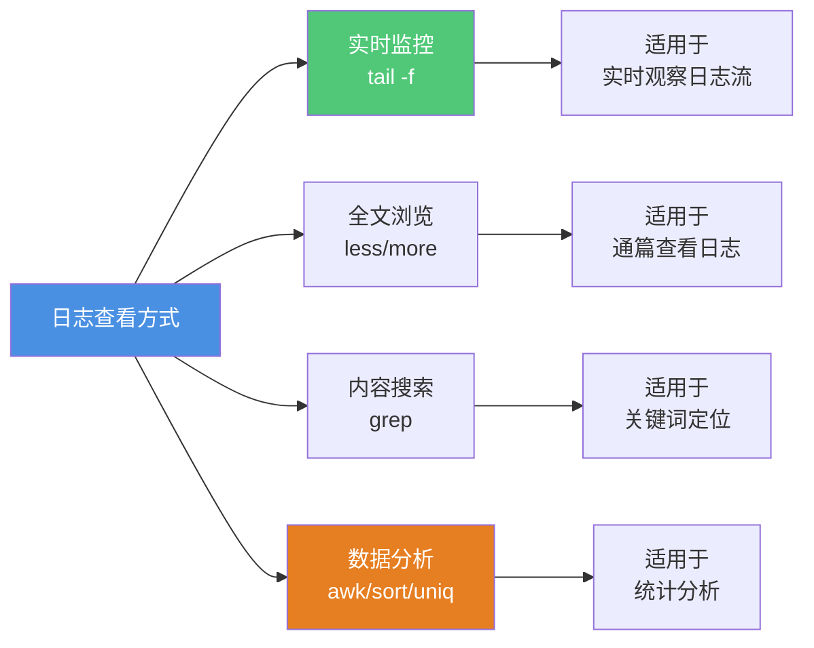
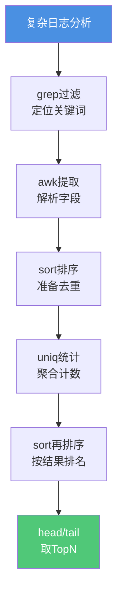

# Linux日志分析与问题排查实战

## Linux日志分析基础

在生产环境中,日志是排查问题、分析性能、监控业务的第一手资料。虽然ELK、Splunk等日志平台提供了强大的可视化分析能力,但在某些场景下(如登录服务器紧急排查、日志平台故障、需要快速统计等),掌握Linux命令行的日志分析技巧就显得尤为重要。

### 常见日志查看方式



### 日志查看场景

**场景1: 实时观察应用日志**

当我们部署新版本或执行某个操作时,需要实时观察日志输出:

```bash
# 实时滚动查看日志
tail -f /var/logs/application.log

# 显示最后100行并持续跟踪
tail -n 100 -f /var/logs/application.log

# 同时查看多个日志文件
tail -f /var/logs/app.log /var/logs/error.log
```

**场景2: 通篇查看历史日志**

查看完整日志文件,支持搜索和翻页:

```bash
# 使用less查看(推荐)
less /var/logs/application.log

# less常用操作:
# 空格键 - 向下翻页
# b键 - 向上翻页
# /关键词 - 向下搜索
# ?关键词 - 向上搜索
# n - 下一个搜索结果
# N - 上一个搜索结果
# q - 退出
# G - 跳转到文件末尾
# gg - 跳转到文件开头
```

## grep - 日志内容搜索

### 基础用法

grep是日志分析中最常用的工具,用于搜索包含指定模式的行:

```bash
# 搜索包含ERROR的行
grep "ERROR" application.log

# 忽略大小写搜索
grep -i "error" application.log

# 显示匹配行的前后10行(上下文)
grep -C 10 "NullPointerException" application.log

# 只显示匹配行的前5行
grep -B 5 "OutOfMemoryError" application.log

# 只显示匹配行的后5行
grep -A 5 "SQLException" application.log
```

### 高级搜索

```bash
# 使用正则表达式
grep -E "ERROR|WARN|FATAL" application.log

# 排除指定内容
grep -v "DEBUG" application.log

# 递归搜索目录下所有文件
grep -r "connection timeout" /var/logs/

# 只显示文件名(不显示匹配内容)
grep -l "Exception" /var/logs/*.log

# 显示匹配的行号
grep -n "404" access.log

# 统计匹配的行数
grep -c "success" transaction.log
```

### 实战案例: 排查接口异常

假设我们的订单服务日志格式如下:

```
2025-12-02 10:15:23.456 [order-pool-8] INFO  - 接收订单请求 orderId=OD20251202001 userId=USER123
2025-12-02 10:15:23.678 [order-pool-8] ERROR - 订单处理失败 orderId=OD20251202001 error=库存不足
2025-12-02 10:15:24.123 [order-pool-9] INFO  - 接收订单请求 orderId=OD20251202002 userId=USER456
2025-12-02 10:15:24.456 [order-pool-9] INFO  - 订单处理成功 orderId=OD20251202002
```

排查某个订单的完整处理链路:

```bash
# 查找某个订单的所有日志
grep "OD20251202001" order.log

# 查找该订单的错误日志及上下文
grep -C 5 "OD20251202001.*ERROR" order.log

# 统计今天所有订单处理失败的数量
grep "$(date +%Y-%m-%d)" order.log | grep "ERROR" | wc -l
```

## 日志数据统计分析

### wc - 行数统计

wc(word count)用于统计文件的行数、单词数、字节数:

```bash
# 统计文件总行数
wc -l application.log

# 统计ERROR日志数量
grep "ERROR" application.log | wc -l

# 统计某个接口今天的调用次数
grep "$(date +%Y-%m-%d)" api.log | grep "/api/payment" | wc -l
```

### sort - 排序

sort命令用于对文本进行排序:

```bash
# 按字符顺序排序
sort response_time.txt

# 按字符倒序排序
sort -r response_time.txt

# 按数字排序
sort -n response_time.txt

# 按第2列数字排序
sort -k2 -n metrics.txt

# 按第2列数字倒序排序
sort -k2 -n -r metrics.txt

# 以逗号作为分隔符,按第3列数字排序
sort -t ',' -k3 -n data.csv
```

**实战示例:**

假设我们有一个接口响应时间记录文件 `api_metrics.txt`:

```
/api/order,850ms
/api/payment,1200ms
/api/user,320ms
/api/product,650ms
/api/inventory,2100ms
```

按响应时间排序找出最慢的接口:

```bash
# 按响应时间从高到低排序
sort -t ',' -k2 -n -r api_metrics.txt

# 输出:
# /api/inventory,2100ms
# /api/payment,1200ms
# /api/order,850ms
# /api/product,650ms
# /api/user,320ms
```

### uniq - 去重统计

uniq命令用于去除连续重复的行,通常与sort配合使用:

```bash
# 去除重复行
sort data.txt | uniq

# 统计每行出现的次数
sort data.txt | uniq -c

# 只显示重复的行
sort data.txt | uniq -d

# 只显示不重复的行
sort data.txt | uniq -u

# 只显示重复行,且只显示一次
sort data.txt | uniq -D
```

**实战示例:**

统计异常类型及出现次数:

```bash
# 提取异常类名并统计
grep "Exception" error.log | awk '{print $NF}' | sort | uniq -c | sort -rn

# 输出:
#  156 NullPointerException
#   89 IllegalArgumentException
#   45 SQLException
#   23 TimeoutException
```

## awk - 强大的文本处理工具

### awk基础

awk是一个完整的文本处理语言,功能极其强大。它逐行处理文本,默认以空白字符分隔每行为多列。


### awk基本语法

```bash
# 基本格式
awk 'pattern {action}' file

# $0 - 整行内容
# $1 - 第1列
# $2 - 第2列
# $NF - 最后一列
# NR - 当前行号
# NF - 当前行的列数
```

### 常用操作

```bash
# 打印第1列
awk '{print $1}' access.log

# 打印第1列和第3列
awk '{print $1, $3}' access.log

# 打印最后一列
awk '{print $NF}' access.log

# 指定分隔符为逗号
awk -F ',' '{print $1}' data.csv

# 条件过滤: 打印第7列大于500的行
awk '$7 > 500 {print $0}' response_time.log

# 使用BEGIN和END
awk 'BEGIN{print "开始处理"} {print $1} END{print "处理完成"}' data.txt

# 统计求和
awk '{sum += $2} END {print "总计:", sum}' sales.txt

# 计算平均值
awk '{sum += $2; count++} END {print "平均:", sum/count}' metrics.txt
```

### 实战案例

假设我们的访问日志 `access.log` 格式如下:

```
[INFO] 20251202 10:15:23.456 [http-pool-1] - GET 200 850 http://api.example.com/order/query requestId=req001
[INFO] 20251202 10:15:24.123 [http-pool-2] - POST 500 1200 http://api.example.com/payment/pay requestId=req002
[INFO] 20251202 10:15:24.678 [http-pool-3] - GET 200 320 http://api.example.com/user/info requestId=req003
[WARN] 20251202 10:15:25.234 [http-pool-4] - GET 404 100 http://api.example.com/product/detail requestId=req004
[INFO] 20251202 10:15:25.789 [http-pool-5] - POST 200 2100 http://api.example.com/order/create requestId=req005
```

每列含义:
1. 日志级别
2. 日期
3. 时间
4. 线程名
5. 请求方法
6. 响应状态码
7. 响应耗时(ms)
8. 请求URL
9. requestId

**统计各HTTP状态码的数量:**

```bash
awk '{print $6}' access.log | sort | uniq -c

# 输出:
#   3 200
#   1 404
#   1 500
```

**找出响应时间大于1000ms的请求:**

```bash
awk '$7 > 1000 {print $7"ms", $8, $9}' access.log

# 输出:
# 1200ms http://api.example.com/payment/pay requestId=req002
# 2100ms http://api.example.com/order/create requestId=req005
```

**计算所有请求的平均响应时间:**

```bash
awk '{sum += $7; count++} END {print "平均响应时间:", sum/count, "ms"}' access.log

# 输出:
# 平均响应时间: 914 ms
```

**统计每个接口的调用次数:**

```bash
awk '{print $8}' access.log | sort | uniq -c | sort -rn

# 输出:
#   2 http://api.example.com/order/create
#   1 http://api.example.com/order/query
#   1 http://api.example.com/payment/pay
#   1 http://api.example.com/product/detail
#   1 http://api.example.com/user/info
```

## 综合实战案例

### 案例1: 统计接口QPS

**需求**: 统计某个接口每秒的请求量(QPS)

```bash
# 提取时间戳(精确到秒)并统计
grep "/api/order/query" access.log | \
  awk '{print substr($3,1,8)}' | \
  sort | uniq -c | \
  awk '{sum += $1; count++} END {print "平均QPS:", sum/count}'
```

执行流程:


**详细解释:**

```bash
# 步骤1: 过滤指定接口的日志
grep "/api/order/query" access.log

# 步骤2: 提取时间戳的小时分钟秒部分
# substr($3,1,8) 从第3列(时间)的第1个字符开始取8个字符
# 例如: 10:15:23.456 -> 10:15:23
awk '{print substr($3,1,8)}'

# 步骤3: 排序,为uniq做准备
sort

# 步骤4: 统计每个时间戳出现的次数
uniq -c
# 输出示例:
#   15 10:15:23
#   18 10:15:24
#   12 10:15:25

# 步骤5: 计算平均QPS
awk '{sum += $1; count++} END {print "平均QPS:", sum/count}'
```

### 案例2: 找出响应时间最慢的TOP 10接口

**需求**: 从访问日志中找出响应时间最长的10个请求

```bash
awk '$7 > 500 {print $7"ms", $8, $9}' access.log | \
  sort -k1 -n -r | \
  head -10
```

执行流程:

```bash
# 步骤1: 过滤响应时间大于500ms的请求,打印耗时、URL、requestId
awk '$7 > 500 {print $7"ms", $8, $9}' access.log

# 步骤2: 按第1列(耗时)数字倒序排序
sort -k1 -n -r

# 步骤3: 取前10条
head -10
```

### 案例3: 分析HTTP状态码分布并计算错误率

**需求**: 统计各状态码的数量和占比

```bash
awk '{
    total++
    status[$6]++
} 
END {
    print "状态码\t数量\t占比"
    print "----------------------------"
    for (code in status) {
        printf "%s\t%d\t%.2f%%\n", code, status[code], status[code]/total*100
    }
    print "----------------------------"
    print "总请求数:", total
}' access.log
```

**输出示例:**

```
状态码	数量	占比
----------------------------
200	850	85.00%
404	80	8.00%
500	50	5.00%
502	20	2.00%
----------------------------
总请求数: 1000
```

### 案例4: 按时间段统计请求量

**需求**: 统计每小时的请求量,找出流量高峰

```bash
awk '{
    hour = substr($3, 1, 2)
    count[hour]++
}
END {
    print "小时\t请求数"
    print "-------------------"
    for (h in count) {
        printf "%s:00\t%d\n", h, count[h]
    }
}' access.log | sort
```

**输出示例:**

```
小时	请求数
-------------------
08:00	1234
09:00	3456
10:00	5678
11:00	6789
12:00	4567
```

### 案例5: 分析慢查询接口并去重

**需求**: 找出响应超过1秒的接口,按接口URL去重并统计次数

```bash
awk '$7 > 1000 {print $8}' access.log | \
  sort | \
  uniq -c | \
  sort -rn | \
  awk '{printf "%-50s %d次\n", $2, $1}'
```

**输出示例:**

```
http://api.example.com/order/create            45次
http://api.example.com/payment/pay             23次
http://api.example.com/report/generate         18次
http://api.example.com/export/excel            12次
```

## 高级技巧与最佳实践

### 命令组合的艺术



### 性能优化建议

```bash
# 1. 先过滤再处理,减少数据量
grep "2025-12-02" huge.log | awk '$7 > 500 {print $0}'
# 优于
awk '$7 > 500 {print $0}' huge.log | grep "2025-12-02"

# 2. 使用 -F 指定分隔符比正则快
awk -F ',' '{print $1}' data.csv
# 优于
awk '{split($0, arr, ","); print arr[1]}' data.csv

# 3. 避免重复读取大文件
# 不好的做法:
for keyword in ERROR WARN FATAL; do
    grep $keyword huge.log | wc -l
done

# 好的做法:
grep -E "ERROR|WARN|FATAL" huge.log | \
  awk '{print $1}' | sort | uniq -c
```

### 日志分析脚本化

对于频繁使用的分析逻辑,建议封装成脚本:

```bash
#!/bin/bash
# analyze_api.sh - 接口性能分析脚本

LOG_FILE=$1
API_PATH=$2

if [ -z "$LOG_FILE" ] || [ -z "$API_PATH" ]; then
    echo "用法: $0 <日志文件> <接口路径>"
    echo "示例: $0 access.log /api/order"
    exit 1
fi

echo "===== 接口: $API_PATH 性能分析 ====="
echo ""

# 总请求数
TOTAL=$(grep "$API_PATH" "$LOG_FILE" | wc -l)
echo "总请求数: $TOTAL"

# 平均响应时间
AVG=$(grep "$API_PATH" "$LOG_FILE" | \
      awk '{sum += $7; count++} END {printf "%.2f", sum/count}')
echo "平均响应时间: ${AVG}ms"

# 最大响应时间
MAX=$(grep "$API_PATH" "$LOG_FILE" | \
      awk '{print $7}' | sort -n | tail -1)
echo "最大响应时间: ${MAX}ms"

# 最小响应时间
MIN=$(grep "$API_PATH" "$LOG_FILE" | \
      awk '{print $7}' | sort -n | head -1)
echo "最小响应时间: ${MIN}ms"

# 状态码分布
echo ""
echo "状态码分布:"
grep "$API_PATH" "$LOG_FILE" | \
  awk '{print $6}' | sort | uniq -c | \
  awk '{printf "  %s: %d次\n", $2, $1}'

# 慢请求(>1000ms)
SLOW=$(grep "$API_PATH" "$LOG_FILE" | awk '$7 > 1000' | wc -l)
echo ""
echo "慢请求数(>1000ms): $SLOW"

# QPS统计
echo ""
echo "QPS分布(前5):"
grep "$API_PATH" "$LOG_FILE" | \
  awk '{print substr($3,1,8)}' | sort | uniq -c | \
  sort -rn | head -5 | \
  awk '{printf "  %s: %d req/s\n", $2, $1}'
```

使用示例:

```bash
$ ./analyze_api.sh access.log /api/order/create

===== 接口: /api/order/create 性能分析 =====

总请求数: 1234
平均响应时间: 856.23ms
最大响应时间: 3456ms
最小响应时间: 234ms

状态码分布:
  200: 1150次
  500: 84次

慢请求数(>1000ms): 156

QPS分布(前5):
  10:15:23: 45 req/s
  10:15:24: 42 req/s
  10:15:25: 38 req/s
  10:15:26: 35 req/s
  10:15:27: 33 req/s
```

## 实用小工具合集

### 实时监控日志中的ERROR

```bash
# 实时显示新增的ERROR日志,带颜色高亮
tail -f application.log | grep --color=auto "ERROR"

# 同时监控多种日志级别
tail -f application.log | grep --color=auto -E "ERROR|WARN|FATAL"
```

### 快速查看日志的起止时间

```bash
# 查看日志第一行时间
head -1 application.log | awk '{print $2, $3}'

# 查看日志最后一行时间
tail -1 application.log | awk '{print $2, $3}'

# 查看日志时间跨度
echo "开始时间: $(head -1 application.log | awk '{print $2, $3}')"
echo "结束时间: $(tail -1 application.log | awk '{print $2, $3}')"
```

### 按时间范围提取日志

```bash
# 提取指定时间段的日志
sed -n '/2025-12-02 10:00:00/,/2025-12-02 11:00:00/p' application.log

# 提取今天的日志
grep "$(date +%Y-%m-%d)" application.log > today.log

# 提取最近1小时的日志
grep "$(date -d '1 hour ago' +'%Y-%m-%d %H')" application.log
```

### 日志压缩与归档分析

```bash
# 分析gzip压缩的日志文件
zgrep "ERROR" application.log.gz | wc -l

# 分析多个历史日志文件
zcat application.log.*.gz | grep "OutOfMemoryError" | wc -l

# 解压后分析
gunzip -c application.log.gz | awk '$7 > 1000 {print $0}'
```

## 总结

Linux命令行的日志分析是每个后端开发人员必备的技能,通过本文我们系统学习了:

1. **基础工具**: tail、less、grep - 日志查看与搜索
2. **统计工具**: wc、sort、uniq - 数据统计与去重
3. **分析工具**: awk - 强大的文本处理能力
4. **综合实战**: 组合命令解决实际问题

掌握这些技能的关键在于:
- **理解管道**: 将多个简单命令组合成强大的分析链路
- **熟悉正则**: 提升搜索和匹配的灵活性
- **善用脚本**: 将常用分析逻辑封装,提升效率
- **多加练习**: 遇到问题主动用命令行分析,积累经验

虽然图形化日志平台功能强大,但命令行分析具有不可替代的优势:响应快速、资源占用低、适用范围广、不依赖外部系统。特别是在紧急故障排查时,往往是最快最有效的手段。

建议将本文的示例命令保存成个人的命令库,在实际工作中不断完善,形成属于自己的日志分析工具箱。
