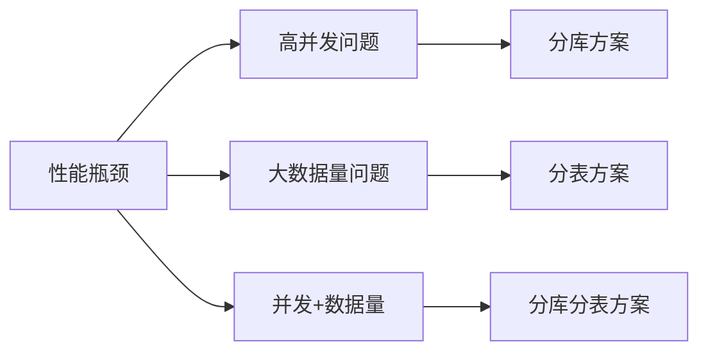
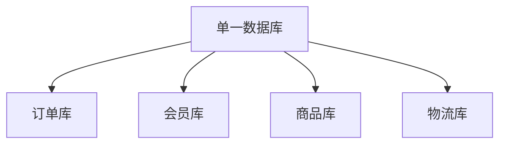
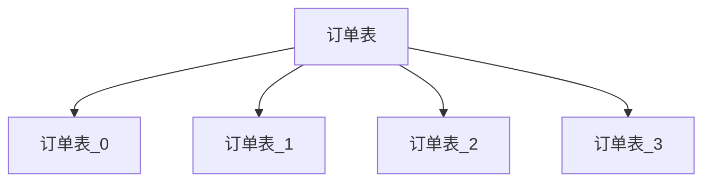
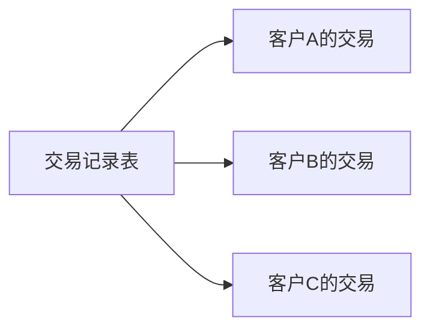
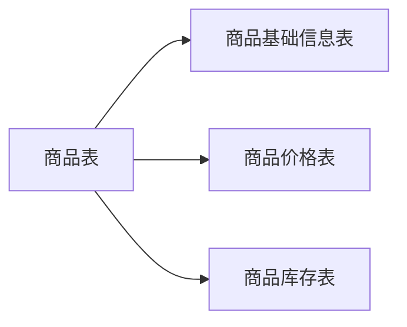

# 分库分表核心概念与应用场景

## 什么是分库、分表与分库分表

当业务系统面临高并发访问和海量数据存储挑战时,分库分表成为数据库性能优化的关键技术手段。但"分库分表"实际上包含三种不同的技术方案,它们分别解决不同的性能瓶颈问题。

### 三种拆分方案的本质差异

**分库分表并非单一技术,而是三种独立方案的统称:**

- **仅分库不分表**:主要应对并发压力
- **仅分表不分库**:主要应对数据量压力  
- **既分库又分表**:同时应对并发与数据量双重挑战

### 分库:解决并发瓶颈

**核心价值:** 通过增加数据库实例来扩展连接池容量,提升系统并发处理能力。

数据库连接数是有限资源,当读写QPS持续攀升,单库连接池耗尽时,即使调整配置也无法无限扩展。此时需要通过分库横向扩展数据库实例,为应用层提供更多可用连接。

典型应用场景包括微服务架构下的业务拆分:

另一种常见做法是按数据时效性分库,比如将历史订单迁移到独立的归档库,减轻主库压力。

### 分表:应对数据膨胀

**核心价值:** 将单表数据拆分到多张物理表,降低单表数据量,提升查询和写入效率。

当单表行数超过建议阈值(通常500万-2000万行,具体取决于行记录大小、存储引擎及硬件配置),查询性能会明显下降。通过水平拆分将数据分散存储,可以有效缓解这一问题。

### 分库分表:综合治理

实际生产环境中,高并发与大数据量问题往往同时出现。此时需要同时采用分库和分表策略,既扩展连接池容量又降低单表数据量。

## 水平拆分与垂直拆分

数据库拆分有两种基本维度:

### 水平拆分(横向拆分)

将同一张表的不同记录行分散到多个物理表中,每个分表结构完全相同。例如按照客户ID将交易记录分散存储:

### 垂直拆分(纵向拆分)

将一张表的不同字段列拆分到多张表中,每个表包含部分字段。例如将商品基础信息、价格信息、库存信息拆分到不同表:

微服务按业务边界拆分数据库也属于垂直拆分的范畴。

## 何时启动分库分表

并非所有数据量增长都需要立即分库分表。一般建议先考虑以下优化手段:

1. **索引优化**:确保查询语句使用合适索引
2. **查询优化**:避免慢SQL和全表扫描
3. **读写分离**:通过主从复制分担读压力
4. **缓存引入**:减少数据库直接访问

当单表数据量超过500万行或容量超过2GB时(阿里巴巴Java开发手册建议值,实际可根据场景调整),才需要认真考虑分表。根据实践经验,InnoDB引擎在合理配置下,单表支撑2000万数据通常没有问题,但具体阈值需结合记录大小、硬件性能等因素综合判断。

## 常用分库分表中间件

要实现分库分表,通常需要借助专业中间件:

### ShardingSphere

前身是ShardingJDBC,现已发展成包含ShardingJDBC、ShardingProxy、ShardingSidecar的生态体系。定位为轻量级Java框架,在JDBC层提供分片服务,以jar包形式集成,对应用透明,完全兼容JDBC和各类ORM框架。

官网地址:[https://shardingsphere.apache.org](https://shardingsphere.apache.org)

### TDDL

淘宝开源的数据库访问中间件,集成分库分表、读写分离、权重调配、动态数据源等功能,封装JDBC DataSource为应用提供统一的客户端访问接口。

开源地址:[https://github.com/alibaba/tb_tddl](https://github.com/alibaba/tb_tddl)

### MyCat

分布式关系型数据库中间件,支持分布式SQL查询,兼容MySQL通信协议,以Java实现,支持多种后端数据库,通过数据分片提升查询处理能力。

开源地址:[https://github.com/MyCATApache/Mycat2](https://github.com/MyCATApache/Mycat2)
