# 容量规划与扩容策略

## 如何预估分库分表数量

分库分表并非盲目拆分,需要基于业务数据特征进行科学预估。拆分数量过少,未来仍需二次扩容;拆分过多,则浪费资源且增加运维复杂度。

### 分表数量计算公式

**核心公式:**

```
分表数量 = (存量数据总量 + 预估年增长量 × 保留年限) / 单表极限容量
         => 向上取最接近的2的幂
```

**参数说明:**

- **单表极限容量**:InnoDB引擎理论上单表2000万行性能稳定(阿里规范建议500万,实际可适当放宽)
- **存量数据总量**:当前系统已有数据量
- **预估年增长量**:基于业务发展预测的年度新增数据量
- **保留年限**:业务要求的数据保留周期

### 实例计算

**场景假设:**

- 当前存量:2000万条记录
- 年增长量:500万条
- 保留年限:10年
- 单表极限:2000万条

**计算过程:**

```
分表数量 = (2000万 + 500万 × 10) / 2000万
        = (2000万 + 5000万) / 2000万
        = 7000万 / 2000万
        = 3.5
        => 向上取2的幂 = 4
```

推荐分4张表。

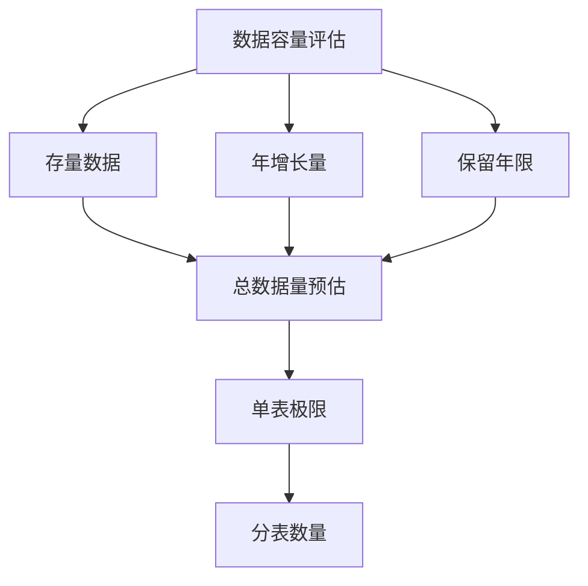

### 为什么选择2的幂

#### 优势一:优化为位运算

取模运算可优化为高效的位运算:

```java
// 传统取模运算
int tableIndex = productId % 8;

// 优化为位运算(当分表数为2的幂时)
int tableIndex = productId & (8 - 1);  // 等价于 productId & 7
```

位运算性能远超取模运算,参考HashMap的实现原理。

#### 优势二:均匀分配多库

当同时分库分表时,2的幂能确保分表均匀分布到各个库:

**示例:**128张表,16个库

- 每个库:128 ÷ 16 = 8张表(完全均匀)

**对比:**如果分120张表,15个库

- 每个库:120 ÷ 15 = 8张表(均匀)
- 但120不是2的幂,后续扩容成本高

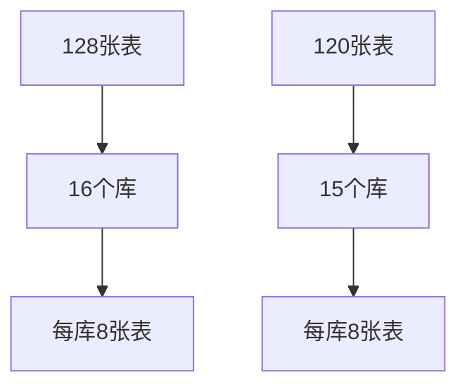

#### 优势三:简化扩容迁移

从4张表扩容到8张表时,只需迁移50%数据。

**扩容前路由规则:**

```java
int tableIndex = userId % 4;  // 结果: 0, 1, 2, 3
```

- table_00: userId % 4 == 0
- table_01: userId % 4 == 1
- table_02: userId % 4 == 2
- table_03: userId % 4 == 3

**扩容后路由规则:**

```java
int tableIndex = userId % 8;  // 结果: 0, 1, 2, 3, 4, 5, 6, 7
```

**数据迁移方案:**

- 原table_00中,userId % 8 == 0的数据保持不动
- 原table_00中,userId % 8 == 4的数据迁移到新table_04
- 原table_01中,userId % 8 == 1的数据保持不动
- 原table_01中,userId % 8 == 5的数据迁移到新table_05
- ...以此类推

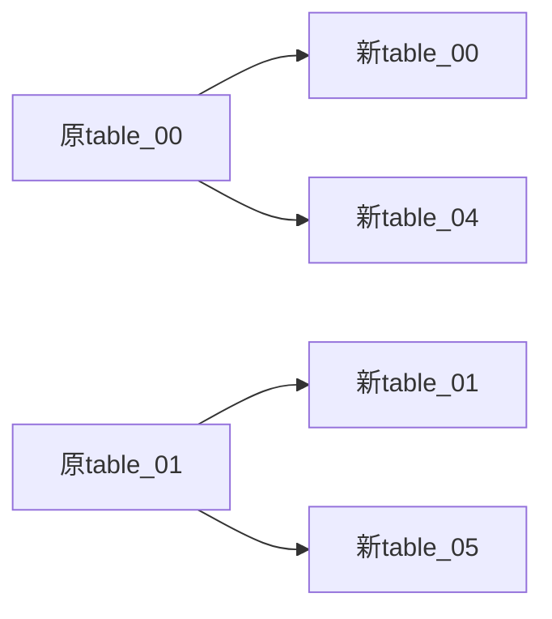

**对比非2的幂:**

5张表扩容到9张表,几乎所有数据都需要重新计算路由并迁移,成本极高。

### 分库数量估算

分库数量取决于并发压力,但通常与分表数量保持倍数关系。

**经验公式:**

```
分库数量 = 分表数量 / 8
```

**常见组合:**

| 分表数量 | 分库数量 | 每库分表数 |
|---------|---------|----------|
| 128     | 16      | 8        |
| 512     | 64      | 8        |
| 1024    | 128     | 8        |
| 64      | 8       | 8        |

**特例:**

- 分表数 < 8:建议分库数 = 分表数(如4库4表)
- 并发极高:可适当增加分库数(如8库64表)

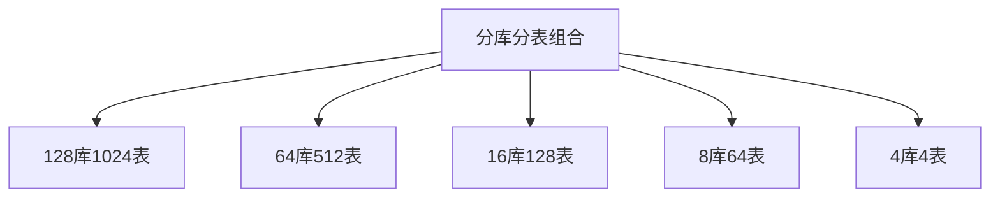

## 分库分表后表不够怎么办

即使前期规划充分,业务爆发式增长仍可能导致分表容量不足。此时有三种应对策略:

### 策略一:提前预留冗余

**最佳实践:**初次分表时预留充足buffer,避免频繁扩容。

生产环境常见配置:256、512、1024张表,远超当前需求,但为未来留出空间。

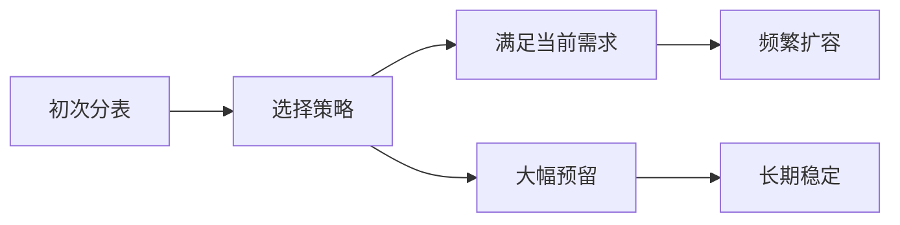

### 策略二:数据归档

将历史冷数据迁移到归档库或对象存储,减轻热数据表压力。

**归档方案:**

```java
// 归档策略:6个月前的订单迁移到归档库
public void archiveOldOrders() {
    Date archiveDate = DateUtils.addMonths(new Date(), -6);
    
    // 查询需归档数据
    List<Order> oldOrders = orderMapper.selectBefore(archiveDate);
    
    // 写入归档库
    archiveOrderMapper.batchInsert(oldOrders);
    
    // 删除原表数据
    orderMapper.deleteBefore(archiveDate);
}
```

**归档库选型:**

- MySQL归档库:低配实例,冷查询场景
- HBase:海量历史数据,低成本存储
- OSS对象存储:极低成本,仅存储不查询

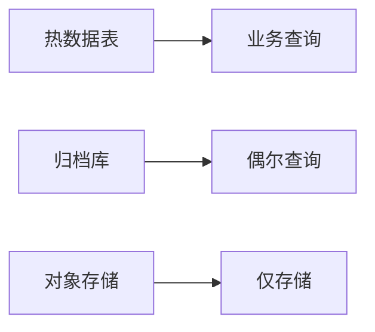

### 策略三:二次分表

容量彻底不足时,只能重新分表并迁移数据。

**关键步骤:**

1. 设计新的分表策略(如128张扩容到256张)
2. 创建新的物理表结构
3. 修改路由算法
4. 执行数据迁移
5. 灰度切换流量
6. 清理旧表

**降低迁移成本的设计:**

采用一致性哈希算法,扩容时仅部分数据需迁移:

```java
// 一致性哈希扩容示例
ConsistentHash oldHash = new ConsistentHash();
oldHash.addNode("table_00");
oldHash.addNode("table_01");
oldHash.addNode("table_02");
oldHash.addNode("table_03");

// 扩容:新增4个节点
ConsistentHash newHash = new ConsistentHash();
newHash.addNode("table_00");
newHash.addNode("table_01");
newHash.addNode("table_02");
newHash.addNode("table_03");
newHash.addNode("table_04");  // 新增
newHash.addNode("table_05");  // 新增
newHash.addNode("table_06");  // 新增
newHash.addNode("table_07");  // 新增

// 仅受影响的数据需要迁移
```

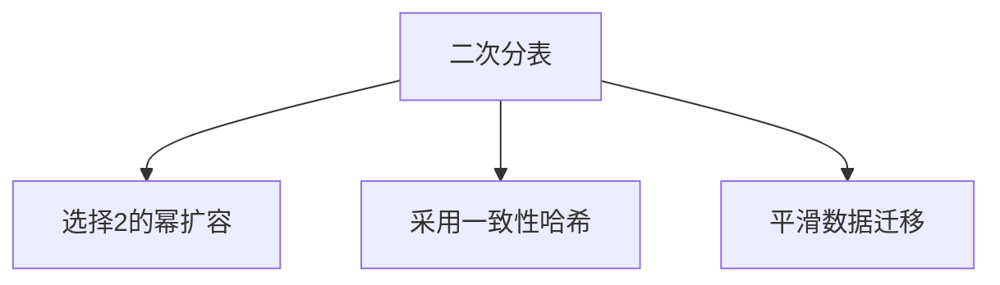

## 平滑数据迁移方案

二次分表的核心难点是如何无损、无缝迁移数据。

### 迁移策略:双写+校验

**阶段一:双写阶段**

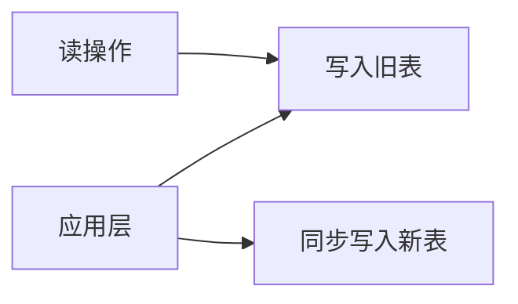

新数据同时写入新旧表,读操作仍从旧表读取,确保业务稳定。

```java
// 双写实现
@Transactional
public void createOrder(Order order) {
    // 写旧表
    oldOrderMapper.insert(order);
    
    // 异步写新表(失败不影响主流程)
    try {
        newOrderMapper.insert(order);
    } catch (Exception e) {
        log.error("写入新表失败,订单号:{}", order.getOrderNo(), e);
        // 记录失败,后续补偿
    }
}
```

**阶段二:存量数据迁移**

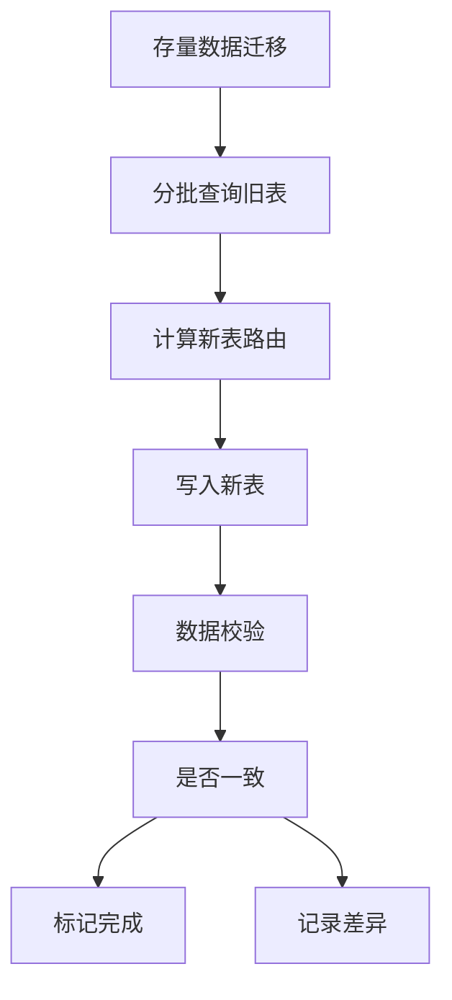

```java
// 存量数据迁移
public void migrateHistoryData() {
    int pageSize = 1000;
    int offset = 0;
    
    while (true) {
        List<Order> orders = oldOrderMapper.selectPage(offset, pageSize);
        if (orders.isEmpty()) {
            break;
        }
        
        for (Order order : orders) {
            // 写入新表
            newOrderMapper.insert(order);
            
            // 校验数据一致性
            Order newOrder = newOrderMapper.selectByOrderNo(order.getOrderNo());
            if (!order.equals(newOrder)) {
                log.error("数据不一致,订单号:{}", order.getOrderNo());
            }
        }
        
        offset += pageSize;
    }
}
```

**阶段三:灰度切流**

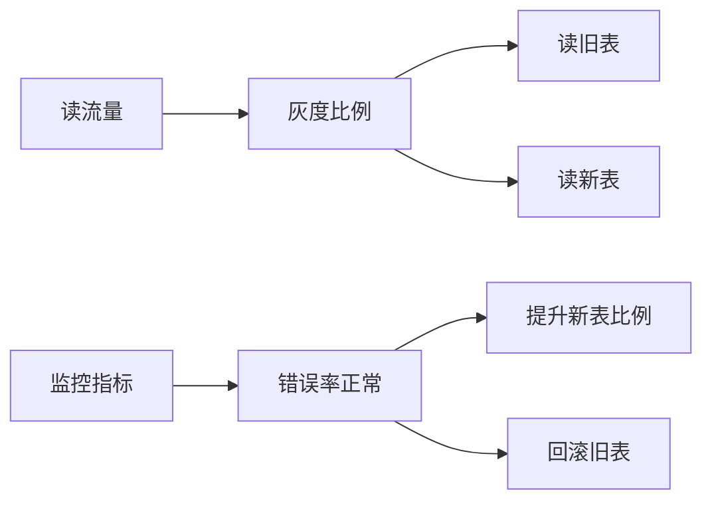

逐步将读流量从旧表切换到新表:

```java
// 灰度读取
public Order getOrder(String orderNo) {
    int grayRatio = configService.getGrayRatio();  // 从配置中心读取
    
    if (RandomUtils.nextInt(100) < grayRatio) {
        // 读新表
        return newOrderMapper.selectByOrderNo(orderNo);
    } else {
        // 读旧表
        return oldOrderMapper.selectByOrderNo(orderNo);
    }
}
```

**阶段四:完全切换**

新表稳定运行一段时间后,完全切换到新表,下线旧表。

### 使用一致性哈希降低迁移成本

一致性哈希在节点变化时,仅影响部分数据:

**原理:**

- 哈希环首尾相接(0 ~ 2^32-1)
- 数据和节点都映射到环上
- 数据存储在顺时针方向最近的节点
- 新增节点只影响逆时针方向第一个节点的数据

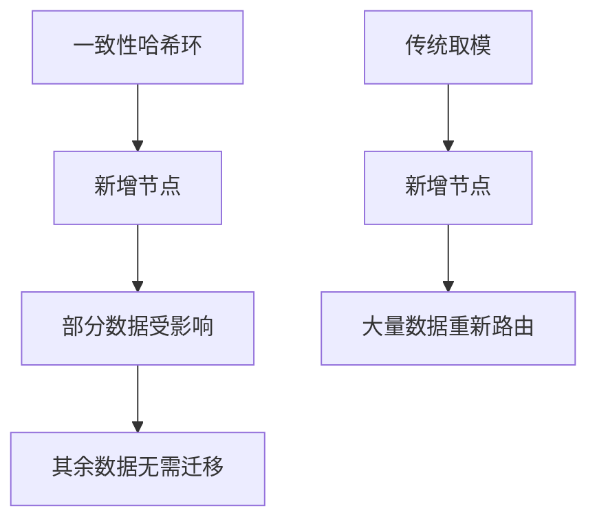

**扩容示例:**

4个节点扩容到8个节点:

- 一致性哈希:平均约50%数据需迁移
- 传统取模:约75%数据需迁移

```java
// 一致性哈希配置
public class ShardingConfig {
    private ConsistentHash consistentHash = new ConsistentHash();
    
    public void init() {
        // 初始4个节点
        consistentHash.addNode("db_00");
        consistentHash.addNode("db_01");
        consistentHash.addNode("db_02");
        consistentHash.addNode("db_03");
    }
    
    public void expand() {
        // 扩容到8个节点
        consistentHash.addNode("db_04");
        consistentHash.addNode("db_05");
        consistentHash.addNode("db_06");
        consistentHash.addNode("db_07");
    }
    
    public String getNode(String orderId) {
        return consistentHash.getNode(orderId);
    }
}
```

## 分库分表后的挑战

分库分表虽然解决了性能瓶颈,但也引入了新的复杂性。

### 必须携带分片键

所有读写操作必须包含分片键,否则只能执行全表扫描。

**单表时代:**

```sql
SELECT * FROM t_order WHERE order_status = 'PAID';
```

**分表后:**

```sql
-- 必须带分片键
SELECT * FROM t_order WHERE customer_id = 12345 AND order_status = 'PAID';
```

不带分片键则需扫描所有物理表,性能极差:

```sql
-- 扫描256张表
SELECT * FROM t_order_0000 WHERE order_status = 'PAID'
UNION ALL
SELECT * FROM t_order_0001 WHERE order_status = 'PAID'
...
UNION ALL
SELECT * FROM t_order_0255 WHERE order_status = 'PAID';
```

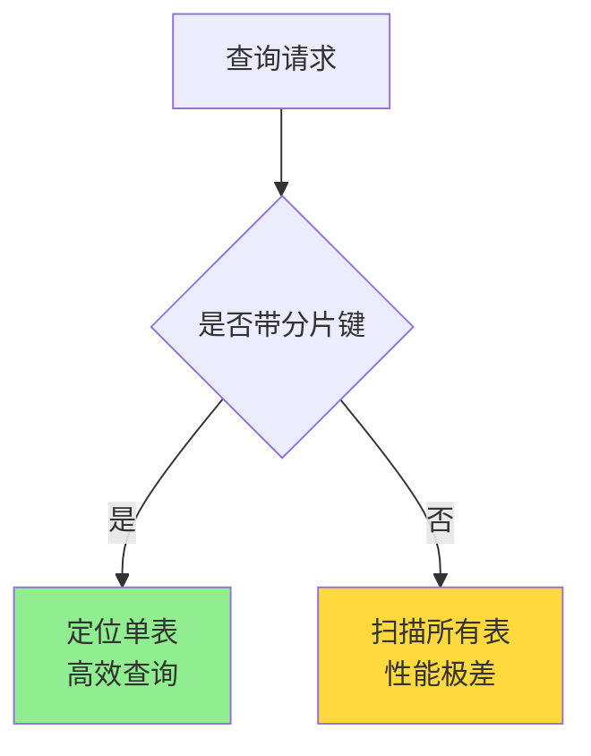

### 跨库事务问题

分库后无法使用数据库原生事务保证跨库操作的ACID特性。

**解决方案:**

- 分布式事务:Seata、TCC、Saga等
- 最终一致性:本地消息表、事务消息
- 业务补偿:定时任务扫描并修复不一致

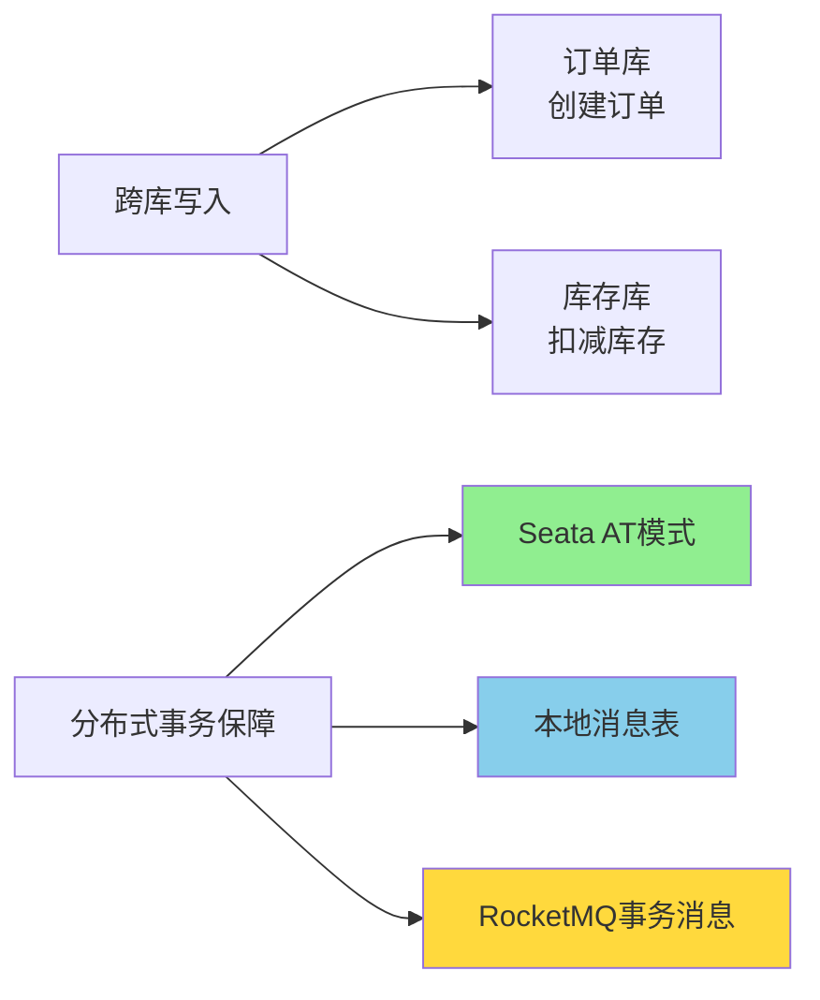

### 分页排序失效

跨表分页和全局排序变得复杂,后续章节详细讨论。

### 全局唯一ID

自增主键在分表后会冲突,需要引入分布式ID生成方案,后续章节详细讨论。
