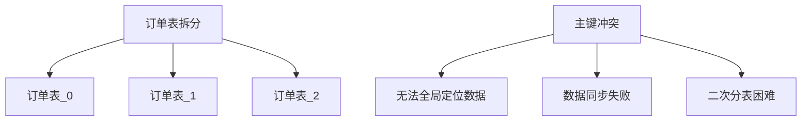
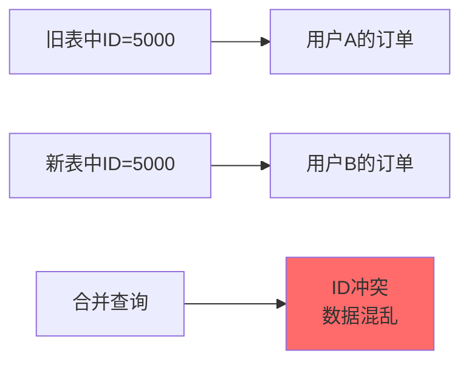
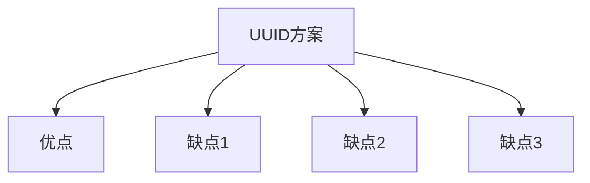
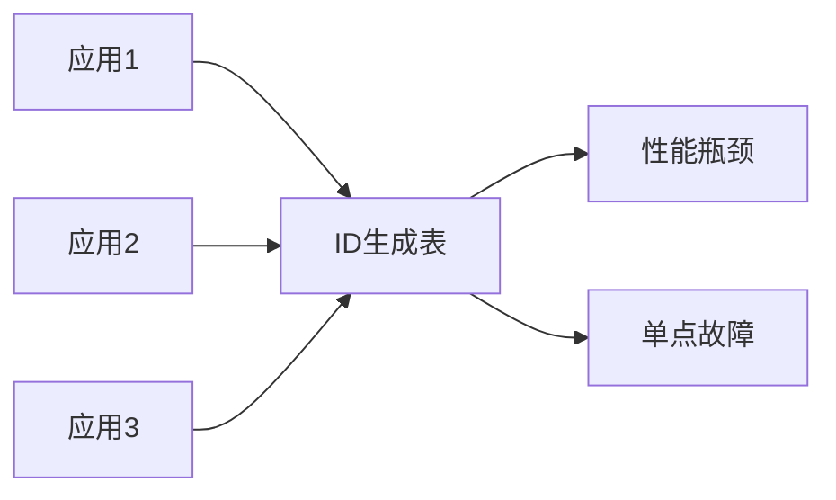
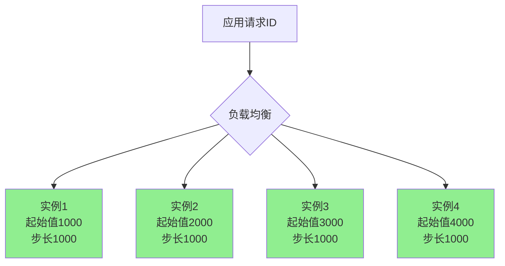
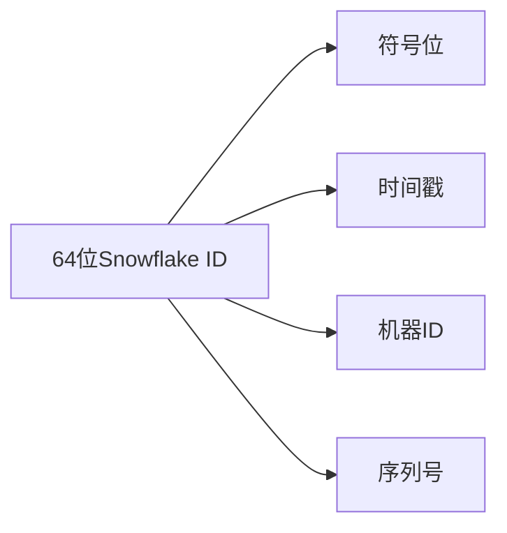
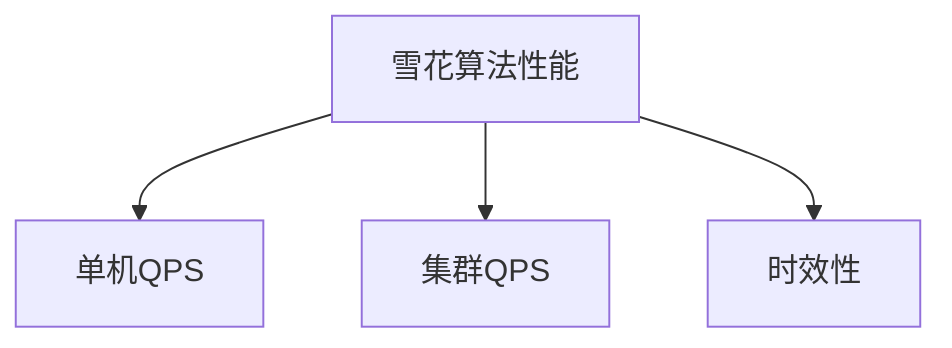
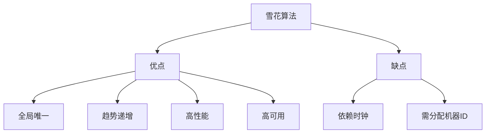

# 分布式ID生成方案

## 为什么需要全局唯一ID

分库分表后,多张物理表的自增主键会产生冲突,无法保证全局唯一性。

### 自增主键冲突问题



### 不使用全局ID的后果

**问题一:ID重复导致定位失败**

多张表都存在ID=1001的记录,仅凭ID无法唯一定位数据,必须联合分片键查询。

**问题二:离线数据同步冲突**

将分表数据汇总到数据仓库或BI系统时,主键冲突导致同步失败:

```sql
-- 汇总到离线表时主键冲突
INSERT INTO dw_order_all 
SELECT * FROM t_order_0000  -- ID可能重复
UNION ALL
SELECT * FROM t_order_0001  -- ID可能重复
...
```

**问题三:二次分表数据混乱**

重新分表时,新旧表中可能存在相同ID的不同数据,无法区分。



## 分布式ID生成方案

### UUID方案

**优点:**

- 生成简单,本地生成无需远程调用
- 全局唯一性有保障

**缺点:**

- 长度过长(32位字符串),存储和索引开销大
- 无序性导致插入性能差(B+树频繁页分裂)
- 无业务含义,可读性差

```java
// UUID生成
String uuid = UUID.randomUUID().toString().replace("-", "");
// 示例: 550e8400e29b41d4a716446655440000
```



**不推荐用于数据库主键**,但可用于业务流水号等场景。

### 单表自增主键

所有分表都从同一张ID生成表获取主键。

**实现方式:**

```sql
CREATE TABLE id_generator (
    id BIGINT AUTO_INCREMENT PRIMARY KEY,
    stub CHAR(1) NOT NULL DEFAULT '',
    UNIQUE KEY uk_stub (stub)
);

-- 获取ID
INSERT INTO id_generator (stub) VALUES ('a');
SELECT LAST_INSERT_ID();
```

```java
// 代码实现
@Service
public class IdGeneratorService {
    
    @Autowired
    private IdGeneratorMapper mapper;
    
    public Long nextId() {
        mapper.insertStub();
        return mapper.getLastInsertId();
    }
}
```



**缺点:**

- 性能瓶颈:所有请求串行获取ID
- 单点故障:ID表挂掉导致整个系统无法写入

**不推荐使用**,仅作为原理理解。

### 多表步长自增

通过多个ID生成表配合步长机制避免单点问题。

**核心思想:**

每个实例生成的ID在不同区间:

- 实例1:1000-1999、5000-5999、9000-9999...
- 实例2:2000-2999、6000-6999、10000-10999...
- 实例3:3000-3999、7000-7999、11000-11999...
- 实例4:4000-4999、8000-8999、12000-12999...



**配置方式:**

```sql
-- 实例1配置
SET @@auto_increment_increment = 1000;  -- 步长
SET @@auto_increment_offset = 1000;     -- 起始值

-- 实例2配置
SET @@auto_increment_increment = 1000;
SET @@auto_increment_offset = 2000;
```

**动态分配新区间:**

实例1的ID用到1999后,分配新区间5000-5999。

**优点:**

- 避免单点故障
- 提升并发能力

**缺点:**

- 配置复杂
- ID不连续,存在空洞
- 依赖数据库,仍有性能限制

### 雪花算法(Snowflake)

**最常用的分布式ID方案**,具备全局唯一、趋势递增、高性能特点。

#### 结构组成

64位Long型ID,分为4部分:

```
0 | 0000000000 0000000000 0000000000 0000000000 0 | 00000 00000 | 000000000000
↑                41位时间戳                        ↑   10位机器ID    ↑ 12位序列号
1位符号位(固定为0)
```



**各部分详解:**

1. **符号位(1位)**:固定为0,保证生成的ID为正数

2. **时间戳(41位)**:
   - 精确到毫秒
   - 可用时间约69年:(2^41 - 1) / (1000 * 60 * 60 * 24 * 365) ≈ 69年
   - 起始时间可自定义(如2020-01-01)

3. **机器ID(10位)**:
   - 高5位:数据中心ID(0-31)
   - 低5位:机器ID(0-31)
   - 最多支持32个数据中心,每个中心32台机器,共1024个节点

4. **序列号(12位)**:
   - 同一毫秒内递增
   - 范围0-4095
   - 单机每毫秒最多生成4096个ID

#### 性能计算

**单机QPS:**

每毫秒4096个ID,每秒可生成:4096 × 1000 = 409.6万个ID

**集群QPS:**

1024个节点:409.6万 × 1024 ≈ 42亿个ID/秒



#### 代码实现

```java
public class SnowflakeIdGenerator {
    
    // 起始时间戳(2020-01-01)
    private final long epoch = 1577836800000L;
    
    // 机器ID位数
    private final long workerIdBits = 5L;
    private final long datacenterIdBits = 5L;
    
    // 序列号位数
    private final long sequenceBits = 12L;
    
    // 最大值
    private final long maxWorkerId = -1L ^ (-1L << workerIdBits);
    private final long maxDatacenterId = -1L ^ (-1L << datacenterIdBits);
    private final long maxSequence = -1L ^ (-1L << sequenceBits);
    
    // 位移量
    private final long workerIdShift = sequenceBits;
    private final long datacenterIdShift = sequenceBits + workerIdBits;
    private final long timestampShift = sequenceBits + workerIdBits + datacenterIdBits;
    
    private long workerId;
    private long datacenterId;
    private long sequence = 0L;
    private long lastTimestamp = -1L;
    
    public SnowflakeIdGenerator(long datacenterId, long workerId) {
        if (workerId > maxWorkerId || workerId < 0) {
            throw new IllegalArgumentException("Worker ID超出范围");
        }
        if (datacenterId > maxDatacenterId || datacenterId < 0) {
            throw new IllegalArgumentException("Datacenter ID超出范围");
        }
        this.workerId = workerId;
        this.datacenterId = datacenterId;
    }
    
    public synchronized long nextId() {
        long timestamp = System.currentTimeMillis();
        
        // 时钟回拨检测
        if (timestamp < lastTimestamp) {
            throw new RuntimeException("时钟回拨,拒绝生成ID");
        }
        
        if (timestamp == lastTimestamp) {
            // 同一毫秒内,序列号递增
            sequence = (sequence + 1) & maxSequence;
            if (sequence == 0) {
                // 序列号耗尽,等待下一毫秒
                timestamp = waitNextMillis(lastTimestamp);
            }
        } else {
            // 新的毫秒,序列号重置
            sequence = 0L;
        }
        
        lastTimestamp = timestamp;
        
        // 组装ID
        return ((timestamp - epoch) << timestampShift)
                | (datacenterId << datacenterIdShift)
                | (workerId << workerIdShift)
                | sequence;
    }
    
    private long waitNextMillis(long lastTimestamp) {
        long timestamp = System.currentTimeMillis();
        while (timestamp <= lastTimestamp) {
            timestamp = System.currentTimeMillis();
        }
        return timestamp;
    }
}
```

**使用示例:**

```java
// 数据中心1,机器5
SnowflakeIdGenerator generator = new SnowflakeIdGenerator(1, 5);

// 生成ID
long id1 = generator.nextId();  // 示例: 1234567890123456789
long id2 = generator.nextId();  // 示例: 1234567890123456790
```

#### 优缺点分析

**优点:**

- 全局唯一:通过机器ID和序列号保证
- 趋势递增:基于时间戳,有序性好
- 高性能:本地生成,无网络开销
- 高可用:无单点依赖
- 信息丰富:可从ID反解时间和机器信息

**缺点:**

- 依赖机器时钟:时钟回拨会导致ID重复或生成失败
- 机器ID需要人工分配或通过配置中心管理



### 方案对比

| 方案 | 全局唯一 | 趋势递增 | 性能 | 复杂度 | 推荐度 |
|-----|---------|---------|-----|--------|--------|
| UUID | ✅ | ❌ | 高 | 低 | ⭐ |
| 单表自增 | ✅ | ✅ | 低 | 低 | ⭐ |
| 多表步长 | ✅ | ✅ | 中 | 中 | ⭐⭐ |
| 雪花算法 | ✅ | ✅ | 高 | 中 | ⭐⭐⭐⭐⭐ |

**生产推荐:** 雪花算法是主流选择,平衡了性能、可用性和可维护性。
