# 跨库查询与性能优化

## 跨库JOIN操作方案

分库分表后,数据分散在多个数据库实例中,传统的SQL JOIN无法跨库执行,需要通过特殊方案解决。

### 问题分析

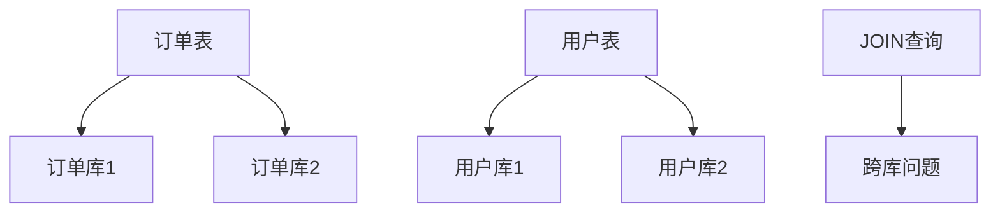

**典型场景:**

查询订单及对应的用户信息,但订单和用户分散在不同库中:

```sql
-- 单库时代可以直接JOIN
SELECT o.*, u.user_name 
FROM t_order o
INNER JOIN t_user u ON o.user_id = u.user_id
WHERE o.order_status = 'PAID';
```

分库后,订单和用户可能不在同一个数据库实例,标准JOIN失效。

### 方案一:应用层JOIN

在应用代码中分别查询,然后在内存中关联。

**实现步骤:**

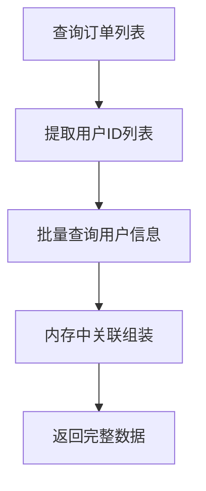

**代码示例:**

```java
@Service
public class OrderQueryService {
    
    @Autowired
    private OrderMapper orderMapper;
    
    @Autowired
    private UserMapper userMapper;
    
    public List<OrderDTO> queryOrdersWithUser(OrderQuery query) {
        // 步骤1:查询订单列表
        List<OrderDO> orders = orderMapper.selectByCondition(query);
        
        // 步骤2:提取用户ID
        Set<Long> userIds = orders.stream()
            .map(OrderDO::getUserId)
            .collect(Collectors.toSet());
        
        // 步骤3:批量查询用户信息
        Map<Long, UserDO> userMap = userMapper.selectByIds(userIds)
            .stream()
            .collect(Collectors.toMap(UserDO::getUserId, u -> u));
        
        // 步骤4:内存中组装
        return orders.stream()
            .map(order -> {
                OrderDTO dto = new OrderDTO(order);
                UserDO user = userMap.get(order.getUserId());
                if (user != null) {
                    dto.setUserName(user.getUserName());
                    dto.setUserPhone(user.getPhone());
                }
                return dto;
            })
            .collect(Collectors.toList());
    }
}
```

**优点:**

- 实现简单,逻辑清晰
- 不依赖数据库特性,适用于任何数据库
- 灵活性高,可处理复杂关联

**缺点:**

- 内存开销大,数据量大时可能OOM
- 网络开销增加,需要多次数据库交互
- 无法利用数据库索引优化

**适用场景:**

- 数据量可控(通常千条级别以内)
- 关联逻辑复杂,数据库难以实现

### 方案二:数据库中间件

使用ShardingSphere、MyCat等中间件的联邦查询功能。

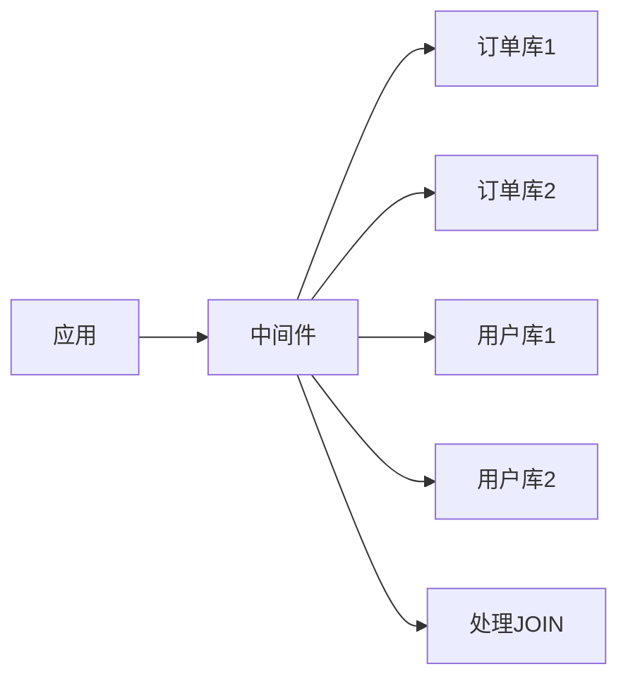

**ShardingSphere联邦查询示例:**

```yaml
# ShardingSphere配置
spring:
  shardingsphere:
    rules:
      sharding:
        tables:
          t_order:
            actual-data-nodes: order_db_$->{0..1}.t_order_$->{0..7}
          t_user:
            actual-data-nodes: user_db_$->{0..1}.t_user_$->{0..7}
    # 启用联邦查询引擎
    sql-federation:
      sql-federation-enabled: true
      execution-plan-cache:
        initial-capacity: 2000
        maximum-size: 65535
```

应用代码无需改动,直接执行JOIN语句:

```java
// 中间件自动处理跨库JOIN
@Select("SELECT o.*, u.user_name " +
        "FROM t_order o " +
        "INNER JOIN t_user u ON o.user_id = u.user_id " +
        "WHERE o.order_status = #{status}")
List<OrderDTO> queryOrdersWithUser(@Param("status") String status);
```

**优点:**

- 对应用透明,无需修改代码
- 中间件负责查询优化和数据汇总

**缺点:**

- 引入额外复杂性和维护成本
- 性能受限于中间件能力
- 部分SQL特性可能不支持

**注意:** ShardingSphere的联邦查询功能仍在完善中,生产环境需谨慎使用。

### 方案三:数据冗余

通过合理的冗余设计避免跨库查询。

**核心思想:** 将常用的关联字段冗余到主表,减少JOIN需求。

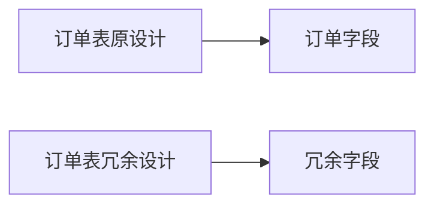

**代码示例:**

```java
// 创建订单时冗余用户信息
@Transactional
public void createOrder(CreateOrderRequest request) {
    // 查询用户信息
    UserDO user = userMapper.selectById(request.getUserId());
    
    // 冗余到订单表
    OrderDO order = new OrderDO();
    order.setUserId(user.getUserId());
    order.setUserName(user.getUserName());  // 冗余
    order.setUserPhone(user.getPhone());    // 冗余
    order.setAmount(request.getAmount());
    
    orderMapper.insert(order);
}

// 查询时无需JOIN
public List<OrderDO> queryOrders(OrderQuery query) {
    // 直接查询订单表,已包含用户信息
    return orderMapper.selectByCondition(query);
}
```

**冗余字段选择原则:**

- **适合冗余**:低频修改字段(用户姓名、身份信息)
- **不适合冗余**:高频修改字段(用户积分、余额)

**一致性保障:**

```java
// 用户信息变更时同步更新订单表
@Transactional
public void updateUserName(Long userId, String newName) {
    // 更新用户表
    userMapper.updateName(userId, newName);
    
    // 同步更新订单表(可异步)
    orderMapper.updateUserNameByUserId(userId, newName);
}
```

**优点:**

- 查询性能最优,无需JOIN
- 减少跨网络调用
- 降低系统复杂度

**缺点:**

- 存储空间增加
- 需要维护数据一致性
- 字段变更时需同步更新多处

**适用场景:**

- 字段修改频率低
- 查询频率极高
- 允许短暂不一致(最终一致性)

### 方案四:搜索引擎

使用Elasticsearch构建宽表,支持复杂查询。

**架构设计:**

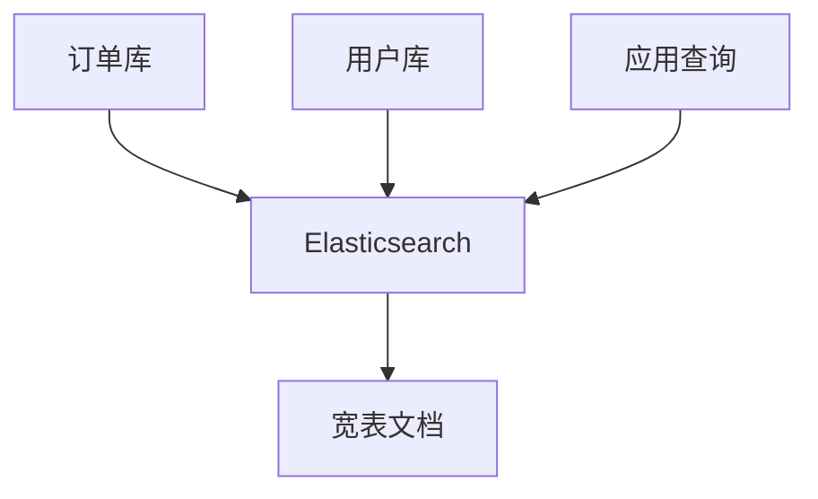

**Elasticsearch文档结构:**

```json
{
  "order_id": "202412020001",
  "user_id": 10086,
  "user_name": "张三",
  "user_phone": "13800138000",
  "user_level": "VIP",
  "order_amount": 299.00,
  "order_status": "PAID",
  "create_time": "2024-12-02T10:30:00"
}
```

**查询示例:**

```java
@Service
public class OrderSearchService {
    
    @Autowired
    private RestHighLevelClient esClient;
    
    public List<OrderDTO> searchOrders(String userName, String orderStatus) {
        BoolQueryBuilder query = QueryBuilders.boolQuery();
        
        if (StringUtils.isNotBlank(userName)) {
            query.must(QueryBuilders.matchQuery("user_name", userName));
        }
        if (StringUtils.isNotBlank(orderStatus)) {
            query.must(QueryBuilders.termQuery("order_status", orderStatus));
        }
        
        SearchRequest request = new SearchRequest("order_index");
        request.source().query(query);
        
        SearchResponse response = esClient.search(request, RequestOptions.DEFAULT);
        
        // 解析结果
        return parseSearchHits(response.getHits());
    }
}
```

**优点:**

- 支持复杂全文检索和聚合分析
- 查询性能极高
- 天然支持分布式

**缺点:**

- 引入新组件,增加复杂度
- 数据同步有延迟(通常秒级)
- 存储成本增加

**适用场景:**

- 复杂搜索需求(模糊查询、全文检索)
- 大数据量分析场景
- 允许数据最终一致性

## 跨库分页查询

分库分表后,跨多个库的分页查询变得复杂,需要特殊处理。

### 单库分页的问题

传统单库分页:

```sql
SELECT * FROM t_order 
WHERE order_status = 'PAID'
ORDER BY create_time DESC
LIMIT 100, 20;  -- 跳过100条,取20条
```

分库后,数据分散在多个库,无法直接执行。

### 方案一:全局视野法(不推荐)

从所有库中查询并在内存中排序分页。

**步骤:**

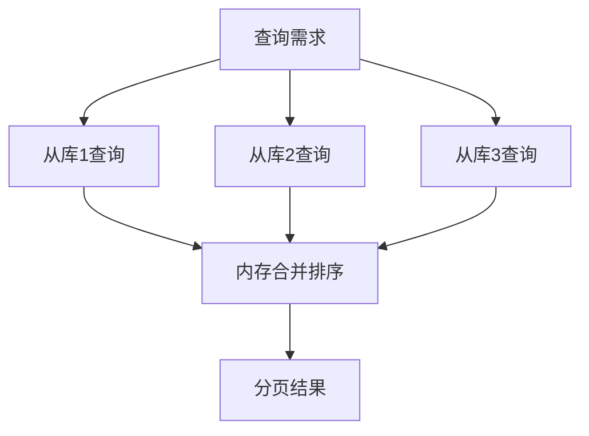

**缺点:**

- 数据传输量大:需要查询offset + limit条数据
- 内存开销大:偏移量越大越严重
- 性能随页码增长急剧下降

**不推荐使用**,仅作为原理理解。

### 方案二:禁止深度分页

通过业务规则限制分页深度。

**常见做法:**

- 搜索引擎通常限制最多查看前100页
- 电商订单列表通常只显示最近几个月

```java
// 限制最大偏移量
public PageResult<Order> queryOrders(int pageNo, int pageSize) {
    int maxOffset = 1000;  // 最多跳过1000条
    
    if (pageNo * pageSize > maxOffset) {
        throw new BusinessException("超出最大分页限制");
    }
    
    // 执行查询...
}
```

**适用场景:**

- C端用户查询(用户通常不会翻很多页)
- 时效性数据(只关心最近数据)

### 方案三:基于分片键查询(推荐)

**核心思路:** 查询条件必须包含分片键,直接路由到特定库/表。

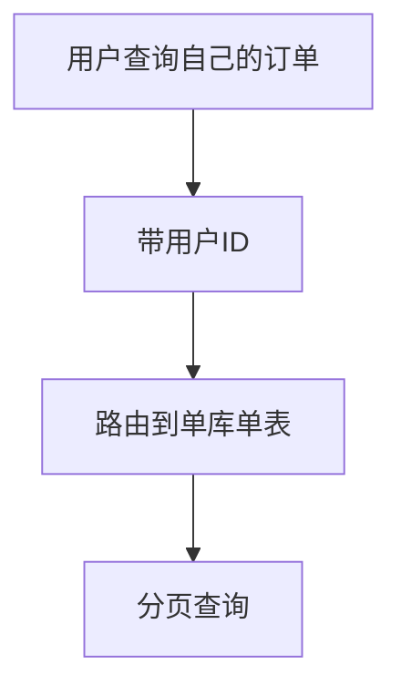

**代码示例:**

```java
// 用户查询自己的订单,天然带分片键
public PageResult<Order> queryMyOrders(Long userId, int pageNo, int pageSize) {
    // 根据userId路由到特定表
    int offset = (pageNo - 1) * pageSize;
    
    List<Order> orders = orderMapper.selectByUserId(userId, offset, pageSize);
    int total = orderMapper.countByUserId(userId);
    
    return new PageResult<>(orders, total, pageNo, pageSize);
}
```

**优点:**

- 查询效率高,仅访问单表
- 无需跨库操作
- 性能稳定

**适用场景:**

- 买家查询自己订单
- 用户查询自己数据

### 方案四:异构索引表

为不同查询维度建立独立的索引表。

**场景:** 卖家需要查询自己店铺的订单

**方案:** 同步一份按卖家ID分表的订单表

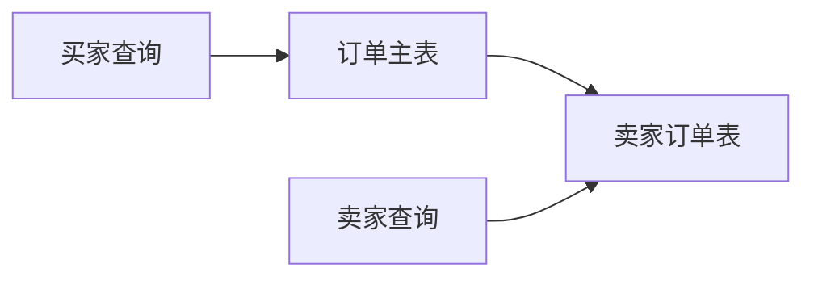

**同步方案:**

```java
// 基于Canal监听Binlog同步
@Component
public class OrderCanalListener {
    
    @Autowired
    private SellerOrderMapper sellerOrderMapper;
    
    @CanalEventListener
    public void onOrderInsert(OrderDO order) {
        // 同步到卖家维度表
        SellerOrderDO sellerOrder = convertToSellerOrder(order);
        sellerOrderMapper.insert(sellerOrder);
    }
}
```

**卖家查询:**

```java
// 卖家查询自己店铺订单
public PageResult<Order> querySellerOrders(Long sellerId, int pageNo, int pageSize) {
    // 路由到卖家维度表
    int offset = (pageNo - 1) * pageSize;
    
    List<SellerOrderDO> orders = sellerOrderMapper.selectBySellerId(
        sellerId, offset, pageSize);
    
    int total = sellerOrderMapper.countBySellerId(sellerId);
    
    return new PageResult<>(orders, total, pageNo, pageSize);
}
```

**优点:**

- 查询性能优秀
- 支持多维度高效分页

**缺点:**

- 存储成本增加
- 数据同步延迟(通常秒级)
- 维护复杂度提升

### 方案五:数据仓库方案

复杂查询转移到TiDB、PolarDB、AnalyticDB等分布式数据库。

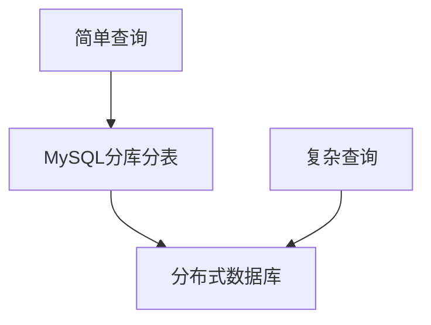

**优点:**

- 支持复杂SQL和跨表查询
- 无需修改应用代码
- 查询性能优秀

**缺点:**

- 引入新组件
- 数据同步成本
- 硬件成本增加

**适用场景:**

- 大型互联网公司
- 复杂BI分析需求

## 模糊查询优化

分库分表后,传统LIKE模糊查询面临挑战。

### 问题分析

```sql
-- 商品名称模糊查询
SELECT * FROM t_product WHERE product_name LIKE '%手机%';
```

**问题:**

1. `%keyword%`无法使用索引,即使单表也慢
2. 分表后需要扫描所有物理表,性能更差

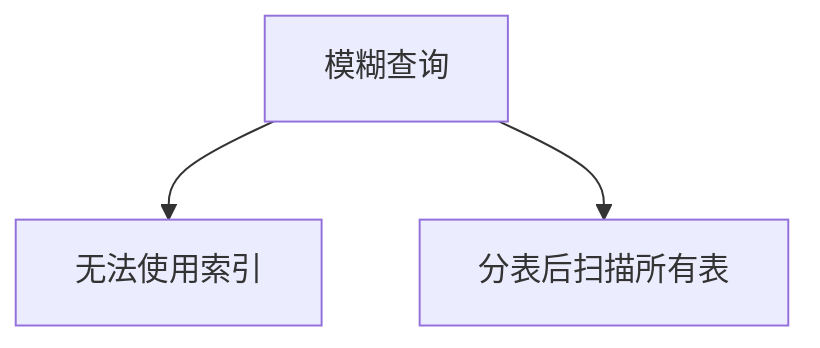

### 解决方案:Elasticsearch

**唯一可行方案:** 使用搜索引擎。

**架构设计:**

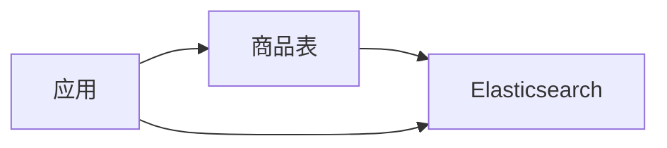

**ES索引设计:**

```json
PUT /product_index
{
  "mappings": {
    "properties": {
      "product_id": { "type": "long" },
      "product_name": {
        "type": "text",
        "analyzer": "ik_max_word",
        "search_analyzer": "ik_smart"
      },
      "category": { "type": "keyword" },
      "price": { "type": "double" }
    }
  }
}
```

**查询示例:**

```java
@Service
public class ProductSearchService {
    
    @Autowired
    private RestHighLevelClient esClient;
    
    public List<ProductDTO> searchByName(String keyword) {
        // 使用match查询,支持分词匹配
        SearchRequest request = new SearchRequest("product_index");
        request.source().query(
            QueryBuilders.matchQuery("product_name", keyword)
        );
        
        SearchResponse response = esClient.search(request, RequestOptions.DEFAULT);
        
        return parseProducts(response.getHits());
    }
}
```

**优势:**

- 支持全文检索和分词
- 查询性能极高
- 支持高亮、拼音、同义词等高级特性

**核心要点:**

- 数据库仅作为存储,不执行模糊查询
- ES作为查询引擎,提供检索能力
- 通过binlog实时同步保证数据一致性

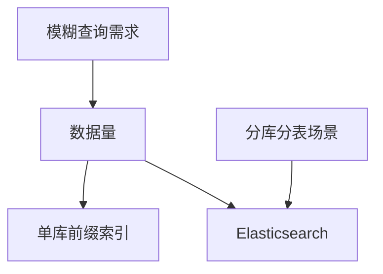

**结论:** 分库分表环境下的模糊查询,Elasticsearch是标准解决方案,无需考虑其他所谓的"奇技淫巧"。
