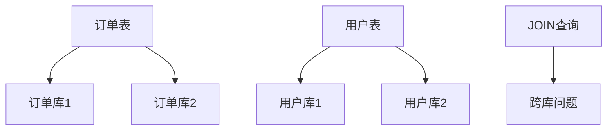
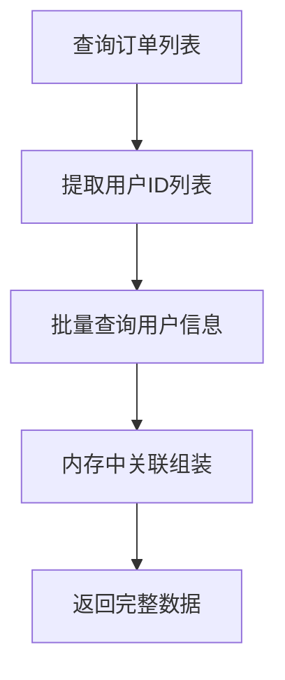

import PaidCTA from '@site/src/components/PaidCTA';

# 跨库查询与性能优化

## 跨库JOIN操作方案

分库分表后,数据分散在多个数据库实例中,传统的SQL JOIN无法跨库执行,需要通过特殊方案解决。

### 问题分析



**典型场景:**

查询订单及对应的用户信息,但订单和用户分散在不同库中:

```sql
-- 单库时代可以直接JOIN
SELECT o.*, u.user_name 
FROM t_order o
INNER JOIN t_user u ON o.user_id = u.user_id
WHERE o.order_status = 'PAID';
```

分库后,订单和用户可能不在同一个数据库实例,标准JOIN失效。

### 方案一:应用层JOIN

在应用代码中分别查询,然后在内存中关联。

**实现步骤:**



**代码示例:**

```java
@Service
public class OrderQueryService {
    
    @Autowired
    private OrderMapper orderMapper;
    
    @Autowired
    private UserMapper userMapper;
    
    public List<OrderDTO> queryOrdersWithUser(OrderQuery query) {
        // 步骤1:查询订单列表
        List<OrderDO> orders = orderMapper.selectByCondition(query);
        
        // 步骤2:提取用户ID
        Set<Long> userIds = orders.stream()
            .map(OrderDO::getUserId)
            .collect(Collectors.toSet());
        
        // 步骤3:批量查询用户信息
        Map<Long, UserDO> userMap = userMapper.selectByIds(userIds)
            .stream()
            .collect(Collectors.toMap(UserDO::getUserId, u -> u));
        
        // 步骤4:内存中组装
        return orders.stream()
            .map(order -> {
                OrderDTO dto = new OrderDTO(order);
                UserDO user = userMap.get(order.getUserId());
                if (user != null) {
                    dto.setUserName(user.getUserName());
                    dto.setUserPhone(user.getPhone());
                }
                return dto;
            })
            .collect(Collectors.toList());
    }
}
```

**优点:**

- 实现简单,逻辑清晰
- 不依赖数据库特性,适用于任何数据库
- 灵活性高,可处理复杂关联

**缺点:**

- 内存开销大,数据量大时可能OOM
- 网络开销增加,需要多次数据库交互
- 无法利用数据库索引优化

**适用场景:**

- 数据量可控(通常千条级别以内)
- 关联逻辑复杂,数据库难以实现

<PaidCTA />