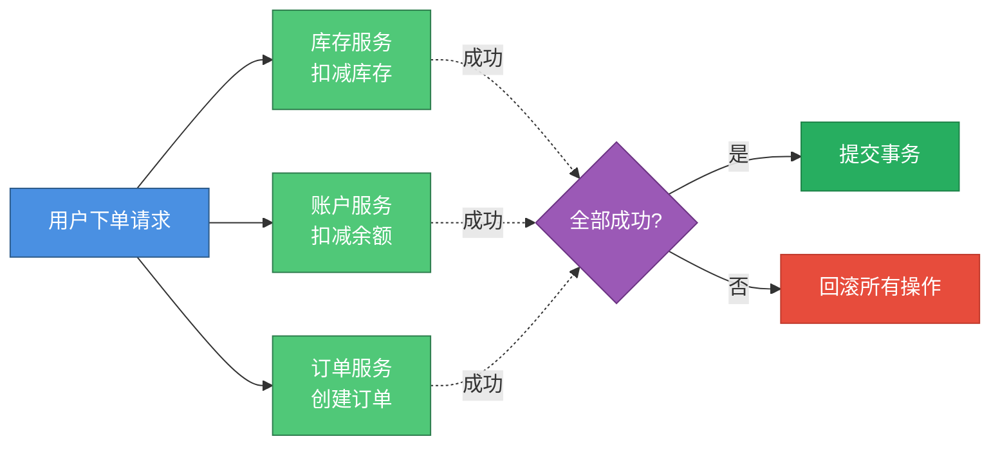
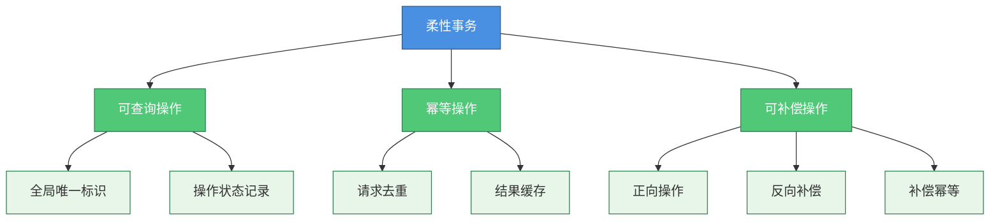

# 分布式事务基础概念与解决方案

## 什么是分布式事务

在分布式系统架构中，分布式事务是指涉及多个独立数据库或多个应用服务的事务操作。这些数据库或服务可能部署在不同的物理服务器节点上，甚至跨越不同的数据中心。分布式事务的核心目标是确保所有参与节点的数据操作保持一致性，即所有操作要么全部执行成功并提交，要么全部回滚失败。

举个实际场景，假设在一个电商平台中，用户完成支付后需要处理多项业务：从库存服务扣减商品库存、从账户服务扣减用户余额、在订单服务创建订单记录。在单体应用中，这些操作可以放在同一个数据库事务中，轻松保证ACID特性。但在微服务架构下，库存服务、账户服务和订单服务各自拥有独立的数据库，此时就需要分布式事务机制来保证这些跨服务操作的数据一致性。

为了解决分布式环境下的事务一致性问题，业界提出了多种分布式事务解决方案，包括基于XA协议的两阶段提交、三阶段提交、TCC事务模式、基于消息的最终一致性方案等。

## 常见的分布式事务解决方案

分布式事务的核心目标是保证多个参与节点的数据一致性。根据一致性的强弱程度，可以将分布式事务方案分为强一致性方案和最终一致性方案两大类。

### 强一致性方案

强一致性方案要求在任何时刻，所有节点的数据都保持完全一致。这类方案通常需要引入一个协调者角色，由协调者统一调度所有参与者执行提交或回滚操作。

**XA规范与两阶段提交（2PC）**

X/Open组织定义了分布式事务处理的XA规范，其中包含事务管理器（TM）、资源管理器（RM）等核心角色。两阶段提交协议就是基于XA规范实现的经典分布式事务一致性协议。

在2PC协议中，整个事务分为准备阶段和提交阶段。准备阶段协调者询问所有参与者是否可以提交事务，参与者执行事务但不提交；提交阶段根据参与者的反馈，协调者决定让所有参与者提交或回滚事务。

**三阶段提交（3PC）**

三阶段提交在2PC基础上增加了一个询问阶段，并引入超时机制。将原来的准备阶段拆分为CanCommit和PreCommit两个阶段，降低了因协调者故障导致的阻塞问题，提升了系统的可用性。

这两种方案的优点是能够保证强一致性，缺点是性能较差、存在同步阻塞问题，且在协调者故障时可能导致参与者长时间等待。

### 最终一致性方案

最终一致性方案不要求实时的强一致性，而是保证在一定时间窗口后，所有节点的数据最终达到一致状态。这类方案在性能和可用性上有更好的表现。

**TCC事务模式**

TCC是Try-Confirm-Cancel的缩写，将一个业务操作拆分为三个独立的事务阶段。Try阶段预留业务资源，Confirm阶段确认提交，Cancel阶段取消并释放资源。TCC通过业务层面的补偿机制实现最终一致性，性能较好但业务侵入性较强。

**基于消息的最终一致性**

这类方案依赖消息中间件实现事务的最终一致性。主要包括：

1. **本地消息表**：在本地数据库创建消息表，将业务操作和消息记录放在同一个本地事务中，通过定时任务扫描消息表并发送到MQ，保证消息一定能发出。

2. **事务消息**：利用消息中间件（如RocketMQ）的事务消息机制，将消息发送拆分为两个半消息，通过两阶段方式加上回调反查机制保证消息可靠投递。

3. **最大努力通知**：发送方尽最大努力通知接收方，但不保证消息一定送达，适用于对一致性要求不高的场景，如发送通知类消息。

**Saga长事务模式**

Saga模式将长事务拆分为多个短事务，每个短事务都有对应的补偿事务。当某个短事务失败时，执行前面所有已完成事务的补偿操作，实现最终一致性。Saga适合业务流程长且复杂的场景。

### 柔性事务与BASE理论

柔性事务是相对于数据库ACID刚性事务而言的概念，基于BASE理论（基本可用、软状态、最终一致性）实现分布式事务。柔性事务部分遵循ACID特性：

- **原子性**：严格遵循
- **一致性**：事务完成后的一致性严格遵循，事务中的一致性可适当放宽
- **隔离性**：并行事务间不可影响，事务中间结果可见性允许安全放宽  
- **持久性**：严格遵循

实现柔性事务的几个基础要素包括：

**可查询操作**：每个服务操作都要提供查询接口，通过全局唯一标识（业务单号或流水号）可以查询操作执行状态，便于协调和补偿。

**幂等操作**：同一个方法使用相同参数多次调用，产生的业务结果应与调用一次相同。幂等性是实现重试机制的基础，可通过缓存请求结果、检测重复操作等方式实现。

**可补偿操作**：每个正向操作都需要提供对应的反向补偿操作，用于事务回滚。例如增加积分操作对应的补偿操作是扣减积分，且补偿操作也需要满足幂等性。

## 如何选择合适的分布式事务方案

在实际项目中选择分布式事务方案时，需要综合考虑多个因素：

**一致性要求**：如果业务要求强一致性，可选择2PC、3PC或XA方案；如果可以接受最终一致性，则可选择TCC、消息方案或Saga模式。例如银行转账场景需要强一致性，而积分发放场景使用最终一致性即可。

**性能要求**：强一致性方案由于需要阻塞等待，性能相对较差；TCC和消息方案性能更好，适合高并发场景。对于核心交易链路可采用TCC，非核心链路可使用消息方案。

**实现成本**：2PC和TCC的实现复杂度较高，业务侵入性大。消息方案需要引入消息中间件，需要考虑部署维护成本。事务消息还要求MQ支持事务特性（如RocketMQ），而本地消息表对MQ类型没有特殊要求。

**可用性要求**：根据CAP理论，一致性和可用性无法同时保证。强一致性方案可用性较低，最终一致性方案可用性较高。对于高可用要求的系统，建议优先选择最终一致性方案。

**数据规模**：对于数据量特别大的场景，基于消息的方案可能出现消息堆积导致一致性保障不及时。此时可以考虑使用Seata等分布式事务框架，或者采用数据分片的方式降低单点压力。

**技术栈限制**：XA方案需要数据库支持XA协议；事务消息需要MQ支持（如RocketMQ）；TCC需要应用层编写大量补偿代码。需要根据现有技术栈和团队能力选择合适方案。

下表总结了常见分布式事务方案的对比：

| 方案 | 一致性 | 性能 | 实现复杂度 | 适用场景 |
|------|--------|------|------------|----------|
| XA（2PC/3PC） | 强一致 | 低 | 中 | 对一致性和隔离性要求高的场景 |
| TCC | 最终一致 | 高 | 高 | 高性能要求、资金交易等核心业务 |
| Saga | 最终一致 | 高 | 中 | 长事务、业务流程复杂的场景 |
| 本地消息表 | 最终一致 | 中 | 中 | 通用场景、需要消息持久化 |
| 事务消息 | 最终一致 | 中 | 低 | MQ支持事务消息的场景 |
| 最大努力通知 | 弱一致 | 高 | 低 | 对一致性要求不高的通知场景 |

在实际应用中，往往需要根据不同的业务场景组合使用多种方案。核心链路使用强一致性或TCC保证数据准确性，非核心链路使用消息方案提升性能，通知类功能使用最大努力通知降低复杂度。通过合理的方案选择和组合，可以在保证数据一致性的同时，兼顾系统的性能和可用性。
