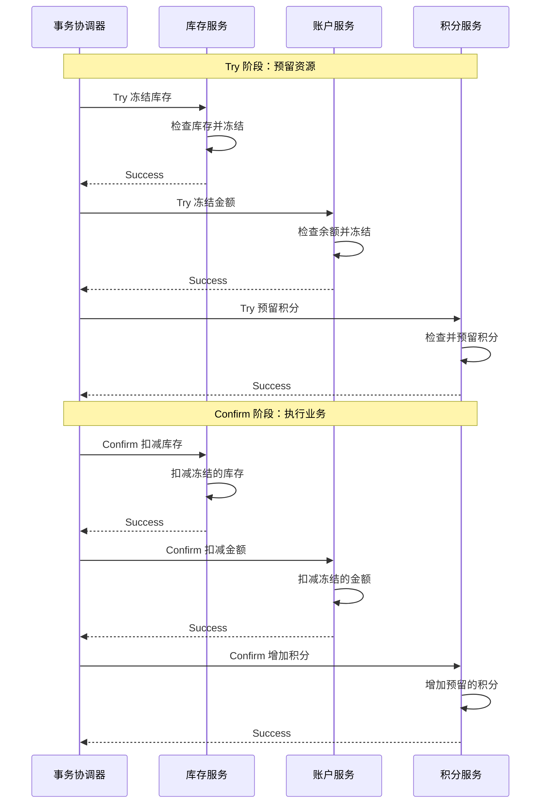
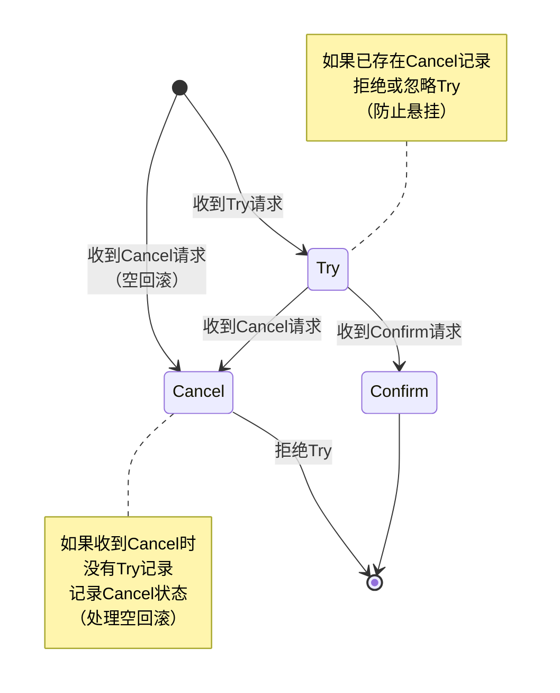

# TCC分布式事务详解

## TCC事务模式概述

TCC是Try-Confirm-Cancel的缩写，是一种基于业务层补偿机制的分布式事务解决方案。TCC模式将一个完整的业务操作拆分为三个独立的事务阶段，通过这三个阶段的协同配合来实现分布式环境下的事务一致性。

TCC事务包括以下三个核心步骤：

**Try阶段**：在Try阶段，各个参与者尝试执行业务操作，并对全局事务预留必要的业务资源。如果Try阶段执行成功，参与者返回成功标识；如果执行失败，则返回失败标识。需要注意的是，Try阶段执行的是完整的业务检查和资源预留，但不是最终提交。

**Confirm阶段**：如果所有参与者的Try阶段都执行成功，协调者通知所有参与者执行Confirm操作。在Confirm阶段，参与者使用Try阶段预留的资源完成业务操作，并释放全局事务占用的资源。Confirm操作必须保证幂等性，因为可能会被重复调用。

**Cancel阶段**：如果任何一个参与者在Try阶段执行失败，或者Confirm阶段出现异常，协调者会通知所有参与者执行Cancel操作。Cancel阶段释放Try阶段预留的业务资源，回滚已执行的操作。Cancel操作同样必须保证幂等性。



举个实际的业务场景。假设用户在电商平台购物，需要从钱包账户扣款200元，同时给用户赠送100积分：

**Try阶段**：
- 钱包服务检查账户余额是否充足，如果充足则冻结200元
- 积分服务检查积分账户状态正常，预留100积分的配额

**Confirm阶段**：
- 如果Try阶段都成功，钱包服务执行扣款，将冻结的200元真正扣除
- 积分服务执行增加积分操作，将100积分加到用户账户

**Cancel阶段**：
- 如果Try阶段钱包冻结失败，积分服务需要释放预留的积分配额
- 如果Confirm阶段钱包扣款成功但积分增加失败，需要执行补偿操作，将钱包的200元退回（执行一次反向充值操作）

### TCC与2PC的核心区别

虽然TCC和2PC都是两阶段类型的协议，但它们有本质的不同：

**事务范围不同**

- **2PC是一个事务**：在2PC中，Prepare阶段事务并不提交，只有在第二阶段收到Commit指令后才真正提交。整个过程是一个完整的数据库事务，事务会一直持续到第二阶段结束，事务持有的锁也会一直保持。

- **TCC是三个独立事务**：TCC把一个业务操作拆分成Try、Confirm、Cancel三个步骤，每个步骤操作数据库时都是一个独立的事务，各自独立开启、独立提交。Try阶段执行完成后事务就提交了，不会等到Confirm阶段。

**一致性保证不同**

- **2PC保证强一致性**：因为2PC是一个完整的数据库事务，严格遵循ACID特性，能够保证强一致性。在事务提交之前，其他事务看不到中间状态的数据。

- **TCC保证最终一致性**：TCC通过全局锁和重试机制保证最终一致性。在Try和Confirm之间存在时间间隔，数据处于中间状态（如资金已冻结但未扣款），用户可能看到这种中间状态，因此TCC是最终一致性而非强一致性。

**性能差异**

- **2PC性能较差**：由于2PC事务时间长，从Prepare到Commit期间一直持有锁，阻塞时间长，并发性能差。

- **TCC性能较好**：TCC的每个阶段都是独立的短事务，锁持有时间短，可以支持更高的并发。

**实现层次不同**

- **2PC在数据库资源层实现**：2PC依赖数据库对XA协议的支持，在数据库资源层面实现分布式事务。

- **TCC在应用层实现**：TCC在应用层通过业务代码实现，不依赖特定的数据库特性，可以支持非关系型数据库。

下表总结了两者的主要区别：

| 维度 | XA 2PC | TCC |
|------|--------|-----|
| 实现层 | 数据库资源层 | 应用层 |
| 事务机制 | 一个事务 | 三个独立事务 |
| 性能 | 低（阻塞时间长） | 高（异步提交） |
| 一致性 | 强一致性 | 最终一致性 |
| 隔离性 | 高（数据库隔离级别） | 弱（需全局锁辅助） |
| 数据库要求 | 需支持XA协议 | 无特殊要求 |
| 回滚方式 | 数据库原生回滚 | 业务补偿 |
| 适用场景 | 强一致、低并发 | 高并发、最终一致 |

因此，2PC适用于对事务一致性要求极高的场景，如银行核心转账系统。而TCC适用于对性能要求高但可以接受最终一致性的场景，如电商订单处理、库存扣减等业务。

## TCC的优缺点

### 优点

**灵活性高**：TCC适用于各种业务场景，如订单处理、库存管理、资金结算等，可以根据业务逻辑实现精细的事务控制。开发者可以在业务层面灵活设计补偿逻辑。

**高可用性**：TCC使用分布式锁和资源预留机制保证分布式事务一致性，即使某个节点出现故障，也不会影响整个系统的运行。可以通过重试机制保证事务最终完成。

**可扩展性好**：TCC采用分阶段提交方式，各个阶段相对独立，支持横向扩展，可以适应更多的并发访问和复杂的业务场景。

**性能优秀**：相比2PC，TCC的每个阶段都是独立的短事务，不会长时间持有数据库锁，具有更好的并发性能，适合高并发场景。

### 缺点

**实现复杂度高**：TCC需要为每个业务操作实现Try、Confirm和Cancel三个方法，每个方法都需要实现正确的业务逻辑和补偿机制，代码实现复杂度较高。

**业务侵入性强**：TCC需要将事务操作拆分为三个步骤，对原有业务代码有较大的侵入性，需要针对不同的业务场景进行专门实现，增加了开发和维护成本。

**悬挂事务问题**：在调用TCC服务的Try操作时，可能因网络拥堵导致超时，此时事务协调器触发Cancel操作。之后，延迟在网络上的Try请求被服务接收，出现了Cancel请求比Try请求先执行的情况。这会导致Try阶段占用的资源无法释放，形成事务悬挂。

**空回滚问题**：当Try操作因网络原因未执行成功，但事务协调器认为超时而触发Cancel操作时，对于那些Try未成功的参与者来说，执行Cancel就是一次空回滚。需要在业务中正确识别和处理空回滚，否则可能导致Cancel失败，最终导致整个分布式事务失败。

## TCC关键问题及解决方案

### 空回滚和悬挂问题

**空回滚**：当Try阶段某些参与者失败了，协调器通知所有参与者执行Cancel。对于那些Try未成功的参与者来说，本次Cancel就是空回滚。如果不正确处理空回滚，可能会出现异常报错，甚至导致Cancel一直失败。

**事务悬挂**：网络延迟可能导致Cancel请求比Try请求先到达。参与者先执行了空回滚，之后才收到Try请求并执行，这会导致Try占用的资源无法释放，没有后续操作来处理，形成悬挂。

**解决方案：引入事务记录表**

可以通过引入分布式事务记录表来统一解决这两个问题。每个参与者在本地数据库创建事务记录表，记录每次分布式事务的操作状态。

表结构示例：

```sql
CREATE TABLE `distributed_transaction_log` (
  `tx_id` varchar(128) NOT NULL COMMENT '全局事务ID',
  `state` int(1) DEFAULT NULL COMMENT '事务状态，0:try，1:confirm，2:cancel',
  `create_time` datetime DEFAULT NULL COMMENT '创建时间',
  `update_time` datetime DEFAULT NULL COMMENT '更新时间',
  PRIMARY KEY (`tx_id`)
) ENGINE=InnoDB DEFAULT CHARSET=utf8mb4 COMMENT='分布式事务日志表';
```

事务状态流转：



**处理空回滚**：

```java
public boolean cancel(String txId) {
    // 查询事务记录
    TransactionLog log = transactionLogMapper.selectByTxId(txId);
    
    if (log == null) {
        // Try阶段未执行，这是空回滚
        // 记录Cancel状态，防止后续Try执行
        TransactionLog cancelLog = new TransactionLog();
        cancelLog.setTxId(txId);
        cancelLog.setState(TransactionState.CANCEL);
        transactionLogMapper.insert(cancelLog);
        return true;
    }
    
    // 正常Cancel逻辑
    if (log.getState() == TransactionState.TRY) {
        // 执行业务回滚
        doBusinessCancel(txId);
        // 更新状态
        log.setState(TransactionState.CANCEL);
        transactionLogMapper.updateById(log);
        return true;
    }
    
    // 已经Cancel过了，幂等返回
    return log.getState() == TransactionState.CANCEL;
}
```

**防止事务悬挂**：

```java
public boolean try(String txId, TryRequest request) {
    // 查询事务记录
    TransactionLog log = transactionLogMapper.selectByTxId(txId);
    
    if (log != null && log.getState() == TransactionState.CANCEL) {
        // 已经执行过Cancel（空回滚），拒绝Try
        return false; // 或直接返回成功，避免重试
    }
    
    if (log != null && log.getState() == TransactionState.TRY) {
        // 幂等处理，已经Try过了
        return true;
    }
    
    // 执行Try业务逻辑
    doBusinessTry(request);
    
    // 记录Try状态
    TransactionLog tryLog = new TransactionLog();
    tryLog.setTxId(txId);
    tryLog.setState(TransactionState.TRY);
    transactionLogMapper.insert(tryLog);
    
    return true;
}
```

需要注意的是，以上操作需要做好并发控制，可以通过数据库的唯一索引、乐观锁或分布式锁来保证并发安全。

有了事务记录表，还可以基于它实现幂等控制。每次Try、Confirm、Cancel请求到达时，都先查询事务记录表，根据当前状态决定是执行业务逻辑还是幂等返回。

### Confirm或Cancel失败的处理

在TCC模式中，Confirm或Cancel阶段可能因为网络故障、服务异常等原因执行失败，需要有合适的处理策略。

**Confirm失败的处理**

由于Try阶段已经锁定了资源，Confirm阶段理论上成功概率很高。如果Confirm失败，通常采用以下策略：

1. **重试机制（最常用）**：这是最常见的处理方式。由于Try阶段已经预留了资源，Confirm失败大概率是暂时性问题（如网络延迟、服务短暂不可用）。可以设置重试策略，包括重试次数、重试间隔等。通常会设置重试上限，避免无限重试。

```java
public void confirmWithRetry(String txId) {
    int maxRetries = 3;
    int retryCount = 0;
    
    while (retryCount < maxRetries) {
        try {
            confirm(txId);
            return; // 成功则返回
        } catch (Exception e) {
            retryCount++;
            if (retryCount >= maxRetries) {
                // 记录日志并告警
                log.error("Confirm failed after {} retries, txId: {}", maxRetries, txId);
                alertService.sendAlert("TCC Confirm failed", txId);
                throw e;
            }
            // 等待后重试
            Thread.sleep(1000 * retryCount); // 递增延迟
        }
    }
}
```

2. **异步补偿**：如果同步重试仍然失败，可以将失败的事务记录下来，通过异步任务或定时任务继续重试，直到成功为止。

3. **人工干预**：对于重要的业务事务，如果自动重试多次仍然失败，可以触发告警，由运维人员或系统管理员人工介入处理。

**Cancel失败的处理**

Cancel失败的处理策略与Confirm类似：

1. **自动重试**：通过自动重试机制多次尝试执行Cancel操作，直到成功。

2. **记录日志和告警**：将失败信息详细记录到日志中，并发送告警通知相关人员。

3. **人工干预**：如果自动重试多次仍然失败，需要人工介入，手动执行Cancel操作或进行数据修复。

无论是Confirm还是Cancel失败，关键是要保证操作的**幂等性**，这样即使重复执行也不会产生副作用。同时要有完善的监控和告警机制，及时发现和处理异常情况。

## TCC框架选择

目前业界有多个成熟的TCC框架可以选择：

**Seata TCC模式**：阿里开源的分布式事务解决方案Seata提供了完整的TCC模式支持，集成简单，社区活跃。

**Hmily**：高性能的TCC分布式事务框架，支持SpringBoot、Dubbo、SpringCloud等主流框架。

**ByteTCC**：支持XA和TCC两种模式的分布式事务框架，性能优秀。

选择TCC框架时，需要考虑与现有技术栈的兼容性、性能要求、社区支持等因素。对于已经使用Seata的项目，可以直接使用Seata的TCC模式；对于追求极致性能的场景，可以考虑Hmily或ByteTCC。
