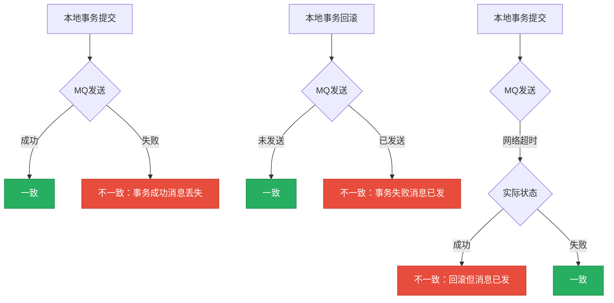

import PaidCTA from '@site/src/components/PaidCTA';

# 基于消息的分布式事务方案

## 基于消息的分布式事务方案概述

在分布式系统中，基于消息中间件实现分布式事务是一种常见且实用的解决方案。这类方案主要分为两大类：可靠消息最终一致性方案和最大努力通知方案。

### 为什么需要基于消息的方案

在分布式系统中，如果直接在本地事务后发送MQ消息，会面临以下问题：

**消息可靠性问题**：任何MQ在极端情况下都可能丢失消息，不能100%保证消息不丢。即使发送成功，MQ自身也可能因为故障导致消息丢失。

**本地事务与消息发送的一致性问题**：本地事务操作和MQ发送操作无法保证原子性，可能出现以下不一致情况：

1. 本地事务提交成功，但MQ发送失败，导致下游服务无法感知业务变更
2. 本地事务回滚，但MQ发送成功，导致下游服务执行了不该执行的操作
3. 网络超时导致的不确定性：MQ发送因网络超时返回失败，本地事务回滚，但实际MQ可能已经接收成功，最终仍然导致不一致

为了解决这些问题，需要有一种机制能够保证MQ消息一定可以发送成功，或者在失败时有重试机制让其最终成功。这就是事务消息和本地消息表方案要解决的核心问题。

## 事务消息方案

事务消息是指消息中间件提供的一种特殊消息类型，通过两阶段提交机制保证消息发送与本地事务的一致性。目前RocketMQ提供了完整的事务消息支持（需要注意，Kafka的事务消息与此不同，主要用于保证生产者到Broker的精确一次语义）。

### 事务消息的执行流程

事务消息将普通消息的发送拆分为两个阶段，通过发送两个半消息（Half Message）来实现事务性：

**第一阶段：发送半消息**

<PaidCTA />