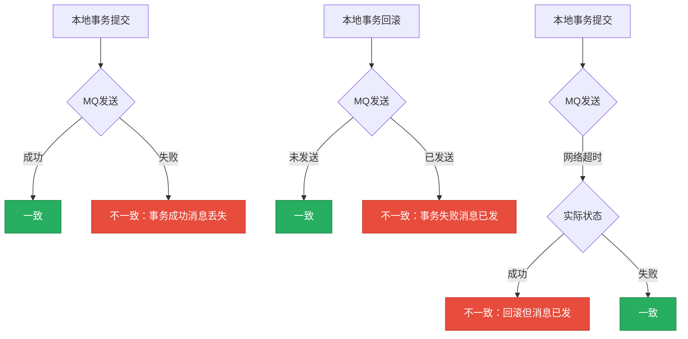
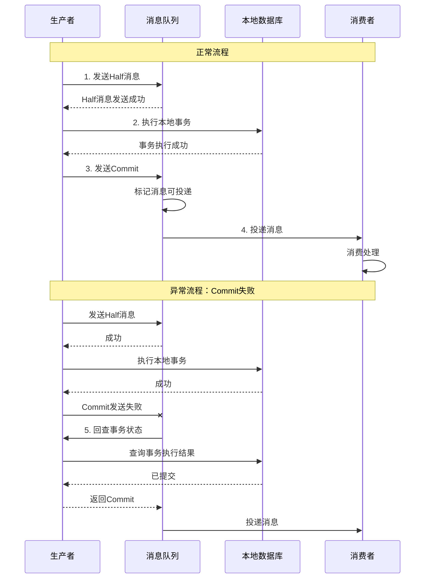
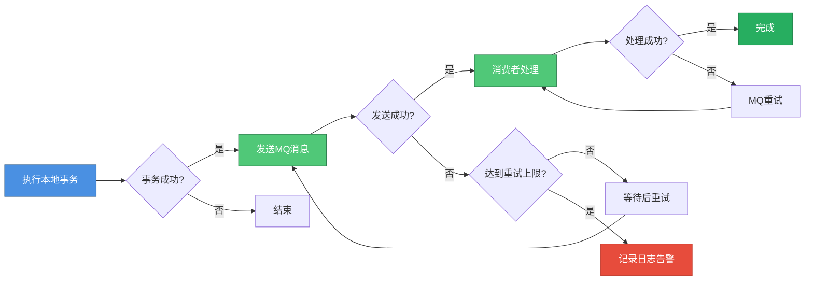

# 基于消息的分布式事务方案

## 基于消息的分布式事务方案概述

在分布式系统中，基于消息中间件实现分布式事务是一种常见且实用的解决方案。这类方案主要分为两大类：可靠消息最终一致性方案和最大努力通知方案。

### 为什么需要基于消息的方案

在分布式系统中，如果直接在本地事务后发送MQ消息，会面临以下问题：

**消息可靠性问题**：任何MQ在极端情况下都可能丢失消息，不能100%保证消息不丢。即使发送成功，MQ自身也可能因为故障导致消息丢失。

**本地事务与消息发送的一致性问题**：本地事务操作和MQ发送操作无法保证原子性，可能出现以下不一致情况：

1. 本地事务提交成功，但MQ发送失败，导致下游服务无法感知业务变更
2. 本地事务回滚，但MQ发送成功，导致下游服务执行了不该执行的操作
3. 网络超时导致的不确定性：MQ发送因网络超时返回失败，本地事务回滚，但实际MQ可能已经接收成功，最终仍然导致不一致



为了解决这些问题，需要有一种机制能够保证MQ消息一定可以发送成功，或者在失败时有重试机制让其最终成功。这就是事务消息和本地消息表方案要解决的核心问题。

## 事务消息方案

事务消息是指消息中间件提供的一种特殊消息类型，通过两阶段提交机制保证消息发送与本地事务的一致性。目前RocketMQ提供了完整的事务消息支持（需要注意，Kafka的事务消息与此不同，主要用于保证生产者到Broker的精确一次语义）。

### 事务消息的执行流程

事务消息将普通消息的发送拆分为两个阶段，通过发送两个半消息（Half Message）来实现事务性：

**第一阶段：发送半消息**
1. 生产者向MQ发送第一个半消息（prepare消息）
2. 如果半消息发送失败，本地事务不会执行，整个流程结束
3. 如果半消息发送成功，进入第二阶段

**第二阶段：执行本地事务**
1. 执行本地业务事务
2. 根据本地事务执行结果，向MQ发送第二个半消息（commit或rollback消息）
3. 如果本地事务成功，发送commit消息，MQ将消息投递给消费者
4. 如果本地事务失败，发送rollback消息，MQ丢弃该消息

**第三阶段：消息回查**
1. 如果第二个半消息因网络等原因发送失败，MQ会主动回查生产者
2. 生产者提供回查接口，查询本地事务的执行状态
3. 根据回查结果，MQ决定提交或回滚消息



### 事务消息的优势

**保证一致性**：通过两阶段机制，确保只有在本地事务成功后，消息才会被消费者接收。避免了本地事务与消息发送不一致的问题。

**自动回查**：当commit或rollback消息发送失败时，MQ会主动回查生产者，无需人工干预即可保证消息最终状态正确。

**业务侵入性较低**：相比本地消息表方案，不需要创建额外的数据表，也不需要定时任务扫描，对业务代码的侵入性较小。

### 事务消息的限制

**依赖MQ特性**：只有支持事务消息的MQ（如RocketMQ）才能使用此方案，Kafka、RabbitMQ等不支持。

**回查接口要求**：生产者必须提供幂等的回查接口，能够准确查询本地事务的执行状态。

**性能开销**：相比普通消息，事务消息需要额外的网络交互和状态维护，性能有一定损耗。

### 代码示例

```java
@Service
public class OrderService {
    
    @Autowired
    private TransactionMQProducer producer;
    
    @Autowired
    private OrderMapper orderMapper;
    
    public void createOrder(OrderRequest request) {
        // 构造消息
        Message message = new Message("ORDER_TOPIC", 
            JSON.toJSONString(request).getBytes());
        
        // 发送事务消息
        producer.sendMessageInTransaction(message, request);
    }
    
    // 执行本地事务的监听器
    @Component
    public class OrderTransactionListener implements TransactionListener {
        
        @Override
        public LocalTransactionState executeLocalTransaction(Message msg, Object arg) {
            OrderRequest request = (OrderRequest) arg;
            try {
                // 执行本地事务
                orderMapper.insert(request);
                return LocalTransactionState.COMMIT_MESSAGE;
            } catch (Exception e) {
                return LocalTransactionState.ROLLBACK_MESSAGE;
            }
        }
        
        @Override
        public LocalTransactionState checkLocalTransaction(MessageExt msg) {
            // 回查本地事务状态
            String orderId = msg.getKeys();
            Order order = orderMapper.selectById(orderId);
            if (order != null) {
                return LocalTransactionState.COMMIT_MESSAGE;
            }
            return LocalTransactionState.ROLLBACK_MESSAGE;
        }
    }
}
```

## 最大努力通知方案

最大努力通知是一种弱一致性的分布式事务方案，发送方尽最大努力通知接收方，但不保证消息一定送达。这种方案实现简单，性能好，适用于对一致性要求不高的场景。

### 执行流程

1. 生产者执行本地事务
2. 本地事务成功后，发送MQ消息
3. 如果消息发送失败，通过重试机制多次尝试发送
4. 达到最大重试次数后，如果仍然失败，则放弃发送
5. 消费者接收消息后执行业务逻辑，如果失败则依赖MQ的重试机制



### 适用场景

最大努力通知适合以下场景：

- **非核心业务流程**：如订单创建后发送邮件通知、新用户注册后发送欢迎短信等
- **可以容忍消息丢失**：即使通知失败也不会影响核心业务
- **对实时性要求不高**：可以接受一定的延迟
- **需要简单实现**：不想引入复杂的事务消息或本地消息表机制

### 示例代码

```java
@Service
public class NotificationService {
    
    @Autowired
    private RocketMQTemplate mqTemplate;
    
    private static final int MAX_RETRY_TIMES = 3;
    
    public void sendNotification(String userId, String content) {
        // 构造消息
        NotificationMessage message = new NotificationMessage();
        message.setUserId(userId);
        message.setContent(content);
        
        // 尽最大努力发送
        boolean success = sendWithRetry(message, MAX_RETRY_TIMES);
        
        if (!success) {
            // 记录失败日志
            log.error("Failed to send notification after {} retries, userId: {}", 
                MAX_RETRY_TIMES, userId);
        }
    }
    
    private boolean sendWithRetry(NotificationMessage message, int maxRetries) {
        for (int i = 0; i < maxRetries; i++) {
            try {
                mqTemplate.convertAndSend("NOTIFICATION_TOPIC", message);
                return true;
            } catch (Exception e) {
                log.warn("Send notification failed, retry {}/{}", i + 1, maxRetries);
                if (i < maxRetries - 1) {
                    try {
                        Thread.sleep(1000 * (i + 1)); // 递增延迟
                    } catch (InterruptedException ie) {
                        Thread.currentThread().interrupt();
                    }
                }
            }
        }
        return false;
    }
}
```

## 三种方案的对比

### 方案对比表

| 对比维度 | 最大努力通知 | 事务消息 | 本地消息表 |
|---------|------------|---------|-----------|
| 一致性保证 | 弱一致性 | 最终一致性 | 最终一致性 |
| 实现复杂度 | 低 | 中 | 高 |
| MQ要求 | 普通MQ即可 | 需支持事务消息 | 普通MQ即可 |
| 代码侵入性 | 低 | 中 | 高 |
| 性能 | 高 | 中 | 中 |
| 消息可靠性 | 不保证 | 保证 | 保证 |
| 适用场景 | 通知类非核心业务 | 核心业务流程 | 核心业务流程 |

### 选择建议

**使用最大努力通知的场景**：
- 发送各类通知消息（邮件、短信、站内信）
- 数据同步到非核心系统
- 统计分析数据上报
- 日志收集和监控数据上报

这些场景的共同特点是：即使消息丢失也不会影响核心业务，可以接受一定的数据不一致。

**使用事务消息的场景**：
- MQ支持事务消息（如使用RocketMQ）
- 对一致性要求较高但可接受最终一致
- 不想维护额外的消息表
- 订单状态变更通知库存系统
- 支付成功后通知积分系统

**使用本地消息表的场景**：
- MQ不支持事务消息
- 需要消息持久化便于对账
- 需要查询历史消息发送记录
- 对消息可靠性要求极高
- 多个下游系统需要接收同一消息

在实际应用中，可以根据不同业务场景组合使用这三种方案。核心业务链路使用事务消息或本地消息表保证可靠性，非核心通知类功能使用最大努力通知提高性能和降低复杂度。

### 消息消费端的保障

无论使用哪种方案，消费端都需要做好以下保障：

**幂等性**：消息可能被重复投递，消费端必须保证幂等处理，可通过业务主键去重、分布式锁、状态机等方式实现。

**重试机制**：消费失败时依赖MQ的重试机制，设置合理的重试次数和重试间隔。

**死信队列**：对于多次重试仍然失败的消息，放入死信队列，避免阻塞正常消息消费，后续可人工处理或定期重试。

**监控告警**：监控消息积压、消费失败率等指标，及时发现和处理异常情况。

通过生产端和消费端的双重保障，可以构建一个可靠的基于消息的分布式事务解决方案。
