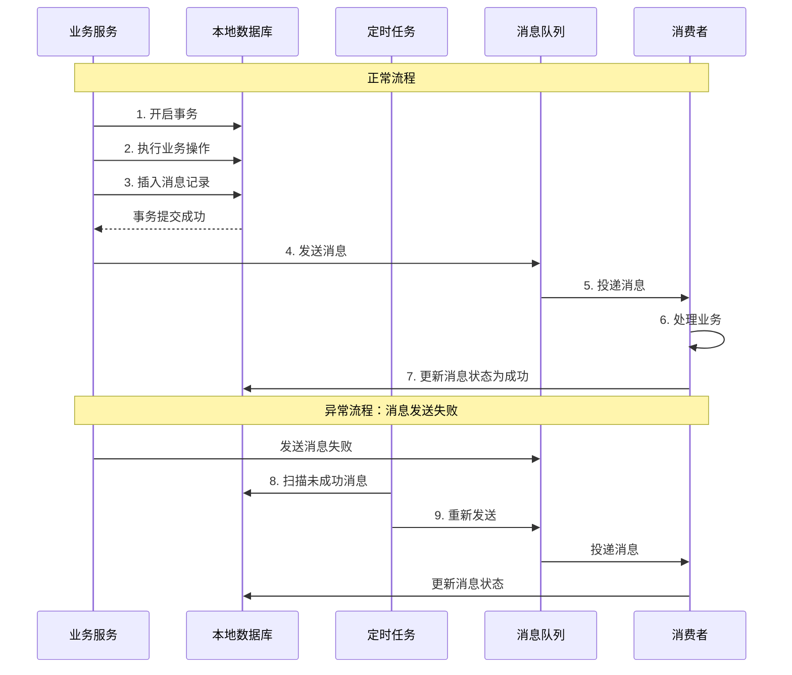

# 本地消息表实现与优化

## 本地消息表方案原理

本地消息表是一种通过在本地数据库创建消息表来保证消息可靠投递的分布式事务解决方案。该方案的核心思想是将分布式事务拆分为本地事务和消息事务两个部分，通过本地事务保证业务数据和消息记录的原子性，再通过定时任务或事件机制保证消息最终能够成功发送并被消费。

### 核心设计思想

本地消息表方案的关键在于：**将业务操作和消息记录放在同一个本地事务中**。这样可以利用数据库的ACID特性，确保只要业务操作成功，本地消息记录就一定能够成功写入。

基本流程如下：

1. 在本地数据库创建消息表，用于记录需要发送的消息
2. 执行业务操作和插入消息记录放在同一个本地事务中
3. 本地事务提交后，异步发送消息到MQ
4. 消费者接收消息后处理业务，处理成功后更新消息表状态
5. 定时任务扫描未成功的消息，进行重新投递



### 消息表设计

一个典型的本地消息表应该包含以下字段：

```sql
CREATE TABLE `local_message_table` (
  `id` bigint NOT NULL AUTO_INCREMENT COMMENT '主键',
  `message_id` varchar(128) NOT NULL COMMENT '消息唯一标识',
  `topic` varchar(64) NOT NULL COMMENT '消息主题',
  `content` text NOT NULL COMMENT '消息内容',
  `state` tinyint NOT NULL DEFAULT 0 COMMENT '消息状态：0-初始化，1-已发送，2-已消费',
  `retry_count` int NOT NULL DEFAULT 0 COMMENT '重试次数',
  `max_retry_count` int NOT NULL DEFAULT 5 COMMENT '最大重试次数',
  `next_retry_time` datetime DEFAULT NULL COMMENT '下次重试时间',
  `create_time` datetime NOT NULL COMMENT '创建时间',
  `update_time` datetime NOT NULL COMMENT '更新时间',
  PRIMARY KEY (`id`),
  UNIQUE KEY `uk_message_id` (`message_id`),
  KEY `idx_state_next_retry` (`state`, `next_retry_time`)
) ENGINE=InnoDB DEFAULT CHARSET=utf8mb4 COMMENT='本地消息表';
```

关键字段说明：

- `message_id`：全局唯一的消息标识，可用于消费端幂等去重
- `state`：消息状态，用于标识消息当前处于哪个阶段
- `retry_count`：已重试次数，避免无限重试
- `next_retry_time`：下次重试时间，支持延迟重试策略
- 在`state`和`next_retry_time`上建立联合索引，优化定时任务扫描性能

### 实现示例

```java
@Service
public class OrderService {
    
    @Autowired
    private OrderMapper orderMapper;
    
    @Autowired
    private MessageMapper messageMapper;
    
    @Autowired
    private RocketMQTemplate mqTemplate;
    
    @Transactional(rollbackFor = Exception.class)
    public void createOrder(OrderRequest request) {
        // 1. 执行业务操作
        Order order = new Order();
        // ... 设置订单属性
        orderMapper.insert(order);
        
        // 2. 在同一事务中插入消息记录
        LocalMessage message = new LocalMessage();
        message.setMessageId(UUID.randomUUID().toString());
        message.setTopic("ORDER_CREATED");
        message.setContent(JSON.toJSONString(order));
        message.setState(MessageState.INIT);
        message.setNextRetryTime(new Date());
        messageMapper.insert(message);
        
        // 事务提交后，异步发送消息
        TransactionSynchronizationManager.registerSynchronization(
            new TransactionSynchronization() {
                @Override
                public void afterCommit() {
                    sendMessage(message);
                }
            }
        );
    }
    
    private void sendMessage(LocalMessage message) {
        try {
            mqTemplate.convertAndSend(message.getTopic(), message.getContent());
            // 更新消息状态为已发送
            updateMessageState(message.getMessageId(), MessageState.SENT);
        } catch (Exception e) {
            log.error("Failed to send message: {}", message.getMessageId(), e);
            // 失败由定时任务重试
        }
    }
}
```

## 故障场景处理

在实际运行中，可能会在不同阶段发生故障，需要针对性处理：

### 场景一：步骤1-2失败

如果在执行业务操作或插入消息记录时失败，由于在同一个事务中，事务会自动回滚，后续步骤都不会执行，数据保持一致。

### 场景二：步骤3消息发送失败

如果消息发送失败，定时任务会扫描到state为INIT的消息记录，进行重新投递。通过重试机制保证消息最终能够发出。

### 场景三：步骤4-5消息消费失败

如果消费失败，依靠MQ自身的重试机制不断重试。消费端必须实现幂等性，确保重复消费不会产生副作用。

### 场景四：步骤6-7状态更新失败

如果消费成功但状态更新失败，会导致两个分布式系统的业务数据已经一致，但本地消息表状态不正确。可以通过以下方式处理：

1. **定时任务继续重投**：重新发送消息，消费端幂等处理后再次更新状态
2. **状态反查**：定时任务查询下游系统状态，如果下游已处理成功，直接更新消息状态为已消费
3. **对账机制**：定期对账发现不一致数据，人工介入或自动修复

## 定时任务扫表优化

本地消息表方案依赖定时任务扫描未成功的消息进行重试，随着数据量增长和业务复杂度提升，扫表可能遇到以下问题及优化方案：

### 问题一：消息堆积，扫表性能下降

**问题描述**：随着消息表数据量增大，全表扫描越来越慢，扫描一次可能需要几分钟甚至更长时间。

**优化方案**：

1. **添加索引**：在state字段上建立索引。虽然state区分度不高，但由于成功消息占比通常在90%以上，扫描INIT状态的消息时索引能显著提升效率。

```sql
-- 联合索引，同时优化状态和时间条件查询
CREATE INDEX idx_state_retry_time ON local_message_table(state, next_retry_time);
```

2. **多线程并发扫描**：使用线程池并发扫描不同数据段。

```java
@Scheduled(fixedDelay = 60000)
public void scanMessages() {
    int threadCount = 10;
    ExecutorService executor = Executors.newFixedThreadPool(threadCount);
    
    for (int i = 0; i < threadCount; i++) {
        final int threadNo = i;
        executor.submit(() -> {
            // 按消息ID取模分片
            List<LocalMessage> messages = messageMapper.selectByMod(
                threadNo, threadCount, MessageState.INIT);
            messages.forEach(this::retryMessage);
        });
    }
}
```

```sql
-- 分片查询SQL
SELECT * FROM local_message_table 
WHERE state = 0 
  AND next_retry_time <= NOW()
  AND MOD(id, #{threadCount}) = #{threadNo}
LIMIT 1000;
```

3. **基于业务ID分段**：如果消息ID不连续，可在表中增加业务分片字段。

```java
// 不同线程处理不同前缀的消息
SELECT * FROM local_message_table 
WHERE state = 0 
  AND message_id LIKE '1%'  -- 线程1处理1开头的
  AND next_retry_time <= NOW()
LIMIT 1000;
```

### 问题二：集中扫表影响正常业务

**问题描述**：大量扫描操作占用数据库连接和资源，导致正常业务请求拿不到连接，响应变慢。

**优化方案**：

1. **读写分离，扫描从库**：定时任务扫描备库，避免影响主库的业务操作。扫描到需要重试的消息后，直接操作主库更新状态和发送消息。

```java
@Scheduled(fixedDelay = 60000)
public void scanMessages() {
    // 从只读数据源扫描
    List<LocalMessage> messages = slaveMessageMapper.selectUnsentMessages();
    
    for (LocalMessage message : messages) {
        // 发送消息和更新状态操作主库
        sendMessageAndUpdateState(message);
    }
}
```

2. **分库分表**：将消息表按业务维度或时间维度分库分表，分散压力。

```java
// 按订单ID哈希分库
int dbIndex = Math.abs(orderId.hashCode()) % DB_COUNT;
DataSource dataSource = dataSourceMap.get("message_db_" + dbIndex);
```

3. **限流控制**：控制扫表的频率和每次处理的数据量。

```java
@Scheduled(fixedDelay = 60000)
public void scanMessages() {
    // 每次最多处理1000条
    List<LocalMessage> messages = messageMapper.selectUnsentMessages(1000);
    
    // 限流：每秒最多发送100条消息
    RateLimiter rateLimiter = RateLimiter.create(100.0);
    
    for (LocalMessage message : messages) {
        rateLimiter.acquire();
        retryMessage(message);
    }
}
```

### 问题三：定时扫表存在延迟

**问题描述**：定时任务是周期性执行的，从消息写入到被扫描到可能有较长延迟，影响实时性。

**优化方案**：

1. **延迟消息代替定时任务**：使用MQ的延迟消息功能，消息写入后立即发送延迟消息，到期后触发重试。

```java
@Transactional
public void createOrder(OrderRequest request) {
    // 执行业务和写消息表
    // ...
    
    // 发送延迟消息，30秒后触发检查
    DelayMessage delayMsg = new DelayMessage();
    delayMsg.setMessageId(message.getMessageId());
    delayMsg.setDelayLevel(3); // 30秒
    mqTemplate.convertAndSend("RETRY_CHECK_TOPIC", delayMsg);
}

@RocketMQMessageListener(topic = "RETRY_CHECK_TOPIC")
public class RetryCheckListener implements RocketMQListener<DelayMessage> {
    public void onMessage(DelayMessage msg) {
        LocalMessage message = messageMapper.selectById(msg.getMessageId());
        if (message.getState() == MessageState.INIT) {
            // 消息还未发送，进行重试
            retryMessage(message);
        }
    }
}
```

2. **同步转异步**：在同步流程中先尝试发送一次，失败了再依赖异步重试。

```java
@Transactional
public void createOrder(OrderRequest request) {
    // 执行业务操作和插入消息记录
    orderMapper.insert(order);
    messageMapper.insert(message);
    
    // 事务提交后立即同步发送一次
    TransactionSynchronizationManager.registerSynchronization(
        new TransactionSynchronization() {
            @Override
            public void afterCommit() {
                try {
                    mqTemplate.convertAndSend(message.getTopic(), message.getContent());
                    updateMessageState(message.getId(), MessageState.SENT);
                } catch (Exception e) {
                    // 失败由异步任务重试
                    log.warn("Sync send failed, will retry async", e);
                }
            }
        }
    );
}
```

3. **Spring Event异步事件**：使用Spring的事件机制，避免在事务中直接发送消息。

```java
@Transactional
public void createOrder(OrderRequest request) {
    // 执行业务和写消息
    // ...
    
    // 事务提交后发布事件
    TransactionSynchronizationManager.registerSynchronization(
        new TransactionSynchronization() {
            @Override
            public void afterCommit() {
                applicationEventPublisher.publishEvent(
                    new MessageSendEvent(message));
            }
        }
    );
}

@Async
@EventListener
public void handleMessageSendEvent(MessageSendEvent event) {
    sendMessage(event.getMessage());
}
```

## 本地消息表的优缺点

### 优点

**可靠性高**：通过本地事务保证业务操作和消息记录的原子性，消息不会丢失。

**可扩展性好**：消息发送和本地事务分离，可以独立扩展，通过异步处理提升系统吞吐量。

**MQ无特殊要求**：不需要MQ支持事务消息，任何MQ都可以使用此方案。

**可追溯性强**：消息记录持久化在数据库中，便于查询历史消息、对账和问题排查。

### 缺点

**实现复杂度高**：需要设计消息表、实现定时任务、处理各种异常场景，整体复杂度较高。

**性能有限**：定时扫表会占用数据库资源，随着数据量增大性能下降。需要通过索引优化、读写分离等手段提升性能。

**不适合回滚场景**：本地消息表更适合"上游成功则下游必须成功"的场景。如果需要整个事务回滚，需要设计复杂的回滚机制。

**不适合多参与方**：虽然消息可以发送给多个消费者，但消息表中只有一条记录。如果需要协调多个参与方，需要为每个参与方设计独立的状态字段，增加了耦合性。

**可能产生消息堆积**：如果下游消费能力不足或出现故障，会导致大量消息堆积在消息表中，影响扫表性能。

## 最佳实践建议

1. **合理设置重试策略**：设置最大重试次数避免无限重试，使用递增延迟策略降低系统压力。

```java
// 递增延迟：第1次1分钟后，第2次5分钟后，第3次30分钟后
int[] delayMinutes = {1, 5, 30, 60, 120};
Date nextRetryTime = DateUtils.addMinutes(new Date(), 
    delayMinutes[Math.min(retryCount, delayMinutes.length - 1)]);
```

2. **完善监控告警**：监控消息堆积数量、重试失败率、扫表耗时等指标，及时发现问题。

```java
// 监控消息堆积
int pendingCount = messageMapper.countByState(MessageState.INIT);
if (pendingCount > 10000) {
    alertService.sendAlert("Message table pending count: " + pendingCount);
}
```

3. **数据归档清理**：定期归档或清理已成功的历史消息，控制表数据量。

```java
@Scheduled(cron = "0 0 2 * * ?") // 每天凌晨2点执行
public void archiveMessages() {
    // 归档30天前已成功的消息
    Date archiveDate = DateUtils.addDays(new Date(), -30);
    messageMapper.archiveSuccessMessages(archiveDate);
}
```

4. **实现幂等性**：消费端必须实现幂等处理，通过message_id去重或使用分布式锁。

```java
@RocketMQMessageListener(topic = "ORDER_CREATED")
public class OrderMessageListener implements RocketMQListener<String> {
    
    @Override
    public void onMessage(String messageContent) {
        OrderMessage orderMsg = JSON.parseObject(messageContent, OrderMessage.class);
        
        // 幂等检查
        if (processedMessageCache.contains(orderMsg.getMessageId())) {
            log.info("Message already processed: {}", orderMsg.getMessageId());
            return;
        }
        
        // 处理业务
        processOrder(orderMsg);
        
        // 记录已处理
        processedMessageCache.add(orderMsg.getMessageId());
    }
}
```

5. **提供状态查询接口**：便于运维人员查询消息处理状态，排查问题。

6. **考虑使用成熟框架**：可以使用开源的事件驱动框架（如Spring Cloud Stream、Apache Camel）简化实现。

通过合理设计和优化，本地消息表方案可以成为一个可靠、高效的分布式事务解决方案，在不支持事务消息的MQ环境下为业务提供强有力的保障。
