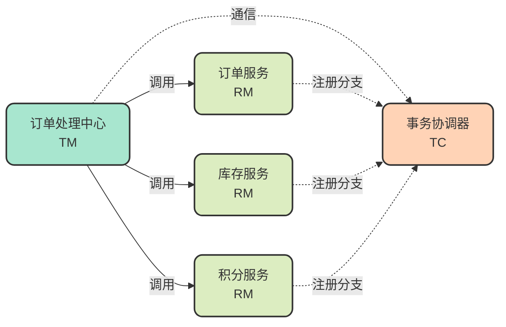
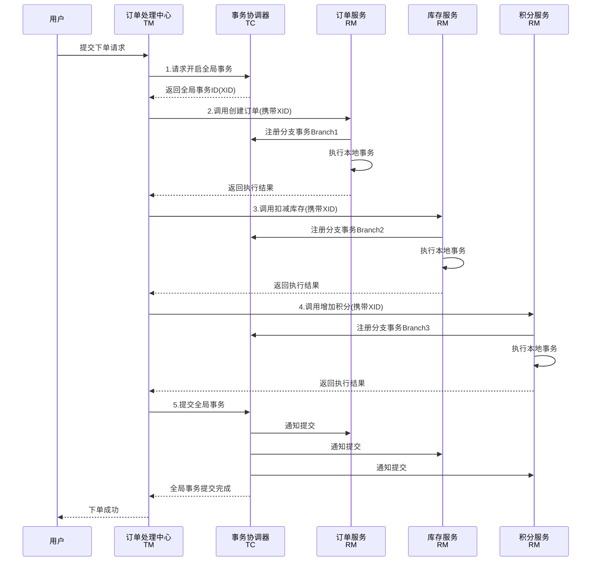

# Seata分布式事务框架核心原理

## 什么是Seata

Seata（Simple Extensible Autonomous Transaction Architecture）是阿里巴巴开源的一款分布式事务解决方案，专门用于解决微服务架构下的数据一致性问题。它提供了高性能且易于使用的分布式事务服务，帮助开发者在复杂的分布式环境中保证数据的强一致性或最终一致性。

在传统的单体应用中，我们可以依赖本地事务（如数据库的ACID特性）来保证数据一致性。但在微服务架构下，一个业务操作往往需要跨越多个服务和数据库，这时本地事务就无能为力了，必须借助分布式事务框架来协调多个服务的数据操作。

## Seata的核心架构组件

Seata设计理念的核心思想是：**一个完整的分布式事务是由多个本地事务组成的**。基于这一理念，Seata将整个分布式事务体系划分为三个关键组件：

### Transaction Coordinator（TC）- 事务协调器

TC是一个独立运行的服务进程，它不包含任何业务代码，是整个Seata架构中的核心协调中枢。TC的主要职责包括：

- **维护全局事务状态**：记录并管理每个全局事务的执行状态
- **协调分支事务**：负责通知各个RM执行提交或回滚操作
- **管理事务生命周期**：从事务开启到最终提交或回滚的全过程控制

### Transaction Manager（TM）- 事务管理器

在微服务架构中，TM通常对应业务聚合服务，即那些需要调用多个下游服务来完成完整业务流程的服务。TM的核心职责是：

- **开启全局事务**：在业务逻辑执行前向TC申请开启全局事务
- **提交或回滚全局事务**：根据业务执行结果决定全局事务的最终状态
- **传递事务上下文**：将全局事务ID（XID）传递给下游服务

### Resource Manager（RM）- 资源管理器

RM对应微服务架构中的具体微服务，每个微服务作为分布式事务的一个分支参与者。RM的主要职责是：

- **管理本地资源**：控制本地数据库连接等资源对象
- **执行分支事务**：执行本地业务操作
- **注册分支事务**：向TC注册事务分支信息
- **响应协调指令**：根据TC的指令执行提交或回滚

## 核心工作流程解析

为了更好地理解Seata的工作机制，我们通过一个电商下单场景来说明。

### 业务场景

假设我们有一个订单处理中心（OrderCenter），它需要协调以下三个微服务完成下单流程：

- **订单服务（OrderService）**：负责创建订单记录
- **库存服务（InventoryService）**：负责扣减商品库存
- **积分服务（PointService）**：负责为用户增加积分

在这个场景中：
- OrderCenter扮演**TM角色**
- OrderService、InventoryService、PointService三个服务扮演**RM角色**
- 需要独立部署一个Seata Server作为**TC**



### 完整事务执行流程



### 详细步骤说明

**第一步：开启全局事务**

当OrderCenter接收到用户的下单请求后，首先向TC发起请求，申请开启一个全局事务。TC会生成一个全局唯一的事务标识（XID），并将其返回给TM。

**第二步：执行业务调用并传递XID**

TM在调用各个下游服务时，必须将XID通过RPC调用上下文传递过去。这样每个RM都能知道自己属于哪个全局事务。

```java
// 业务代码示例
@GlobalTransactional
public void processOrder(OrderRequest request) {
    // 调用订单服务创建订单
    orderService.createOrder(request.getOrderInfo());
    
    // 调用库存服务扣减库存
    inventoryService.decreaseStock(request.getProductId(), request.getQuantity());
    
    // 调用积分服务增加积分
    pointService.addPoints(request.getUserId(), request.getPoints());
}
```

**第三步：RM注册分支事务**

每个RM在接收到调用请求后，会提取XID，然后向TC注册一个分支事务（Branch Transaction）。TC会为每个分支事务分配一个Branch ID，用于后续的事务协调。

**第四步：TM决策事务结果**

当整个调用链执行完毕后，TM会检查所有服务的执行结果：
- 如果所有调用都成功，TM决议**全局提交（Commit）**
- 如果任何一个调用失败或超时，TM决议**全局回滚（Rollback）**

**第五步：TC协调二阶段操作**

TM将决议结果通知TC后，TC会向所有已注册的RM发送协调指令：
- 如果决议是Commit，通知所有RM执行提交动作
- 如果决议是Rollback，通知所有RM执行回滚动作

## 二阶段提交的实现要求

Seata要求所有参与的RM都必须支持**二阶段提交**：

- **第一阶段**：执行业务SQL，进行事务预处理（不同模式实现方式不同）
- **第二阶段**：根据TC的协调指令，执行最终的提交或回滚

具体的实现方式和是否需要修改业务代码，取决于使用的事务模式。Seata提供了AT、TCC、Saga、XA四种模式，每种模式的实现机制和适用场景各不相同。

## 核心优势

**解耦性强**：TC作为独立服务，与业务系统完全解耦，便于维护和扩展。

**高性能**：特别是AT模式，通过优化的两阶段提交机制，在保证一致性的同时提供了优秀的性能表现。

**易用性好**：提供了无侵入或低侵入的解决方案，开发者只需少量配置即可使用。

**模式丰富**：支持多种事务模式，可根据不同的业务场景选择最适合的方案。

## 小结

Seata通过TC、TM、RM三个核心组件的协同工作，构建了一套完整的分布式事务解决方案。它将复杂的分布式事务问题抽象为全局事务和分支事务的管理，通过两阶段提交协议保证了数据的一致性。理解这些核心概念和工作流程，是深入掌握Seata的基础。
