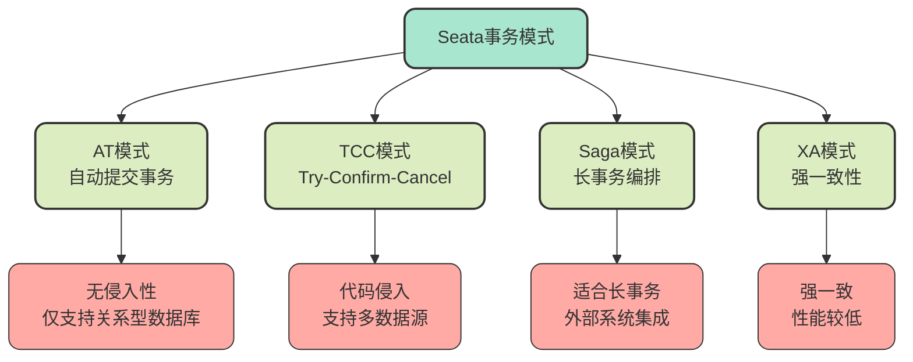
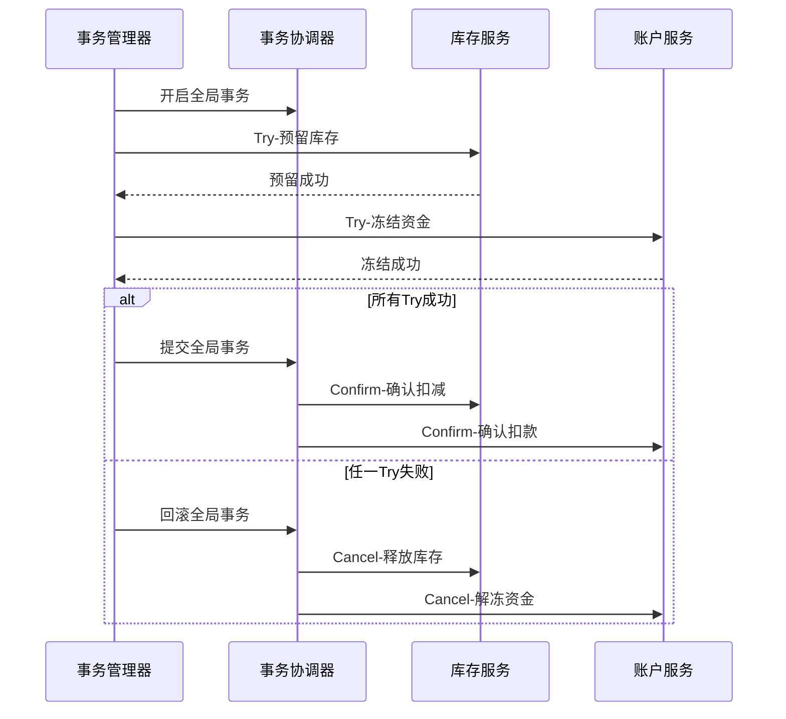
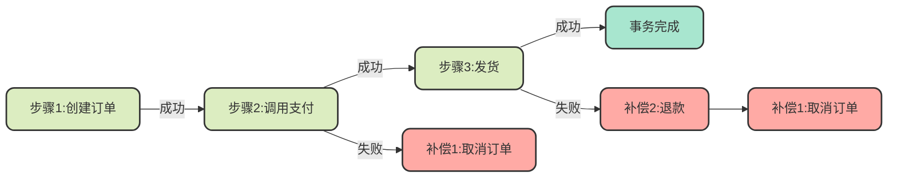
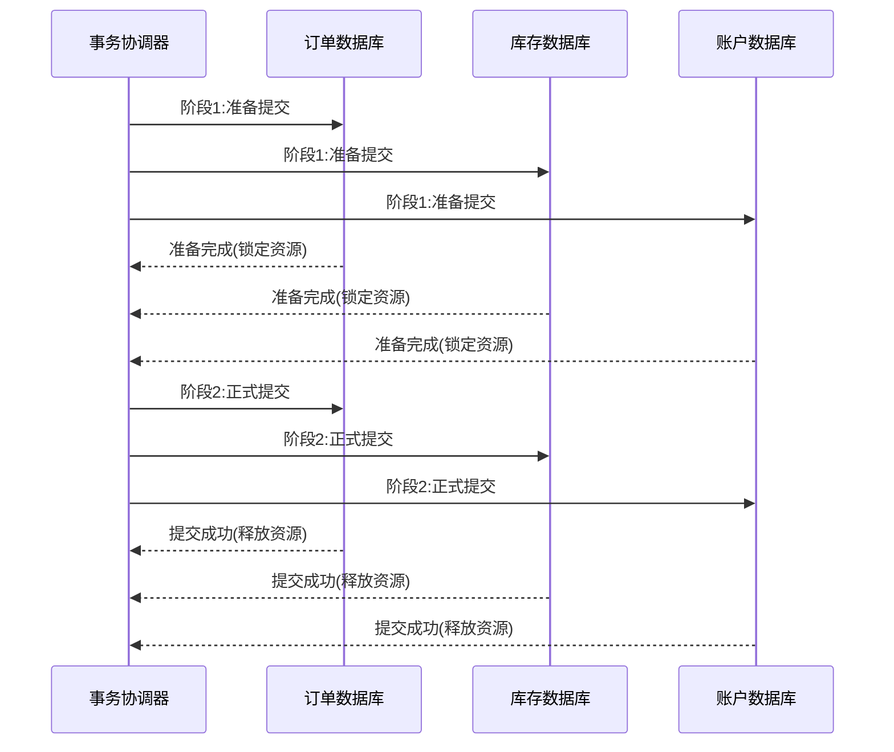
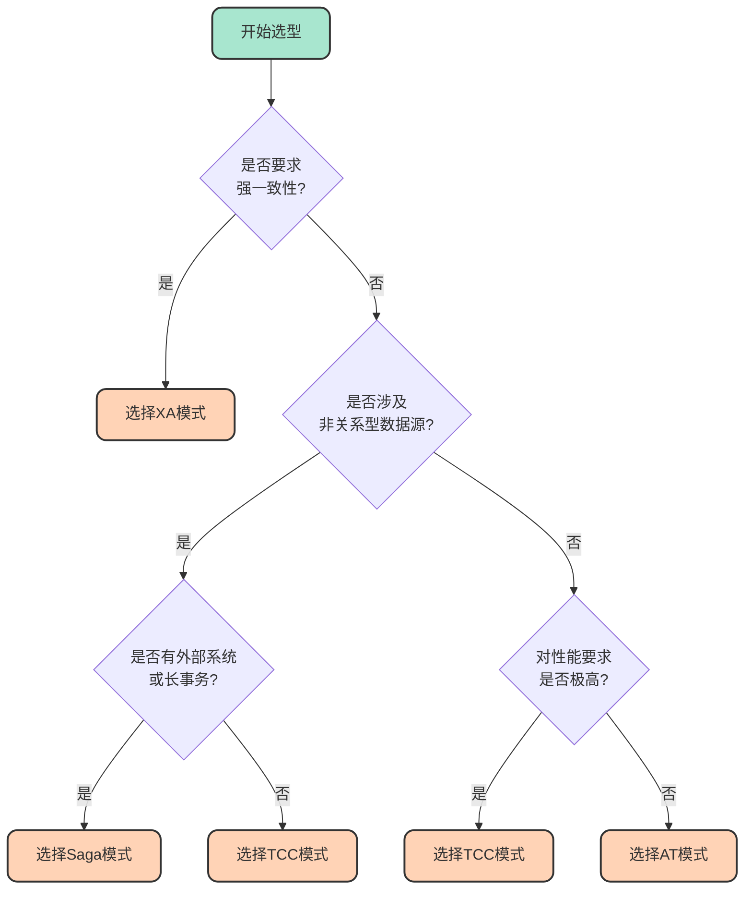

# Seata事务模式详解与选型指南

## Seata的四种事务模式概览

Seata为了适应不同的业务场景和技术需求，提供了四种事务模式：AT模式、TCC模式、Saga模式和XA模式。每种模式都有其独特的实现机制、性能特点和适用场景。选择合适的事务模式，能够在保证数据一致性的前提下，最大化系统性能和开发效率。



## AT模式 - 自动提交事务模式

### 核心特点

AT模式（Auto-Commit Transaction）是Seata中最易用的模式，它最大的特点就是**对业务代码零侵入**。开发者只需要在方法上添加`@GlobalTransactional`注解，就能实现分布式事务，无需编写额外的事务处理逻辑。

### 工作机制

AT模式通过数据源代理层拦截SQL执行，自动生成回滚日志（undo log），在需要回滚时通过这些日志进行数据恢复。

```java
// AT模式使用示例 - 电商订单场景
@Service
public class OrderProcessService {
    
    @Autowired
    private OrderRepository orderRepository;
    
    @Autowired
    private InventoryService inventoryService;
    
    @Autowired
    private PaymentService paymentService;
    
    @GlobalTransactional(name = "order-process-tx", rollbackFor = Exception.class)
    public OrderResult processOrder(OrderDTO orderDTO) {
        // 创建订单
        Order order = orderRepository.createOrder(orderDTO);
        
        // 调用库存服务扣减库存
        inventoryService.deductStock(orderDTO.getProductId(), orderDTO.getQuantity());
        
        // 调用支付服务扣款
        paymentService.deductBalance(orderDTO.getUserId(), orderDTO.getAmount());
        
        return new OrderResult(order.getId(), "SUCCESS");
    }
}
```

### 优势与局限

**优势：**
- 无业务代码侵入，开发体验好
- 自动管理事务回滚，降低开发难度
- 性能较好，适合大多数业务场景

**局限性：**
- 仅支持具有ACID特性的关系型数据库（如MySQL、Oracle）
- 不支持非关系型数据源（如Redis、Elasticsearch）
- 依赖undo log机制，需要额外的存储空间

### 适用场景

AT模式适合以下场景：
- 业务操作主要涉及关系型数据库
- 追求开发效率，不希望修改业务代码
- 对性能有一定要求的常规分布式事务场景

## TCC模式 - 补偿型事务模式

### 核心特点

TCC模式将事务操作分为三个阶段：Try（尝试）、Confirm（确认）、Cancel（取消）。开发者需要为每个事务操作实现这三个方法，具有一定的**代码侵入性**，但换来了更强的灵活性。

### 工作机制



### 代码实现示例

```java
// TCC模式实现示例 - 库存服务
@Service
@LocalTCC
public class InventoryTccService {
    
    @Autowired
    private InventoryMapper inventoryMapper;
    
    @Autowired
    private InventoryFrozenMapper frozenMapper;
    
    /**
     * Try阶段：冻结库存
     */
    @TwoPhaseBusinessAction(name = "inventoryTccService", commitMethod = "confirm", rollbackMethod = "cancel")
    public boolean tryDeduct(@BusinessActionContextParameter(paramName = "productId") Long productId,
                             @BusinessActionContextParameter(paramName = "quantity") Integer quantity) {
        // 检查库存是否充足
        Inventory inventory = inventoryMapper.selectById(productId);
        if (inventory.getAvailable() < quantity) {
            throw new InsufficientStockException("库存不足");
        }
        
        // 冻结库存（不实际扣减）
        InventoryFrozen frozen = new InventoryFrozen();
        frozen.setProductId(productId);
        frozen.setFrozenQuantity(quantity);
        frozen.setStatus("FROZEN");
        frozenMapper.insert(frozen);
        
        return true;
    }
    
    /**
     * Confirm阶段：确认扣减库存
     */
    public boolean confirm(BusinessActionContext context) {
        Long productId = (Long) context.getActionContext("productId");
        Integer quantity = (Integer) context.getActionContext("quantity");
        
        // 实际扣减库存
        inventoryMapper.deductStock(productId, quantity);
        
        // 删除冻结记录
        frozenMapper.deleteByProductId(productId);
        
        return true;
    }
    
    /**
     * Cancel阶段：释放冻结的库存
     */
    public boolean cancel(BusinessActionContext context) {
        Long productId = (Long) context.getActionContext("productId");
        
        // 删除冻结记录，恢复可用库存
        frozenMapper.deleteByProductId(productId);
        
        return true;
    }
}
```

### 优势与局限

**优势：**
- 支持多种数据源（MySQL、Redis、MongoDB等）
- 性能优秀，无需长时间锁定资源
- 业务灵活度高，可自定义补偿逻辑

**局限性：**
- 代码侵入性强，需要实现三个接口
- 开发工作量大，需要处理幂等性和空回滚问题
- 业务逻辑复杂度增加

### 适用场景

TCC模式适合以下场景：
- 需要操作多种异构数据源（如同时操作MySQL和Redis）
- 对性能要求极高的核心业务
- 需要精细控制事务逻辑的场景

## Saga模式 - 长事务编排模式

### 核心特点

Saga模式将长事务拆分为多个本地短事务，每个本地事务都有对应的补偿操作。当某个步骤失败时，通过执行前面已完成步骤的补偿操作来实现回滚。

### 工作机制

Saga模式特别适合包含外部系统调用的长事务场景，例如需要调用第三方支付接口的业务流程。



### 优势与局限

**优势：**
- 适合业务流程长、步骤多的场景
- 支持与外部系统（如微信支付、支付宝）集成
- 无需长时间锁定资源

**局限性：**
- 无法保证隔离性，可能出现中间状态可见
- 需要编写补偿逻辑
- 补偿操作的幂等性设计复杂

### 适用场景

Saga模式适合以下场景：
- 业务流程长，涉及多个步骤
- 需要调用外部第三方接口（如支付、物流）
- 遗留系统集成，无法改造为TCC模式

## XA模式 - 强一致性模式

### 核心特点

XA模式基于数据库的XA协议实现，是唯一提供**强一致性**保证的模式。它通过两阶段提交（2PC）协议，确保所有参与者要么全部提交，要么全部回滚。

### 工作机制



### 优势与局限

**优势：**
- 强一致性保证，符合ACID特性
- 无需编写补偿逻辑
- 数据库原生支持，实现简单

**局限性：**
- 性能较差，需要长时间锁定数据库资源
- 在高并发场景下容易成为性能瓶颈
- 数据库必须支持XA协议

### 适用场景

XA模式适合以下场景：
- 对数据一致性要求极高的场景（如金融、资金类业务）
- 并发量不高的核心业务
- 可接受较低性能以换取强一致性的场景

## 四种模式对比分析

| 对比维度 | AT模式 | TCC模式 | Saga模式 | XA模式 |
|---------|--------|---------|----------|--------|
| **一致性** | 最终一致 | 最终一致 | 最终一致 | 强一致 |
| **隔离性** | 基于全局锁隔离 | 基于资源预留隔离 | 无隔离 | 完全隔离 |
| **代码侵入性** | 无 | 高（需实现三个接口） | 高（需编写补偿逻辑） | 无 |
| **性能** | 高 | 非常高 | 非常高 | 差 |
| **实现复杂度** | 低 | 高 | 中等 | 低 |
| **支持的数据源** | 仅关系型数据库 | 任意数据源 | 任意数据源 | 支持XA的数据库 |
| **资源锁定时间** | 短 | 短 | 短 | 长 |

## 选型决策树



## 实际应用建议

### 常规电商系统

推荐使用**AT模式**。大多数电商业务的核心操作（订单、库存、支付）都基于MySQL等关系型数据库，AT模式能以最小的开发成本实现分布式事务。

### 高并发秒杀系统

推荐使用**TCC模式**。秒杀场景对性能要求极高，且通常需要操作Redis缓存和MySQL数据库，TCC模式通过资源预留机制能提供最佳性能。

### 旅游预订系统

推荐使用**Saga模式**。旅游预订涉及多个外部供应商接口（酒店、机票、景点门票），流程长且需要与外部系统交互，Saga模式的长事务编排能力更适合。

### 金融资金系统

推荐使用**XA模式**。资金类业务对一致性要求极高，不允许出现任何中间状态，必须使用XA模式保证强一致性。

## 小结

选择合适的Seata事务模式需要综合考虑业务特点、性能要求、开发成本等多个因素。AT模式是最常用的选择，适合大多数场景；TCC模式适合追求极致性能的场景；Saga模式解决长事务问题；XA模式保证强一致性。理解每种模式的工作机制和适用场景，是做出正确选型决策的关键。
