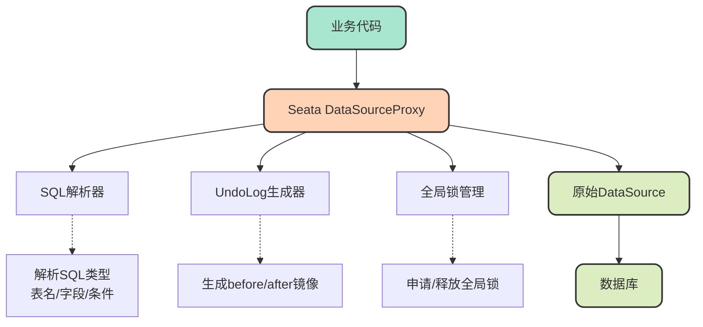
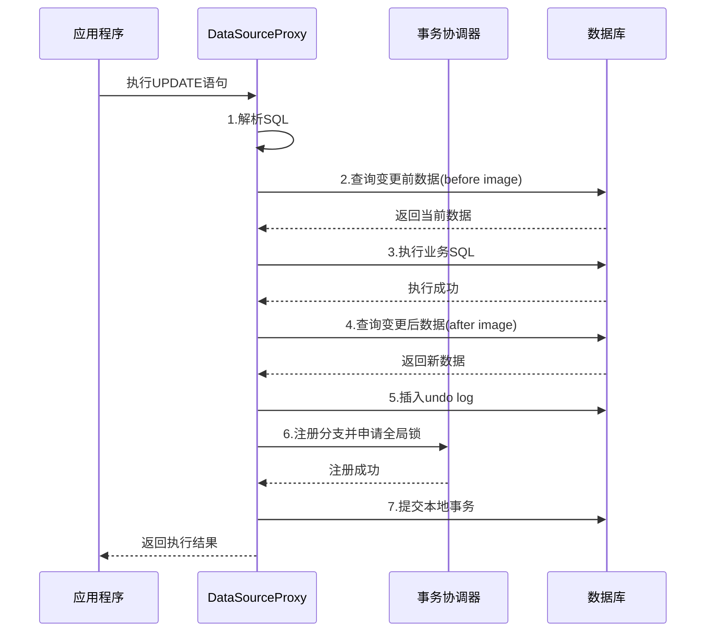
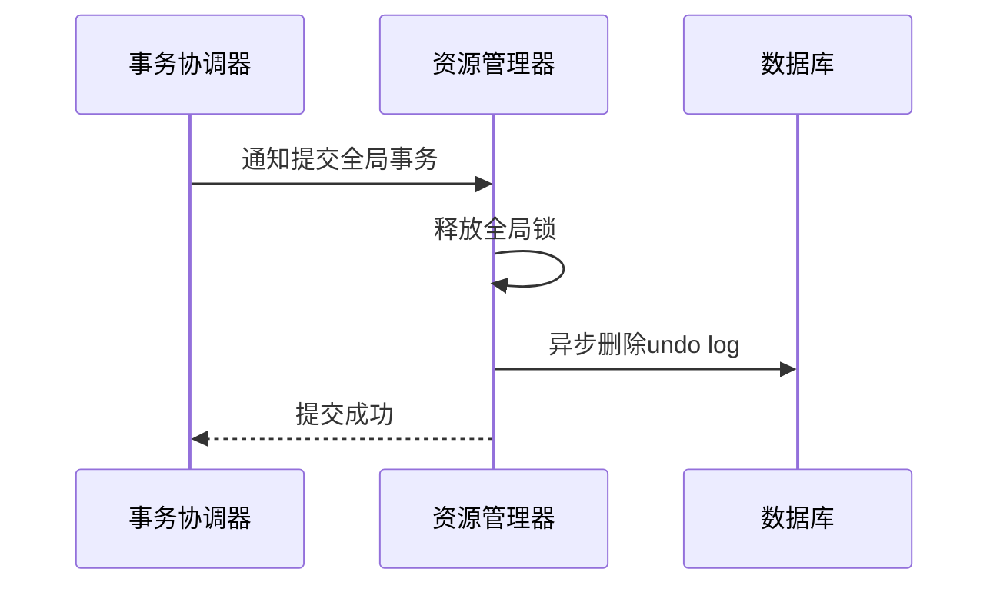
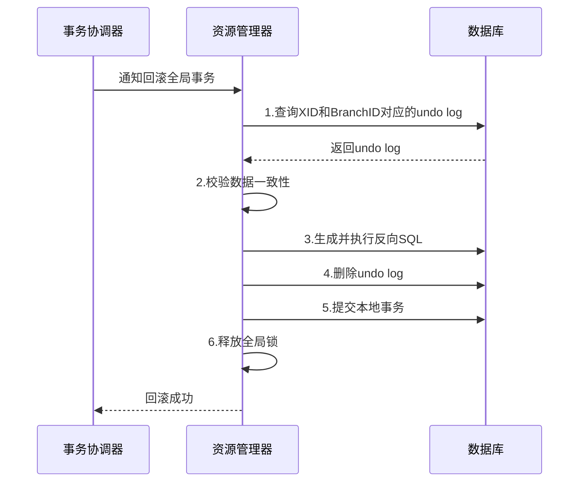
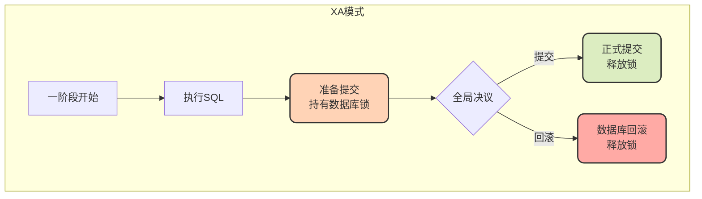
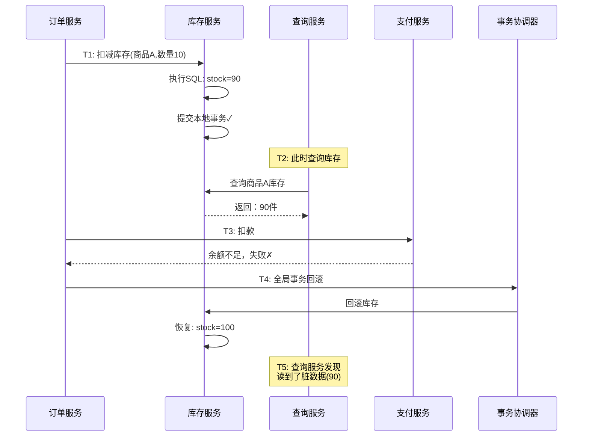

# AT模式深度剖析与隔离性问题

## AT模式的实现原理

AT模式（Auto-Commit Transaction）是Seata中使用最广泛的事务模式，它通过数据源代理的方式实现了对业务代码的零侵入。理解AT模式的底层实现机制，对于正确使用它、排查问题至关重要。

### 数据源代理机制

AT模式的核心是**数据源代理**。Seata在应用的DataSource之上包装了一层代理层，将原本的JDBC DataSource转换为Seata DataSourceProxy。这样就可以在代理层拦截所有的SQL执行，控制事务的提交和回滚。



### 两阶段提交详解

AT模式将事务分为两个阶段执行，每个阶段都有明确的职责和执行步骤。

#### 第一阶段：业务SQL执行与日志记录



**详细步骤说明：**

**步骤1：SQL解析**
代理层拦截到SQL后，首先进行解析，提取出SQL类型（INSERT/UPDATE/DELETE）、涉及的表名、修改的字段以及WHERE条件等关键信息。

**步骤2：生成前置镜像（before image）**
根据SQL解析结果，先执行一次查询，获取即将被修改的数据的当前状态，作为before image。这个镜像数据是后续回滚的依据。

例如，对于SQL：
```sql
UPDATE product SET stock = stock - 5 WHERE product_id = 100;
```

会先执行：
```sql
SELECT product_id, stock FROM product WHERE product_id = 100;
-- 假设查询结果：product_id=100, stock=50
```

**步骤3：执行业务SQL**
执行实际的业务SQL，对数据库进行修改。

**步骤4：生成后置镜像（after image）**
业务SQL执行完成后，再次查询被修改的数据，获取变更后的状态，作为after image。

```sql
SELECT product_id, stock FROM product WHERE product_id = 100;
-- 执行后结果：product_id=100, stock=45
```

**步骤5：插入undo log**
将before image、after image以及业务SQL的相关信息组装成一条回滚日志，插入到undo_log表中。

undo log的数据结构示例：
```json
{
  "branchId": 987654321,
  "xid": "192.168.1.100:8091:2024120200001",
  "undoItems": [{
    "sqlType": "UPDATE",
    "tableName": "product",
    "beforeImage": {
      "rows": [{
        "fields": [{
          "name": "product_id",
          "type": 4,
          "value": 100
        }, {
          "name": "stock",
          "type": 4,
          "value": 50
        }]
      }]
    },
    "afterImage": {
      "rows": [{
        "fields": [{
          "name": "product_id",
          "type": 4,
          "value": 100
        }, {
          "name": "stock",
          "type": 4,
          "value": 45
        }]
      }]
    }
  }]
}
```

**步骤6：注册分支事务并申请全局锁**
向TC注册分支事务，并申请本次修改的记录的全局锁。全局锁是Seata用来保证多个全局事务之间隔离性的重要机制。

**步骤7：提交本地事务**
将业务数据的变更和undo log的插入一起提交到数据库。这里依赖数据库本地事务的ACID特性，保证业务操作和回滚日志的原子性。

**关键点：** 第一阶段结束后，本地事务已经提交，数据库锁已经释放，但全局锁仍然被持有。

#### 第二阶段：提交或回滚

第二阶段根据全局事务的决议，执行不同的操作。

**场景一：全局提交**

如果所有分支事务的第一阶段都执行成功，TC会通知所有RM提交全局事务。



由于第一阶段已经提交了本地事务，所以第二阶段的提交非常轻量：
1. 释放全局锁
2. 异步删除undo log（无需立即删除，可批量处理）

这种设计使得AT模式在正常情况下性能非常高。

**场景二：全局回滚**

如果任一分支事务失败，TC会协调所有RM进行回滚。



回滚过程详解：

**步骤1：查找undo log**
根据XID和Branch ID从undo_log表中查询对应的回滚日志。

**步骤2：数据一致性校验**
将当前数据库中的数据与undo log中的after image进行比对：
- 如果一致，说明数据未被其他事务修改，可以安全回滚，执行步骤3
- 如果不一致，再比对before image：
  - 若与before image一致，说明事务未提交或已回滚，无需处理
  - 若都不一致，说明出现了脏写，需要人工介入处理

**步骤3：生成反向SQL并执行**
根据before image生成反向SQL，恢复数据到事务执行前的状态。

例如，对于之前的UPDATE操作，会生成：
```sql
UPDATE product SET stock = 50 WHERE product_id = 100;
```

**步骤4-6：清理和释放资源**
删除undo log，提交本地事务，释放全局锁。

## AT模式 vs XA模式

AT模式和XA模式都基于两阶段提交思想，但实现机制截然不同，导致它们在性能和一致性方面有明显差异。

### 核心区别对比

| 维度 | AT模式 | XA模式 |
|------|--------|--------|
| **一阶段处理** | 直接提交本地事务，释放数据库锁 | 执行但不提交，持有数据库锁 |
| **二阶段处理** | 提交：异步删除日志；回滚：基于undo log补偿 | 提交：通知数据库提交；回滚：通知数据库回滚 |
| **资源锁定时间** | 仅一阶段期间 | 跨越两个阶段 |
| **一致性** | 最终一致性 | 强一致性 |
| **性能** | 高 | 低 |

### 执行流程对比




### 性能差异分析

**AT模式的性能优势：**

1. **数据库锁快速释放**：第一阶段提交后立即释放行锁，其他事务可以继续访问这些数据
2. **二阶段异步化**：提交场景下的日志清理可以异步批量处理
3. **仅全局锁等待**：只需等待Seata的全局锁，不影响数据库并发能力

**XA模式的性能劣势：**

1. **长时间锁定资源**：从一阶段到二阶段完成，数据库资源一直被锁定
2. **阻塞其他事务**：其他事务无法访问被锁定的数据，并发能力下降
3. **数据库负载高**：大量事务等待锁释放，数据库连接池可能耗尽

### 一致性差异分析

**XA模式的强一致性：**

XA模式在一阶段只进行准备而不提交，所有参与者都处于"准备就绪"状态。只有二阶段收到提交指令后，才真正提交数据。这确保了：
- 事务未完成前，其他事务看不到中间状态
- 全局事务具有完整的ACID特性

**AT模式的最终一致性：**

AT模式在一阶段就提交了本地事务，这意味着：
- 数据变更立即对其他事务可见
- 如果后续发生回滚，会存在一个短暂的不一致窗口
- 属于最终一致性，而非强一致性

## AT模式的脏读问题

### 问题场景分析

AT模式的一阶段会提交本地事务，这带来了一个特殊的隔离性问题：**全局事务级别的脏读**。

注意，这里的脏读与传统数据库的脏读不同：
- **传统脏读**：读取到其他本地事务**未提交**的数据
- **AT模式脏读**：读取到全局事务中某个分支事务**已提交但可能被回滚**的数据

### 具体案例

假设有一个电商下单流程，包含三个步骤：

```java
@Service
public class OrderService {
    
    @Autowired
    private InventoryClient inventoryClient;
    
    @Autowired
    private OrderRepository orderRepository;
    
    @Autowired
    private PaymentClient paymentClient;
    
    @GlobalTransactional
    public void placeOrder(OrderDTO orderDTO) {
        // 步骤1: 扣减库存
        inventoryClient.deductStock(orderDTO.getProductId(), orderDTO.getQuantity());
        
        // 步骤2: 创建订单
        orderRepository.createOrder(orderDTO);
        
        // 步骤3: 扣款（假设这里失败）
        paymentClient.deductBalance(orderDTO.getUserId(), orderDTO.getAmount());
    }
}
```

时间线分析：



在上述流程中：
- **T1时刻**：库存服务扣减库存成功，本地事务提交，库存变为90
- **T2时刻**：另一个查询服务查询库存，读到了90这个值
- **T3时刻**：支付服务扣款失败
- **T4时刻**：全局事务回滚，库存恢复为100
- **T5时刻**：查询服务发现自己在T2读到的90是"脏数据"

### 为什么会出现脏读

AT模式的脏读是其设计机制决定的：

1. **性能优先的设计**：为了避免长时间锁定数据库资源，一阶段直接提交本地事务
2. **全局事务的两阶段特性**：一阶段执行成功后，全局事务尚未最终确定，仍可能回滚
3. **数据可见性**：本地事务一旦提交，数据就对其他事务可见，无法阻止读取

### 如何应对脏读问题

**方案一：使用全局锁（SELECT FOR UPDATE）**

Seata提供了`@GlobalLock`注解和`SELECT FOR UPDATE`语法，可以在查询时申请全局锁，避免读到未提交的全局事务数据。

```java
@GlobalLock
@Transactional
public Product queryProductStock(Long productId) {
    // 使用SELECT FOR UPDATE申请全局锁
    return productMapper.selectForUpdate(productId);
}
```

这种方式会等待全局事务完成后再读取数据，但会降低并发性能。

**方案二：业务层面补偿**

在业务设计上接受短暂的不一致，通过最终一致性保证数据正确。例如：
- 库存查询允许一定的误差
- 使用异步对账机制修正数据

**方案三：选择其他事务模式**

如果业务对一致性要求极高，不能容忍任何中间状态：
- 使用**XA模式**保证强一致性（牺牲性能）
- 使用**TCC模式**通过资源预留避免脏读（需要改造代码）

### 应该如何选择

| 场景 | 推荐方案 | 理由 |
|------|----------|------|
| 库存查询展示 | 接受脏读 | 对用户影响小，性能优先 |
| 订单确认页面 | 使用全局锁 | 需要准确数据，可接受轻微延迟 |
| 资金账户查询 | 使用XA模式或TCC模式 | 资金类业务不允许任何不一致 |

## 小结

AT模式通过数据源代理和undo log机制实现了对业务代码的零侵入，在大多数场景下提供了优秀的性能表现。相比XA模式，AT模式牺牲了强一致性换取了更高的性能，这是一种符合互联网业务特点的权衡。

理解AT模式的脏读问题及其根源，能够帮助我们在实际应用中做出正确的技术选型。对于大多数业务场景，AT模式的最终一致性是可以接受的；而对于资金类等强一致性要求的场景，应选择XA模式或TCC模式。
