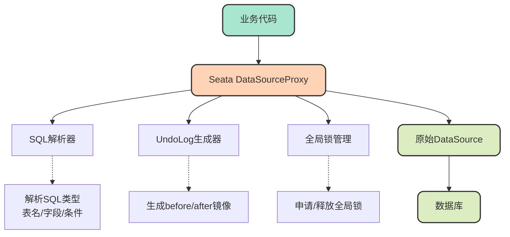
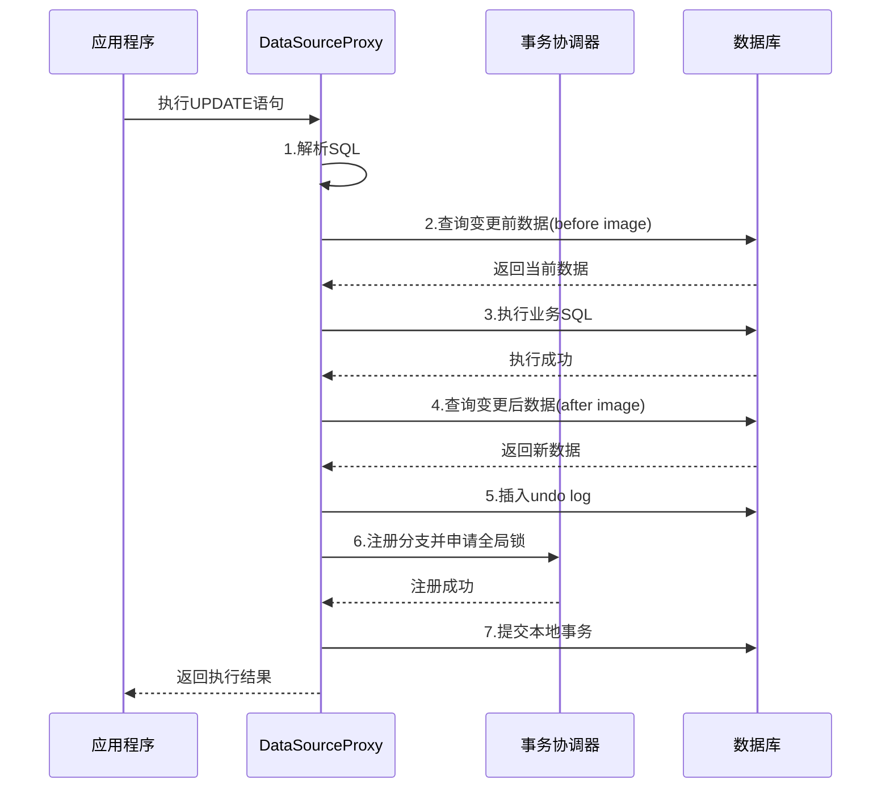

import PaidCTA from '@site/src/components/PaidCTA';

# AT模式深度剖析与隔离性问题

## AT模式的实现原理

AT模式（Auto-Commit Transaction）是Seata中使用最广泛的事务模式，它通过数据源代理的方式实现了对业务代码的零侵入。理解AT模式的底层实现机制，对于正确使用它、排查问题至关重要。

### 数据源代理机制

AT模式的核心是**数据源代理**。Seata在应用的DataSource之上包装了一层代理层，将原本的JDBC DataSource转换为Seata DataSourceProxy。这样就可以在代理层拦截所有的SQL执行，控制事务的提交和回滚。

### 两阶段提交详解

AT模式将事务分为两个阶段执行，每个阶段都有明确的职责和执行步骤。

#### 第一阶段：业务SQL执行与日志记录

**详细步骤说明：**

<PaidCTA />