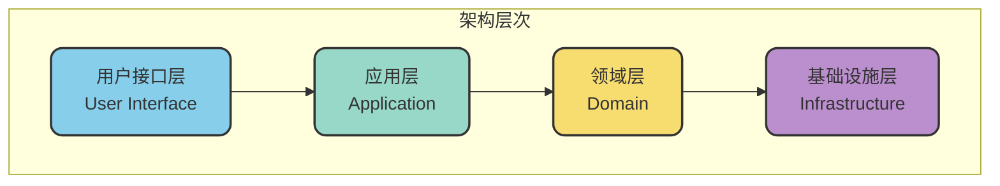
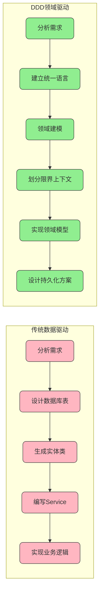

# 领域驱动设计核心思想与价值

## 什么是领域驱动设计

领域驱动设计（Domain-Driven Design，简称DDD）是由Eric Evans在2003年提出的一种软件开发方法论。其核心理念是将软件设计的重心放在业务领域本身，而非技术实现细节。

在传统的软件开发模式中，开发人员往往习惯于"数据驱动"的思维方式：拿到一个需求后，首先思考的是如何设计数据库表结构，然后围绕表结构创建实体类和服务层。这种方式虽然直观，但容易导致系统与数据库结构深度耦合，难以适应业务变化。

DDD则提倡完全不同的思路：**先深入理解业务、进行领域建模，最后才考虑如何持久化存储**。这种"业务优先"的方法论，让软件系统能够更好地反映真实的业务需求，也更易于随业务演进而调整。

## DDD的三大核心思想

### 领域建模

领域建模是DDD的核心工作，其目标是将复杂的业务领域抽象为可理解、可实现的模型。通过识别和定义领域对象（如实体、值对象）、领域服务、领域事件等概念，开发团队可以构建出与业务紧密对应的软件模型。

一个优秀的领域模型应该做到：

- **准确反映业务规则**：模型中的约束和行为应与真实业务规则一致
- **使用统一语言**：开发人员和业务人员使用相同的术语描述模型
- **边界清晰**：不同领域之间有明确的职责划分

### 领域驱动架构

DDD定义了一套经典的分层架构体系，将应用程序划分为四个核心层次：

- **用户接口层**：负责与外部交互，接收请求并返回响应
- **应用层**：编排领域对象，协调业务流程的执行
- **领域层**：承载核心业务逻辑，是整个系统的价值核心
- **基础设施层**：提供技术支撑能力，如数据持久化、消息通信等

### 领域事件驱动

领域事件是DDD中实现模块解耦的重要机制。当领域模型中发生重要的业务状态变化时，会发布相应的事件通知，其他关心这些变化的模块可以订阅并响应这些事件。

这种基于事件的通信方式，让不同领域之间无需直接依赖，显著降低了系统的耦合度，也为系统的扩展和演进提供了更大的灵活性。

## DDD与传统开发的对比

为了更直观地理解DDD的设计理念，我们通过一个对比来说明两种开发方式的差异：

| 维度 | 传统数据驱动 | DDD领域驱动 |
|------|--------------|-------------|
| 设计起点 | 数据库表结构 | 业务领域模型 |
| 核心关注 | 数据如何存储 | 业务如何运作 |
| 代码组织 | 按技术层次划分 | 按业务领域划分 |
| 业务表达 | 分散在Service层 | 内聚在领域对象中 |
| 变化适应 | 数据结构变化影响大 | 业务变化影响可控 |

## DDD带来的核心价值

### 增强业务理解能力

DDD强调开发团队深入理解业务领域，通过与业务专家建立紧密协作关系，共同构建领域模型。这个过程不仅让开发人员更好地理解业务需求，也让业务人员能够参与到系统设计中来。

最终产出的软件系统，能够准确反映业务逻辑，真正服务于业务目标。

### 提升系统可维护性

DDD通过将系统划分为多个相对独立的领域模块，每个模块内聚性强、耦合度低。当业务需求发生变化时，影响范围可控，修改成本相对较小。

这种模块化的设计思想，也为代码重构提供了便利——可以在不影响其他模块的前提下，对单个领域进行优化调整。

### 促进团队高效协作

通过建立统一语言（Ubiquitous Language），业务人员、产品经理和开发人员可以使用相同的词汇来描述系统功能。这消除了沟通中的歧义，大大提高了需求传递的准确性。

同时，DDD的分层架构和限界上下文概念，也为团队分工协作提供了清晰的边界——不同团队可以负责不同的领域，在接口约定的基础上并行开发。

## DDD的局限与挑战

### 学习门槛较高

DDD涉及大量专业概念，如限界上下文、聚合、聚合根、实体、值对象、领域事件等。对于没有接触过这套方法论的团队来说，需要投入相当的时间和精力来学习和实践。

这意味着DDD可能不适合所有团队，特别是时间紧迫或团队经验不足的情况下，贸然引入DDD可能带来额外的风险。

### 初期投入成本高

相比"快速出活"的开发模式，DDD需要在项目初期投入更多时间进行领域分析和建模。这对于追求快速迭代、快速验证的项目来说，可能显得"太重"。

此外，DDD对开发人员的要求也更高，需要具备较强的抽象思维能力和业务理解能力。

### 适用场景有选择性

DDD最适合的场景是业务逻辑复杂、需要长期演进的大型系统。对于业务简单、生命周期短的小型项目，使用DDD可能是"杀鸡用牛刀"，得不偿失。

在决定是否采用DDD之前，需要综合评估项目的规模、复杂度、团队能力等因素。

## 何时应该考虑使用DDD

基于上述分析，以下场景建议考虑采用DDD：

- **业务复杂度高**：系统涉及复杂的业务规则和流程
- **需要长期演进**：预期系统将持续迭代多年
- **团队规模较大**：需要多团队协作开发
- **业务变化频繁**：需要灵活应对业务需求的调整

相反，以下场景可能不太适合DDD：

- 简单的CRUD应用
- 短期验证性项目
- 团队缺乏DDD经验且时间紧迫
- 业务逻辑简单、变化较少的系统

## 小结

领域驱动设计是一套以业务为中心的软件开发方法论，其核心价值在于帮助开发团队构建与业务紧密贴合的软件系统。通过领域建模、分层架构和事件驱动等关键实践，DDD能够有效应对复杂业务场景，提升系统的可维护性和可扩展性。

然而，DDD并非银弹，它有自己的适用边界和引入成本。在实际项目中，需要根据具体情况权衡利弊，合理选择是否采用以及如何采用这套方法论。
