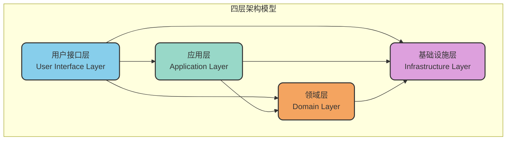
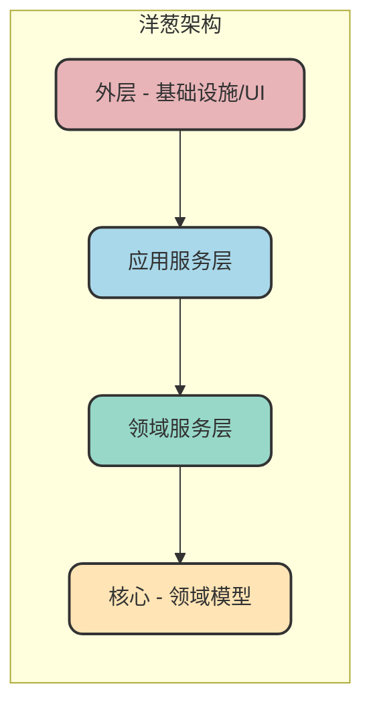
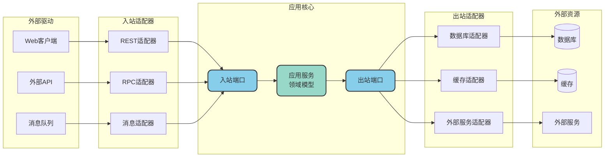
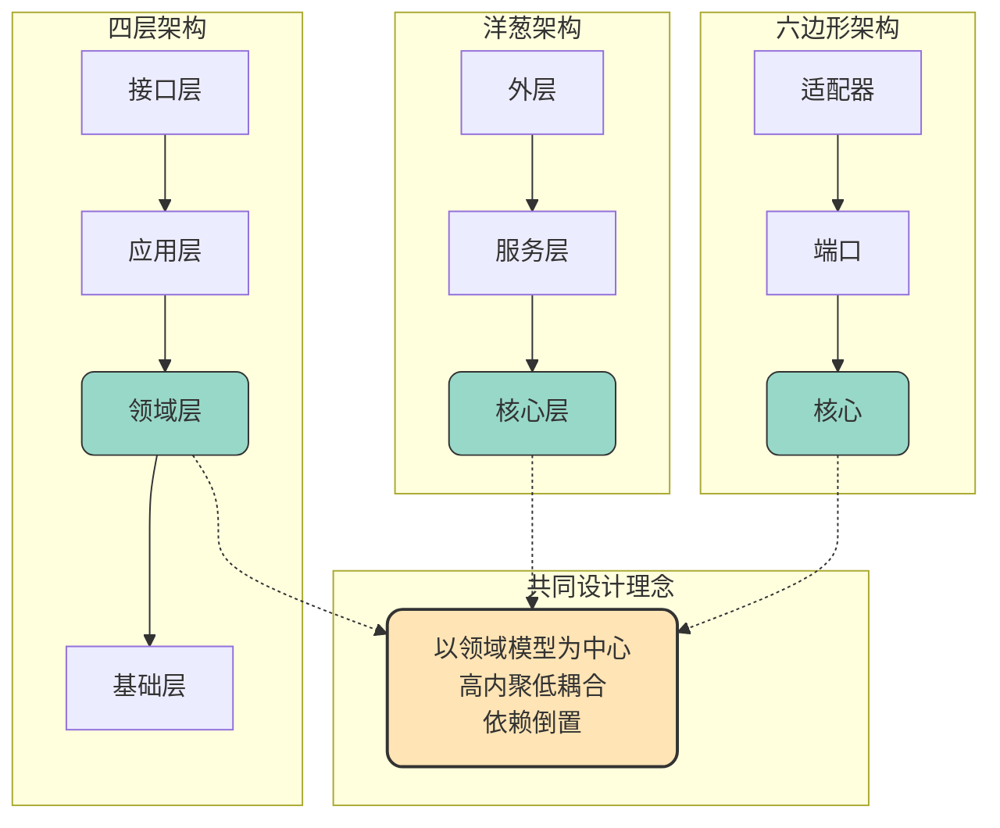

# DDD分层架构模式详解

## 经典四层架构

DDD提出了一套经典的四层架构模型，从上到下依次为：用户接口层、应用层、领域层和基础设施层。这种分层设计的核心目的是实现关注点分离，让每一层专注于特定的职责。

### 层次依赖规则

四层架构遵循严格的依赖规则：**上层可以调用下层，但下层不能反向调用上层**。这种单向依赖关系确保了系统的稳定性和可维护性。

具体而言：
- 用户接口层可以调用应用层、领域层和基础设施层
- 应用层可以调用领域层和基础设施层
- 领域层可以调用基础设施层
- 任何层都不能向上反向调用

### 各层职责详解

#### 用户接口层（User Interface Layer）

用户接口层是系统与外部世界交互的边界，负责接收外部请求并返回响应结果。这一层的核心职责包括：

- **请求接收与解析**：处理HTTP请求、RPC调用等外部请求
- **参数校验**：对输入参数进行基础校验
- **响应组装**：将业务结果转换为客户端期望的格式
- **异常转换**：将内部异常转换为对外的错误码和错误信息

常见的实现形式包括RESTful API、GraphQL接口、gRPC服务等。

#### 应用层（Application Layer）

应用层是业务用例的协调者，不包含具体的业务规则，而是负责编排领域对象来完成业务流程。其核心职责包括：

- **用例编排**：协调多个领域对象完成一个完整的业务场景
- **事务控制**：管理业务操作的事务边界
- **权限校验**：检查操作权限
- **事件发布**：发布应用层事件通知外部系统

应用层应该尽可能"薄"，不包含业务逻辑，只做流程控制。

#### 领域层（Domain Layer）

领域层是整个系统的核心，承载着全部的业务规则和业务逻辑。这一层包含：

- **实体（Entity）**：具有唯一标识和生命周期的领域对象
- **值对象（Value Object）**：不可变的、通过属性值定义的对象
- **聚合（Aggregate）**：一组相关对象的集合，保持数据一致性
- **领域服务（Domain Service）**：跨实体的业务逻辑
- **领域事件（Domain Event）**：领域中发生的重要事件

领域层应该与技术实现完全解耦，不依赖任何具体的框架或中间件。

#### 基础设施层（Infrastructure Layer）

基础设施层提供通用的技术支撑能力，为上层提供技术实现：

- **数据持久化**：数据库访问、ORM映射
- **消息通信**：消息队列的发送和接收
- **缓存管理**：缓存读写操作
- **外部服务调用**：调用第三方API
- **工具类**：通用工具方法

## 洋葱架构（Onion Architecture）

洋葱架构是DDD架构的一种演进形式，由Jeffrey Palermo在2008年提出。它将系统组织成同心圆的形式，就像洋葱的一层层外皮一样。

### 洋葱架构的核心特点

**依赖方向朝内**：外层依赖内层，内层不依赖外层。越靠近中心的层次越稳定，越不容易变化。

**核心层是领域模型**：领域模型位于架构中心，是整个系统最核心、最稳定的部分。

**外层可替换**：外层的基础设施（如数据库、消息队列）可以被替换，而不影响核心业务逻辑。

### 洋葱架构的层次说明

| 层次 | 位置 | 职责 | 特点 |
|------|------|------|------|
| 领域模型 | 最内层 | 核心业务实体和规则 | 最稳定，无外部依赖 |
| 领域服务 | 中内层 | 跨实体的业务逻辑 | 只依赖领域模型 |
| 应用服务 | 中外层 | 用例编排和协调 | 依赖内层服务 |
| 基础设施/UI | 最外层 | 技术实现和用户交互 | 可替换，依赖内层 |

## 六边形架构（Hexagonal Architecture）

六边形架构，又称为端口与适配器架构（Ports and Adapters），由Alistair Cockburn提出。这种架构强调系统与外部世界的隔离，通过端口和适配器来实现内外解耦。

### 核心概念解析

**端口（Port）**：端口是应用核心与外部世界交互的接口定义，分为入站端口和出站端口：

- **入站端口**：定义应用对外提供的能力，如服务接口
- **出站端口**：定义应用依赖的外部能力，如仓储接口

**适配器（Adapter）**：适配器是端口的具体实现，负责将外部请求或资源转换为应用核心能理解的格式：

- **入站适配器**：将外部请求转换为应用调用，如REST控制器
- **出站适配器**：实现出站端口，如数据库仓储实现

### 六边形架构的优势

**高度可测试**：应用核心不依赖外部实现，可以轻松使用Mock替换适配器进行单元测试。

**技术无关性**：领域模型与具体技术解耦，更换数据库或通信协议只需替换适配器。

**灵活扩展**：新增外部交互方式只需添加新的适配器，无需修改核心逻辑。

## 三种架构的对比与统一

尽管四层架构、洋葱架构和六边形架构在表现形式上有所不同，但它们的设计理念是一致的：

### 核心共同点

| 设计原则 | 四层架构 | 洋葱架构 | 六边形架构 |
|----------|----------|----------|------------|
| 领域为核心 | 领域层是核心 | 中心是领域模型 | 应用核心包含领域 |
| 依赖方向 | 上层依赖下层 | 外层依赖内层 | 适配器依赖端口 |
| 技术隔离 | 基础层隔离技术 | 外层隔离技术 | 适配器隔离技术 |
| 可替换性 | 基础层可替换 | 外层可替换 | 适配器可替换 |

### 如何选择

在实际项目中，可以根据团队熟悉程度和项目特点选择合适的架构风格：

- **四层架构**：概念简单直观，适合DDD入门和中小型项目
- **洋葱架构**：强调核心稳定性，适合需要长期演进的系统
- **六边形架构**：强调可测试性和可替换性，适合需要与多种外部系统集成的场景

无论选择哪种架构，核心目标都是相同的：**将业务逻辑与技术实现分离，让领域模型成为系统的核心资产**。

## 分层架构的实践建议

### 避免层次穿透

虽然上层可以调用任意下层，但实践中应尽量遵循逐层调用原则，避免跨层调用带来的依赖混乱。

### 保持领域层纯净

领域层应该只包含业务逻辑，不应依赖任何框架或技术实现。常见的反模式包括：
- 在实体中直接使用ORM注解
- 在领域服务中调用数据库
- 在领域事件中发送MQ消息

### 合理使用依赖注入

通过依赖注入实现依赖倒置，让高层模块不依赖低层模块的具体实现，而是依赖抽象接口。

## 小结

DDD的分层架构体系提供了多种架构模式供选择，无论是经典四层架构、洋葱架构还是六边形架构，其核心思想都是一致的：以领域模型为中心，通过分层解耦实现关注点分离。理解这些架构模式的设计理念和适用场景，有助于在实际项目中做出合理的架构决策。
