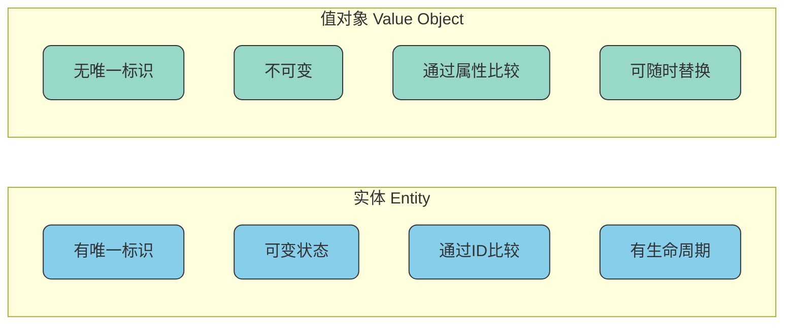
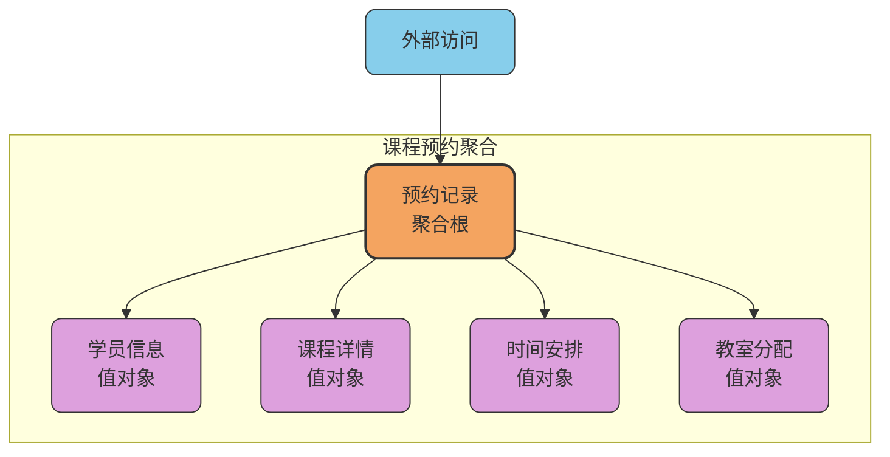
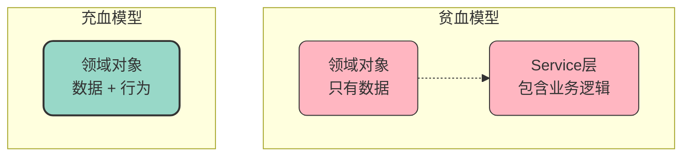

# 领域模型核心构建要素

## 概述

领域模型是DDD的核心产物，由多种构建要素组合而成。理解这些要素的概念和使用场景，是成功实施DDD的关键基础。本文将详细介绍实体、值对象、聚合、聚合根等核心概念，以及充血模型与贫血模型两种设计风格。

## 实体（Entity）

### 什么是实体

实体是领域模型中具有**唯一标识**和**生命周期**的对象。即使实体的属性值发生变化，只要标识不变，它仍然代表同一个业务对象。

以医疗系统中的患者为例：每位患者都有唯一的医疗档案号，无论患者的地址、电话或其他信息如何变更，只要档案号不变，系统就认为是同一位患者。

实体的核心特征：

- **唯一标识**：通过ID而非属性值来区分不同实体
- **可变性**：状态可以随时间变化
- **生命周期**：有创建、修改、删除等生命周期阶段
- **业务行为**：可以封装相关的业务操作

### 实体的设计要点

```java
/**
 * 会员实体 - 健身房会员管理场景
 */
public class Member {
    
    private final MemberId memberId;  // 唯一标识，不可变
    private String name;
    private MembershipLevel level;
    private LocalDate expireDate;
    private int remainingSessions;
    
    public Member(MemberId memberId, String name) {
        this.memberId = memberId;
        this.name = name;
        this.level = MembershipLevel.BASIC;
        this.remainingSessions = 0;
    }
    
    /**
     * 升级会员等级
     */
    public void upgradeTo(MembershipLevel newLevel) {
        if (newLevel.ordinal() <= this.level.ordinal()) {
            throw new IllegalArgumentException("只能升级到更高等级");
        }
        this.level = newLevel;
    }
    
    /**
     * 消费私教课程
     */
    public void consumeSession() {
        if (this.remainingSessions <= 0) {
            throw new IllegalStateException("私教课程已用完");
        }
        this.remainingSessions--;
    }
    
    /**
     * 充值私教课程
     */
    public void rechargeSessions(int count) {
        if (count <= 0) {
            throw new IllegalArgumentException("充值数量必须为正数");
        }
        this.remainingSessions += count;
    }
    
    // equals和hashCode基于memberId实现
    @Override
    public boolean equals(Object o) {
        if (this == o) return true;
        if (o == null || getClass() != o.getClass()) return false;
        Member member = (Member) o;
        return memberId.equals(member.memberId);
    }
    
    @Override
    public int hashCode() {
        return memberId.hashCode();
    }
}
```

实体设计的关键原则：
- **标识不可变**：实体的唯一标识一旦确定就不应改变
- **行为内聚**：将与实体相关的业务逻辑封装在实体内部
- **状态保护**：通过方法控制状态变更，避免直接暴露属性

## 值对象（Value Object）

### 什么是值对象

值对象是通过**属性值**来定义的对象，没有唯一标识。两个值对象如果所有属性都相等，就认为它们是等价的。值对象通常是不可变的——一旦创建，其属性值就不能改变。

以地理位置坐标为例：坐标(116.40, 39.90)就是一个值对象，任何具有相同经纬度的坐标对象都被认为是相等的，我们不需要关心"这是哪一个坐标对象"。

值对象的核心特征：

- **无唯一标识**：通过属性值而非ID来区分
- **不可变性**：创建后状态不能改变
- **可替换性**：可以用另一个等值的对象替换
- **自包含性**：封装相关属性形成完整的概念

### 值对象的设计要点

```java
/**
 * 地址值对象 - 物流配送场景
 */
public final class DeliveryAddress {
    
    private final String province;
    private final String city;
    private final String district;
    private final String street;
    private final String zipCode;
    
    public DeliveryAddress(String province, String city, 
                          String district, String street, String zipCode) {
        // 创建时校验
        if (province == null || province.isEmpty()) {
            throw new IllegalArgumentException("省份不能为空");
        }
        this.province = province;
        this.city = city;
        this.district = district;
        this.street = street;
        this.zipCode = zipCode;
    }
    
    /**
     * 获取完整地址字符串
     */
    public String getFullAddress() {
        return province + city + district + street;
    }
    
    /**
     * 判断是否同城
     */
    public boolean isSameCity(DeliveryAddress other) {
        return this.province.equals(other.province) 
            && this.city.equals(other.city);
    }
    
    /**
     * 修改街道地址 - 返回新对象
     */
    public DeliveryAddress withStreet(String newStreet) {
        return new DeliveryAddress(
            this.province, this.city, this.district, newStreet, this.zipCode
        );
    }
    
    // 只提供getter，没有setter
    public String getProvince() { return province; }
    public String getCity() { return city; }
    public String getDistrict() { return district; }
    public String getStreet() { return street; }
    public String getZipCode() { return zipCode; }
    
    // equals和hashCode基于所有属性实现
    @Override
    public boolean equals(Object o) {
        if (this == o) return true;
        if (o == null || getClass() != o.getClass()) return false;
        DeliveryAddress that = (DeliveryAddress) o;
        return Objects.equals(province, that.province) 
            && Objects.equals(city, that.city)
            && Objects.equals(district, that.district) 
            && Objects.equals(street, that.street)
            && Objects.equals(zipCode, that.zipCode);
    }
    
    @Override
    public int hashCode() {
        return Objects.hash(province, city, district, street, zipCode);
    }
}
```

### 实体与值对象的对比



| 特性 | 实体 | 值对象 |
|------|------|--------|
| 唯一标识 | 必须有 | 没有 |
| 可变性 | 可变 | 不可变 |
| 相等性判断 | 基于ID | 基于所有属性 |
| 生命周期 | 独立的生命周期 | 依附于实体 |
| 持久化 | 独立存储 | 作为实体的一部分存储 |

## 聚合（Aggregate）

### 什么是聚合

聚合是一组相关对象的集合，被视为数据修改的一个单元。聚合内部的对象具有紧密的业务关联，必须保持数据一致性，外部只能通过聚合根来访问聚合内的对象。

以课程预约系统为例：一个预约记录（聚合根）可能包含学员信息、课程信息、时间安排、教室分配等多个对象，这些对象共同构成一个完整的预约聚合。

### 什么是聚合根

聚合根是聚合中最重要的实体，是整个聚合的唯一入口点。聚合根的核心职责包括：

- **充当统一入口**：外部只能通过聚合根访问聚合内的对象
- **维护一致性**：确保聚合内所有对象的状态保持一致
- **控制生命周期**：管理聚合内其他对象的创建和销毁
- **定义边界**：明确聚合的范围边界



### 聚合的代码示例

```java
/**
 * 培训课程聚合 - 企业内训场景
 */
public class TrainingCourse {
    
    private final CourseId courseId;          // 聚合根标识
    private String title;
    private CourseSchedule schedule;          // 值对象：课程安排
    private Instructor instructor;            // 值对象：讲师信息
    private List<Participant> participants;   // 实体集合：参与者
    private CourseStatus status;
    private int maxParticipants;
    
    public TrainingCourse(CourseId courseId, String title, int maxParticipants) {
        this.courseId = courseId;
        this.title = title;
        this.maxParticipants = maxParticipants;
        this.participants = new ArrayList<>();
        this.status = CourseStatus.DRAFT;
    }
    
    /**
     * 设置课程安排
     */
    public void scheduleCourse(LocalDate startDate, LocalDate endDate, String location) {
        if (this.status != CourseStatus.DRAFT) {
            throw new IllegalStateException("只有草稿状态的课程可以设置安排");
        }
        this.schedule = new CourseSchedule(startDate, endDate, location);
    }
    
    /**
     * 分配讲师
     */
    public void assignInstructor(String name, String qualification) {
        this.instructor = new Instructor(name, qualification);
    }
    
    /**
     * 添加参与者
     */
    public void addParticipant(ParticipantId participantId, String name, String department) {
        if (participants.size() >= maxParticipants) {
            throw new IllegalStateException("已达到最大参与人数限制");
        }
        if (this.status == CourseStatus.COMPLETED || this.status == CourseStatus.CANCELLED) {
            throw new IllegalStateException("课程已结束或取消，无法添加参与者");
        }
        
        // 检查是否已存在
        boolean exists = participants.stream()
            .anyMatch(p -> p.getParticipantId().equals(participantId));
        if (exists) {
            throw new IllegalArgumentException("该参与者已报名");
        }
        
        participants.add(new Participant(participantId, name, department));
    }
    
    /**
     * 移除参与者
     */
    public void removeParticipant(ParticipantId participantId) {
        participants.removeIf(p -> p.getParticipantId().equals(participantId));
    }
    
    /**
     * 发布课程
     */
    public void publish() {
        if (this.schedule == null) {
            throw new IllegalStateException("请先设置课程安排");
        }
        if (this.instructor == null) {
            throw new IllegalStateException("请先分配讲师");
        }
        this.status = CourseStatus.PUBLISHED;
    }
    
    /**
     * 获取参与者列表 - 返回不可变副本
     */
    public List<Participant> getParticipants() {
        return Collections.unmodifiableList(participants);
    }
    
    /**
     * 获取剩余名额
     */
    public int getRemainingSlots() {
        return maxParticipants - participants.size();
    }
}
```

### 聚合设计原则

**保持聚合尽可能小**：聚合越大，并发冲突的可能性越高，事务范围也越大。

**通过唯一标识引用其他聚合**：不要在聚合内部直接持有其他聚合的对象引用，而是持有其ID。

**一个事务只修改一个聚合**：如果需要修改多个聚合，考虑使用领域事件实现最终一致性。

## 充血模型与贫血模型

### 贫血模型（Anemic Domain Model）

贫血模型是一种将数据与行为分离的设计风格。在这种模式下，领域对象只包含数据属性和简单的getter/setter方法，而业务逻辑则放在Service层中实现。

```java
/**
 * 贫血模型示例 - 图书馆借阅场景
 */
// 领域对象只有数据，没有行为
public class Book {
    private String bookId;
    private String title;
    private String author;
    private BookStatus status;
    private String borrowerId;
    private LocalDate dueDate;
    
    // 只有getter和setter
    public String getBookId() { return bookId; }
    public void setBookId(String bookId) { this.bookId = bookId; }
    public String getTitle() { return title; }
    public void setTitle(String title) { this.title = title; }
    public BookStatus getStatus() { return status; }
    public void setStatus(BookStatus status) { this.status = status; }
    public String getBorrowerId() { return borrowerId; }
    public void setBorrowerId(String borrowerId) { this.borrowerId = borrowerId; }
    public LocalDate getDueDate() { return dueDate; }
    public void setDueDate(LocalDate dueDate) { this.dueDate = dueDate; }
}

// 业务逻辑在Service层
public class BookService {
    
    public void borrowBook(Book book, String borrowerId) {
        if (book.getStatus() != BookStatus.AVAILABLE) {
            throw new IllegalStateException("图书不可借阅");
        }
        book.setStatus(BookStatus.BORROWED);
        book.setBorrowerId(borrowerId);
        book.setDueDate(LocalDate.now().plusDays(30));
    }
    
    public void returnBook(Book book) {
        if (book.getStatus() != BookStatus.BORROWED) {
            throw new IllegalStateException("图书未被借出");
        }
        book.setStatus(BookStatus.AVAILABLE);
        book.setBorrowerId(null);
        book.setDueDate(null);
    }
    
    public boolean isOverdue(Book book) {
        return book.getStatus() == BookStatus.BORROWED 
            && LocalDate.now().isAfter(book.getDueDate());
    }
}
```

### 充血模型（Rich Domain Model）

充血模型将业务逻辑封装在领域对象内部，对象既有数据也有行为。这种设计更符合面向对象的原则，也是DDD推荐的方式。

```java
/**
 * 充血模型示例 - 图书馆借阅场景
 */
public class Book {
    private final BookId bookId;
    private String title;
    private String author;
    private BookStatus status;
    private BorrowerId borrowerId;
    private LocalDate dueDate;
    
    private static final int DEFAULT_BORROW_DAYS = 30;
    
    public Book(BookId bookId, String title, String author) {
        this.bookId = bookId;
        this.title = title;
        this.author = author;
        this.status = BookStatus.AVAILABLE;
    }
    
    /**
     * 借阅图书
     */
    public void borrow(BorrowerId borrowerId) {
        if (this.status != BookStatus.AVAILABLE) {
            throw new IllegalStateException("图书当前不可借阅");
        }
        this.status = BookStatus.BORROWED;
        this.borrowerId = borrowerId;
        this.dueDate = LocalDate.now().plusDays(DEFAULT_BORROW_DAYS);
    }
    
    /**
     * 归还图书
     */
    public void returnBook() {
        if (this.status != BookStatus.BORROWED) {
            throw new IllegalStateException("图书未被借出，无需归还");
        }
        this.status = BookStatus.AVAILABLE;
        this.borrowerId = null;
        this.dueDate = null;
    }
    
    /**
     * 续借
     */
    public void renew() {
        if (this.status != BookStatus.BORROWED) {
            throw new IllegalStateException("只有借出的图书才能续借");
        }
        if (isOverdue()) {
            throw new IllegalStateException("已逾期图书不能续借");
        }
        this.dueDate = this.dueDate.plusDays(DEFAULT_BORROW_DAYS);
    }
    
    /**
     * 判断是否逾期
     */
    public boolean isOverdue() {
        return this.status == BookStatus.BORROWED 
            && LocalDate.now().isAfter(this.dueDate);
    }
    
    /**
     * 计算逾期天数
     */
    public int getOverdueDays() {
        if (!isOverdue()) {
            return 0;
        }
        return (int) ChronoUnit.DAYS.between(this.dueDate, LocalDate.now());
    }
    
    // 只暴露必要的查询方法
    public BookId getBookId() { return bookId; }
    public String getTitle() { return title; }
    public BookStatus getStatus() { return status; }
    public boolean isAvailable() { return status == BookStatus.AVAILABLE; }
}
```

### 两种模型的对比



| 对比维度 | 贫血模型 | 充血模型 |
|----------|----------|----------|
| 对象职责 | 只持有数据 | 数据与行为并存 |
| 业务逻辑位置 | Service层 | 领域对象内部 |
| 封装性 | 弱，数据暴露 | 强，内部状态受保护 |
| 面向对象程度 | 偏过程式编程 | 真正的面向对象 |
| 上手难度 | 低，直观易懂 | 高，需要设计思维 |
| 可维护性 | 逻辑分散，维护困难 | 逻辑内聚，易于维护 |
| 可测试性 | 依赖Service层 | 对象独立可测试 |

### 如何选择

**适合贫血模型的场景**：
- 业务逻辑简单的CRUD应用
- 团队对OOP设计经验不足
- 项目周期短、快速交付优先

**适合充血模型的场景**：
- 业务逻辑复杂的领域
- 需要长期维护和演进的系统
- 团队具备良好的OOP设计能力

在实际项目中，可以根据不同模块的复杂度灵活选择：核心业务域使用充血模型，辅助模块可以使用贫血模型。

## 小结

领域模型的构建要素是DDD实践的基础。实体和值对象是最基本的构建块，聚合定义了一致性边界，聚合根作为统一入口保证了聚合的完整性。充血模型与贫血模型代表了两种不同的设计风格，各有适用场景。

在实际应用中，需要根据业务复杂度、团队能力和项目特点，灵活运用这些概念，构建出既能准确表达业务、又便于维护的领域模型。
