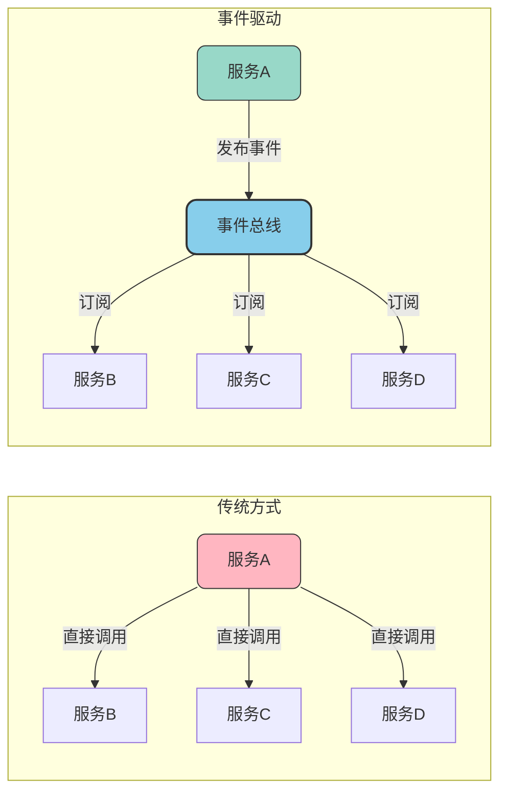

import PaidCTA from '@site/src/components/PaidCTA';

# 领域事件与DDD落地实践

## 领域事件概述

### 什么是领域事件

领域事件是DDD中用于描述领域内重要业务变化的机制。当领域模型中发生了某个具有业务意义的状态变更或行为时，可以通过发布领域事件来通知其他关心这个变化的组件。

与消息队列（MQ）中的消息不同，领域事件通常在单个微服务或限界上下文内部传递，主要目的是实现模块间的解耦，而非跨服务通信。

领域事件的核心特征：

- **业务语义明确**：事件名称直接反映业务动作，如"订单已支付"、"会员已升级"
- **不可变性**：事件一旦发生就已成为历史事实，不能修改
- **包含上下文信息**：携带事件发生时的关键业务数据
- **松耦合通信**：发布者和订阅者互不依赖

### 领域事件的价值

- **解耦模块依赖**：发布者无需知道谁会处理事件，订阅者也不依赖发布者的实现
- **扩展性增强**：新增业务处理只需添加订阅者，无需修改发布者代码
- **异步处理支持**：事件可以异步处理，提高系统响应速度
- **审计追溯方便**：事件天然形成操作日志，便于问题排查

## 领域事件设计实践

### 事件命名规范

领域事件的命名应该清晰表达业务含义，通常采用"对象+过去分词"的形式：

| 业务动作 | 事件名称 | 说明 |
|----------|----------|------|
| 会员注册成功 | MemberRegistered | 新会员完成注册 |
| 订单已确认 | OrderConfirmed | 订单进入确认状态 |
| 付款完成 | PaymentCompleted | 支付流程完成 |
| 库存已锁定 | InventoryReserved | 库存预占成功 |
| 课程已发布 | CoursePublished | 培训课程上线 |

### 事件结构设计

<PaidCTA />