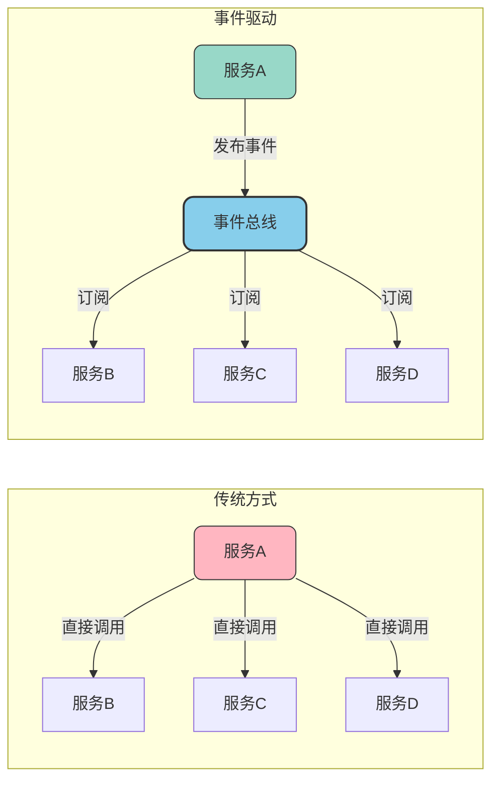
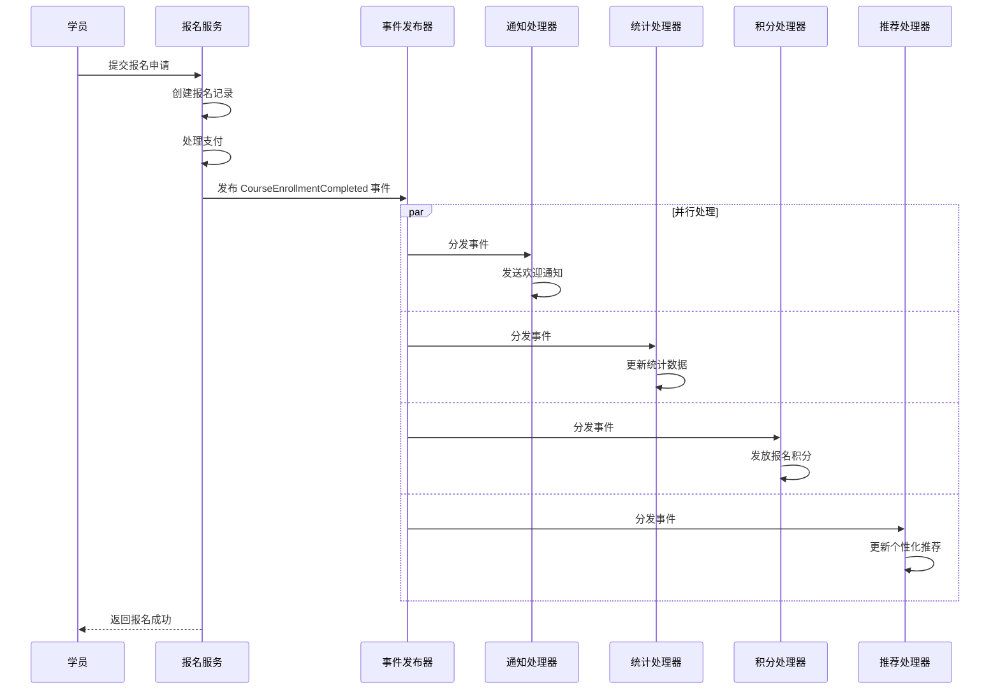
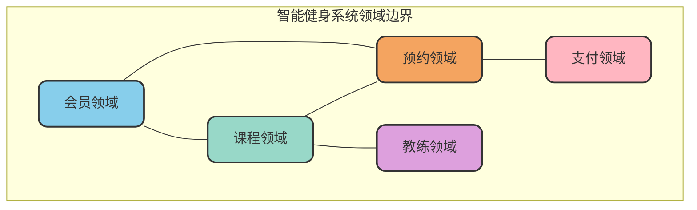
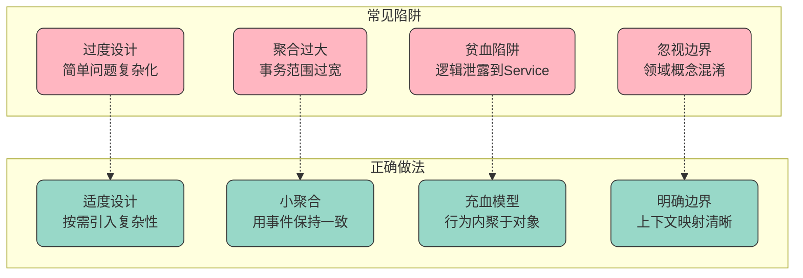

# 领域事件与DDD落地实践

## 领域事件概述

### 什么是领域事件

领域事件是DDD中用于描述领域内重要业务变化的机制。当领域模型中发生了某个具有业务意义的状态变更或行为时，可以通过发布领域事件来通知其他关心这个变化的组件。

与消息队列（MQ）中的消息不同，领域事件通常在单个微服务或限界上下文内部传递，主要目的是实现模块间的解耦，而非跨服务通信。

领域事件的核心特征：

- **业务语义明确**：事件名称直接反映业务动作，如"订单已支付"、"会员已升级"
- **不可变性**：事件一旦发生就已成为历史事实，不能修改
- **包含上下文信息**：携带事件发生时的关键业务数据
- **松耦合通信**：发布者和订阅者互不依赖

### 领域事件的价值



- **解耦模块依赖**：发布者无需知道谁会处理事件，订阅者也不依赖发布者的实现
- **扩展性增强**：新增业务处理只需添加订阅者，无需修改发布者代码
- **异步处理支持**：事件可以异步处理，提高系统响应速度
- **审计追溯方便**：事件天然形成操作日志，便于问题排查

## 领域事件设计实践

### 事件命名规范

领域事件的命名应该清晰表达业务含义，通常采用"对象+过去分词"的形式：

| 业务动作 | 事件名称 | 说明 |
|----------|----------|------|
| 会员注册成功 | MemberRegistered | 新会员完成注册 |
| 订单已确认 | OrderConfirmed | 订单进入确认状态 |
| 付款完成 | PaymentCompleted | 支付流程完成 |
| 库存已锁定 | InventoryReserved | 库存预占成功 |
| 课程已发布 | CoursePublished | 培训课程上线 |

### 事件结构设计

```java
/**
 * 领域事件基类
 */
public abstract class DomainEvent {
    
    private final String eventId;
    private final LocalDateTime occurredOn;
    private final String aggregateId;
    private final String aggregateType;
    
    protected DomainEvent(String aggregateId, String aggregateType) {
        this.eventId = UUID.randomUUID().toString();
        this.occurredOn = LocalDateTime.now();
        this.aggregateId = aggregateId;
        this.aggregateType = aggregateType;
    }
    
    public String getEventId() { return eventId; }
    public LocalDateTime getOccurredOn() { return occurredOn; }
    public String getAggregateId() { return aggregateId; }
    public String getAggregateType() { return aggregateType; }
    
    // 事件类型名称
    public abstract String getEventType();
}

/**
 * 课程报名成功事件 - 在线教育场景
 */
public class CourseEnrollmentCompleted extends DomainEvent {
    
    private final String studentId;
    private final String studentName;
    private final String courseId;
    private final String courseName;
    private final BigDecimal paidAmount;
    private final LocalDateTime enrolledAt;
    
    public CourseEnrollmentCompleted(String enrollmentId, String studentId, 
            String studentName, String courseId, String courseName, 
            BigDecimal paidAmount) {
        super(enrollmentId, "Enrollment");
        this.studentId = studentId;
        this.studentName = studentName;
        this.courseId = courseId;
        this.courseName = courseName;
        this.paidAmount = paidAmount;
        this.enrolledAt = LocalDateTime.now();
    }
    
    @Override
    public String getEventType() {
        return "CourseEnrollmentCompleted";
    }
    
    // getter方法
    public String getStudentId() { return studentId; }
    public String getCourseId() { return courseId; }
    public BigDecimal getPaidAmount() { return paidAmount; }
    // ... 其他getter
}
```

### 事件发布与订阅

```java
/**
 * 领域事件发布器接口
 */
public interface DomainEventPublisher {
    void publish(DomainEvent event);
    void publishAll(List<DomainEvent> events);
}

/**
 * 领域事件处理器接口
 */
public interface DomainEventHandler<T extends DomainEvent> {
    void handle(T event);
    Class<T> supportedEventType();
}

/**
 * 课程报名事件处理器 - 发送欢迎通知
 */
public class SendWelcomeNotificationHandler 
        implements DomainEventHandler<CourseEnrollmentCompleted> {
    
    private final NotificationService notificationService;
    
    @Override
    public void handle(CourseEnrollmentCompleted event) {
        String message = String.format(
            "亲爱的%s，恭喜您成功报名【%s】课程！",
            event.getStudentName(),
            event.getCourseName()
        );
        notificationService.send(event.getStudentId(), message);
    }
    
    @Override
    public Class<CourseEnrollmentCompleted> supportedEventType() {
        return CourseEnrollmentCompleted.class;
    }
}

/**
 * 课程报名事件处理器 - 更新学习统计
 */
public class UpdateLearningStatisticsHandler 
        implements DomainEventHandler<CourseEnrollmentCompleted> {
    
    private final StatisticsService statisticsService;
    
    @Override
    public void handle(CourseEnrollmentCompleted event) {
        statisticsService.incrementCourseEnrollment(event.getCourseId());
        statisticsService.incrementStudentCourseCount(event.getStudentId());
    }
    
    @Override
    public Class<CourseEnrollmentCompleted> supportedEventType() {
        return CourseEnrollmentCompleted.class;
    }
}
```

### 典型事件场景示例

以在线教育平台为例，当学员完成课程报名时，可能触发以下事件流：



## DDD落地实践流程

### 第一步：明确业务领域边界

DDD落地的第一步是深入理解业务，明确系统要解决的核心问题，并划定业务领域的边界。这个过程需要开发团队与业务专家紧密协作。

以智能健身管理系统为例：



**关键产出**：
- 识别核心领域、支撑领域和通用领域
- 确定各领域之间的关系和交互方式
- 明确系统的问题域和解决方案域

### 第二步：建立统一语言

统一语言（Ubiquitous Language）是团队沟通的基础。所有成员——无论是业务人员还是开发人员——都应该使用相同的术语来描述业务概念。

**实践建议**：
- 创建术语表，记录核心业务概念的定义
- 在代码中使用与业务一致的命名
- 避免使用技术术语替代业务术语

| 业务术语 | 定义 | 代码命名 |
|----------|------|----------|
| 私教课程 | 一对一的个性化训练课程 | PersonalTrainingSession |
| 课时包 | 预购的私教课程次数集合 | SessionPackage |
| 签到 | 会员到店确认开始训练 | CheckIn |
| 体测 | 记录会员身体指标的评估 | FitnessAssessment |

### 第三步：设计领域模型

根据业务需求设计领域模型，识别实体、值对象、聚合等构建要素。

```java
/**
 * 预约聚合根 - 健身房预约场景
 */
public class Reservation {
    
    private final ReservationId reservationId;
    private final MemberId memberId;
    private final TrainerId trainerId;
    private final CourseType courseType;
    private TimeSlot timeSlot;           // 值对象：时间段
    private ReservationStatus status;
    private String cancelReason;
    private List<DomainEvent> domainEvents;
    
    public Reservation(ReservationId reservationId, MemberId memberId,
                      TrainerId trainerId, CourseType courseType, TimeSlot timeSlot) {
        this.reservationId = reservationId;
        this.memberId = memberId;
        this.trainerId = trainerId;
        this.courseType = courseType;
        this.timeSlot = timeSlot;
        this.status = ReservationStatus.PENDING;
        this.domainEvents = new ArrayList<>();
    }
    
    /**
     * 确认预约
     */
    public void confirm() {
        if (this.status != ReservationStatus.PENDING) {
            throw new IllegalStateException("只有待确认状态的预约可以确认");
        }
        this.status = ReservationStatus.CONFIRMED;
        
        // 发布预约确认事件
        domainEvents.add(new ReservationConfirmed(
            this.reservationId.getValue(),
            this.memberId.getValue(),
            this.trainerId.getValue(),
            this.timeSlot.getStartTime()
        ));
    }
    
    /**
     * 取消预约
     */
    public void cancel(String reason) {
        if (this.status == ReservationStatus.COMPLETED) {
            throw new IllegalStateException("已完成的预约不能取消");
        }
        this.status = ReservationStatus.CANCELLED;
        this.cancelReason = reason;
        
        // 发布预约取消事件
        domainEvents.add(new ReservationCancelled(
            this.reservationId.getValue(),
            this.memberId.getValue(),
            reason
        ));
    }
    
    /**
     * 完成预约（签到后调用）
     */
    public void complete() {
        if (this.status != ReservationStatus.CONFIRMED) {
            throw new IllegalStateException("只有已确认的预约可以完成");
        }
        this.status = ReservationStatus.COMPLETED;
        
        // 发布预约完成事件
        domainEvents.add(new ReservationCompleted(
            this.reservationId.getValue(),
            this.memberId.getValue(),
            this.courseType.name()
        ));
    }
    
    /**
     * 获取并清除领域事件
     */
    public List<DomainEvent> pullDomainEvents() {
        List<DomainEvent> events = new ArrayList<>(domainEvents);
        domainEvents.clear();
        return events;
    }
}

/**
 * 时间段值对象
 */
public final class TimeSlot {
    private final LocalDateTime startTime;
    private final LocalDateTime endTime;
    
    public TimeSlot(LocalDateTime startTime, LocalDateTime endTime) {
        if (startTime.isAfter(endTime)) {
            throw new IllegalArgumentException("开始时间不能晚于结束时间");
        }
        this.startTime = startTime;
        this.endTime = endTime;
    }
    
    public boolean overlaps(TimeSlot other) {
        return this.startTime.isBefore(other.endTime) 
            && this.endTime.isAfter(other.startTime);
    }
    
    public Duration getDuration() {
        return Duration.between(startTime, endTime);
    }
    
    // getter、equals、hashCode
}
```

### 第四步：实现领域服务

对于跨实体的业务逻辑，使用领域服务来实现：

```java
/**
 * 预约领域服务
 */
public class ReservationDomainService {
    
    private final TrainerScheduleRepository trainerScheduleRepo;
    private final MemberSessionRepository memberSessionRepo;
    
    /**
     * 检查预约可行性
     */
    public ReservationFeasibility checkFeasibility(
            MemberId memberId, TrainerId trainerId, TimeSlot timeSlot) {
        
        // 检查教练时间是否可用
        TrainerSchedule schedule = trainerScheduleRepo.findByTrainerId(trainerId);
        if (!schedule.isAvailable(timeSlot)) {
            return ReservationFeasibility.trainerUnavailable();
        }
        
        // 检查会员剩余课时
        MemberSession session = memberSessionRepo.findByMemberId(memberId);
        if (session.getRemainingCount() <= 0) {
            return ReservationFeasibility.insufficientSessions();
        }
        
        // 检查会员同时段是否有其他预约
        if (session.hasReservationAt(timeSlot)) {
            return ReservationFeasibility.timeConflict();
        }
        
        return ReservationFeasibility.feasible();
    }
}
```

### 第五步：构建应用服务

应用服务负责编排领域对象，处理事务和事件发布：

```java
/**
 * 预约应用服务
 */
@Service
@Transactional
public class ReservationApplicationService {
    
    private final ReservationRepository reservationRepo;
    private final ReservationDomainService domainService;
    private final DomainEventPublisher eventPublisher;
    
    /**
     * 创建预约
     */
    public ReservationId createReservation(CreateReservationCommand command) {
        // 1. 构造领域对象
        MemberId memberId = new MemberId(command.getMemberId());
        TrainerId trainerId = new TrainerId(command.getTrainerId());
        TimeSlot timeSlot = new TimeSlot(command.getStartTime(), command.getEndTime());
        
        // 2. 调用领域服务检查可行性
        ReservationFeasibility feasibility = 
            domainService.checkFeasibility(memberId, trainerId, timeSlot);
        if (!feasibility.isFeasible()) {
            throw new BusinessException(feasibility.getReason());
        }
        
        // 3. 创建预约聚合
        ReservationId reservationId = reservationRepo.nextId();
        Reservation reservation = new Reservation(
            reservationId, memberId, trainerId,
            command.getCourseType(), timeSlot
        );
        
        // 4. 持久化
        reservationRepo.save(reservation);
        
        // 5. 发布领域事件
        eventPublisher.publishAll(reservation.pullDomainEvents());
        
        return reservationId;
    }
    
    /**
     * 确认预约
     */
    public void confirmReservation(String reservationId) {
        Reservation reservation = reservationRepo.findById(
            new ReservationId(reservationId)
        ).orElseThrow(() -> new EntityNotFoundException("预约不存在"));
        
        reservation.confirm();
        reservationRepo.save(reservation);
        eventPublisher.publishAll(reservation.pullDomainEvents());
    }
}
```

### 第六步：设计基础设施层

基础设施层负责技术实现，包括仓储、消息等：

```java
/**
 * 预约仓储接口（领域层定义）
 */
public interface ReservationRepository {
    ReservationId nextId();
    void save(Reservation reservation);
    Optional<Reservation> findById(ReservationId id);
    List<Reservation> findByMemberId(MemberId memberId);
}

/**
 * 预约仓储实现（基础设施层实现）
 */
@Repository
public class JpaReservationRepository implements ReservationRepository {
    
    private final ReservationJpaRepository jpaRepository;
    private final ReservationMapper mapper;
    
    @Override
    public void save(Reservation reservation) {
        ReservationPO po = mapper.toPersistence(reservation);
        jpaRepository.save(po);
    }
    
    @Override
    public Optional<Reservation> findById(ReservationId id) {
        return jpaRepository.findById(id.getValue())
            .map(mapper::toDomain);
    }
    
    // 其他方法实现...
}
```

## DDD落地的关键要点

### 持续迭代优化

DDD不是一次性的设计工作，而是需要随着业务发展持续演进：

- **定期回顾领域模型**：确保模型与业务需求保持一致
- **及时更新统一语言**：新增业务概念时同步更新术语表
- **重构优于重写**：通过渐进式重构优化模型，而非推倒重来

### 团队协作机制

- **建立跨职能团队**：业务、产品、开发紧密协作
- **定期举办领域建模工作坊**：Event Storming等协作方法
- **代码审查关注领域表达**：确保代码准确反映业务语义

### 常见陷阱避免



## 小结

领域事件是DDD中实现模块解耦的关键机制，通过事件驱动的方式让系统各部分松耦合协作。DDD的落地需要遵循清晰的流程：从明确业务边界、建立统一语言，到设计领域模型、实现领域服务，再到构建应用层和基础设施层。

成功的DDD实践需要团队的持续投入和不断迭代。它不是一种即插即用的技术方案，而是一套需要团队共同学习、实践和改进的方法论。在复杂业务场景下，DDD能够帮助团队构建出更加健壮、灵活和可维护的软件系统。
