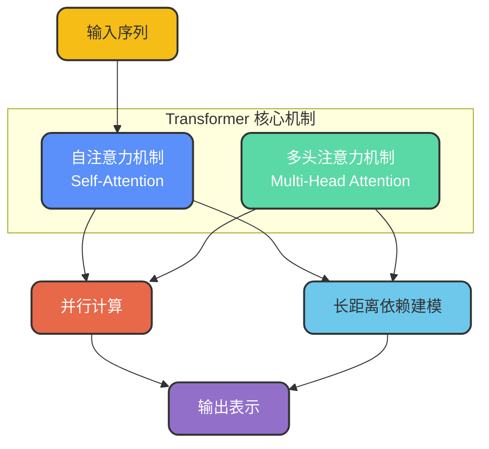
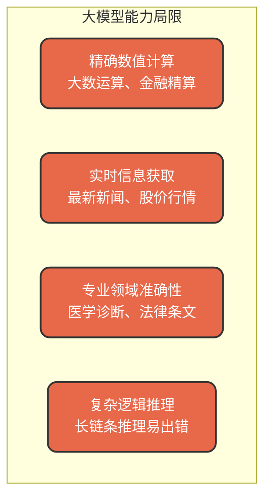
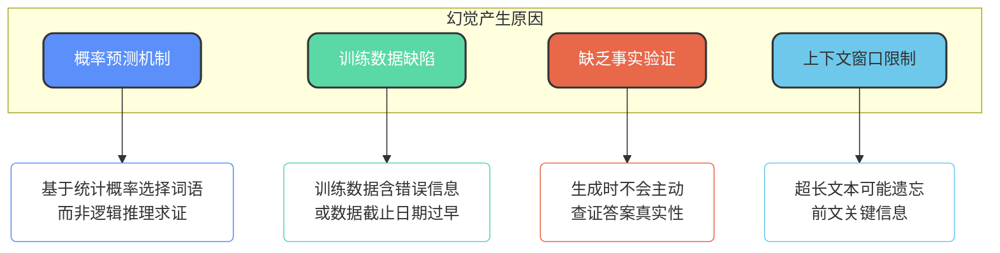
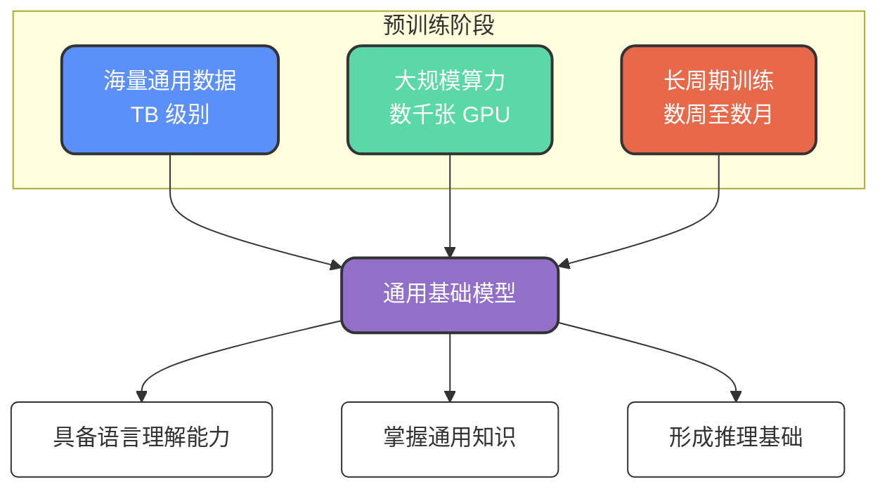

# 大模型核心概念与技术原理

## 什么是大模型

大模型（Large Model）是基于深度学习的大规模人工智能模型，其中最具代表性的是大语言模型（LLM，Large Language Model），例如 GPT 系列、Claude、DeepSeek 等。

### 参数规模的跨越

相较于传统深度学习模型，大模型最显著的特征在于**参数规模的指数级增长**：

| 模型类型 | 参数规模 | 典型代表 |
| --- | --- | --- |
| 传统深度学习模型 | 百万级~千万级 | ResNet、BERT-base |
| 大语言模型 | 百亿级~万亿级 | GPT-4、DeepSeek-V3 |

> 业界常用 "B"（Billion，十亿）来描述模型规模，例如 7B 模型表示参数量达到 70 亿。

### Transformer 架构基础

现代大模型的核心技术基石是 **Transformer 架构**，该架构通过以下两个关键机制实现高效信息处理：

与传统的 RNN（循环神经网络）和 CNN（卷积神经网络）相比，Transformer 具备**更强的并行计算能力**和**更长的上下文理解能力**，这使得处理长文本成为可能。

### 多领域应用场景

大模型的能力远不止对话交互，其应用已渗透到各个技术领域：

| 应用领域 | 具体场景 | 代表性模型 |
| --- | --- | --- |
| 自然语言处理 | 智能对话、机器翻译、代码生成 | GPT-4、LLaMA 3、Claude |
| 计算机视觉 | 图像生成、目标检测、图像理解 | Stable Diffusion、DALL·E、ViT |
| 语音处理 | 语音识别、语音合成、声音克隆 | Whisper、VALL-E、Tacotron |
| 自动驾驶 | 环境感知、路径规划、决策控制 | Tesla FSD、Waymo Driver |
| 科学研究 | 蛋白质结构预测、药物研发 | AlphaFold、Med-PaLM 2 |

## 大模型的能力边界

### 擅长的任务类型

大模型在以下领域表现出色：

**文本理解与生成**
- 阅读理解与文本摘要
- 多语言翻译（质量接近专业水平）
- 创意写作、商业文案、技术文档撰写

**代码开发辅助**
- 根据需求描述自动生成代码
- 代码缺陷定位与修复建议
- 遗留代码逻辑解读与重构

**知识问答与信息整合**
- 跨领域百科知识查询
- 结构化信息提取（如从文本生成 JSON、表格）
- 长文档要点归纳

**多模态内容处理**
- 根据文字描述生成艺术图像
- 视频内容理解与生成
- 语音转文字与语音合成

### 能力局限性

尽管大模型功能强大，但在某些场景下仍存在明显短板：

- **数值计算能力有限**：无法准确处理大数运算、高精度金融计算等场景
- **知识存在时效性**：模型训练完成后无法自主学习新知识
- **容易产生"幻觉"**：可能生成看似合理但实际错误的信息
- **长尾知识覆盖不足**：对冷门领域、小众话题的准确性较低

## 大模型幻觉问题

### 什么是幻觉

大模型的"幻觉"（Hallucination）是指模型生成**看似合理但实际错误或虚构**的内容。典型表现包括：
- 编造不存在的历史事件或人物
- 虚构学术论文和引用来源
- 杜撰公司信息或产品特性

### 幻觉产生的根源

**概率预测本质**：Transformer 模型本质上是基于概率的"词语预测器"，它根据上下文统计概率选择下一个最可能的词，而非通过逻辑推理验证答案正确性。

**训练数据问题**：训练语料本身可能包含错误信息、过时数据或带有偏见的内容，模型会将这些问题"学习"下来。

**缺乏外部验证**：模型在生成内容时不会主动检索外部数据源来验证信息的准确性。

**上下文长度约束**：即使是支持 128K tokens 的模型，在处理超长文本时也可能丢失前文的关键信息。

### 幻觉缓解策略

针对幻觉问题，业界发展出多种解决方案：

| 策略 | 实现方式 | 适用场景 |
| --- | --- | --- |
| RAG 增强检索 | 回答前先检索真实数据源 | 知识库问答、文档查询 |
| 领域微调 | 使用专业数据调整模型参数 | 医疗、法律等垂直领域 |
| 提示词约束 | 明确指示"不确定时回答不知道" | 所有对话场景 |
| 自我反思机制 | 让模型检查并标记不确定部分 | 关键决策辅助 |
| 实时联网检索 | 生成前查询最新网络数据 | 时事新闻、实时数据 |
| 多轮验证 | 同一问题多次生成后交叉验证 | 高准确性要求场景 |
| 思维链推理 | 先输出推理过程再给出结论 | 复杂逻辑问题 |

## 预训练与微调

### 预训练的核心作用

预训练（Pre-training）是大模型获取通用能力的关键阶段。通过在海量通用数据上进行训练，模型能够习得：

- 语法规则与语言结构
- 常识知识与基础概念
- 跨领域的通用语义理解

预训练的资源消耗极高：需要 TB 级别的训练数据、数千张高端 GPU、持续数周甚至数月的训练周期，因此通常只有大型科技公司具备预训练能力。

### 微调的价值与方法

微调（Fine-tuning）是在预训练模型基础上，使用**特定领域或任务的数据**进一步调整模型参数，使其适应具体应用场景。

| 对比维度 | 预训练 | 微调 |
| --- | --- | --- |
| 目标 | 构建通用基础模型 | 适配特定任务场景 |
| 数据规模 | TB 级 | MB~GB 级 |
| 算力需求 | 极高 | 相对较低 |
| 训练周期 | 数周~数月 | 数小时~数天 |

### 主流微调技术

随着模型规模增大，完整微调所有参数的成本急剧上升，催生了多种**参数高效微调**方法：

**LoRA（Low-Rank Adaptation）**
通过低秩矩阵分解，仅训练少量新增参数，大幅降低显存占用和计算成本。

**PEFT（Parameter-Efficient Fine-Tuning）**
参数高效微调的统称，包含多种只更新部分参数的技术方案。

**Adapter Tuning**
在 Transformer 层之间插入小型适配器模块，仅训练适配器参数。

**Prefix Tuning**
在输入序列前添加可学习的前缀向量，引导模型行为。

**指令微调（Instruction Tuning）**
使用"指令-回答"格式的数据训练，提升模型的指令遵循能力。

**RLHF（人类反馈强化学习）**
结合人类偏好反馈优化模型输出质量，是 ChatGPT 等产品的核心训练技术之一。

## 主流AI工具与应用

### 对话式AI平台

| 类别 | 代表产品 | 特点 |
| --- | --- | --- |
| 国产平台 | DeepSeek、通义千问、文心一言、Kimi | 中文处理优势明显 |
| 海外平台 | ChatGPT、Claude、Gemini | 英文能力领先 |

### 编程辅助工具

- **通义灵码**：阿里云推出的免费代码助手
- **GitHub Copilot**：微软与 OpenAI 合作的编程助手
- **Cursor**：集成 AI 能力的现代化 IDE

### 多模态生成工具

| 媒体类型 | 代表工具 |
| --- | --- |
| 图像生成 | Midjourney、Stable Diffusion、DALL·E、可灵 |
| 视频生成 | Runway、Sora、Pika |
| 音频处理 | Whisper、ElevenLabs |

### 进阶实践

对于希望深入学习大模型的开发者，可以尝试：
- 本地部署开源模型（如 LLaMA、Qwen）
- 使用 LoRA 进行模型微调实验
- 搭建 RAG 知识库应用
