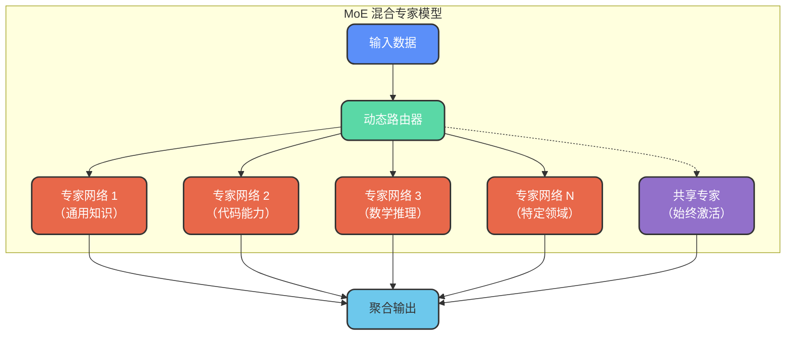
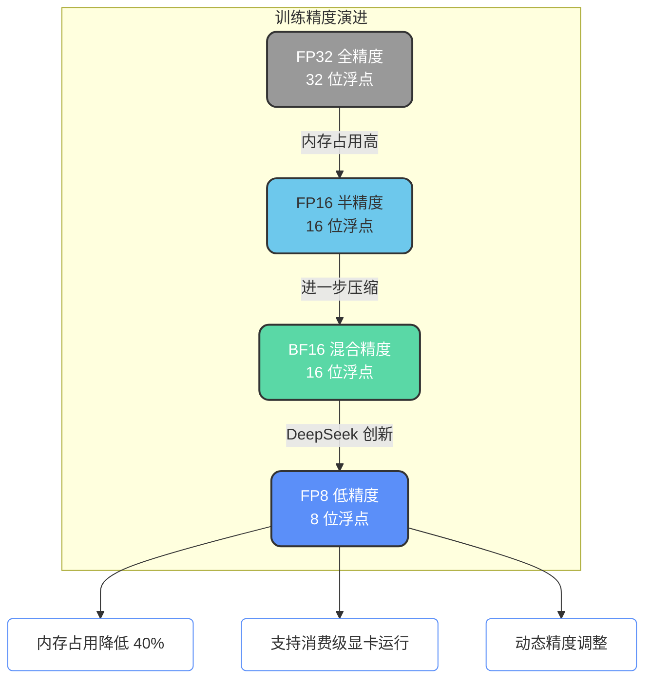
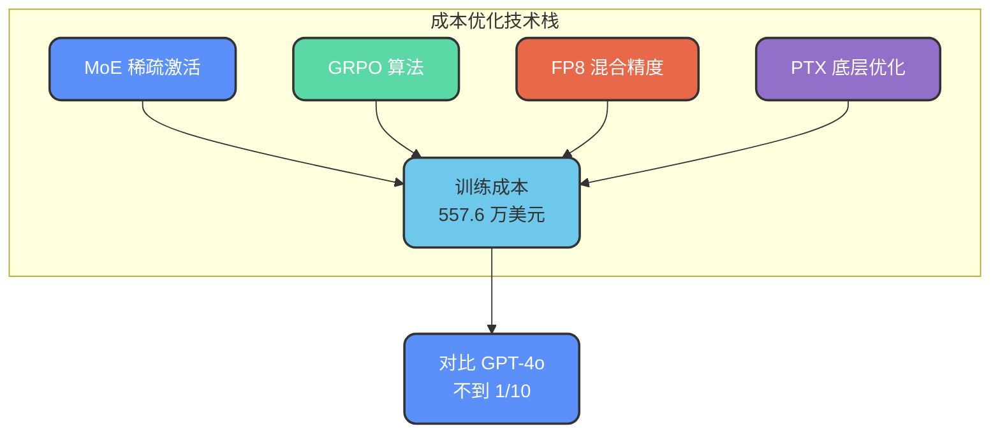

# DeepSeek技术架构解析

## DeepSeek 的崛起

DeepSeek 的爆火可以从两个视角来分析：普通用户体验层面和技术行业层面。

### 用户体验层面的突破

**思维过程可视化**

DeepSeek 开创性地将模型的**思考过程**展示给用户。在此之前，包括 GPT 在内的各类大模型虽然内部也有推理过程，但从未向用户呈现。这种透明化的处理方式让用户能够理解模型的推理链条，极大增强了交互的可信度。

**中文处理能力领先**

在中文理解与生成方面，DeepSeek 展现出超越 GPT 等海外模型的能力，这对于国内用户而言具有重要的实用价值。

### 行业层面的技术革新

**训练成本的颠覆性降低**

DeepSeek 最令业界震撼的是其**训练成本仅为同等规模模型的 1/20**。以 DeepSeek-V3 为例，官方公布的训练成本约 557.6 万美元，不到 GPT-4o 训练成本的十分之一。这意味着对算力（GPU 资源）的依赖大幅降低。

**开源策略**

DeepSeek-R1 采用完全开源的方式发布，这使得学术界和中小企业也能基于其进行研究和应用开发。

**非传统巨头的突围**

DeepSeek 并非诞生于传统互联网大厂，而是来自幻方量化——一家以量化投资起家的公司。这种"小公司挑战行业巨头"的叙事本身就具有话题性。

## 核心技术架构

DeepSeek 之所以能够实现低成本高性能，依赖于多项技术创新的综合运用。

### MoE 混合专家架构

DeepSeek 采用 **Transformer + MoE（Mixture of Experts）** 的组合架构，这是其降本增效的核心技术之一。

**工作原理**

- **稀疏激活**：虽然模型总参数量巨大（如 6710 亿参数），但在推理时仅激活 10%-37% 的参数
- **动态路由**：根据输入内容自动选择最相关的专家网络进行处理
- **共享专家机制**：部分专家始终参与计算，处理通用知识；路由专家针对特定任务优化

这种架构使计算资源实现**按需分配**，综合效率较传统 MoE 提升约 30%。

### MLA 多头潜在注意力

DeepSeek 引入 **MLA（Multi-head Latent Attention）** 机制，通过低秩投影压缩 Key-Value 缓存，在保持模型性能的同时显著降低推理时的内存占用。

### 训练策略优化

#### GRPO 强化学习算法

DeepSeek 采用 **GRPO（Group Relative Policy Optimization）** 算法替代传统的 PPO 算法：

| 对比项 | 传统 PPO | GRPO |
| --- | --- | --- |
| 价值模型 | 需要独立训练 | 无需价值模型 |
| 训练内存 | 较高 | 降低约 50% |
| 无效训练 | 较多 | 减少约 60% |
| 策略优化 | 间接优化 | 直接优化 |

#### FP8 混合精度训练

DeepSeek-V3 是**全球首个全面采用 FP8（8位浮点）精度训练**的大规模模型：

FP8 训练的优势：
- 内存占用相比 FP16 降低约 40%
- 训练过程动态调整精度，平衡效率与精度
- 使中等规模 GPU 也能参与大模型训练

### 底层硬件优化

#### PTX 直接编程

DeepSeek 团队深入到 **NVIDIA PTX（Parallel Thread Execution）** 指令层进行优化：

- **绕过 CUDA 抽象层**：直接操作底层硬件指令
- **最大化 GPU 利用率**：榨取硬件的每一分算力
- **跨架构适配**：在 A100 显卡上运行原本需要 H100 才能完成的任务

这种极致的底层优化需要深厚的硬件理解和工程能力，是 DeepSeek 团队的技术护城河之一。

## 成本优势总结

通过上述技术的综合应用，DeepSeek 在训练成本上实现了显著突破：

| 优化技术 | 效果说明 |
| --- | --- |
| MoE 架构 | 推理时仅激活部分参数，减少计算量 |
| GRPO 算法 | 无需价值模型，内存需求降低 50% |
| FP8 精度 | 内存占用降低 40%，支持更低配置硬件 |
| PTX 优化 | 最大化利用现有 GPU 算力 |

这些技术创新共同推动了大模型训练成本的革命性降低，为更多组织参与大模型研发提供了可能。
