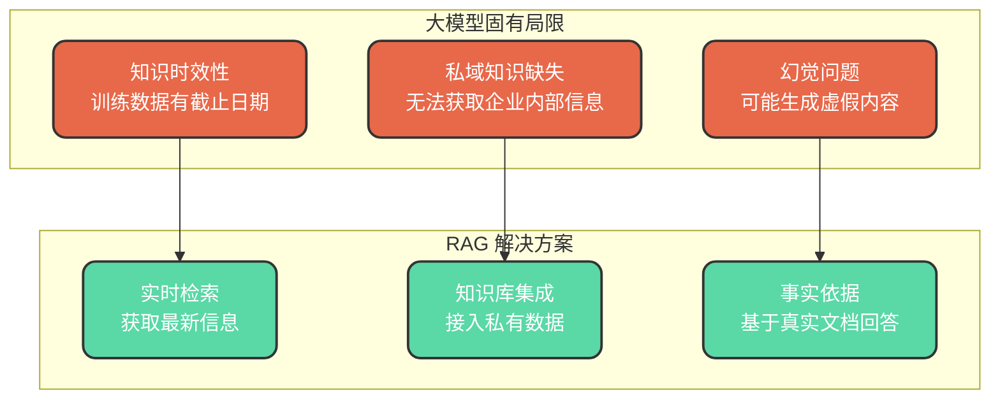
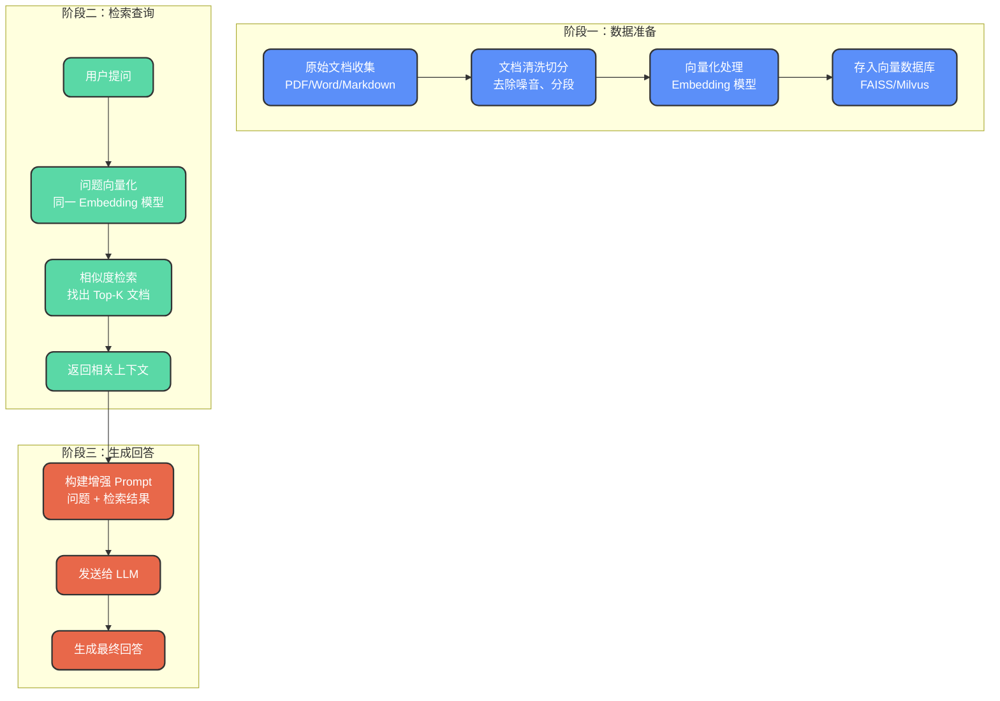
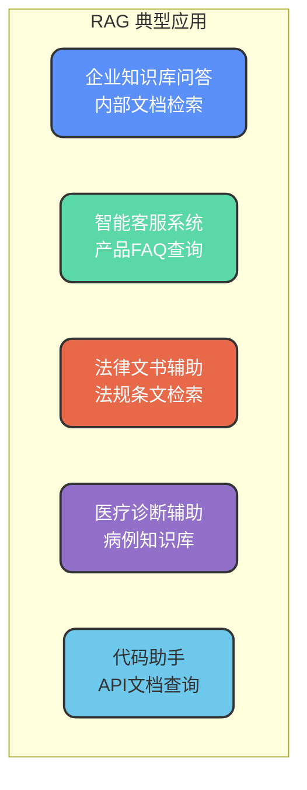

# RAG检索增强生成技术

## RAG 概述

### 基本概念

RAG（Retrieval-Augmented Generation）即**检索增强生成**，是一种将信息检索与大语言模型相结合的技术架构。其核心思想是：让大模型在生成回答之前，**先从外部知识库中检索相关信息**，再基于检索结果生成更加准确、可靠的答案。

简而言之，RAG 就是给大模型配备了一个"知识库查询助手"，使其不再完全依赖预训练时学到的知识，而是能够实时获取最新、最准确的信息。

### 为什么需要 RAG

大语言模型虽然功能强大，但存在几个固有局限：



**知识时效性问题**
大模型的知识来源于训练数据，而训练数据存在明确的截止日期。例如某些模型的数据截止到 2023 年初，对于之后发生的事件一无所知。

**私域知识空白**
公开训练的大模型只学习了互联网上的公开资料，对于企业内部文档、专有知识库等私域信息完全没有覆盖。

**幻觉现象严重**
当模型遇到不熟悉的问题时，可能会"编造"看似合理但实际错误的答案，在专业领域尤为危险。

RAG 通过引入外部知识检索，有效解决了上述问题，使大模型的回答更加可靠、可追溯。

## RAG 系统架构

一个完整的 RAG 系统主要包含三个阶段：数据准备、检索查询、生成回答。



## 核心技术详解

### 数据准备阶段

#### 文档收集与清洗

首先需要整理知识库的原始资料，常见来源包括：
- 企业内部文档（技术规范、操作手册）
- 产品说明与 FAQ
- 历史问答记录
- 行业标准与法规文件

收集后需要进行数据清洗：
- 去除无关信息（页眉页脚、广告内容）
- 统一文本格式
- 处理特殊字符和编码问题

#### 文本切分策略

由于大模型的上下文窗口有限，需要将长文档切分为合理的小段。切分策略直接影响检索质量：

| 切分方式 | 优点 | 缺点 |
| --- | --- | --- |
| 固定长度切分 | 实现简单 | 可能切断语义完整性 |
| 按段落切分 | 保持语义连贯 | 段落长度不均匀 |
| 语义感知切分 | 语义完整性最好 | 实现复杂度高 |
| 滑动窗口切分 | 保留上下文关联 | 存在冗余数据 |

通常建议结合业务场景选择合适的切分策略，并设置适当的重叠区域以保留上下文。

#### 向量化与存储

**Embedding 模型**
将文本转换为高维向量表示，使语义相似的文本在向量空间中距离更近。常用的 Embedding 模型包括：
- OpenAI text-embedding-ada-002
- BGE（智源）
- M3E（Moka）

**向量数据库**
专门用于存储和检索向量的数据库系统：

| 数据库 | 特点 |
| --- | --- |
| FAISS | Facebook 开源，高性能本地部署 |
| Milvus | 云原生架构，支持分布式 |
| Pinecone | 全托管云服务 |
| Chroma | 轻量级，适合原型开发 |
| PostgreSQL + pgvector | 基于关系型数据库扩展 |

### 检索查询阶段

当用户提出问题时，系统执行以下流程：

**问题向量化**
使用与文档处理相同的 Embedding 模型，将用户问题转换为向量表示。

**相似度检索**
在向量数据库中执行近似最近邻（ANN）搜索，找出与问题向量最相似的 Top-K 个文档片段。常用的相似度计算方式：
- 余弦相似度
- 欧氏距离
- 点积

**结果筛选**
可以设置相似度阈值，过滤掉相关性不足的结果，避免引入噪音信息。

### 生成回答阶段

将用户问题与检索到的上下文材料组合构建增强 Prompt，发送给大语言模型生成答案。

**Prompt 构建示例**

```text
基于以下参考资料回答用户问题。如果资料中没有相关信息，请明确说明。

【参考资料】
{检索到的文档片段1}
{检索到的文档片段2}
...

【用户问题】
{用户的原始问题}

【回答要求】
1. 仅基于参考资料内容回答
2. 如信息不足请说明
3. 标注信息来源
```

这种方式确保模型在指定范围内生成答案，有效降低幻觉发生概率。

## RAG 应用场景



**企业知识库问答**
员工可以自然语言查询公司内部文档、技术规范、流程手册等。

**智能客服系统**
基于产品手册和 FAQ 库，自动回答用户问题，减轻人工客服压力。

**专业领域辅助**
法律、医疗等领域需要高准确性，RAG 可以确保回答基于权威资料。

## RAG 与微调的对比

| 对比维度 | RAG | 微调 |
| --- | --- | --- |
| 知识更新 | 实时更新，修改知识库即可 | 需要重新训练模型 |
| 成本 | 相对较低 | 需要 GPU 资源和训练时间 |
| 可追溯性 | 可标注信息来源 | 知识内化，难以追溯 |
| 适用场景 | 知识频繁更新、需要来源追溯 | 风格调整、特定任务优化 |

在实际项目中，RAG 和微调往往可以结合使用：先通过微调让模型适应特定领域的表达风格，再通过 RAG 补充实时的专业知识。
