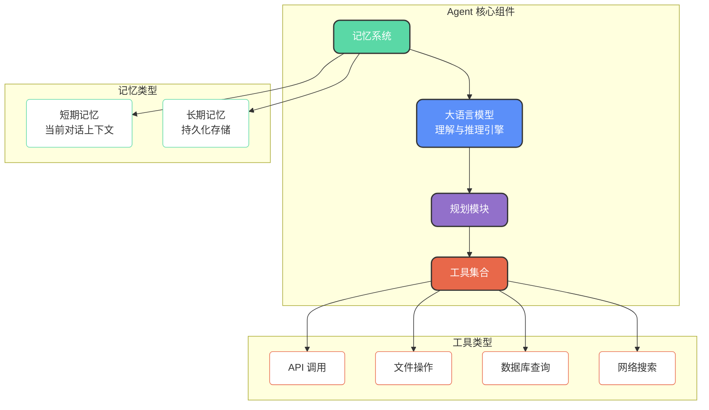
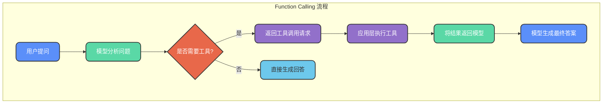
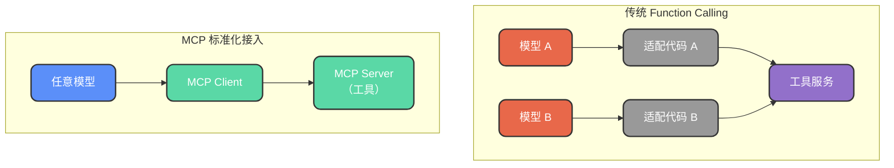
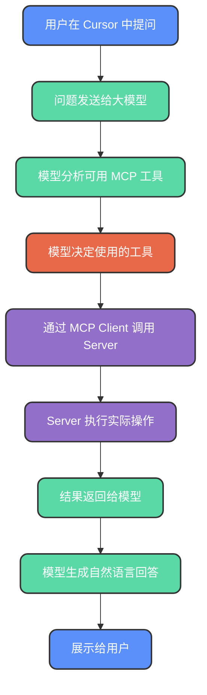

# AI Agent与工具调用协议

## AI Agent 概述

### 从对话机器人到智能助理

传统的大语言模型（如早期的 ChatGPT）本质上是一个"对话机器人"，只能基于预训练知识进行文本交互。当你要求它查询实时数据、操作本地文件或调用外部服务时，它无能为力。

**AI Agent（智能体）** 则是在大模型基础上增加了**工具调用能力**和**自主决策能力**的系统。它不仅能理解自然语言，还知道**何时该调用什么工具**来完成任务。

### 一个生活化的例子

想象这样一个场景：你对智能音箱说"我想点一份外卖"，一个真正的 Agent 需要：

1. **理解意图**：识别出你想点餐
2. **收集信息**：询问想吃什么、送到哪里
3. **选择工具**：知道需要打开外卖应用
4. **执行操作**：自动完成搜索、下单、支付
5. **反馈结果**：告诉你订单已完成

这个过程涉及感知、推理、规划和执行多个环节，正是 Agent 的核心能力体现。

## Agent 核心架构

Agent 的能力可以概括为一个公式：**Agent = LLM + Memory + Tools（使用 + 规划）**



### 核心能力分解

**感知（Perception）**
Agent 能够接收多种输入信息：用户的自然语言问题、系统状态、历史对话记录等。

**决策（Decision-making）**
基于感知到的信息和内部状态，Agent 分析当前情况，选择最合适的行动方案。

**规划（Planning）**
对于复杂任务，Agent 能够将其分解为多个子任务，确定执行顺序和依赖关系。

**执行（Action）**
调用相应的工具或 API 执行具体操作，并获取执行结果。

### 记忆机制详解

**短期记忆**
类似于对话窗口的上下文，在当前会话中有效。用户切换对话或关闭应用后，短期记忆随之消失。

**长期记忆**
通过数据库、向量存储等方式持久化保存的信息。每次对话开始时，Agent 会加载相关的长期记忆作为背景知识。

## 工具调用技术

让大模型学会使用工具，是实现 Agent 的关键技术突破。目前主流的方案包括 Function Calling 和 MCP。

### Function Calling

#### 基本原理

Function Calling 是 OpenAI 率先提出的工具调用方案。其核心思想是：**通过结构化的方式向模型描述可用工具**，让模型在需要时主动请求调用这些工具。



#### 工具定义规范

每个工具需要按照特定的 JSON Schema 格式进行描述：

```python
# 定义一个查询商品库存的工具
def query_product_stock(product_id: str, warehouse: str = "main"):
    """查询指定仓库的商品库存数量
    
    Args:
        product_id: 商品唯一标识符
        warehouse: 仓库编码，默认为主仓库
    
    Returns:
        包含库存数量和更新时间的字典
    """
    # 实际业务逻辑
    return {
        "product_id": product_id,
        "warehouse": warehouse,
        "quantity": 156,
        "last_updated": "2024-01-15 10:30:00"
    }

# 工具的结构化描述
TOOLS = [
    {
        "type": "function",
        "function": {
            "name": "query_product_stock",
            "description": "查询指定仓库的商品库存数量",
            "parameters": {
                "type": "object",
                "properties": {
                    "product_id": {
                        "type": "string",
                        "description": "商品唯一标识符，如 SKU 编码"
                    },
                    "warehouse": {
                        "type": "string",
                        "enum": ["main", "east", "west", "south"],
                        "description": "仓库编码，可选值：main-主仓库，east-东区仓，west-西区仓，south-南区仓"
                    }
                },
                "required": ["product_id"]
            }
        }
    }
]
```

**工具描述要素**：
- `name`：函数名称，模型通过此名称调用工具
- `description`：功能描述，帮助模型理解何时使用该工具
- `parameters`：参数规范，采用 JSON Schema 格式定义

#### 调用流程

将用户问题和可用工具列表一起发送给模型：

```python
messages = [
    {"role": "system", "content": "你是一个仓库管理助手，可以帮助查询商品库存信息。"},
    {"role": "user", "content": "帮我看一下 SKU20240115 在东区仓的库存还有多少"}
]

# 调用模型，传入工具列表
response = client.chat.completions.create(
    model="gpt-4",
    messages=messages,
    tools=TOOLS,
    tool_choice="auto"  # 让模型自动决定是否使用工具
)
```

模型会分析用户意图，判断需要调用 `query_product_stock` 工具，并返回包含参数的调用请求。应用层执行工具后，将结果返回模型生成最终回答。

### MCP 协议

#### MCP 的诞生背景

Function Calling 虽然有效，但存在一个问题：**每个工具都需要编写大量适配代码**。不同的模型、不同的工具，接入方式各异，导致生态碎片化严重。

MCP（Model Context Protocol，模型上下文协议）由 Anthropic（Claude 的开发公司）于 2024 年底推出，旨在建立一个**统一的工具接入标准**。



#### MCP 核心组件

**MCP Host**
AI 应用的入口，如 Claude Desktop、Cursor IDE 等，负责发起工具调用请求。

**MCP Client**
协议客户端，维护与 MCP Server 的连接，负责请求转发和协议适配。

**MCP Server**
轻量级工具服务，对接具体的数据源或功能（如 GitHub API、本地文件系统、数据库等），提供标准化接口。

#### MCP 工作流程



#### MCP 的优势

**即插即用**
只要工具遵循 MCP 规范，任何支持 MCP 的 AI 应用都可以直接使用，无需额外适配。

**生态共享**
开发者发布的 MCP Server 可以被整个社区复用，避免重复开发。

**标准化接口**
统一的协议规范降低了学习成本和维护成本。

MCP 推出后，因 Cursor 等知名工具的支持而迅速流行，OpenAI 等厂商也开始跟进支持。

## Function Calling 与 MCP 对比

| 对比维度 | Function Calling | MCP |
| --- | --- | --- |
| 定位 | 单一模型的工具调用方案 | 跨模型的标准化协议 |
| 工具接入 | 需要编写适配代码 | 遵循协议即可即插即用 |
| 生态系统 | 各厂商各自为政 | 统一标准，生态共享 |
| 学习成本 | 需要了解各模型差异 | 学习一次，处处适用 |
| 适用场景 | 快速原型、单一模型应用 | 多模型支持、工具复用 |

在实际项目中，可以根据需求选择合适的方案：
- 如果只使用单一模型且工具较少，Function Calling 足够简单直接
- 如果需要支持多个模型或希望复用社区工具，MCP 是更好的选择
