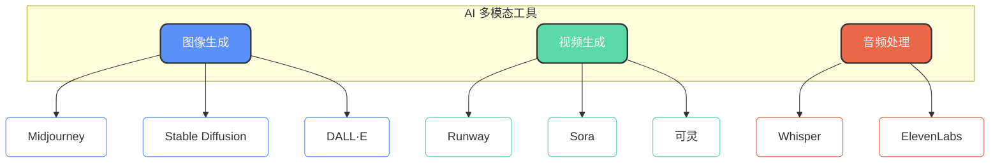

# Spring AI开发框架实践

## Spring AI 简介

Spring AI 是 Spring 官方推出的 AI 应用开发框架，于 2025 年 5 月正式发布 1.0 版本。它的核心价值在于**通过统一的 API 抽象降低 Java 开发者接入大模型的门槛**，让开发者可以用熟悉的 Spring 风格快速构建 AI 应用。

### 核心特性概览

```mermaid
graph TB
    subgraph SpringAI["Spring AI 核心能力"]
        A["多模型集成"]
        B["对话 API"]
        C["提示词模板"]
        D["向量存储"]
        E["对话记忆"]
        F["工具调用"]
    end
    
    A --> A1["OpenAI / Azure"]
    A --> A2["Ollama / 通义千问"]
    B --> B1["ChatClient"]
    B --> B2["ChatModel"]
    D --> D1["Milvus / Redis"]
    D --> D2["PostgreSQL + pgvector"]
    F --> F1["Function Calling"]
    F --> F2["MCP 支持"]
    
    style A fill:#5B8FF9,stroke:#333,stroke-width:2px,color:#fff,rx:10,ry:10
    style B fill:#5AD8A6,stroke:#333,stroke-width:2px,color:#fff,rx:10,ry:10
    style C fill:#E8684A,stroke:#333,stroke-width:2px,color:#fff,rx:10,ry:10
    style D fill:#9270CA,stroke:#333,stroke-width:2px,color:#fff,rx:10,ry:10
    style E fill:#6DC8EC,stroke:#333,stroke-width:2px,rx:10,ry:10
    style F fill:#5B8FF9,stroke:#333,stroke-width:2px,color:#fff,rx:10,ry:10
    style A1 fill:#fff,stroke:#5B8FF9,stroke-width:1px,rx:5,ry:5
    style A2 fill:#fff,stroke:#5B8FF9,stroke-width:1px,rx:5,ry:5
    style B1 fill:#fff,stroke:#5AD8A6,stroke-width:1px,rx:5,ry:5
    style B2 fill:#fff,stroke:#5AD8A6,stroke-width:1px,rx:5,ry:5
    style D1 fill:#fff,stroke:#9270CA,stroke-width:1px,rx:5,ry:5
    style D2 fill:#fff,stroke:#9270CA,stroke-width:1px,rx:5,ry:5
    style F1 fill:#fff,stroke:#5B8FF9,stroke-width:1px,rx:5,ry:5
    style F2 fill:#fff,stroke:#5B8FF9,stroke-width:1px,rx:5,ry:5
```



## 多模型集成

Spring AI 通过简单的配置即可快速集成主流大语言模型服务：

| 模型提供商 | 支持情况 |
| --- | --- |
| OpenAI | GPT-3.5 / GPT-4 系列 |
| Azure OpenAI | 企业级 OpenAI 服务 |
| 通义千问 | 阿里云 DashScope |
| Ollama | 本地部署开源模型 |
| HuggingFace | 开源模型推理 |
| Google Gemini | Google AI 服务 |

```java
// 通过自动注入获取 ChatClient
ChatClient chatClient = ChatClient.builder(chatModel).build();

// 一行代码发起对话
String response = chatClient.prompt()
    .user("请帮我生成一个订单确认邮件模板")
    .call()
    .content();
```

## 对话 API 详解

Spring AI 提供两种对话交互方式：`ChatModel` 和 `ChatClient`。

### ChatModel 基础 API

`ChatModel` 是底层的模型交互接口，提供对 Prompt 和 Response 的精细控制：

```java
@RestController
@RequestMapping("/api/support")
public class CustomerSupportController {
    
    private final ChatModel chatModel;
    
    public CustomerSupportController(ChatModel chatModel) {
        this.chatModel = chatModel;
    }
    
    @PostMapping("/analyze")
    public TicketAnalysis analyzeTicket(@RequestBody String ticketContent) {
        String prompt = """
            分析以下客户工单，提取关键信息：
            1. 问题类型（退款/咨询/投诉/建议）
            2. 紧急程度（高/中/低）
            3. 涉及的产品或服务
            4. 建议处理方案
            
            工单内容：
            %s
            """.formatted(ticketContent);
        
        ChatResponse response = chatModel.call(new Prompt(prompt));
        return parseAnalysisResult(response.getResult().getOutput().getContent());
    }
}
```

### ChatClient 流式 API

`ChatClient` 提供更加灵活的 Fluent API，支持同步和响应式编程模型：

```java
@RestController
@RequestMapping("/api/docs")
public class DocumentAssistantController {
    
    private final ChatClient chatClient;
    
    public DocumentAssistantController(ChatClient.Builder builder) {
        this.chatClient = builder.build();
    }
    
    @GetMapping("/summarize")
    public String summarizeDocument(@RequestParam String documentUrl) {
        return this.chatClient.prompt()
            .system("你是一个专业的文档分析助手，擅长提取关键信息和生成摘要")
            .user("请对以下文档生成一份结构化摘要：" + documentUrl)
            .call()
            .content();
    }
    
    @GetMapping(value = "/stream", produces = MediaType.TEXT_EVENT_STREAM_VALUE)
    public Flux<String> streamResponse(@RequestParam String question) {
        return this.chatClient.prompt()
            .user(question)
            .stream()
            .content();
    }
}
```

## Prompt 模板支持

Spring AI 支持定义可复用的 Prompt 模板，通过变量动态生成提示词：

```java
@Service
public class ReportGeneratorService {
    
    private final ChatClient chatClient;
    
    public String generateSalesReport(String period, String region, List<String> metrics) {
        PromptTemplate template = new PromptTemplate("""
            请根据以下信息生成一份销售分析报告：
            
            统计周期：{period}
            销售区域：{region}
            关注指标：{metrics}
            
            报告要求：
            1. 使用 Markdown 格式
            2. 包含数据对比分析
            3. 给出可行性建议
            """);
        
        String prompt = template.render(Map.of(
            "period", period,
            "region", region,
            "metrics", String.join("、", metrics)
        ));
        
        return chatClient.prompt().user(prompt).call().content();
    }
}
```

## RAG 向量存储支持

Spring AI 原生支持向量化存储，可与多种向量数据库集成，轻松构建 RAG 应用：

```java
@Service
public class KnowledgeBaseService {
    
    private final EmbeddingModel embeddingModel;
    private final VectorStore vectorStore;
    
    public KnowledgeBaseService(EmbeddingModel embeddingModel, VectorStore vectorStore) {
        this.embeddingModel = embeddingModel;
        this.vectorStore = vectorStore;
    }
    
    /**
     * 导入文档到知识库
     */
    public void importDocument(String title, String content, Map<String, Object> metadata) {
        Document document = new Document(content, metadata);
        document.getMetadata().put("title", title);
        document.getMetadata().put("importTime", System.currentTimeMillis());
        
        vectorStore.add(List.of(document));
    }
    
    /**
     * 基于问题检索相关文档
     */
    public List<Document> searchRelevantDocs(String question, int topK) {
        return vectorStore.similaritySearch(
            SearchRequest.query(question).withTopK(topK)
        );
    }
}
```

支持的向量数据库包括：

| 数据库 | 适用场景 |
| --- | --- |
| Redis | 高性能缓存场景 |
| Milvus | 大规模向量检索 |
| PostgreSQL + pgvector | 与现有 PG 数据库集成 |
| Pinecone | 全托管云服务 |
| Chroma | 本地开发与测试 |

## 对话记忆管理

Spring AI 提供开箱即用的对话记忆功能，无需手动管理历史消息：

```java
@Service
public class ConversationService {
    
    private final ChatClient chatClient;
    private final ChatMemory chatMemory;
    
    public ConversationService(ChatModel chatModel) {
        // 初始化基于内存的对话记忆
        this.chatMemory = new InMemoryChatMemory();
        
        this.chatClient = ChatClient.builder(chatModel)
            .defaultAdvisors(new MessageChatMemoryAdvisor(chatMemory))
            .build();
    }
    
    /**
     * 多轮对话示例 - 旅行规划助手
     */
    public String chat(String sessionId, String userMessage) {
        return chatClient.prompt()
            .system("你是一个专业的旅行规划助手，帮助用户规划行程")
            .user(userMessage)
            .advisors(spec -> spec
                .param(CHAT_MEMORY_CONVERSATION_ID_KEY, sessionId)
                .param(CHAT_MEMORY_RETRIEVE_SIZE_KEY, 20))
            .call()
            .content();
    }
}

// 使用示例
// 第一轮：用户说"我想去云南旅行"
// 第二轮：用户说"帮我推荐一些当地美食"
// 模型能够记住上下文，知道是在询问云南的美食
```

## Function Calling 集成

Spring AI 封装了 Function Calling 能力，让工具定义和调用更加简洁：

```java
@Configuration
public class ToolConfiguration {
    
    /**
     * 定义一个查询订单状态的工具
     */
    @Bean
    @Description("查询订单的当前状态和物流信息")
    public Function<OrderQueryRequest, OrderStatus> queryOrderStatus(OrderService orderService) {
        return request -> orderService.getOrderStatus(request.orderId());
    }
    
    /**
     * 定义一个发送通知的工具
     */
    @Bean
    @Description("向用户发送短信或邮件通知")
    public Function<NotificationRequest, NotificationResult> sendNotification(NotificationService notificationService) {
        return request -> notificationService.send(
            request.userId(),
            request.channel(),
            request.message()
        );
    }
}

// 请求和响应对象定义
public record OrderQueryRequest(String orderId) {}

public record OrderStatus(
    String orderId, 
    String status, 
    String logistics, 
    LocalDateTime estimatedDelivery
) {}

public record NotificationRequest(
    String userId, 
    String channel, 
    String message
) {}

public record NotificationResult(boolean success, String messageId) {}
```

使用时，只需在 ChatClient 中启用工具：

```java
@Service
public class CustomerServiceBot {
    
    private final ChatClient chatClient;
    
    public String handleQuery(String userQuestion) {
        return chatClient.prompt()
            .system("你是电商平台的智能客服，可以查询订单和发送通知")
            .user(userQuestion)
            .functions("queryOrderStatus", "sendNotification")
            .call()
            .content();
    }
}
```

## MCP 协议支持

Spring AI 1.0 版本开始支持 MCP 协议，可以直接接入 MCP Server 生态：

```java
@Configuration
public class McpConfiguration {
    
    @Bean
    public McpClient mcpClient() {
        return McpClient.builder()
            .serverUrl("http://localhost:8080")
            .build();
    }
}
```

官方文档：https://docs.spring.io/spring-ai/reference/api/mcp/mcp-overview.html

## 常见 AI 工具生态

除了 Spring AI 框架本身，了解当前主流的 AI 工具生态也很重要：

### 对话式 AI 平台

| 类别 | 代表产品 |
| --- | --- |
| 国产平台 | DeepSeek、通义千问、文心一言、Kimi |
| 海外平台 | ChatGPT、Claude、Gemini |

### 开发辅助工具

| 工具 | 特点 |
| --- | --- |
| 通义灵码 | 阿里云出品，免费使用 |
| GitHub Copilot | 微软出品，代码补全强大 |
| Cursor | 集成 AI 的现代 IDE |
| Codeium | 免费的代码助手 |

### 多模态生成工具



### 进阶实践建议

对于希望深入学习 AI 技术的开发者：

1. **本地模型部署**：使用 Ollama 在本地运行 LLaMA、Qwen 等开源模型
2. **模型微调实验**：尝试使用 LoRA 对模型进行领域微调
3. **RAG 系统搭建**：基于 Spring AI 构建企业知识库问答系统
4. **Agent 开发**：结合 Function Calling 开发具有工具调用能力的智能助手
