import PaidCTA from '@site/src/components/PaidCTA';

# Spring AI开发框架实践

## Spring AI 简介

Spring AI 是 Spring 官方推出的 AI 应用开发框架，于 2025 年 5 月正式发布 1.0 版本。它的核心价值在于**通过统一的 API 抽象降低 Java 开发者接入大模型的门槛**，让开发者可以用熟悉的 Spring 风格快速构建 AI 应用。

### 核心特性概览

```mermaid
graph TB
    subgraph SpringAI["Spring AI 核心能力"]
        A["多模型集成"]
        B["对话 API"]
        C["提示词模板"]
        D["向量存储"]
        E["对话记忆"]
        F["工具调用"]
    end
    
    A --> A1["OpenAI / Azure"]
    A --> A2["Ollama / 通义千问"]
    B --> B1["ChatClient"]
    B --> B2["ChatModel"]
    D --> D1["Milvus / Redis"]
    D --> D2["PostgreSQL + pgvector"]
    F --> F1["Function Calling"]
    F --> F2["MCP 支持"]
    
    style A fill:#5B8FF9,stroke:#333,stroke-width:2px,color:#fff,rx:10,ry:10
    style B fill:#5AD8A6,stroke:#333,stroke-width:2px,color:#fff,rx:10,ry:10
    style C fill:#E8684A,stroke:#333,stroke-width:2px,color:#fff,rx:10,ry:10
    style D fill:#9270CA,stroke:#333,stroke-width:2px,color:#fff,rx:10,ry:10
    style E fill:#6DC8EC,stroke:#333,stroke-width:2px,rx:10,ry:10
    style F fill:#5B8FF9,stroke:#333,stroke-width:2px,color:#fff,rx:10,ry:10
    style A1 fill:#fff,stroke:#5B8FF9,stroke-width:1px,rx:5,ry:5
    style A2 fill:#fff,stroke:#5B8FF9,stroke-width:1px,rx:5,ry:5
    style B1 fill:#fff,stroke:#5AD8A6,stroke-width:1px,rx:5,ry:5
    style B2 fill:#fff,stroke:#5AD8A6,stroke-width:1px,rx:5,ry:5
    style D1 fill:#fff,stroke:#9270CA,stroke-width:1px,rx:5,ry:5
    style D2 fill:#fff,stroke:#9270CA,stroke-width:1px,rx:5,ry:5
    style F1 fill:#fff,stroke:#5B8FF9,stroke-width:1px,rx:5,ry:5
    style F2 fill:#fff,stroke:#5B8FF9,stroke-width:1px,rx:5,ry:5
```



## 多模型集成

Spring AI 通过简单的配置即可快速集成主流大语言模型服务：

| 模型提供商 | 支持情况 |
| --- | --- |
| OpenAI | GPT-3.5 / GPT-4 系列 |
| Azure OpenAI | 企业级 OpenAI 服务 |
| 通义千问 | 阿里云 DashScope |
| Ollama | 本地部署开源模型 |
| HuggingFace | 开源模型推理 |
| Google Gemini | Google AI 服务 |

```java
// 通过自动注入获取 ChatClient
ChatClient chatClient = ChatClient.builder(chatModel).build();

// 一行代码发起对话
String response = chatClient.prompt()
    .user("请帮我生成一个订单确认邮件模板")
    .call()
    .content();
```

## 对话 API 详解

Spring AI 提供两种对话交互方式：`ChatModel` 和 `ChatClient`。

### ChatModel 基础 API

`ChatModel` 是底层的模型交互接口，提供对 Prompt 和 Response 的精细控制：

```java
@RestController
@RequestMapping("/api/support")
public class CustomerSupportController {
    
    private final ChatModel chatModel;
    
    public CustomerSupportController(ChatModel chatModel) {
        this.chatModel = chatModel;
    }
    
    @PostMapping("/analyze")
    public TicketAnalysis analyzeTicket(@RequestBody String ticketContent) {
        String prompt = """
            分析以下客户工单，提取关键信息：
            1. 问题类型（退款/咨询/投诉/建议）
            2. 紧急程度（高/中/低）
            3. 涉及的产品或服务
            4. 建议处理方案
            
            工单内容：
            %s
            """.formatted(ticketContent);
        
        ChatResponse response = chatModel.call(new Prompt(prompt));
        return parseAnalysisResult(response.getResult().getOutput().getContent());
    }
}
```

### ChatClient 流式 API

`ChatClient` 提供更加灵活的 Fluent API，支持同步和响应式编程模型：

```java
@RestController
@RequestMapping("/api/docs")
public class DocumentAssistantController {
    
    private final ChatClient chatClient;
    
    public DocumentAssistantController(ChatClient.Builder builder) {
        this.chatClient = builder.build();
    }
    
    @GetMapping("/summarize")
    public String summarizeDocument(@RequestParam String documentUrl) {
        return this.chatClient.prompt()
            .system("你是一个专业的文档分析助手，擅长提取关键信息和生成摘要")
            .user("请对以下文档生成一份结构化摘要：" + documentUrl)
            .call()
            .content();
    }
    
    @GetMapping(value = "/stream", produces = MediaType.TEXT_EVENT_STREAM_VALUE)
    public Flux<String> streamResponse(@RequestParam String question) {
        return this.chatClient.prompt()
            .user(question)
            .stream()
            .content();
    }
}
```

## Prompt 模板支持

Spring AI 支持定义可复用的 Prompt 模板，通过变量动态生成提示词：

<PaidCTA />