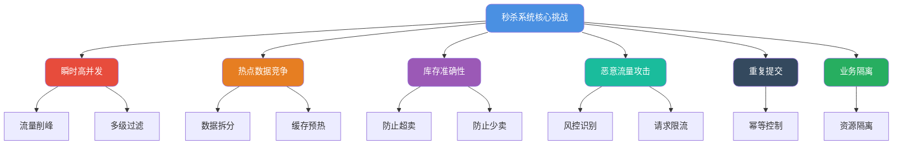
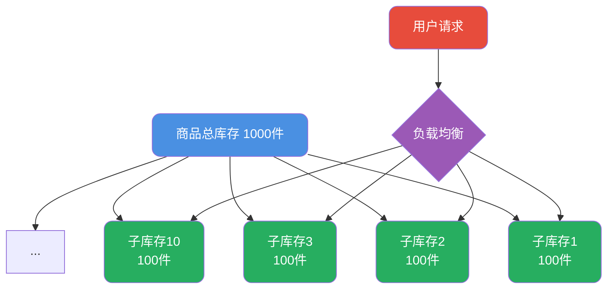
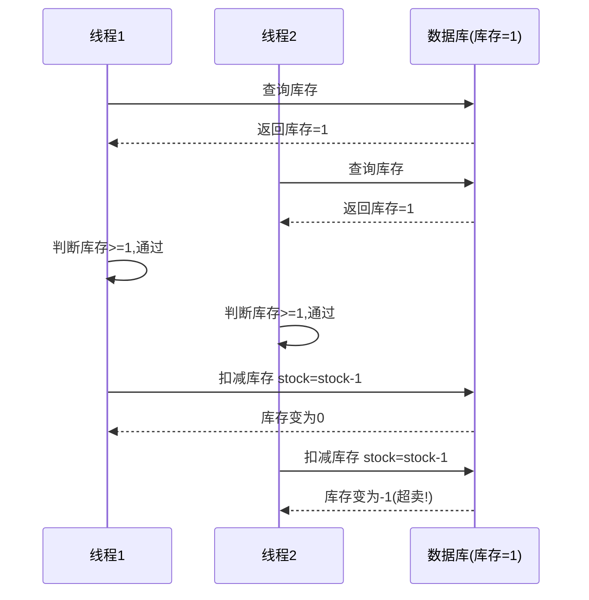
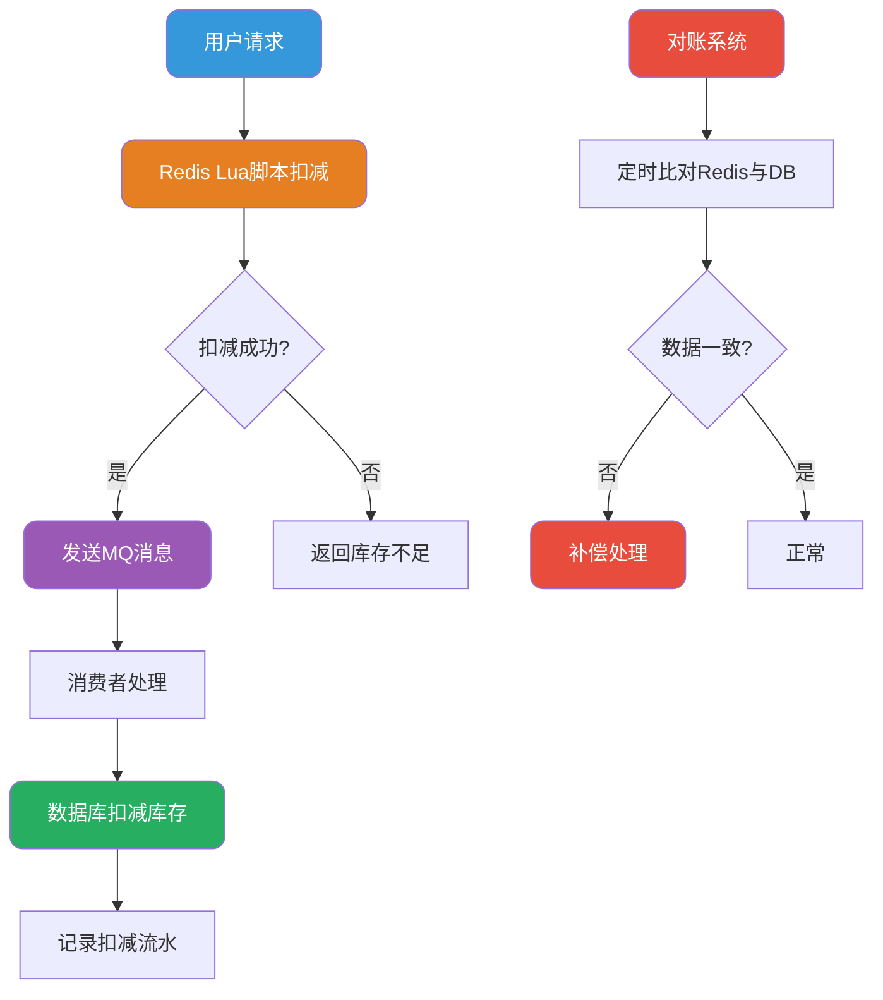
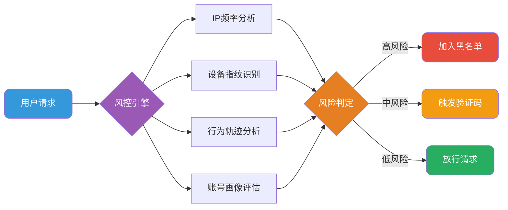
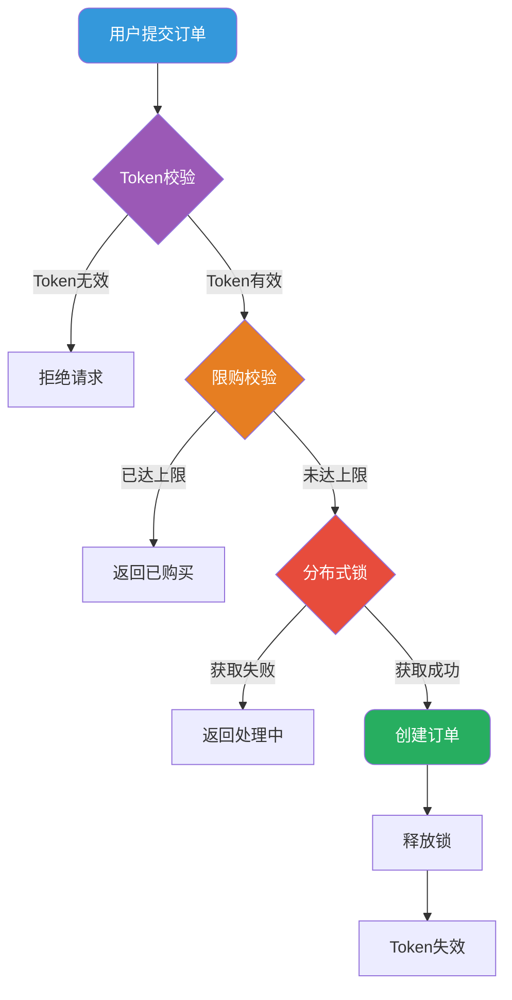

# 秒杀系统架构与库存扣减设计

## 秒杀系统核心挑战分析

秒杀活动是电商系统中极具技术挑战性的业务场景，它将大量用户请求集中在极短的时间窗口内释放，对系统的承载能力形成巨大冲击。要构建一个健壮的秒杀系统，首先需要明确它面临的核心技术问题：



## 流量层层过滤架构

### 整体架构设计思路

秒杀系统架构的核心理念是**逐层削减流量**，让绝大多数请求在到达核心服务之前就被过滤掉。一次用户请求从发起到最终处理，需要经过多个节点，每一层都承担着流量筛选的职责。

```mermaid
graph LR
    subgraph 用户层
        A[用户请求]
    end
    
    subgraph 接入层
        B[CDN静态资源]
        C[Nginx负载均衡]
    end
    
    subgraph 应用层
        D[网关限流]
        E[业务校验]
    end
    
    subgraph 缓存层
        F[本地缓存]
        G[Redis集群]
    end
    
    subgraph 数据层
        H[(数据库)]
    end
    
    A -->|100万QPS| B
    B -->|50万QPS| C
    C -->|10万QPS| D
    D -->|1万QPS| E
    E -->|5000QPS| F
    F -->|2000QPS| G
    G -->|500QPS| H
    
    style A fill:#E74C3C,color:#fff,rx:10,ry:10
    style B fill:#3498DB,color:#fff,rx:10,ry:10
    style C fill:#3498DB,color:#fff,rx:10,ry:10
    style D fill:#9B59B6,color:#fff,rx:10,ry:10
    style E fill:#9B59B6,color:#fff,rx:10,ry:10
    style F fill:#E67E22,color:#fff,rx:10,ry:10
    style G fill:#E67E22,color:#fff,rx:10,ry:10
    style H fill:#27AE60,color:#fff,rx:10,ry:10
```



### 各层过滤策略详解

**客户端层过滤**：在前端页面中加入随机丢弃逻辑，当检测到服务端压力过大时，部分请求直接在客户端返回"系统繁忙"提示，引导用户稍后重试。

**CDN与静态资源**：秒杀页面的静态资源（HTML、CSS、JS、图片等）提前推送至CDN节点，用户访问时直接从就近的CDN节点获取，大幅降低源站压力。

**Nginx接入层**：配置IP限流规则、黑白名单、请求频率控制等策略。例如限制单个IP每秒最多发起5次请求，超出则直接拒绝。

**应用网关层**：基于Sentinel等限流组件实现动态限流，可根据系统负载实时调整限流阈值。同时进行业务层面的校验，如用户登录状态、活动时间窗口等。

**缓存层**：将商品信息、库存数据等热点数据预加载到本地缓存和Redis中。本地缓存（如Caffeine）响应速度更快，适合存储读多写少的数据。

## 热点数据处理策略

秒杀商品天然就是热点数据，所有用户都在抢购同一件商品，这会导致该商品的读写请求高度集中。

### 数据拆分策略

将单个热点商品的库存拆分成多个子库存，分散到不同的缓存节点上。例如1000件商品可以拆分为10个子库存，每个子库存100件，用户请求被均匀路由到不同的子库存上进行扣减。



### 多级缓存预热

秒杀活动开始前，需要将热点数据提前加载到各级缓存中：

1. **Redis预热**：将商品详情、库存数量等数据写入Redis集群
2. **本地缓存预热**：应用启动时或定时任务将热点数据加载到本地缓存
3. **多副本部署**：对于Redis热Key，可以在不同的Redis节点上创建多个副本

## 库存扣减核心设计

库存扣减是秒杀系统中最关键的环节，必须同时满足**原子性**和**有序性**两个要求，否则会导致超卖或少卖问题。

### 超卖问题根源分析

超卖是指商品实际销售数量超过了可售库存。以下场景展示了超卖是如何发生的：



两个并发线程同时查询到库存为1，都通过了库存校验，最终导致库存被扣减为负数。

### 数据库层面解决方案

最直接的解决思路是在数据库扣减时增加库存校验条件：

```sql
-- 会员权益扣减示例
UPDATE member_quota 
SET remaining_times = remaining_times - #{deductCount} 
WHERE member_id = '#{memberId}' 
  AND quota_type = '#{quotaType}'
  AND remaining_times >= #{deductCount}
```

这条SQL利用数据库的行级锁和原子操作特性，只有当剩余次数足够时才会执行扣减。如果扣减失败（影响行数为0），说明库存不足。

但这种方案在高并发下存在严重性能瓶颈：

- 多线程同时更新同一行数据时会产生锁竞争
- MySQL单行热点更新QPS通常不超过300
- 大量请求排队等待锁释放，可能导致数据库连接池耗尽

### Redis + Lua脚本解决方案

更优的方案是将库存扣减操作放到Redis中执行，利用Redis单线程特性和Lua脚本的原子性保证：

```lua
-- 会员积分扣减脚本
local memberKey = KEYS[1]
local deductPoints = tonumber(ARGV[1])

-- 获取当前积分余额
local currentPoints = tonumber(redis.call('GET', memberKey))

if currentPoints == nil then
    return "MEMBER_NOT_FOUND"
end

-- 判断积分是否充足
if currentPoints >= deductPoints then
    -- 执行积分扣减
    redis.call('DECRBY', memberKey, deductPoints)
    return redis.call('GET', memberKey)
else
    return "INSUFFICIENT_POINTS"
end
```

Lua脚本在Redis中以原子方式执行，中间不会被其他命令打断，完美解决了并发扣减问题。

### 数据一致性保障

实际生产环境中，通常采用Redis扣减+数据库持久化的组合方案：



整个流程分为三个阶段：

1. **Redis快速扣减**：利用Redis高性能特性承接高并发流量
2. **异步持久化**：通过MQ异步将扣减操作同步到数据库
3. **对账补偿**：定时任务比对Redis和数据库数据，发现不一致则进行补偿

### 少卖问题及对策

少卖是指因系统异常导致实际销售数量少于应售数量。典型场景是Redis扣减成功，但后续MQ消息丢失或消费失败，导致数据库库存未扣减。

解决方案：

1. **流水记录**：每次Redis扣减时同步记录到ZSet中，包含业务单号和时间戳
2. **定时对账**：扫描一段时间内的扣减流水，与数据库实际扣减记录比对
3. **补偿机制**：发现不一致时，根据业务规则进行库存回补或告警

## 库存增加设计

秒杀过程中可能需要临时追加库存，其设计思路与库存扣减类似：

```lua
-- 库存追加脚本
local itemKey = KEYS[1]
local addQuantity = tonumber(ARGV[1])

-- 直接增加库存
redis.call('INCRBY', itemKey, addQuantity)
return redis.call('GET', itemKey)
```

库存增加相对简单，因为不存在"透支"风险。但需要注意：

- 增加操作同样需要异步同步到数据库
- 需要做好表单防重，避免重复提交导致库存多加
- 如果业务需要"设置为某个值"而非"增加多少"，需要先计算差值

## 恶意流量防护

### 黄牛识别与拦截

秒杀商品往往存在价差，吸引黄牛使用脚本批量抢购。防护策略包括：



**黑名单机制**：将风控引擎识别出的高风险用户ID、IP地址、设备标识加入黑名单，在Nginx层和应用层进行双重过滤。

**多维限流**：基于用户ID、IP、设备等多个维度进行限流。例如限制单个用户每分钟最多下单1次，单个IP每分钟最多发起10次请求。

### Token防刷机制

为防止脚本绕过前端直接调用接口，可以引入Token校验：

1. 用户访问秒杀页面时，服务端生成一个一次性Token返回给前端
2. 用户提交秒杀请求时必须携带该Token
3. 服务端校验Token有效性，校验通过后立即使Token失效
4. Token不合法或已失效则直接拒绝请求

## 重复下单防护

用户在秒杀时可能因网络延迟、页面卡顿等原因多次点击提交按钮，需要防止重复下单。

### 多层幂等控制



1. **Token一次性校验**：同一个Token只能使用一次
2. **限购规则校验**：检查用户是否已有在途订单或已达到购买上限
3. **分布式锁控制**：使用Redis分布式锁，同一用户同一商品同时只能有一个请求在处理

## 业务隔离策略

秒杀流量可能冲击到其他正常业务，需要进行隔离保护：

### 物理隔离

- 秒杀服务独立部署，使用独立的服务器集群
- 秒杀数据库独立部署，与主业务库分离
- Redis集群独立部署，避免热Key影响其他业务缓存

### 逻辑隔离

- 秒杀订单打标，便于后续统计分析和问题排查
- 独立的订单处理流程，可采用不同的风控和校验策略
- 单独的监控告警体系

## 业务层面优化手段

技术方案并非解决所有问题的唯一途径，合理的业务设计同样能大幅降低技术复杂度：

1. **预约机制**：用户需要提前预约才能参与秒杀，有效控制参与人数
2. **分批开抢**：将商品分多个时段开放抢购，分散瞬时流量
3. **验证码/答题**：秒杀前增加验证环节，既能防脚本又能错峰
4. **预售模式**：先付定金后付尾款，将流量分散到多个时间点
5. **限购策略**：每人限购N件，减少单用户的请求次数

这些业务手段在不影响用户体验的前提下，能够显著降低系统压力，使技术方案更加简洁可靠。
