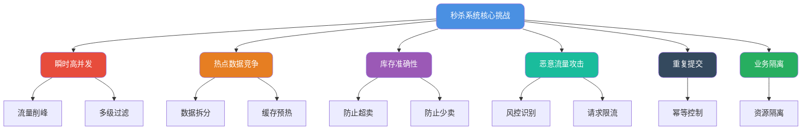
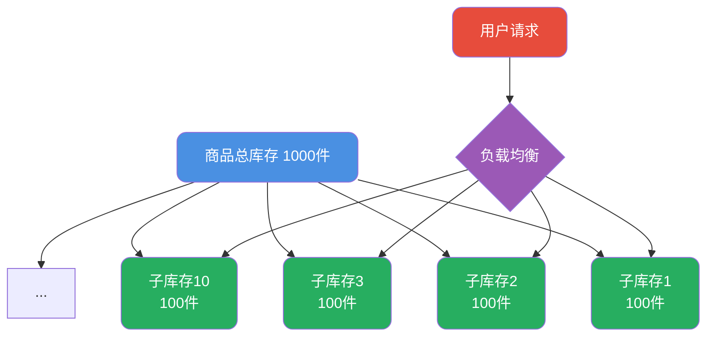

import PaidCTA from '@site/src/components/PaidCTA';

# 秒杀系统架构与库存扣减设计

## 秒杀系统核心挑战分析

秒杀活动是电商系统中极具技术挑战性的业务场景，它将大量用户请求集中在极短的时间窗口内释放，对系统的承载能力形成巨大冲击。要构建一个健壮的秒杀系统，首先需要明确它面临的核心技术问题：

## 流量层层过滤架构

### 整体架构设计思路

秒杀系统架构的核心理念是**逐层削减流量**，让绝大多数请求在到达核心服务之前就被过滤掉。一次用户请求从发起到最终处理，需要经过多个节点，每一层都承担着流量筛选的职责。

```mermaid
graph LR
    subgraph 用户层
        A[用户请求]
    end
    
    subgraph 接入层
        B[CDN静态资源]
        C[Nginx负载均衡]
    end
    
    subgraph 应用层
        D[网关限流]
        E[业务校验]
    end
    
    subgraph 缓存层
        F[本地缓存]
        G[Redis集群]
    end
    
    subgraph 数据层
        H[(数据库)]
    end
    
    A -->|100万QPS| B
    B -->|50万QPS| C
    C -->|10万QPS| D
    D -->|1万QPS| E
    E -->|5000QPS| F
    F -->|2000QPS| G
    G -->|500QPS| H
    
    style A fill:#E74C3C,color:#fff,rx:10,ry:10
    style B fill:#3498DB,color:#fff,rx:10,ry:10
    style C fill:#3498DB,color:#fff,rx:10,ry:10
    style D fill:#9B59B6,color:#fff,rx:10,ry:10
    style E fill:#9B59B6,color:#fff,rx:10,ry:10
    style F fill:#E67E22,color:#fff,rx:10,ry:10
    style G fill:#E67E22,color:#fff,rx:10,ry:10
    style H fill:#27AE60,color:#fff,rx:10,ry:10
```

### 各层过滤策略详解

**客户端层过滤**：在前端页面中加入随机丢弃逻辑，当检测到服务端压力过大时，部分请求直接在客户端返回"系统繁忙"提示，引导用户稍后重试。

**CDN与静态资源**：秒杀页面的静态资源（HTML、CSS、JS、图片等）提前推送至CDN节点，用户访问时直接从就近的CDN节点获取，大幅降低源站压力。

**Nginx接入层**：配置IP限流规则、黑白名单、请求频率控制等策略。例如限制单个IP每秒最多发起5次请求，超出则直接拒绝。

**应用网关层**：基于Sentinel等限流组件实现动态限流，可根据系统负载实时调整限流阈值。同时进行业务层面的校验，如用户登录状态、活动时间窗口等。

**缓存层**：将商品信息、库存数据等热点数据预加载到本地缓存和Redis中。本地缓存（如Caffeine）响应速度更快，适合存储读多写少的数据。

## 热点数据处理策略

秒杀商品天然就是热点数据，所有用户都在抢购同一件商品，这会导致该商品的读写请求高度集中。

### 数据拆分策略

将单个热点商品的库存拆分成多个子库存，分散到不同的缓存节点上。例如1000件商品可以拆分为10个子库存，每个子库存100件，用户请求被均匀路由到不同的子库存上进行扣减。

### 多级缓存预热

秒杀活动开始前，需要将热点数据提前加载到各级缓存中：

1. **Redis预热**：将商品详情、库存数量等数据写入Redis集群
2. **本地缓存预热**：应用启动时或定时任务将热点数据加载到本地缓存
3. **多副本部署**：对于Redis热Key，可以在不同的Redis节点上创建多个副本

## 库存扣减核心设计

库存扣减是秒杀系统中最关键的环节，必须同时满足**原子性**和**有序性**两个要求，否则会导致超卖或少卖问题。

### 超卖问题根源分析

超卖是指商品实际销售数量超过了可售库存。以下场景展示了超卖是如何发生的：

<PaidCTA />