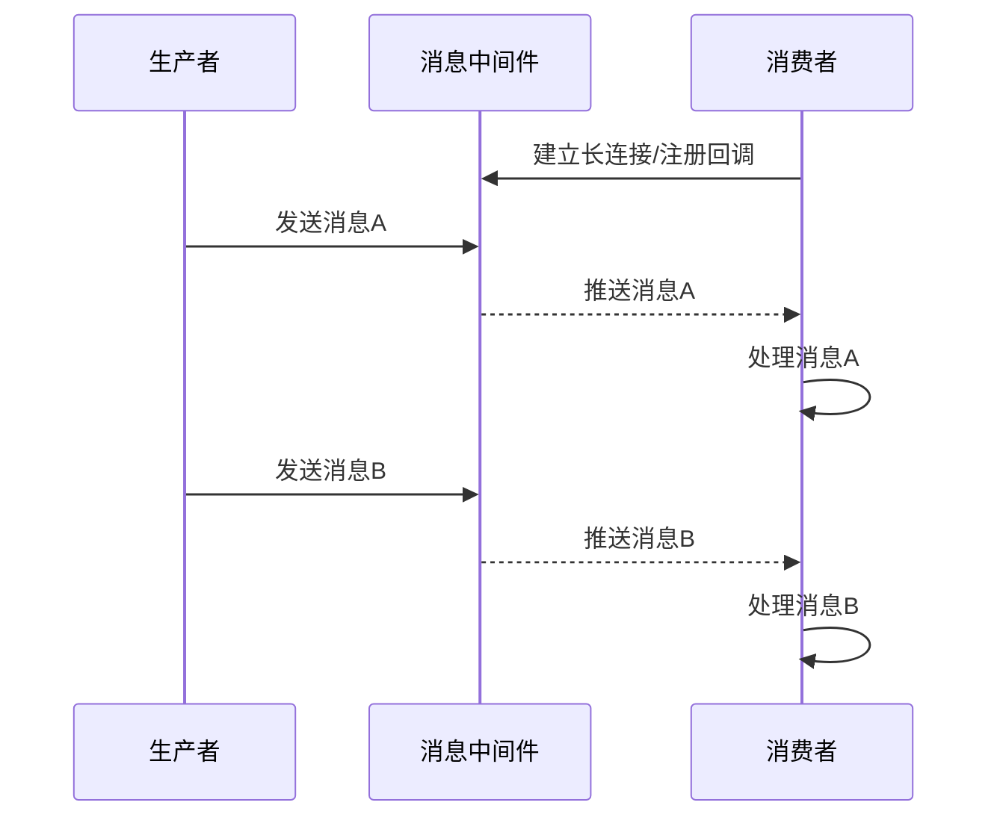
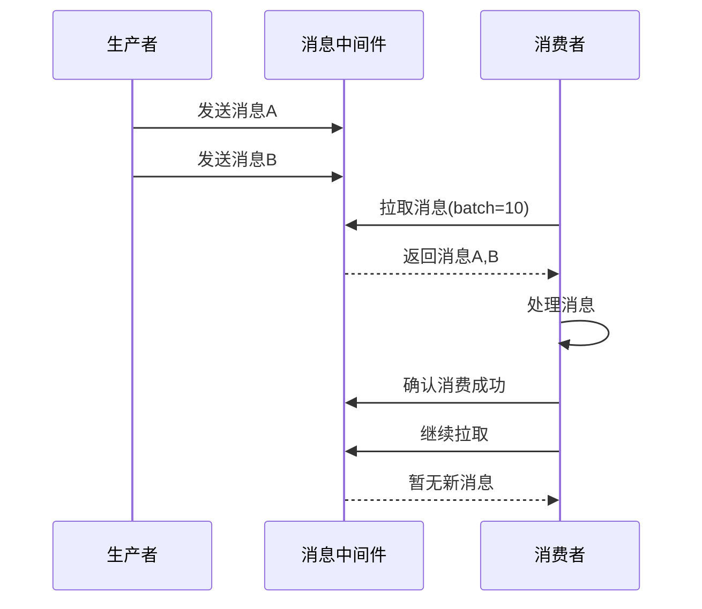
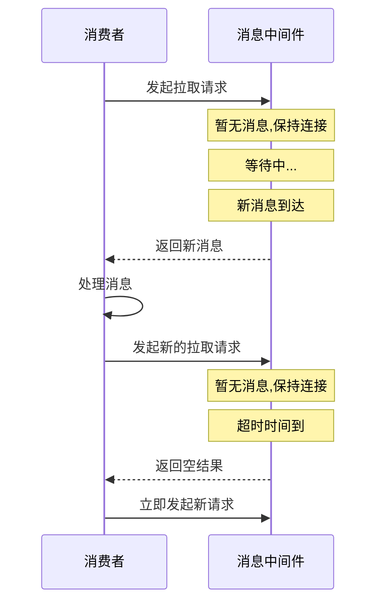
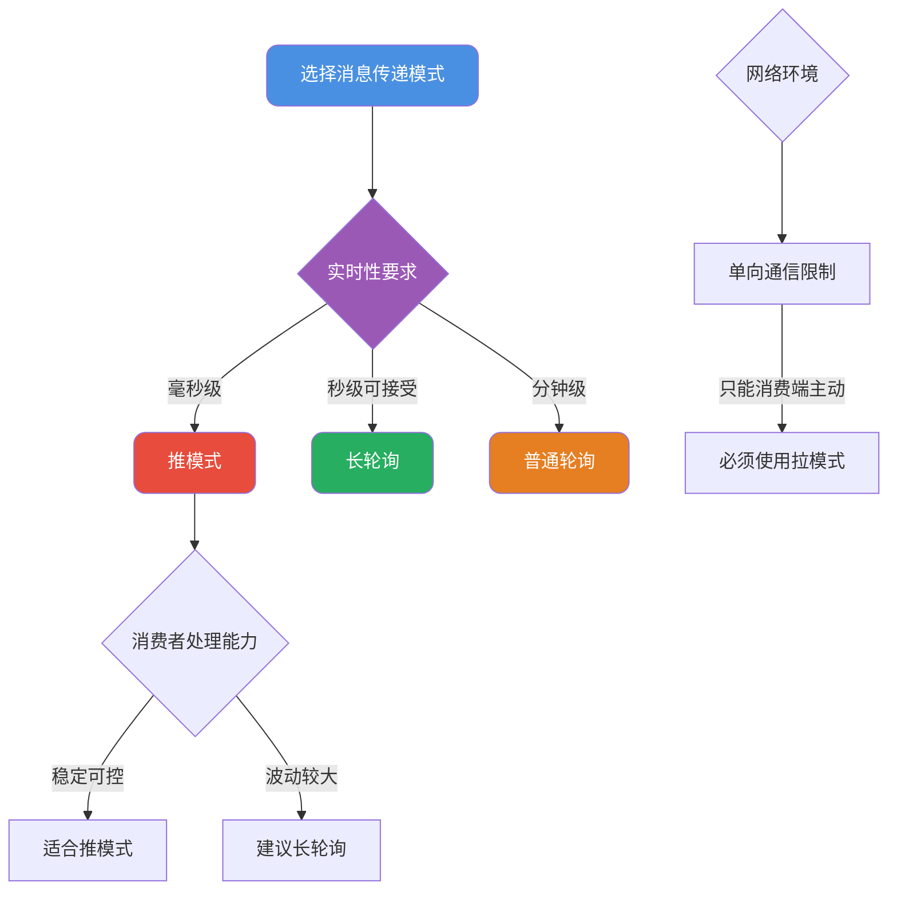

import PaidCTA from '@site/src/components/PaidCTA';

# 消息队列设计与消息乱序处理

## 消息传递模式选择

消息队列作为分布式系统中的核心组件，其消息传递方式直接影响着系统的实时性、稳定性和复杂度。主流的消息传递模式分为 **推模式（Push）** 和 **拉模式（Pull）** 两种。

### 推模式工作原理

推模式下，消费者与消息中间件建立长连接或注册回调函数。当有新消息到达时，中间件主动将消息推送给消费者。

**优势分析**：
- 消息实时性高，生产者发送后消费者立即感知
- 消费者实现简单，只需等待推送即可
- 无需轮询，降低消费者端资源消耗

**潜在风险**：
- 若生产速率远超消费速率，消息会在消费者端大量堆积
- 消费者处理能力不足时可能被压垮
- 消费者宕机期间的消息可能丢失

### 拉模式工作原理

拉模式下，消费者主动向消息中间件发起请求，拉取待消费的消息。消费者完全掌控消息拉取的时机和数量。

**优势分析**：
- 消费者自主控制消费速率，不会被压垮
- 便于实现消费端的流量控制和背压机制
- 消费者宕机恢复后可以继续拉取未消费的消息

**潜在风险**：
- 消息实时性较差，取决于轮询间隔
- 频繁轮询会对中间件造成压力
- 轮询间隔设置不当可能导致消息延迟

### 长轮询模式

长轮询是对拉模式的优化，兼顾了推模式的实时性和拉模式的可控性。

工作流程：
1. 消费者发起拉取请求
2. 若有消息则立即返回
3. 若无消息，连接保持一段时间（如30秒）
4. 在等待期间有新消息到达则立即返回
5. 超时后返回空结果，消费者重新发起请求

Kafka和RocketMQ都支持长轮询机制，这是生产环境中最常用的消费模式。

### 模式选择建议

## 消息乱序问题深度解析

### 乱序产生的根源

消息乱序是指消费者接收到的消息顺序与生产者发送顺序不一致。这在分布式消息系统中是一个普遍存在的问题。

<PaidCTA />