# 消息队列设计与消息乱序处理

## 消息传递模式选择

消息队列作为分布式系统中的核心组件，其消息传递方式直接影响着系统的实时性、稳定性和复杂度。主流的消息传递模式分为 **推模式（Push）** 和 **拉模式（Pull）** 两种。

### 推模式工作原理

推模式下，消费者与消息中间件建立长连接或注册回调函数。当有新消息到达时，中间件主动将消息推送给消费者。


**优势分析**：
- 消息实时性高，生产者发送后消费者立即感知
- 消费者实现简单，只需等待推送即可
- 无需轮询，降低消费者端资源消耗

**潜在风险**：
- 若生产速率远超消费速率，消息会在消费者端大量堆积
- 消费者处理能力不足时可能被压垮
- 消费者宕机期间的消息可能丢失

### 拉模式工作原理

拉模式下，消费者主动向消息中间件发起请求，拉取待消费的消息。消费者完全掌控消息拉取的时机和数量。


**优势分析**：
- 消费者自主控制消费速率，不会被压垮
- 便于实现消费端的流量控制和背压机制
- 消费者宕机恢复后可以继续拉取未消费的消息

**潜在风险**：
- 消息实时性较差，取决于轮询间隔
- 频繁轮询会对中间件造成压力
- 轮询间隔设置不当可能导致消息延迟

### 长轮询模式

长轮询是对拉模式的优化，兼顾了推模式的实时性和拉模式的可控性。


工作流程：
1. 消费者发起拉取请求
2. 若有消息则立即返回
3. 若无消息，连接保持一段时间（如30秒）
4. 在等待期间有新消息到达则立即返回
5. 超时后返回空结果，消费者重新发起请求

Kafka和RocketMQ都支持长轮询机制，这是生产环境中最常用的消费模式。

### 模式选择建议


## 消息乱序问题深度解析

### 乱序产生的根源

消息乱序是指消费者接收到的消息顺序与生产者发送顺序不一致。这在分布式消息系统中是一个普遍存在的问题。

以会员升级流程为例：用户完成任务后，系统需要依次处理"积分增加"和"等级提升"两个消息。正常流程下，应该先增加积分，再根据积分判断是否升级。


乱序产生的常见原因：

1. **网络延迟差异**：不同消息经过不同网络路径，到达时间不同
2. **分区路由不同**：消息被投递到不同分区，由不同消费者处理
3. **消费者处理速度差异**：同一分区的消息被多个消费者并行处理
4. **重试机制影响**：早期消息处理失败进入重试队列，后续消息先被处理

### 解决方案一：顺序消息

对于存在严格顺序依赖的业务消息，可以使用消息队列的顺序消息特性。


实现要点：
- 使用业务唯一标识（如会员ID）作为分区键
- 确保相关消息被路由到同一分区
- 该分区只分配一个消费者实例
- 消费者内部串行处理消息

### 解决方案二：前置状态校验

在消息体中携带前置状态信息，消费者处理前先校验当前状态是否匹配。

```java
// 积分变动消息结构
public class PointsChangeEvent {
    private String memberId;           // 会员ID
    private String eventId;            // 事件唯一ID
    private String expectedStatus;     // 期望的前置状态
    private String targetStatus;       // 处理后的目标状态
    private Integer pointsChange;      // 积分变动值
}

// 消费者处理逻辑
public void handlePointsChange(PointsChangeEvent event) {
    // 获取会员当前状态
    String currentStatus = memberService.getStatus(event.getMemberId());
    
    // 校验前置状态
    if (!event.getExpectedStatus().equals(currentStatus)) {
        // 状态不匹配，消息暂时无法处理，抛出异常等待重试
        throw new IllegalStateException("前置状态不匹配，等待重试");
    }
    
    // 状态匹配，执行业务逻辑
    memberService.updatePoints(event.getMemberId(), event.getPointsChange());
    memberService.updateStatus(event.getMemberId(), event.getTargetStatus());
}
```

这个方案有两个前提条件：
1. 消息处理能够推进业务状态变化
2. 状态变化是单向的，不会出现回退

### 解决方案三：序列号重排

在消息中添加递增序列号，消费者端根据序列号进行重新排序。


这个方案需要在消费者端维护缓冲区，增加了系统复杂度，且需要合理设置超时时间来处理丢失的消息。

### 解决方案四：本地事件表模式

这是一种更加健壮的方案，将消息先持久化到本地数据库，再进行处理。

```mermaid
graph TD
    A[接收MQ消息] --> B{幂等校验}
    B -->|已处理| C[直接返回成功]
    B -->|未处理| D[转换为本地事件]
    D --> E[保存到事件表<br/>状态:待处理]
    E --> F[返回消费成功]
    F --> G[异步线程处理事件]
    G --> H{处理成功?}
    H -->|是| I[更新状态:已完成]
    H -->|否| J[更新重试次数+1]
    
    K[定时任务] --> L[扫描待处理事件]
    L --> M[按业务键分组排序]
    M --> N[依次重试处理]
    
    style A fill:#4A90E2,color:#fff,rx:10,ry:10
    style E fill:#27AE60,color:#fff,rx:10,ry:10
    style F fill:#27AE60,color:#fff,rx:10,ry:10
    style K fill:#9B59B6,color:#fff,rx:10,ry:10
    style I fill:#27AE60,color:#fff,rx:10,ry:10
    style J fill:#E67E22,color:#fff,rx:10,ry:10
```



事件表结构设计：

```sql
CREATE TABLE local_event (
    id BIGINT PRIMARY KEY AUTO_INCREMENT,
    event_id VARCHAR(64) NOT NULL COMMENT '事件唯一ID',
    business_key VARCHAR(64) NOT NULL COMMENT '业务键,如会员ID',
    event_type VARCHAR(32) NOT NULL COMMENT '事件类型',
    event_body TEXT NOT NULL COMMENT '事件内容JSON',
    sequence_no INT NOT NULL COMMENT '序列号',
    status VARCHAR(16) NOT NULL COMMENT '状态:PENDING/PROCESSING/COMPLETED/FAILED',
    retry_count INT DEFAULT 0 COMMENT '重试次数',
    create_time DATETIME NOT NULL,
    update_time DATETIME NOT NULL,
    INDEX idx_business_status (business_key, status),
    INDEX idx_status_create (status, create_time)
) COMMENT '本地事件表';
```

### 进一步优化：Redis加速触发

为减少定时任务的延迟，可以结合Redis实现快速触发：


当新消息处理成功时，主动检查Redis中是否有同一业务键的待处理事件，有则触发处理，实现了"后到的消息拉动先到消息处理"的效果。

## 消息顺序性保障最佳实践

### 生产端设计原则

```java
// 消息生产者示例
public class OrderEventProducer {
    
    @Autowired
    private RocketMQTemplate rocketMQTemplate;
    
    /**
     * 发送订单状态变更消息
     * 使用订单ID作为分区键，确保同一订单的消息进入同一队列
     */
    public void sendOrderEvent(OrderEvent event) {
        String topic = "order-status-topic";
        String orderId = event.getOrderId();
        
        // 使用订单ID的hashCode选择队列
        rocketMQTemplate.syncSendOrderly(
            topic,
            event,
            orderId  // 分区键
        );
    }
}
```

### 消费端设计原则

1. **单线程消费**：对于需要严格顺序的队列，消费者采用单线程处理
2. **处理超时控制**：设置合理的处理超时时间，避免单条消息阻塞队列
3. **失败处理策略**：制定清晰的失败重试和降级策略

```java
// 消费者配置示例
@RocketMQMessageListener(
    topic = "order-status-topic",
    consumerGroup = "order-consumer-group",
    consumeMode = ConsumeMode.ORDERLY  // 顺序消费模式
)
public class OrderEventConsumer implements RocketMQListener<OrderEvent> {
    
    @Override
    public void onMessage(OrderEvent event) {
        // 处理订单事件
        processOrderEvent(event);
    }
}
```

### 监控与告警

建立完善的消息顺序性监控：

1. **消息延迟监控**：监控消息从发送到消费的延迟时间
2. **乱序检测**：定期抽样检查消息处理顺序是否正确
3. **重试次数监控**：监控因顺序问题导致的重试次数
4. **事件积压告警**：监控本地事件表的待处理事件数量
