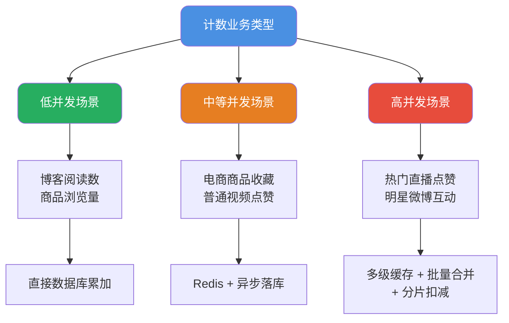
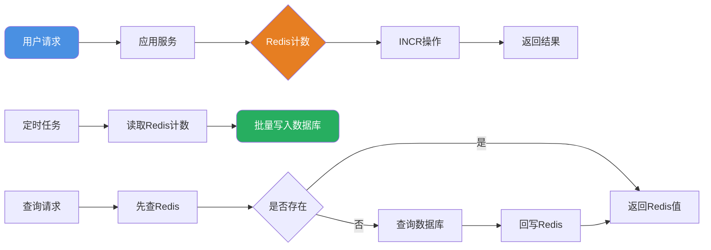
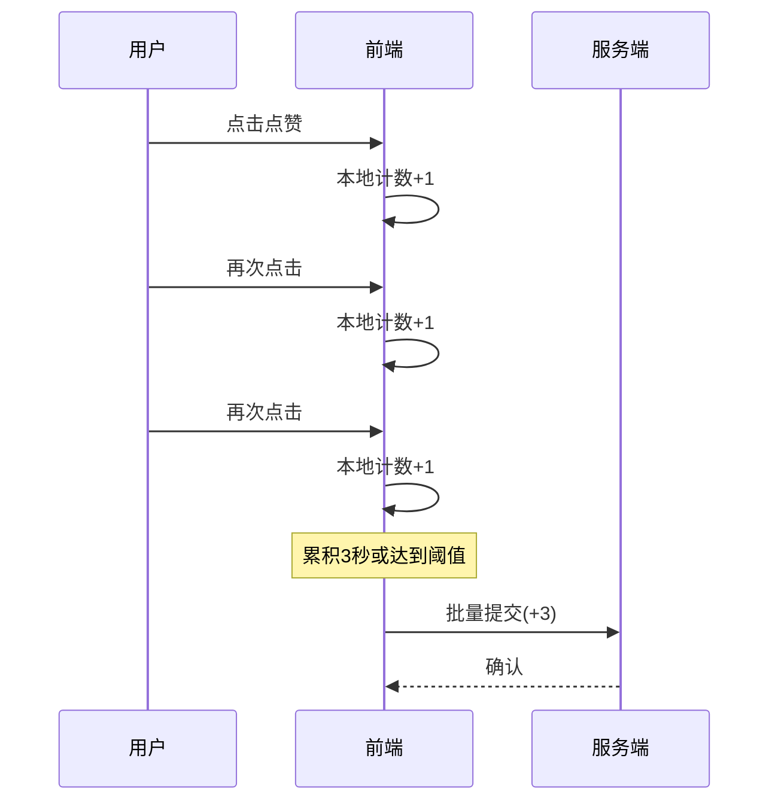
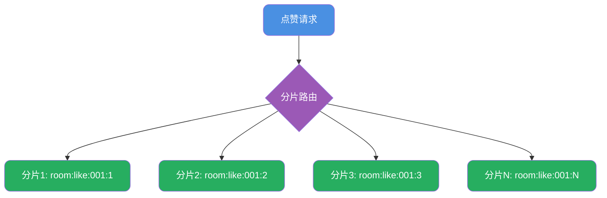
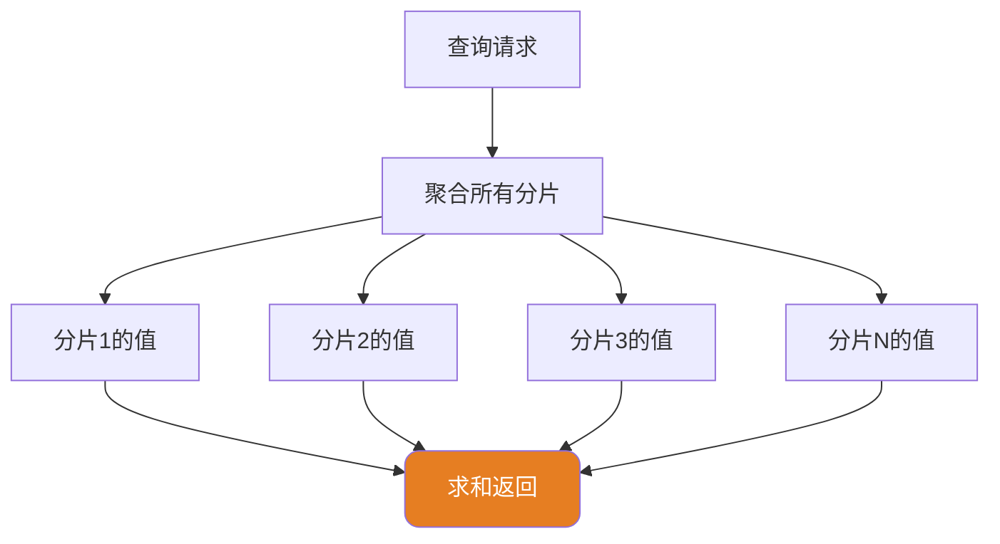
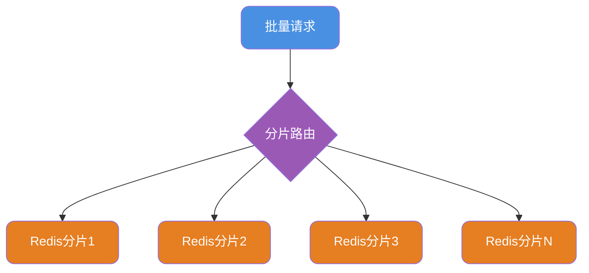
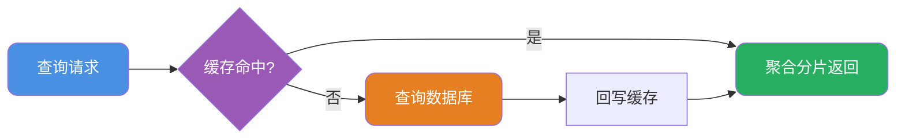

# 高并发计数系统设计

## 计数业务特性分析

计数功能在互联网应用中随处可见：文章阅读数、视频播放量、商品收藏数、社交点赞数等。这类业务看似简单，但在高并发场景下却面临着严峻的技术挑战。

### 业务复杂度分级

不同业务场景对计数系统的要求差异很大：



### 核心技术难点

高并发计数的本质是**热点数据更新问题**。当百万用户同时对同一个内容进行点赞操作时，所有请求都指向同一条数据记录，这就形成了典型的热点写入。

主要挑战：
1. **数据库锁竞争**：大量并发UPDATE语句对同一行加锁，导致请求排队
2. **连接池耗尽**：等待锁释放的请求占用数据库连接，可能导致连接池枯竭
3. **数据准确性**：高并发下如何保证计数的最终准确性
4. **系统稳定性**：避免计数服务异常影响核心业务

## 基础方案：数据库直接累加

对于日均访问量在万级以下的低并发场景，直接使用数据库累加是最简单有效的方案。

```sql
-- 文章阅读数累加
UPDATE article_stats 
SET view_count = view_count + 1 
WHERE article_id = #{articleId};
```

数据库通过行级锁保证了并发更新的安全性，实现简单且数据可靠。

**适用边界**：
- QPS < 100 的一般业务场景
- 对响应延迟要求不高
- 数据一致性要求高于性能

## 进阶方案：Redis缓存层

当并发量提升到每秒数百甚至上千时，数据库已经无法承受压力。此时需要引入Redis作为缓存层。

### 基本架构



### 实现要点

利用Redis的INCR命令实现原子计数：

```java
@Service
public class ArticleCounterService {
    
    @Autowired
    private StringRedisTemplate redisTemplate;
    
    private static final String COUNT_KEY_PREFIX = "article:view:";
    
    /**
     * 增加阅读计数
     */
    public Long incrementViewCount(String articleId) {
        String key = COUNT_KEY_PREFIX + articleId;
        return redisTemplate.opsForValue().increment(key);
    }
    
    /**
     * 获取阅读计数
     */
    public Long getViewCount(String articleId) {
        String key = COUNT_KEY_PREFIX + articleId;
        String value = redisTemplate.opsForValue().get(key);
        if (value != null) {
            return Long.parseLong(value);
        }
        
        // 缓存未命中，从数据库加载
        Long dbCount = articleStatsMapper.getViewCount(articleId);
        redisTemplate.opsForValue().set(key, String.valueOf(dbCount));
        return dbCount;
    }
}
```

### 数据同步策略

Redis中的计数数据需要定期同步到数据库进行持久化：

```java
@Scheduled(fixedRate = 60000) // 每分钟执行
public void syncCountToDatabase() {
    // 获取所有需要同步的计数key
    Set<String> keys = redisTemplate.keys(COUNT_KEY_PREFIX + "*");
    
    for (String key : keys) {
        String articleId = key.replace(COUNT_KEY_PREFIX, "");
        String countStr = redisTemplate.opsForValue().get(key);
        
        if (countStr != null) {
            Long count = Long.parseLong(countStr);
            // 更新到数据库
            articleStatsMapper.updateViewCount(articleId, count);
        }
    }
}
```

## 高级方案：批量合并技术

对于超高并发场景（如热门直播间点赞），即使Redis也可能面临压力。此时可以在客户端和服务端同时引入批量合并机制。

### 客户端批量合并

用户在短时间内可能多次点击点赞按钮，前端可以将这些点击合并后再发送到服务端：



前端伪代码示例：

```javascript
class LikeCounter {
    constructor(roomId) {
        this.roomId = roomId;
        this.pendingCount = 0;
        this.timer = null;
    }
    
    // 用户点击点赞
    onLike() {
        this.pendingCount++;
        this.updateUI();
        
        // 防抖：3秒后或累积100次时提交
        if (!this.timer) {
            this.timer = setTimeout(() => this.flush(), 3000);
        }
        
        if (this.pendingCount >= 100) {
            this.flush();
        }
    }
    
    // 批量提交到服务端
    async flush() {
        if (this.pendingCount === 0) return;
        
        const count = this.pendingCount;
        this.pendingCount = 0;
        clearTimeout(this.timer);
        this.timer = null;
        
        await api.batchLike(this.roomId, count);
    }
}
```

### 服务端批量合并

服务端同样可以将短时间内的请求合并处理：

```java
@Service
public class BatchLikeService {
    
    // 使用ConcurrentHashMap暂存待提交的点赞数
    private ConcurrentHashMap<String, AtomicLong> pendingLikes = new ConcurrentHashMap<>();
    
    /**
     * 接收点赞请求，先暂存
     */
    public void addLike(String roomId, int count) {
        pendingLikes.computeIfAbsent(roomId, k -> new AtomicLong(0))
                    .addAndGet(count);
    }
    
    /**
     * 定时批量提交到Redis
     */
    @Scheduled(fixedRate = 1000) // 每秒执行
    public void flushToRedis() {
        // 获取并清空待处理数据
        Map<String, AtomicLong> toProcess = new HashMap<>(pendingLikes);
        pendingLikes.clear();
        
        // 批量更新到Redis
        toProcess.forEach((roomId, count) -> {
            if (count.get() > 0) {
                redisTemplate.opsForValue()
                    .increment("room:like:" + roomId, count.get());
            }
        });
    }
}
```

## 极致方案：分片计数

对于微博热搜、顶流直播这种极端场景，单个Redis Key也可能成为瓶颈。此时需要采用分片策略。

### 分片架构设计





### 分片实现

```java
@Service
public class ShardedLikeService {
    
    private static final int SHARD_COUNT = 10;
    private static final String KEY_PATTERN = "room:like:%s:%d";
    
    @Autowired
    private StringRedisTemplate redisTemplate;
    
    /**
     * 增加点赞数（随机选择分片）
     */
    public void addLike(String roomId, int count) {
        // 随机选择一个分片
        int shardIndex = ThreadLocalRandom.current().nextInt(SHARD_COUNT);
        String key = String.format(KEY_PATTERN, roomId, shardIndex);
        
        redisTemplate.opsForValue().increment(key, count);
    }
    
    /**
     * 获取总点赞数（聚合所有分片）
     */
    public Long getTotalLikes(String roomId) {
        long total = 0;
        
        // 构建所有分片的key
        List<String> keys = new ArrayList<>();
        for (int i = 0; i < SHARD_COUNT; i++) {
            keys.add(String.format(KEY_PATTERN, roomId, i));
        }
        
        // 批量获取所有分片的值
        List<String> values = redisTemplate.opsForValue().multiGet(keys);
        
        for (String value : values) {
            if (value != null) {
                total += Long.parseLong(value);
            }
        }
        
        return total;
    }
}
```

### 分片策略优化

简单随机分片可能导致分片不均匀，可以采用更智能的策略：

1. **轮询分片**：按请求序号轮询选择分片，保证绝对均匀
2. **一致性哈希**：根据用户ID哈希选择分片，便于统计用户点赞记录
3. **动态分片**：根据流量动态调整分片数量

## 完整架构：多层协同

将上述所有技术整合，构建一个高性能计数系统：

### 写入流程

**客户端与应用层**：用户点击在本地累积，批量提交到服务端暂存后定时刷入缓存。


**缓存层分片**：请求通过分片路由分散到多个Redis节点。



### 持久化流程

定时任务聚合各分片数据，批量写入数据库进行持久化存储。


### 查询流程

优先查询缓存，未命中时查询数据库并回写缓存。



## 数据一致性考量

### 对精确度的容忍

计数业务通常不需要绝对精确。以直播点赞为例，用户看到的是"128.5万"而非"1285647"，允许存在一定误差：

- 客户端批量合并可能因页面关闭而丢失
- Redis数据落库存在延迟
- 分片聚合存在短暂不一致

这些在业务层面都是可以接受的，只要保证**最终一致性**即可。

### 异常恢复机制

需要考虑Redis故障时的应对策略：

```java
public Long getLikeCount(String roomId) {
    try {
        // 优先从Redis获取
        return getTotalFromRedis(roomId);
    } catch (Exception e) {
        log.warn("Redis获取失败，降级到数据库", e);
        // 降级到数据库
        return getLikeCountFromDB(roomId);
    }
}
```

### 防止数据丢失

为避免Redis故障导致数据丢失，可以采用以下策略：

1. **Redis持久化**：开启AOF持久化，每秒刷盘
2. **流水记录**：每次写入同时记录到ZSet，便于对账
3. **双写机制**：关键数据同时写入Redis和消息队列

## 性能对比分析

不同方案在各指标上的表现：

| 方案 | QPS承载能力 | 实时性 | 准确性 | 实现复杂度 |
|------|------------|--------|--------|-----------|
| 数据库直接累加 | 百级 | 高 | 精确 | 低 |
| Redis单Key | 万级 | 高 | 准确 | 低 |
| 批量合并 | 十万级 | 中 | 准确 | 中 |
| 分片计数 | 百万级 | 中 | 准确 | 高 |
| 多层协同 | 千万级 | 中 | 近似 | 高 |

选择合适的方案需要根据实际业务需求进行权衡，避免过度设计。
