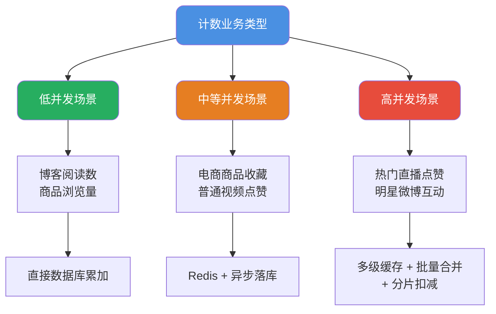
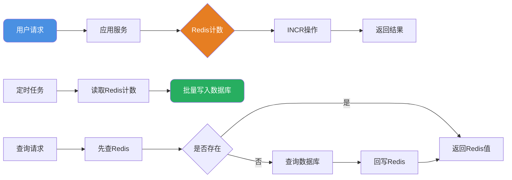

import PaidCTA from '@site/src/components/PaidCTA';


# 高并发计数系统设计

## 计数业务特性分析

计数功能在互联网应用中随处可见：文章阅读数、视频播放量、商品收藏数、社交点赞数等。这类业务看似简单，但在高并发场景下却面临着严峻的技术挑战。

### 业务复杂度分级

不同业务场景对计数系统的要求差异很大：



### 核心技术难点

高并发计数的本质是**热点数据更新问题**。当百万用户同时对同一个内容进行点赞操作时，所有请求都指向同一条数据记录，这就形成了典型的热点写入。

主要挑战：
1. **数据库锁竞争**：大量并发UPDATE语句对同一行加锁，导致请求排队
2. **连接池耗尽**：等待锁释放的请求占用数据库连接，可能导致连接池枯竭
3. **数据准确性**：高并发下如何保证计数的最终准确性
4. **系统稳定性**：避免计数服务异常影响核心业务

## 基础方案：数据库直接累加

对于日均访问量在万级以下的低并发场景，直接使用数据库累加是最简单有效的方案。

```sql
-- 文章阅读数累加
UPDATE article_stats 
SET view_count = view_count + 1 
WHERE article_id = #{articleId};
```

数据库通过行级锁保证了并发更新的安全性，实现简单且数据可靠。

**适用边界**：
- QPS < 100 的一般业务场景
- 对响应延迟要求不高
- 数据一致性要求高于性能

## 进阶方案：Redis缓存层

当并发量提升到每秒数百甚至上千时，数据库已经无法承受压力。此时需要引入Redis作为缓存层。

### 基本架构



### 实现要点

<PaidCTA />