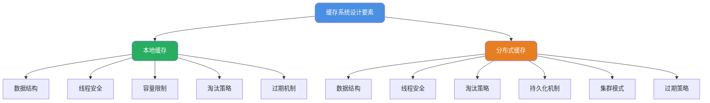
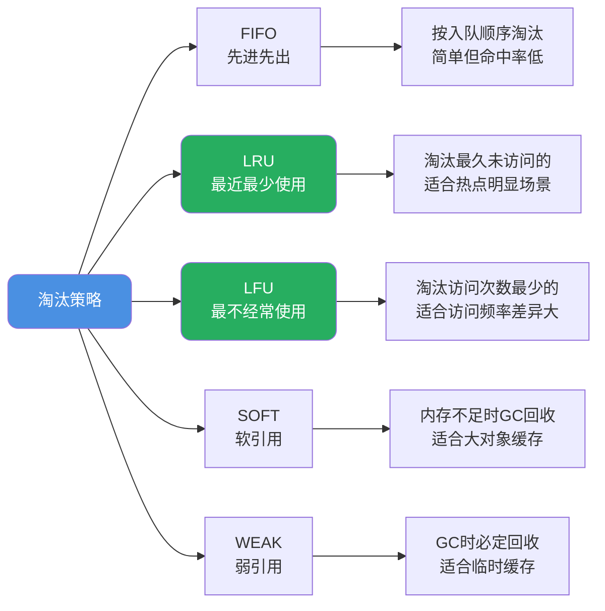

import PaidCTA from '@site/src/components/PaidCTA';

# 缓存系统设计与预热策略

## 缓存系统设计要素

缓存是提升系统性能的关键技术，但设计一个健壮的缓存系统需要考虑多个维度。根据部署位置的不同，缓存分为**本地缓存**和**分布式缓存**两大类，它们面临的挑战和解决方案各有不同。



## 本地缓存核心设计

### 数据结构选择

缓存的本质是**空间换时间**，通过在内存中存储热点数据来避免昂贵的IO操作。为实现O(1)的存取效率，通常采用Key-Value结构：

- **HashMap系列**：基于哈希表实现，适合大多数场景
- **ConcurrentHashMap**：线程安全的哈希表，适合多线程环境
- **专用缓存库**：如Caffeine、Guava Cache，提供更丰富的功能

### 线程安全保障

本地缓存通常作为全局共享资源，必须考虑并发访问安全：

```java
// 不推荐：使用普通HashMap
private Map<String, Object> cache = new HashMap<>(); // 线程不安全

// 推荐方式一：使用ConcurrentHashMap
private Map<String, Object> cache = new ConcurrentHashMap<>();

// 推荐方式二：使用Caffeine
private Cache<String, Object> cache = Caffeine.newBuilder()
    .maximumSize(10000)
    .expireAfterWrite(Duration.ofMinutes(10))
    .build();
```

优秀的缓存框架通常采用以下技术保证线程安全：
- **CAS操作**：无锁更新计数器、统计数据等
- **分段锁**：将数据分成多个段，降低锁粒度
- **读写分离**：允许并发读，串行写

### 容量控制机制

本地缓存占用JVM堆内存，必须设置上限防止OOM：

```java
// 方式一：限制条目数量
Cache<String, User> cache = Caffeine.newBuilder()
    .maximumSize(10000)  // 最多存储10000个条目
    .build();

// 方式二：基于权重限制
Cache<String, byte[]> cache = Caffeine.newBuilder()
    .maximumWeight(100 * 1024 * 1024)  // 总权重不超过100MB
    .weigher((key, value) -> value.length)  // 以字节数组长度为权重
    .build();
```

### 淘汰策略

当缓存达到容量上限时，需要淘汰部分数据。常见淘汰策略：



<PaidCTA />