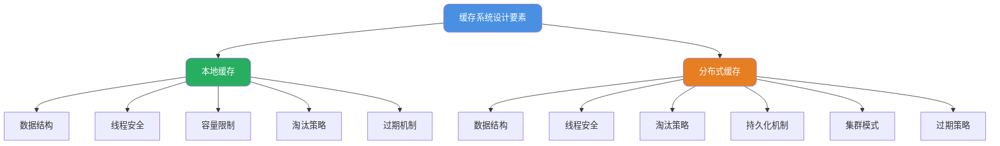
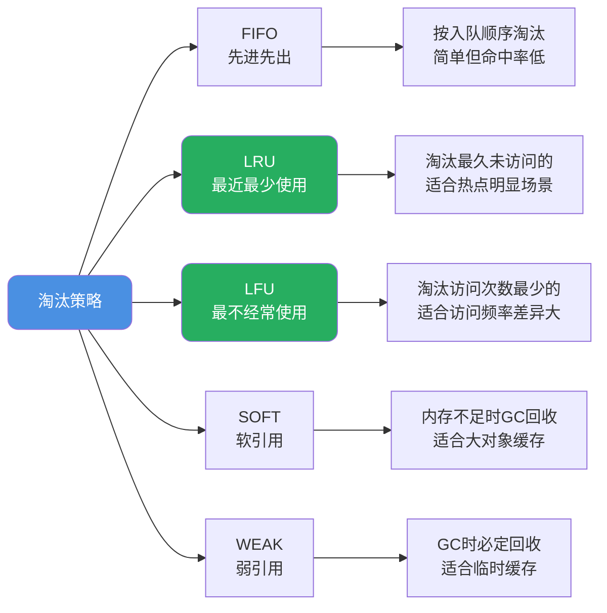
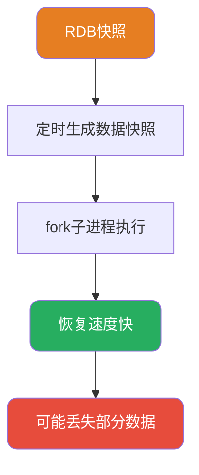
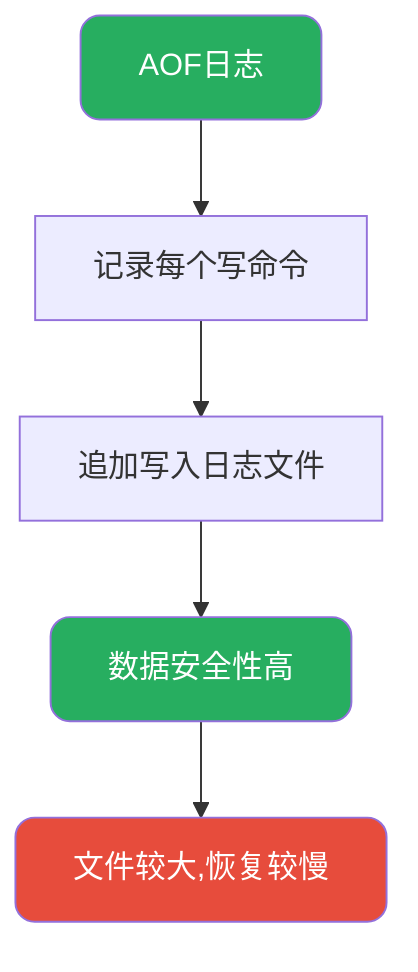
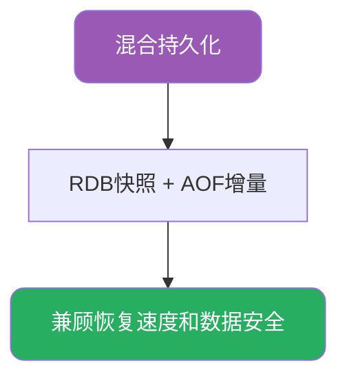
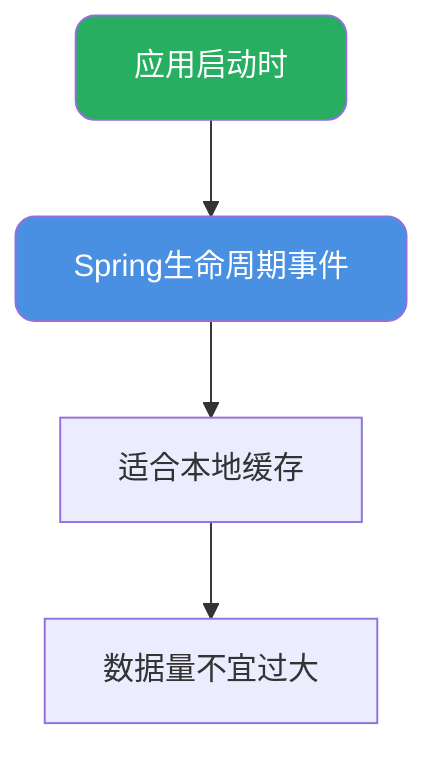
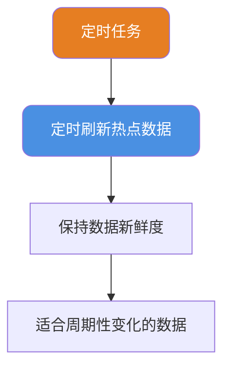
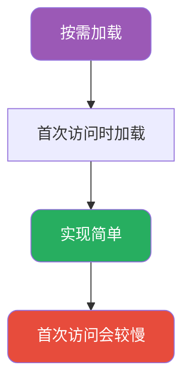
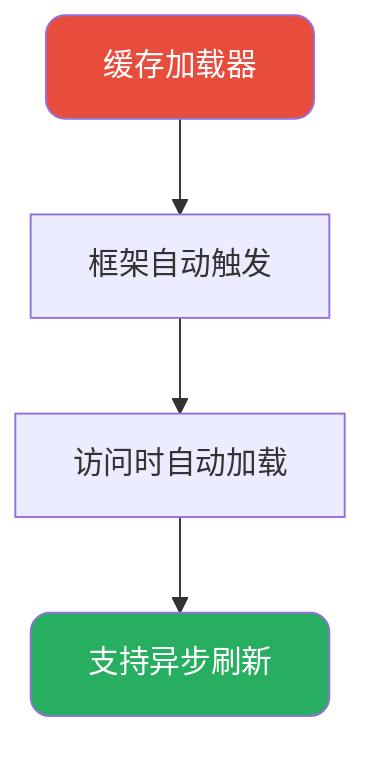
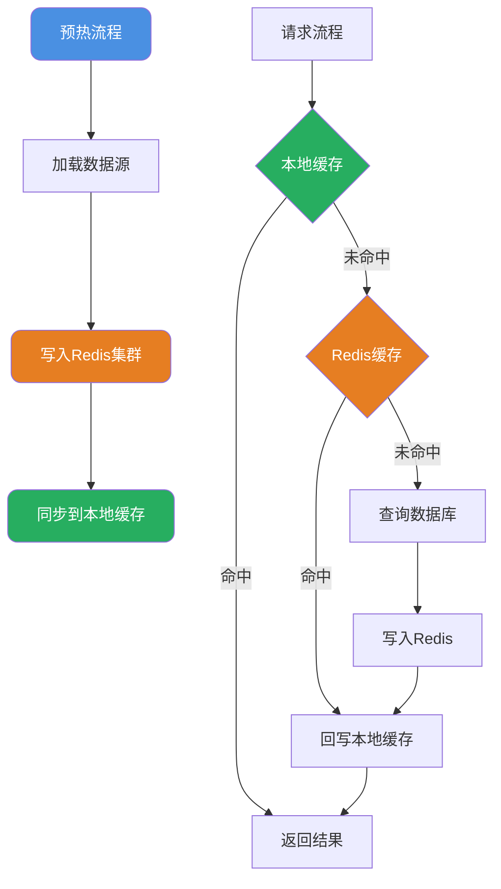

# 缓存系统设计与预热策略

## 缓存系统设计要素

缓存是提升系统性能的关键技术，但设计一个健壮的缓存系统需要考虑多个维度。根据部署位置的不同，缓存分为**本地缓存**和**分布式缓存**两大类，它们面临的挑战和解决方案各有不同。



## 本地缓存核心设计

### 数据结构选择

缓存的本质是**空间换时间**，通过在内存中存储热点数据来避免昂贵的IO操作。为实现O(1)的存取效率，通常采用Key-Value结构：

- **HashMap系列**：基于哈希表实现，适合大多数场景
- **ConcurrentHashMap**：线程安全的哈希表，适合多线程环境
- **专用缓存库**：如Caffeine、Guava Cache，提供更丰富的功能

### 线程安全保障

本地缓存通常作为全局共享资源，必须考虑并发访问安全：

```java
// 不推荐：使用普通HashMap
private Map<String, Object> cache = new HashMap<>(); // 线程不安全

// 推荐方式一：使用ConcurrentHashMap
private Map<String, Object> cache = new ConcurrentHashMap<>();

// 推荐方式二：使用Caffeine
private Cache<String, Object> cache = Caffeine.newBuilder()
    .maximumSize(10000)
    .expireAfterWrite(Duration.ofMinutes(10))
    .build();
```

优秀的缓存框架通常采用以下技术保证线程安全：
- **CAS操作**：无锁更新计数器、统计数据等
- **分段锁**：将数据分成多个段，降低锁粒度
- **读写分离**：允许并发读，串行写

### 容量控制机制

本地缓存占用JVM堆内存，必须设置上限防止OOM：

```java
// 方式一：限制条目数量
Cache<String, User> cache = Caffeine.newBuilder()
    .maximumSize(10000)  // 最多存储10000个条目
    .build();

// 方式二：基于权重限制
Cache<String, byte[]> cache = Caffeine.newBuilder()
    .maximumWeight(100 * 1024 * 1024)  // 总权重不超过100MB
    .weigher((key, value) -> value.length)  // 以字节数组长度为权重
    .build();
```

### 淘汰策略

当缓存达到容量上限时，需要淘汰部分数据。常见淘汰策略：



Caffeine采用**Window TinyLFU**算法，结合LRU和LFU的优点：

1. 新数据进入一个小型的Window Cache（基于LRU）
2. 从Window淘汰的数据与Main Cache的候选数据比较访问频率
3. 频率更高的数据进入Main Cache
4. 通过Count-Min Sketch高效统计访问频率

### 过期时间设计

过期时间是确保数据新鲜度的最后保障：

```java
Cache<String, String> cache = Caffeine.newBuilder()
    // 写入后10分钟过期
    .expireAfterWrite(Duration.ofMinutes(10))
    // 或：最后访问后5分钟过期
    .expireAfterAccess(Duration.ofMinutes(5))
    // 或：自定义过期策略
    .expireAfter(new Expiry<String, String>() {
        @Override
        public long expireAfterCreate(String key, String value, long currentTime) {
            // 根据key动态设置过期时间
            return key.startsWith("hot:") 
                ? TimeUnit.HOURS.toNanos(1) 
                : TimeUnit.MINUTES.toNanos(10);
        }
        // ...其他方法
    })
    .build();
```

## 分布式缓存扩展设计

分布式缓存（如Redis）在本地缓存设计要素基础上，还需要考虑数据持久化和集群管理。

### 持久化机制

Redis提供两种持久化方式：

**RDB快照**：定时生成数据快照，fork子进程执行，恢复速度快，但可能丢失最后一次快照后的数据。



**AOF日志**：记录每个写命令，追加写入日志文件，数据安全性高，但文件较大、恢复较慢。



**混合持久化**：结合RDB快照与AOF增量日志，兼顾恢复速度和数据安全。



### 集群模式

Redis集群解决单节点容量和性能瓶颈：

- **主从复制**：数据备份，读写分离
- **哨兵模式**：自动故障转移
- **Cluster模式**：数据分片，水平扩展

## 缓存预热策略

缓存预热是在系统启动或业务高峰到来之前，主动将热点数据加载到缓存中，避免缓存冷启动导致的大量请求穿透到数据库。

### 预热时机选择

**应用启动时预热**：利用Spring生命周期事件，适合本地缓存，数据量不宜过大。



**定时任务预热**：定时刷新热点数据，保持数据新鲜度，适合周期性变化的数据。



**按需加载**：首次访问时加载，实现简单，但首次访问会较慢。



**缓存加载器**：框架自动触发，访问时自动加载，支持异步刷新。



### 启动时预热

基于Spring生命周期在应用启动完成后自动加载缓存：

**方式一：ApplicationReadyEvent**

```java
@Component
public class CacheWarmer {
    
    @Autowired
    private ProductService productService;
    
    @Autowired
    private Cache<String, Product> productCache;
    
    @EventListener(ApplicationReadyEvent.class)
    public void warmUpCache() {
        log.info("开始缓存预热...");
        
        // 加载热门商品到缓存
        List<Product> hotProducts = productService.getHotProducts(1000);
        for (Product product : hotProducts) {
            productCache.put(product.getId(), product);
        }
        
        log.info("缓存预热完成，共加载{}个商品", hotProducts.size());
    }
}
```

**方式二：CommandLineRunner**

```java
@Component
public class CacheWarmRunner implements CommandLineRunner {
    
    @Autowired
    private ConfigService configService;
    
    @Override
    public void run(String... args) {
        // 加载系统配置到本地缓存
        List<SystemConfig> configs = configService.loadAllConfigs();
        configs.forEach(config -> 
            LocalCache.put(config.getKey(), config.getValue())
        );
    }
}
```

**方式三：InitializingBean**

```java
@Service
public class CategoryCacheService implements InitializingBean {
    
    @Autowired
    private CategoryMapper categoryMapper;
    
    private Map<String, Category> categoryCache = new ConcurrentHashMap<>();
    
    @Override
    public void afterPropertiesSet() {
        // Bean初始化完成后加载分类数据
        List<Category> categories = categoryMapper.selectAll();
        categories.forEach(cat -> categoryCache.put(cat.getId(), cat));
    }
    
    public Category getCategory(String id) {
        return categoryCache.get(id);
    }
}
```

### 定时任务预热

对于需要周期性更新的缓存数据，使用定时任务刷新：

```java
@Component
public class ScheduledCacheRefresher {
    
    @Autowired
    private StringRedisTemplate redisTemplate;
    
    @Autowired
    private RankingService rankingService;
    
    /**
     * 每天凌晨2点刷新排行榜缓存
     */
    @Scheduled(cron = "0 0 2 * * ?")
    public void refreshRankingCache() {
        log.info("开始刷新排行榜缓存");
        
        // 计算各类排行榜
        List<RankItem> salesRank = rankingService.calculateSalesRanking();
        List<RankItem> viewRank = rankingService.calculateViewRanking();
        
        // 更新到Redis
        redisTemplate.opsForValue().set("rank:sales", 
            JSON.toJSONString(salesRank), 
            Duration.ofDays(1));
        redisTemplate.opsForValue().set("rank:view", 
            JSON.toJSONString(viewRank), 
            Duration.ofDays(1));
        
        log.info("排行榜缓存刷新完成");
    }
    
    /**
     * 每小时刷新热点商品缓存
     */
    @Scheduled(fixedRate = 3600000)
    public void refreshHotProductCache() {
        // 获取最近一小时的热门商品
        List<String> hotProductIds = statisticsService.getHotProductIds(100);
        
        // 批量加载商品详情并预热
        List<Product> products = productService.batchGetProducts(hotProductIds);
        products.forEach(product -> 
            redisTemplate.opsForValue().set(
                "product:" + product.getId(),
                JSON.toJSONString(product),
                Duration.ofHours(2)
            )
        );
    }
}
```

### 按需加载（Lazy Loading）

首次访问时触发缓存加载，是最常见的缓存策略：

```java
@Service
public class UserService {
    
    @Autowired
    private UserMapper userMapper;
    
    @Autowired
    private StringRedisTemplate redisTemplate;
    
    public User getUser(String userId) {
        String cacheKey = "user:" + userId;
        
        // 先查缓存
        String cached = redisTemplate.opsForValue().get(cacheKey);
        if (cached != null) {
            return JSON.parseObject(cached, User.class);
        }
        
        // 缓存未命中，查询数据库
        User user = userMapper.selectById(userId);
        if (user != null) {
            // 写入缓存，设置过期时间
            redisTemplate.opsForValue().set(
                cacheKey, 
                JSON.toJSONString(user),
                Duration.ofMinutes(30)
            );
        }
        
        return user;
    }
}
```

### 缓存加载器模式

Caffeine等现代缓存框架支持缓存加载器，自动处理缓存未命中的情况：

```java
@Service
public class ConfigCacheService {
    
    @Autowired
    private ConfigMapper configMapper;
    
    private final LoadingCache<String, String> configCache;
    
    public ConfigCacheService() {
        this.configCache = Caffeine.newBuilder()
            .maximumSize(1000)
            .expireAfterWrite(Duration.ofMinutes(30))
            // 配置自动刷新
            .refreshAfterWrite(Duration.ofMinutes(10))
            // 设置加载器
            .build(this::loadConfigFromDB);
    }
    
    /**
     * 缓存未命中时自动调用此方法加载
     */
    private String loadConfigFromDB(String configKey) {
        log.info("从数据库加载配置: {}", configKey);
        SystemConfig config = configMapper.selectByKey(configKey);
        return config != null ? config.getValue() : null;
    }
    
    public String getConfig(String configKey) {
        // get方法会自动触发加载器
        return configCache.get(configKey);
    }
}
```

加载器模式的优势：
- 代码更简洁，无需手动处理缓存穿透
- 支持异步刷新，不阻塞读请求
- 自动处理并发加载，避免缓存击穿

## 多级缓存预热

对于关键业务，需要同时预热本地缓存和分布式缓存：



```java
@Component
public class MultiLevelCacheWarmer {
    
    @Autowired
    private StringRedisTemplate redisTemplate;
    
    @Autowired
    private ProductMapper productMapper;
    
    // 本地缓存
    private final Cache<String, Product> localCache = Caffeine.newBuilder()
        .maximumSize(10000)
        .expireAfterWrite(Duration.ofMinutes(5))
        .build();
    
    @EventListener(ApplicationReadyEvent.class)
    public void warmUp() {
        log.info("开始多级缓存预热");
        
        // 1. 获取热点商品ID列表
        List<String> hotIds = getHotProductIds();
        
        // 2. 批量加载商品数据
        List<Product> products = productMapper.batchSelect(hotIds);
        
        // 3. 写入Redis
        Map<String, String> redisData = new HashMap<>();
        for (Product product : products) {
            String key = "product:" + product.getId();
            redisData.put(key, JSON.toJSONString(product));
            
            // 4. 同时写入本地缓存
            localCache.put(product.getId(), product);
        }
        redisTemplate.opsForValue().multiSet(redisData);
        
        // 5. 设置过期时间
        hotIds.forEach(id -> 
            redisTemplate.expire("product:" + id, Duration.ofHours(2))
        );
        
        log.info("多级缓存预热完成，共预热{}个商品", products.size());
    }
    
    /**
     * 查询商品（优先本地缓存）
     */
    public Product getProduct(String productId) {
        // 一级：本地缓存
        Product product = localCache.getIfPresent(productId);
        if (product != null) {
            return product;
        }
        
        // 二级：Redis缓存
        String cached = redisTemplate.opsForValue().get("product:" + productId);
        if (cached != null) {
            product = JSON.parseObject(cached, Product.class);
            // 回填本地缓存
            localCache.put(productId, product);
            return product;
        }
        
        // 三级：数据库
        product = productMapper.selectById(productId);
        if (product != null) {
            // 写入两级缓存
            String json = JSON.toJSONString(product);
            redisTemplate.opsForValue().set("product:" + productId, json, Duration.ofHours(2));
            localCache.put(productId, product);
        }
        
        return product;
    }
}
```

## 预热注意事项

### 避免启动阻塞

预热数据量大时可能导致应用启动缓慢，可采用异步预热：

```java
@EventListener(ApplicationReadyEvent.class)
public void warmUpAsync() {
    // 异步执行预热，不阻塞应用启动
    CompletableFuture.runAsync(() -> {
        try {
            doWarmUp();
        } catch (Exception e) {
            log.error("缓存预热失败", e);
        }
    });
}
```

### 预热进度监控

对于大规模预热，需要监控进度和耗时：

```java
public void warmUpWithProgress() {
    List<String> allIds = getAllProductIds();
    int total = allIds.size();
    AtomicInteger progress = new AtomicInteger(0);
    
    // 分批预热
    Lists.partition(allIds, 100).forEach(batch -> {
        warmUpBatch(batch);
        int current = progress.addAndGet(batch.size());
        log.info("预热进度: {}/{} ({}%)", current, total, current * 100 / total);
    });
}
```

### 预热失败处理

预热失败不应影响应用正常启动和服务：

```java
@EventListener(ApplicationReadyEvent.class)
public void safeWarmUp() {
    try {
        warmUpCache();
    } catch (Exception e) {
        // 记录错误但不抛出，允许应用继续运行
        log.error("缓存预热失败，将依赖按需加载", e);
        // 可选：发送告警通知
        alertService.sendAlert("缓存预热失败", e.getMessage());
    }
}
```
