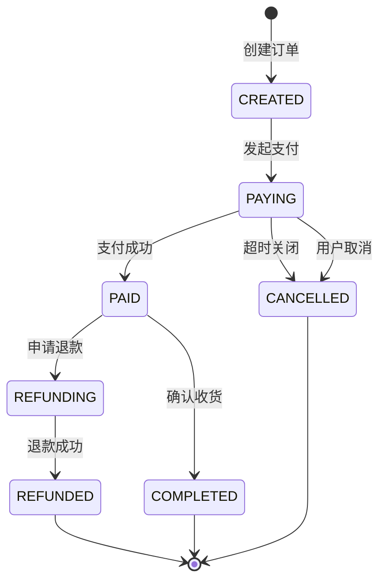
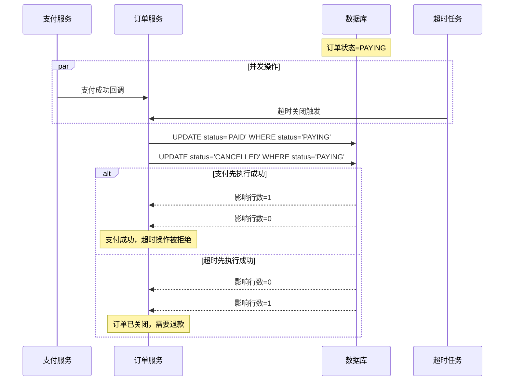
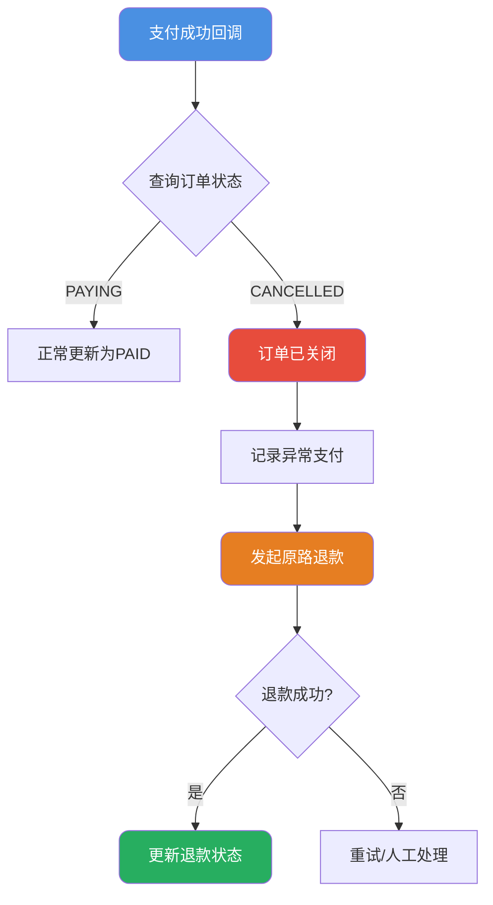
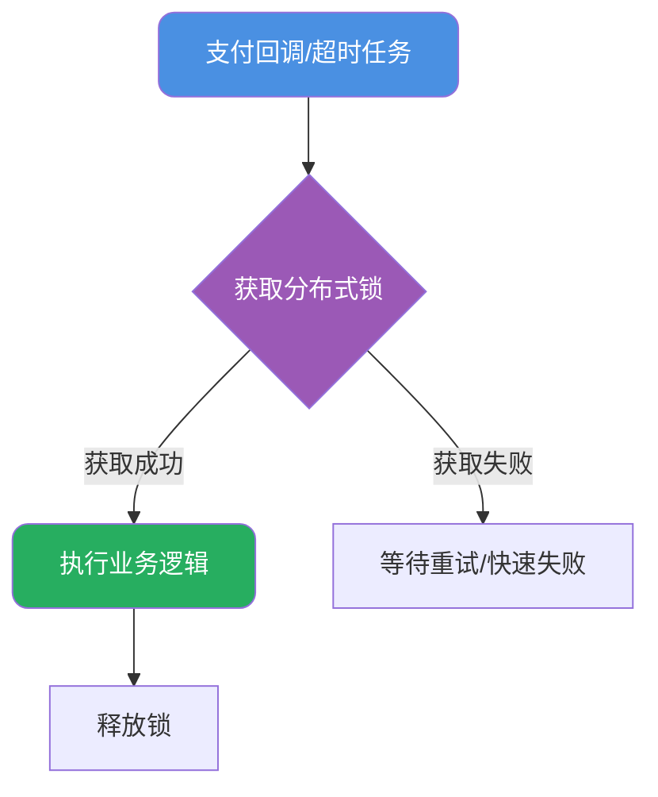

# 订单支付并发冲突处理

## 问题场景描述

在电商系统中，订单通常设有支付时效限制。例如用户下单后需在30分钟内完成支付，超时则自动关闭订单释放库存。然而在实际业务中，可能出现一个棘手的并发场景：

> 假设用户在14:00下单，支付超时时间为30分钟。在14:29:59时，用户完成支付的同时，系统也触发了超时关闭操作。此时支付成功与订单关闭两个事件几乎同时发生，系统该如何处理？

这是一个典型的分布式系统并发问题，处理不当会导致资金风险或用户投诉。

## 状态机与终态设计

### 订单状态流转

要正确处理并发场景，首先需要明确订单的状态机设计：



### 终态不可变原则

状态机设计的核心原则：**终态一旦确定，不可逆转**。

终态包括：
- **PAID**（已支付）：用户完成付款
- **CANCELLED**（已取消）：订单超时或用户主动取消
- **COMPLETED**（已完成）：交易完成
- **REFUNDED**（已退款）：退款完成

一旦进入终态，该订单的生命周期即结束，不允许再进行状态变更。这是保证业务逻辑正确性的基础约定。

## 并发控制方案

### 数据库层面控制

通过SQL条件和乐观锁机制，确保并发场景下只有一个操作能够成功：

```sql
-- 支付成功状态更新
UPDATE order_info 
SET status = 'PAID',
    pay_time = NOW(),
    version = version + 1
WHERE order_no = #{orderNo} 
  AND status = 'PAYING' 
  AND version = #{currentVersion};

-- 超时关闭状态更新  
UPDATE order_info 
SET status = 'CANCELLED',
    cancel_time = NOW(),
    cancel_reason = 'TIMEOUT',
    version = version + 1
WHERE order_no = #{orderNo} 
  AND status = 'PAYING' 
  AND version = #{currentVersion};
```

关键设计要点：
1. **状态前置条件**：只有处于PAYING状态的订单才能被更新
2. **版本号控制**：通过version字段实现乐观锁
3. **原子操作**：UPDATE语句本身是原子的

当两个操作并发执行时，数据库会保证只有一个UPDATE成功（返回影响行数=1），另一个失败（影响行数=0）。

### 并发场景分析



## 逆向流程处理

### 场景一：支付成功优先

当支付成功操作先于超时关闭执行时，订单状态变为PAID。后续的超时关闭操作因状态不匹配而失败，这是正常的业务流程，无需特殊处理。

### 场景二：超时关闭优先

当超时关闭操作先执行成功时，订单状态变为CANCELLED。此时支付成功回调到来，发现订单已关闭，需要触发**原路退款**流程：



代码实现示例：

```java
@Service
public class PaymentCallbackService {
    
    @Transactional
    public void handlePaymentSuccess(PaymentCallback callback) {
        String orderNo = callback.getOrderNo();
        
        // 尝试更新订单状态
        int updated = orderMapper.updateToPaid(orderNo, callback.getPayTime());
        
        if (updated == 1) {
            // 正常支付成功流程
            handleNormalPayment(callback);
            return;
        }
        
        // 更新失败，查询当前订单状态
        Order order = orderMapper.selectByOrderNo(orderNo);
        
        if (order.getStatus() == OrderStatus.CANCELLED) {
            // 订单已关闭，需要退款
            log.warn("订单{}已关闭，触发原路退款", orderNo);
            initiateRefund(callback);
        } else if (order.getStatus() == OrderStatus.PAID) {
            // 重复回调，幂等处理
            log.info("订单{}已支付，忽略重复回调", orderNo);
        } else {
            // 异常状态，记录并告警
            log.error("订单{}状态异常: {}", orderNo, order.getStatus());
            alertService.sendAlert("订单状态异常", orderNo);
        }
    }
    
    private void initiateRefund(PaymentCallback callback) {
        // 创建退款单
        RefundOrder refund = new RefundOrder();
        refund.setOrderNo(callback.getOrderNo());
        refund.setRefundAmount(callback.getPayAmount());
        refund.setRefundReason("订单已关闭-自动退款");
        refund.setStatus(RefundStatus.PENDING);
        refundOrderMapper.insert(refund);
        
        // 调用支付渠道退款接口
        paymentGateway.refund(refund);
    }
}
```

### 为什么必须退款

有人可能会问：既然用户已经付款了，为什么不能让订单恢复到已支付状态？

原因如下：
1. **终态不可变**：CANCELLED是终态，逆转会破坏状态机设计
2. **库存已释放**：超时关闭时通常会释放库存，商品可能已被他人购买
3. **优惠已失效**：使用的优惠券、积分等可能已释放给其他订单
4. **业务一致性**：下游系统可能已收到取消通知并做了相应处理

## 资金恒等式校验

为确保资金安全，需要建立严格的资金恒等式：

### 恒等式定义

对于任意订单，在任意时刻必须满足：

```
实际收款金额 = 订单应付金额 × 支付成功标识 - 累计退款金额
```

具体规则：

| 订单状态 | 恒等式约束 |
|---------|-----------|
| PAYING | 支付金额 = 0，退款金额 = 0 |
| PAID | 支付金额 > 0，退款金额 = 0 |
| CANCELLED | 支付金额 - 退款金额 = 0 |
| REFUNDED | 支付金额 - 退款金额 = 0 |

### 对账机制

建立定时对账任务，校验资金恒等式：

```java
@Scheduled(cron = "0 0 */1 * * ?") // 每小时执行
public void reconcileOrders() {
    // 查询近24小时的订单
    List<Order> orders = orderMapper.selectRecentOrders(24);
    
    for (Order order : orders) {
        BigDecimal paid = order.getPaidAmount() != null 
            ? order.getPaidAmount() : BigDecimal.ZERO;
        BigDecimal refunded = order.getRefundedAmount() != null 
            ? order.getRefundedAmount() : BigDecimal.ZERO;
        
        boolean valid = checkFundEquation(order, paid, refunded);
        
        if (!valid) {
            log.error("订单{}资金不平衡: 支付={}, 退款={}, 状态={}", 
                order.getOrderNo(), paid, refunded, order.getStatus());
            
            // 触发补偿处理
            compensationService.handleFundMismatch(order);
        }
    }
}

private boolean checkFundEquation(Order order, BigDecimal paid, BigDecimal refunded) {
    switch (order.getStatus()) {
        case PAID:
        case COMPLETED:
            // 已支付订单：支付金额>0，退款金额=0
            return paid.compareTo(BigDecimal.ZERO) > 0 
                && refunded.compareTo(BigDecimal.ZERO) == 0;
            
        case CANCELLED:
        case REFUNDED:
            // 已取消/退款订单：支付金额=退款金额
            return paid.compareTo(refunded) == 0;
            
        default:
            return true;
    }
}
```

## 分布式锁优化

为进一步降低并发冲突的概率，可以在业务入口处加入分布式锁：



```java
@Service
public class OrderStatusService {
    
    @Autowired
    private RedissonClient redisson;
    
    public boolean updateOrderStatus(String orderNo, OrderStatus targetStatus) {
        String lockKey = "order:lock:" + orderNo;
        RLock lock = redisson.getLock(lockKey);
        
        try {
            // 尝试获取锁，等待5秒，锁持有30秒
            if (lock.tryLock(5, 30, TimeUnit.SECONDS)) {
                try {
                    // 在锁保护下执行状态更新
                    return doUpdateStatus(orderNo, targetStatus);
                } finally {
                    lock.unlock();
                }
            } else {
                log.warn("获取订单锁失败: {}", orderNo);
                return false;
            }
        } catch (InterruptedException e) {
            Thread.currentThread().interrupt();
            return false;
        }
    }
}
```

分布式锁的优势：
- 将并发冲突前置，减少数据库层面的锁竞争
- 业务逻辑更加清晰，便于调试和监控
- 可以做更复杂的业务判断（如查询订单详情后再决定操作）

## 异常处理与监控

### 退款失败处理

原路退款可能因各种原因失败，需要建立重试机制：

```java
@Service
public class RefundRetryService {
    
    private static final int MAX_RETRY_TIMES = 5;
    
    @Scheduled(fixedRate = 60000) // 每分钟执行
    public void retryFailedRefunds() {
        List<RefundOrder> failedRefunds = refundOrderMapper
            .selectByStatus(RefundStatus.FAILED);
        
        for (RefundOrder refund : failedRefunds) {
            if (refund.getRetryCount() >= MAX_RETRY_TIMES) {
                // 超过最大重试次数，转人工处理
                refund.setStatus(RefundStatus.MANUAL_REQUIRED);
                refundOrderMapper.updateById(refund);
                alertService.sendAlert("退款需人工处理", refund.getOrderNo());
                continue;
            }
            
            try {
                boolean success = paymentGateway.refund(refund);
                if (success) {
                    refund.setStatus(RefundStatus.SUCCESS);
                } else {
                    refund.setRetryCount(refund.getRetryCount() + 1);
                }
            } catch (Exception e) {
                log.error("退款重试失败: {}", refund.getOrderNo(), e);
                refund.setRetryCount(refund.getRetryCount() + 1);
            }
            
            refundOrderMapper.updateById(refund);
        }
    }
}
```

### 监控告警

建立完善的监控体系：

1. **并发冲突监控**：统计支付回调时订单已关闭的次数
2. **退款成功率**：监控自动退款的成功率
3. **资金平衡检查**：实时监控资金恒等式异常
4. **处理延迟**：监控支付回调的处理时长

```java
@Component
public class PaymentMetrics {
    
    private final Counter paymentSuccessCounter;
    private final Counter orderAlreadyClosedCounter;
    private final Counter refundTriggeredCounter;
    private final Timer paymentProcessingTimer;
    
    public PaymentMetrics(MeterRegistry registry) {
        this.paymentSuccessCounter = registry.counter("payment.success");
        this.orderAlreadyClosedCounter = registry.counter("payment.order.closed");
        this.refundTriggeredCounter = registry.counter("payment.refund.triggered");
        this.paymentProcessingTimer = registry.timer("payment.processing.time");
    }
    
    public void recordPaymentSuccess() {
        paymentSuccessCounter.increment();
    }
    
    public void recordOrderAlreadyClosed() {
        orderAlreadyClosedCounter.increment();
    }
    
    public void recordRefundTriggered() {
        refundTriggeredCounter.increment();
    }
    
    public Timer.Sample startTimer() {
        return Timer.start();
    }
    
    public void stopTimer(Timer.Sample sample) {
        sample.stop(paymentProcessingTimer);
    }
}
```

## 最佳实践总结

1. **明确状态机**：设计清晰的状态流转规则，明确终态不可变
2. **数据库兜底**：通过SQL条件确保并发安全
3. **分布式锁前置**：降低并发冲突概率
4. **逆向流程完备**：处理好异常场景下的退款流程
5. **资金对账**：建立定时对账机制，及时发现问题
6. **监控告警**：完善的监控体系，快速响应异常
