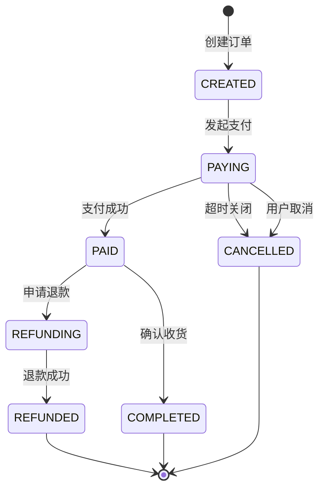

import PaidCTA from '@site/src/components/PaidCTA';

# 订单支付并发冲突处理

## 问题场景描述

在电商系统中，订单通常设有支付时效限制。例如用户下单后需在30分钟内完成支付，超时则自动关闭订单释放库存。然而在实际业务中，可能出现一个棘手的并发场景：

> 假设用户在14:00下单，支付超时时间为30分钟。在14:29:59时，用户完成支付的同时，系统也触发了超时关闭操作。此时支付成功与订单关闭两个事件几乎同时发生，系统该如何处理？

这是一个典型的分布式系统并发问题，处理不当会导致资金风险或用户投诉。

## 状态机与终态设计

### 订单状态流转

要正确处理并发场景，首先需要明确订单的状态机设计：

### 终态不可变原则

状态机设计的核心原则：**终态一旦确定，不可逆转**。

终态包括：
- **PAID**（已支付）：用户完成付款
- **CANCELLED**（已取消）：订单超时或用户主动取消
- **COMPLETED**（已完成）：交易完成
- **REFUNDED**（已退款）：退款完成

一旦进入终态，该订单的生命周期即结束，不允许再进行状态变更。这是保证业务逻辑正确性的基础约定。

## 并发控制方案

### 数据库层面控制

<PaidCTA />