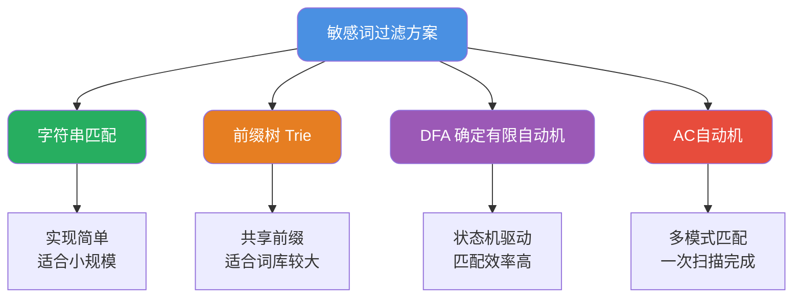

import PaidCTA from '@site/src/components/PaidCTA';

# 敏感词过滤算法与实现

## 敏感词过滤概述

敏感词过滤是内容安全领域的基础能力，广泛应用于社交平台、电商评论、即时通讯等场景。其核心目标是检测并处理文本中的违规词汇，包括涉政、涉黄、暴力、广告等类型。

根据业务规模和性能要求的不同，敏感词过滤方案从简单到复杂可分为多个层次：



## 字符串匹配法

### 基本原理

最直观的实现方式是遍历敏感词库，逐个检查文本中是否包含敏感词：

```java
public class SimpleFilter {
    
    private List<String> sensitiveWords;
    
    public SimpleFilter(List<String> words) {
        this.sensitiveWords = words;
    }
    
    /**
     * 检测文本是否包含敏感词
     */
    public boolean containsSensitiveWord(String text) {
        for (String word : sensitiveWords) {
            if (text.contains(word)) {
                return true;
            }
        }
        return false;
    }
    
    /**
     * 替换敏感词为指定字符
     */
    public String replaceSensitiveWords(String text, String replacement) {
        String result = text;
        for (String word : sensitiveWords) {
            result = result.replace(word, replacement);
        }
        return result;
    }
}
```

### 性能分析

假设文本长度为N，敏感词库大小为M，每个敏感词平均长度为L：

- **时间复杂度**：O(N × M × L)
- **空间复杂度**：O(M × L)

当敏感词库规模达到数万甚至数十万时，性能会急剧下降。

### 适用场景

- SQL注入防护中的特殊字符检测
- 数据脱敏时的固定模式替换
- 敏感词库规模在百级以下的小型应用

<PaidCTA />