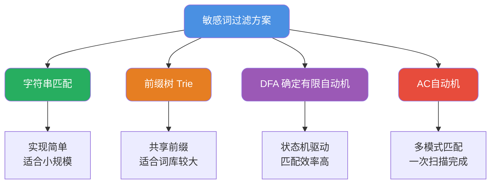
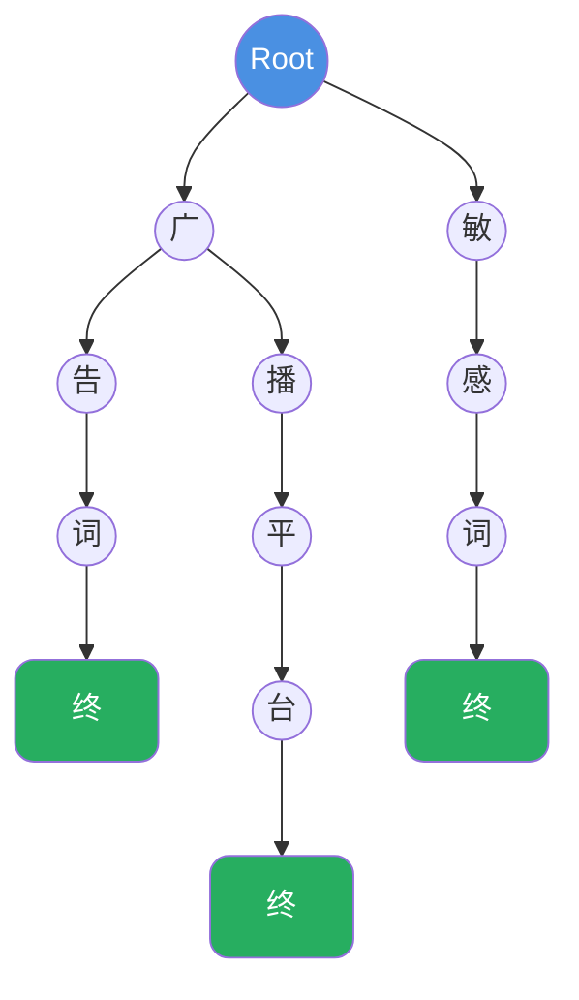
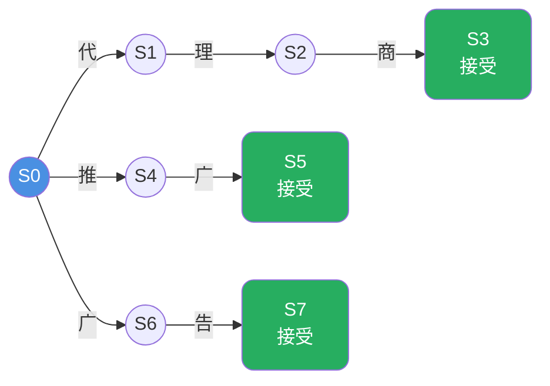
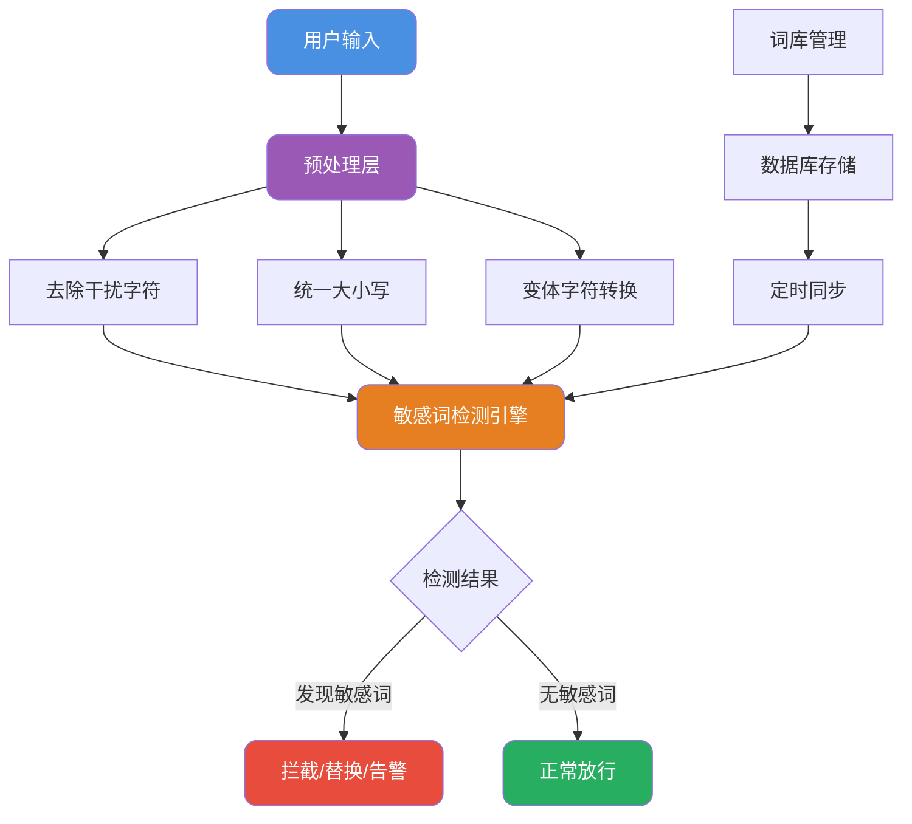

# 敏感词过滤算法与实现

## 敏感词过滤概述

敏感词过滤是内容安全领域的基础能力，广泛应用于社交平台、电商评论、即时通讯等场景。其核心目标是检测并处理文本中的违规词汇，包括涉政、涉黄、暴力、广告等类型。

根据业务规模和性能要求的不同，敏感词过滤方案从简单到复杂可分为多个层次：



## 字符串匹配法

### 基本原理

最直观的实现方式是遍历敏感词库，逐个检查文本中是否包含敏感词：

```java
public class SimpleFilter {
    
    private List<String> sensitiveWords;
    
    public SimpleFilter(List<String> words) {
        this.sensitiveWords = words;
    }
    
    /**
     * 检测文本是否包含敏感词
     */
    public boolean containsSensitiveWord(String text) {
        for (String word : sensitiveWords) {
            if (text.contains(word)) {
                return true;
            }
        }
        return false;
    }
    
    /**
     * 替换敏感词为指定字符
     */
    public String replaceSensitiveWords(String text, String replacement) {
        String result = text;
        for (String word : sensitiveWords) {
            result = result.replace(word, replacement);
        }
        return result;
    }
}
```

### 性能分析

假设文本长度为N，敏感词库大小为M，每个敏感词平均长度为L：

- **时间复杂度**：O(N × M × L)
- **空间复杂度**：O(M × L)

当敏感词库规模达到数万甚至数十万时，性能会急剧下降。

### 适用场景

- SQL注入防护中的特殊字符检测
- 数据脱敏时的固定模式替换
- 敏感词库规模在百级以下的小型应用

## 前缀树（Trie）实现

### 数据结构设计

前缀树通过共享公共前缀来优化存储和查询效率。每个节点代表一个字符，从根到叶子的路径构成一个完整的词。



上图展示了包含"广告词"、"广播平台"、"敏感词"三个敏感词的前缀树结构。

### 代码实现

```java
public class TrieFilter {
    
    private TrieNode root;
    
    public TrieFilter() {
        this.root = new TrieNode();
    }
    
    /**
     * 前缀树节点
     */
    private static class TrieNode {
        Map<Character, TrieNode> children = new HashMap<>();
        boolean isEndOfWord = false;
    }
    
    /**
     * 添加敏感词到前缀树
     */
    public void addWord(String word) {
        TrieNode current = root;
        for (char ch : word.toCharArray()) {
            current = current.children.computeIfAbsent(ch, k -> new TrieNode());
        }
        current.isEndOfWord = true;
    }
    
    /**
     * 批量添加敏感词
     */
    public void addWords(List<String> words) {
        for (String word : words) {
            addWord(word);
        }
    }
    
    /**
     * 检测文本中的敏感词
     */
    public List<String> findSensitiveWords(String text) {
        List<String> found = new ArrayList<>();
        
        for (int i = 0; i < text.length(); i++) {
            TrieNode current = root;
            StringBuilder word = new StringBuilder();
            
            for (int j = i; j < text.length(); j++) {
                char ch = text.charAt(j);
                TrieNode next = current.children.get(ch);
                
                if (next == null) {
                    break;
                }
                
                word.append(ch);
                current = next;
                
                if (current.isEndOfWord) {
                    found.add(word.toString());
                }
            }
        }
        
        return found;
    }
    
    /**
     * 替换敏感词
     */
    public String replaceSensitiveWords(String text, char replacement) {
        char[] chars = text.toCharArray();
        
        for (int i = 0; i < chars.length; i++) {
            TrieNode current = root;
            int endIndex = -1;
            
            for (int j = i; j < chars.length; j++) {
                TrieNode next = current.children.get(chars[j]);
                if (next == null) {
                    break;
                }
                current = next;
                if (current.isEndOfWord) {
                    endIndex = j;
                }
            }
            
            // 找到最长匹配的敏感词并替换
            if (endIndex != -1) {
                for (int k = i; k <= endIndex; k++) {
                    chars[k] = replacement;
                }
                i = endIndex;
            }
        }
        
        return new String(chars);
    }
}
```

### 性能分析

- **构建时间**：O(M × L)，M为敏感词数量，L为平均长度
- **查询时间**：O(N × L)，N为文本长度
- **空间复杂度**：最坏情况O(M × L)，但因共享前缀通常更优

## DFA算法实现

### 算法原理

DFA（Deterministic Finite Automaton，确定有限自动机）将敏感词库构建为状态转换图。每个状态代表匹配过程中的一个位置，根据输入字符决定下一个状态。



### 代码实现

```java
public class DFAFilter {
    
    private static final int END_FLAG = 1;
    private static final int CONTINUE_FLAG = 0;
    
    private Map<Character, Object> sensitiveWordMap;
    
    public DFAFilter() {
        this.sensitiveWordMap = new HashMap<>();
    }
    
    /**
     * 构建DFA
     */
    @SuppressWarnings("unchecked")
    public void buildDFA(List<String> sensitiveWords) {
        for (String word : sensitiveWords) {
            Map<Character, Object> currentMap = sensitiveWordMap;
            
            for (int i = 0; i < word.length(); i++) {
                char ch = word.charAt(i);
                Object existing = currentMap.get(ch);
                
                if (existing != null) {
                    currentMap = (Map<Character, Object>) existing;
                } else {
                    Map<Character, Object> newMap = new HashMap<>();
                    newMap.put('_', CONTINUE_FLAG);
                    currentMap.put(ch, newMap);
                    currentMap = newMap;
                }
                
                // 标记词尾
                if (i == word.length() - 1) {
                    currentMap.put('_', END_FLAG);
                }
            }
        }
    }
    
    /**
     * 检测敏感词
     */
    @SuppressWarnings("unchecked")
    public List<MatchResult> detect(String text) {
        List<MatchResult> results = new ArrayList<>();
        
        for (int i = 0; i < text.length(); i++) {
            int matchLength = checkSensitiveWord(text, i);
            if (matchLength > 0) {
                String matched = text.substring(i, i + matchLength);
                results.add(new MatchResult(i, matched));
                i += matchLength - 1; // 跳过已匹配的字符
            }
        }
        
        return results;
    }
    
    @SuppressWarnings("unchecked")
    private int checkSensitiveWord(String text, int startIndex) {
        Map<Character, Object> currentMap = sensitiveWordMap;
        int matchLength = 0;
        int lastMatchLength = 0;
        
        for (int i = startIndex; i < text.length(); i++) {
            char ch = text.charAt(i);
            Object next = currentMap.get(ch);
            
            if (next == null) {
                break;
            }
            
            matchLength++;
            currentMap = (Map<Character, Object>) next;
            
            // 检查是否到达终态
            if ((Integer) currentMap.get('_') == END_FLAG) {
                lastMatchLength = matchLength;
            }
        }
        
        return lastMatchLength;
    }
    
    /**
     * 替换敏感词
     */
    public String replace(String text, String replacement) {
        StringBuilder result = new StringBuilder(text);
        List<MatchResult> matches = detect(text);
        
        // 从后向前替换，避免位置偏移
        for (int i = matches.size() - 1; i >= 0; i--) {
            MatchResult match = matches.get(i);
            result.replace(
                match.getStartIndex(), 
                match.getStartIndex() + match.getWord().length(),
                replacement
            );
        }
        
        return result.toString();
    }
    
    /**
     * 匹配结果
     */
    @Data
    @AllArgsConstructor
    public static class MatchResult {
        private int startIndex;
        private String word;
    }
}
```

### 性能优势

DFA的核心优势在于确定性：对于每个输入字符，状态转换是唯一确定的，不需要回溯。

- **查询时间**：O(N)，与敏感词库大小无关
- **空间复杂度**：取决于状态机规模，通常O(M × L)

## 实战优化技巧

### 忽略特殊字符

用户可能通过插入特殊字符来规避检测，如"广★告"、"广 告"等：

```java
public String preprocess(String text) {
    // 移除可能用于绕过的字符
    return text.replaceAll("[\\s\\*★·@#$%^&]", "");
}
```

### 大小写统一

```java
public String normalize(String text) {
    return text.toLowerCase();
}
```

### 同音字/形近字处理

建立映射表，将变体字符统一转换：

```java
private static final Map<Character, Character> VARIANT_MAP = new HashMap<>();
static {
    VARIANT_MAP.put('零', '0');
    VARIANT_MAP.put('一', '1');
    VARIANT_MAP.put('贰', '2');
    // ... 更多映射
}

public String convertVariants(String text) {
    StringBuilder sb = new StringBuilder();
    for (char ch : text.toCharArray()) {
        sb.append(VARIANT_MAP.getOrDefault(ch, ch));
    }
    return sb.toString();
}
```

### 动态词库更新

生产环境中敏感词库需要支持热更新：

```java
@Service
public class SensitiveWordService {
    
    private volatile DFAFilter filter;
    
    @Autowired
    private SensitiveWordMapper wordMapper;
    
    @PostConstruct
    public void init() {
        reloadWordList();
    }
    
    /**
     * 重新加载敏感词库
     */
    public synchronized void reloadWordList() {
        List<String> words = wordMapper.selectAllWords();
        
        DFAFilter newFilter = new DFAFilter();
        newFilter.buildDFA(words);
        
        // 原子替换
        this.filter = newFilter;
        
        log.info("敏感词库重载完成，共{}个词", words.size());
    }
    
    /**
     * 检测文本
     */
    public List<String> detect(String text) {
        return filter.detect(preprocess(text))
            .stream()
            .map(r -> r.getWord())
            .collect(Collectors.toList());
    }
}
```

## 开源框架推荐

对于生产环境，推荐使用成熟的开源框架，避免重复造轮子。

### sensitive-word

一个基于DFA算法的高性能敏感词过滤框架：

```xml
<dependency>
    <groupId>com.github.houbb</groupId>
    <artifactId>sensitive-word</artifactId>
    <version>0.16.1</version>
</dependency>
```

基本用法：

```java
// 判断是否包含敏感词
boolean contains = SensitiveWordHelper.contains("这是一段测试文本");

// 查找所有敏感词
List<String> words = SensitiveWordHelper.findAll("这是一段测试文本");

// 替换敏感词
String replaced = SensitiveWordHelper.replace("这是一段测试文本");
```

高级特性：

```java
// 自定义配置
SensitiveWordBs sensitiveWordBs = SensitiveWordBs.newInstance()
    // 忽略大小写
    .ignoreCase(true)
    // 忽略半角全角
    .ignoreWidth(true)
    // 忽略数字格式
    .ignoreNumStyle(true)
    // 支持繁简体
    .enableNumCheck(true)
    // 启用邮箱检测
    .enableEmailCheck(true)
    // 启用URL检测
    .enableUrlCheck(true)
    .init();

// 使用自定义配置检测
List<String> words = sensitiveWordBs.findAll("测试文本");
```

### 性能对比

不同方案在10万敏感词、1000字符文本场景下的性能表现：

| 方案 | 构建耗时 | 单次检测耗时 | 内存占用 |
|------|---------|-------------|---------|
| 字符串匹配 | - | ~500ms | 低 |
| 前缀树 | ~200ms | ~5ms | 中 |
| DFA | ~300ms | ~2ms | 中高 |
| AC自动机 | ~500ms | ~1ms | 高 |

## 架构设计建议



**关键设计要点**：

1. **预处理标准化**：在检测前统一处理各种变体
2. **多级过滤**：轻量级规则前置，复杂检测后置
3. **词库热更新**：支持不停服更新敏感词库
4. **分类管理**：按类型（涉政/涉黄/广告等）分类管理词库
5. **误伤处理**：支持白名单机制，减少误判
6. **日志审计**：记录检测结果，便于后续分析优化
