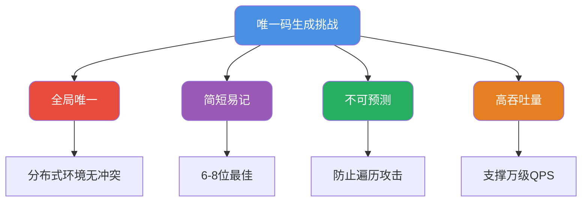

import PaidCTA from '@site/src/components/PaidCTA';

# 短链服务设计与分布式ID生成

## 唯一码生成的技术难点

在用户邀请、活动分享等场景中，需要为每个资源生成一个简短且唯一的标识码。这类需求看似简单，却隐藏着多个技术挑战：

## 发号器 + Base58编码方案

### 为什么选择Base58而非Base62

Base58是比特币地址采用的编码方案，相比Base62有更好的可读性：

| 对比项 | Base62 | Base58 |
|-------|--------|--------|
| 字符数 | 62个 | 58个 |
| 排除字符 | 无 | 0/O/I/l |
| 易混淆 | 0和O、1和l容易混淆 | 去除易混淆字符 |
| 适用场景 | 程序内部 | 用户可见场景 |

Base58字符集：`123456789ABCDEFGHJKLMNPQRSTUVWXYZabcdefghijkmnopqrstuvwxyz`

使用7位Base58编码可表示：58^7 ≈ 2.2万亿种组合。

<PaidCTA />