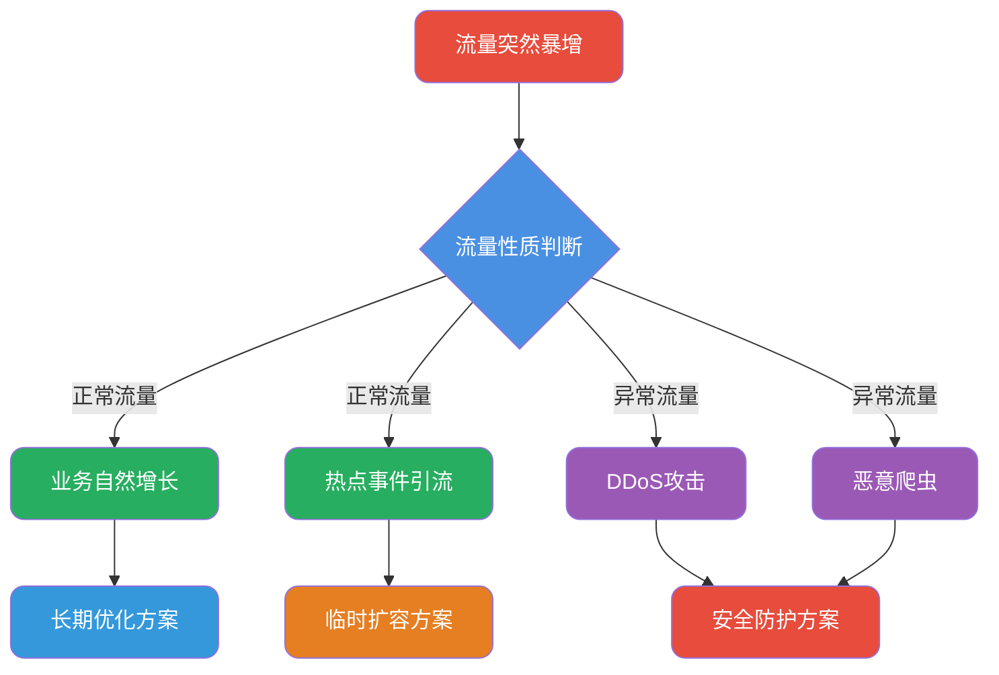

import PaidCTA from '@site/src/components/PaidCTA';

# 高并发流量应对与防护策略

## 流量暴增的应对思路

当系统突然面临流量激增时，首先需要判断流量来源的性质，这将决定我们采取什么样的应对策略。

```mermaid
graph TD
    A["流量突然暴增"] --> B{"流量性质判断"}
    B -->|正常流量| C["业务自然增长"]
    B -->|正常流量| D["热点事件引流"]
    B -->|异常流量| E["DDoS攻击"]
    B -->|异常流量| F["恶意爬虫"]
    
    C --> G["长期优化方案"]
    D --> H["临时扩容方案"]
    E --> I["安全防护方案"]
    F --> I
    
    style A fill:#E74C3C,color:#fff,rx:10,ry:10
    style B fill:#4A90E2,color:#fff,rx:10,ry:10
    style C fill:#27AE60,color:#fff,rx:10,ry:10
    style D fill:#27AE60,color:#fff,rx:10,ry:10
    style E fill:#9B59B6,color:#fff,rx:10,ry:10
    style F fill:#9B59B6,color:#fff,rx:10,ry:10
    style G fill:#3498DB,color:#fff,rx:10,ry:10
    style H fill:#E67E22,color:#fff,rx:10,ry:10
    style I fill:#E74C3C,color:#fff,rx:10,ry:10
```

## 临时应急方案

### 快速扩容策略

当遇到突发流量时，最直接有效的方式是快速扩容：

<PaidCTA />