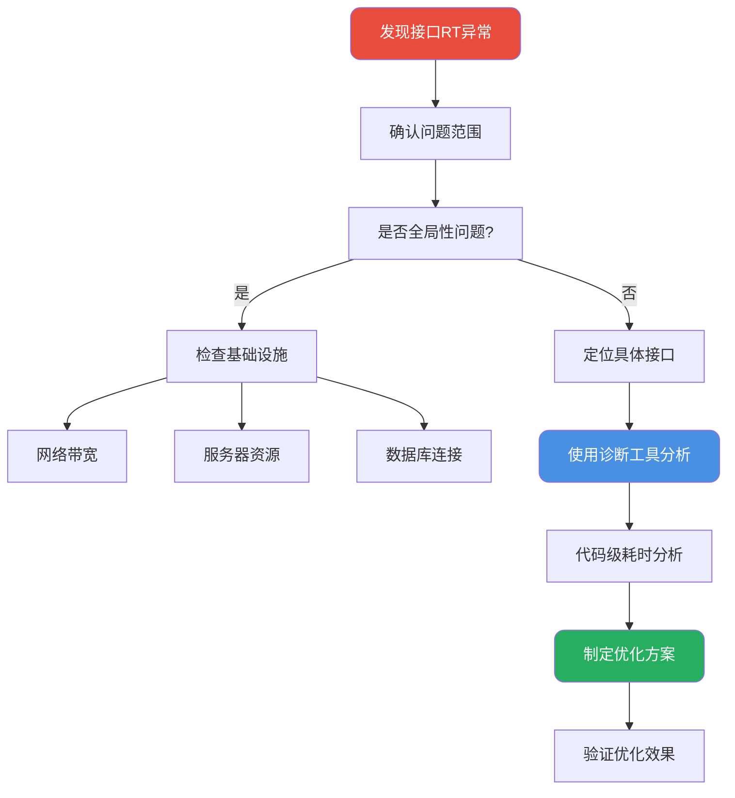
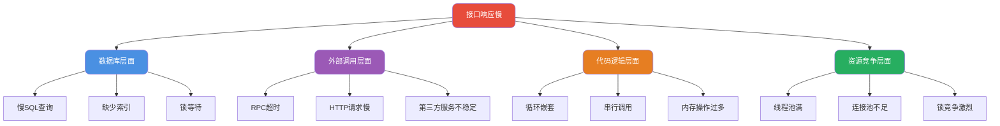

import PaidCTA from '@site/src/components/PaidCTA';

# 接口性能优化与第三方服务治理

## 线上接口性能诊断

当生产环境接口响应变慢时，快速定位问题根源是首要任务。这里介绍一套系统化的排查方法论。

### 性能诊断整体流程



### 使用Arthas进行方法级诊断

Arthas是阿里巴巴开源的Java诊断工具，通过字节码插桩技术实现运行时监控，对生产环境影响极小。

**安装与启动**

```bash
# 下载安装
curl -O https://arthas.aliyun.com/arthas-boot.jar

# 启动并attach到目标进程
java -jar arthas-boot.jar
```

**trace命令追踪方法耗时**

trace命令可以展示方法内部的调用链路及各节点耗时：

```bash
# 追踪指定类的方法调用耗时
trace com.example.order.service.OrderService createOrder

# 只追踪耗时超过500ms的请求
trace com.example.order.service.OrderService createOrder '#cost > 500'

# 限制采样次数
trace com.example.order.service.OrderService createOrder -n 5
```

**输出示例解读**

```
`---[1356.234ms] com.example.order.service.OrderService:createOrder()
    +---[2.156ms] com.example.order.service.OrderService:validateOrder()
    +---[12.453ms] com.example.inventory.client.InventoryClient:checkStock()
    +---[1298.789ms] com.example.payment.client.PaymentClient:prepay()
    +---[38.234ms] com.example.order.mapper.OrderMapper:insert()
    `---[4.102ms] com.example.order.service.OrderService:sendNotification()
```

从上面的输出可以清晰看到，`PaymentClient.prepay()`占用了1298ms，是主要的性能瓶颈。

### 常见性能瓶颈分析



## 事务边界设计与性能调优

<PaidCTA />