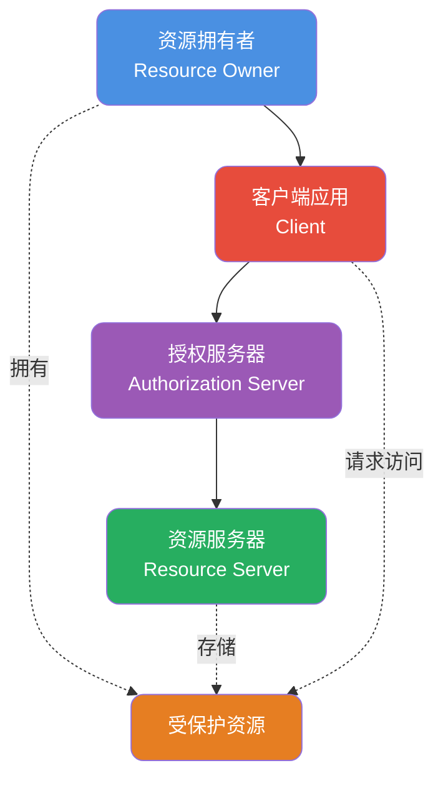

import PaidCTA from '@site/src/components/PaidCTA';

# 用户认证授权与会话管理

## OAuth 2.0 协议解析

OAuth 2.0是当前最流行的授权协议，广泛应用于第三方登录场景。理解其核心机制是构建安全认证系统的基础。

### 核心角色定义

**角色说明**：
- **资源拥有者**：通常是终端用户，拥有受保护资源的访问权限
- **客户端应用**：需要获取用户资源的第三方应用
- **授权服务器**：验证用户身份并颁发访问令牌
- **资源服务器**：存储用户资源，验证访问令牌的有效性

### 四种授权模式对比

| 模式 | 适用场景 | 安全级别 | 实现复杂度 |
|------|---------|---------|-----------|
| 授权码模式 | Web应用 | 最高 | 较复杂 |
| 隐式模式 | 单页应用 | 中等 | 简单 |
| 密码模式 | 受信任应用 | 较低 | 简单 |
| 客户端凭证模式 | 服务间调用 | 高 | 最简单 |

### 授权码模式详解

授权码模式是最安全也是最常用的授权方式，微信、QQ等平台均采用此模式。

<PaidCTA />