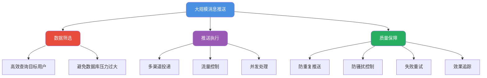

import PaidCTA from '@site/src/components/PaidCTA';

# 大规模消息推送系统设计

## 业务场景与技术挑战

以大型电商平台为例，每逢双十一、618等大促活动，需要向千万级用户精准推送活动预热和开抢提醒。这类场景看似简单，实际包含多个技术挑战：



**关于数据规模的理性认识**：千万级用户数据虽然看起来庞大，但通过合理的分批处理和索引优化，完全可以在可控时间内完成推送，关键在于任务拆分和流量控制。

## 推送任务与投递日志设计

大规模消息系统通常采用任务+日志的双表设计模式，将触达任务与实际投递过程分离，便于任务调度和效果追踪。

### 批次任务表

记录每一次推送活动的整体信息：

```sql
CREATE TABLE push_batch (
    batch_id VARCHAR(32) PRIMARY KEY COMMENT '批次编号',
    campaign_name VARCHAR(128) NOT NULL COMMENT '活动名称',
    trigger_type ENUM('SCHEDULED','MANUAL','EVENT') NOT NULL COMMENT '触发方式',
    audience_sql TEXT COMMENT '目标人群筛选条件',
    template_code VARCHAR(64) NOT NULL COMMENT '消息模板编码',
    planned_count INT UNSIGNED DEFAULT 0 COMMENT '计划推送数量',
    success_count INT UNSIGNED DEFAULT 0 COMMENT '成功数量',
    fail_count INT UNSIGNED DEFAULT 0 COMMENT '失败数量',
    exec_status TINYINT DEFAULT 0 COMMENT '执行状态: 0-待执行 1-执行中 2-已完成 3-已取消',
    scheduled_at DATETIME COMMENT '计划执行时间',
    started_at DATETIME COMMENT '实际开始时间',
    finished_at DATETIME COMMENT '执行完成时间',
    operator VARCHAR(64) COMMENT '操作人',
    gmt_create DATETIME DEFAULT CURRENT_TIMESTAMP,
    INDEX idx_exec_status(exec_status),
    INDEX idx_scheduled(scheduled_at)
) COMMENT='推送批次任务表';
```

### 投递明细表

记录每条消息的投递轨迹：

<PaidCTA />