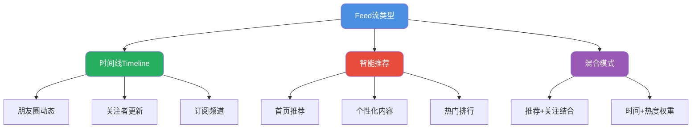

import PaidCTA from '@site/src/components/PaidCTA';

# 信息流Feed系统架构设计

## Feed流系统概述

Feed流是社交和内容平台的核心功能，用户看到的朋友动态、关注者更新、推荐内容等都属于Feed流的范畴。

### Feed流的典型形态

**时间线模式**：按时间顺序展示内容，实现简单，适用于好友社交场景，用户更关注"谁发的"而非"发了什么"。

**智能推荐模式**：基于用户兴趣和行为进行个性化推荐，需要依赖推荐算法，但存在"信息茧房"问题。

**混合模式**：结合时间线和推荐的优点，既保证时效性，又有一定的个性化，是目前主流的方案。

### 核心技术挑战

| 挑战维度 | 具体要求 | 技术难点 |
|---------|---------|---------|
| 实时性 | 发布后秒级可见 | 数据同步延迟控制 |
| 高并发 | 几十万QPS | 读写压力分离 |
| 性能 | 100ms内响应 | 多源数据聚合 |
| 准确性 | 不丢不重 | 分布式一致性 |

## 三种推送模式对比

### 推模式（Push）

<PaidCTA />