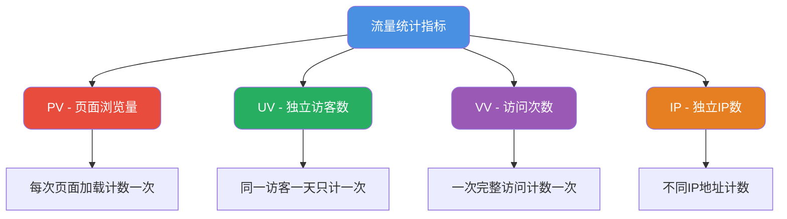
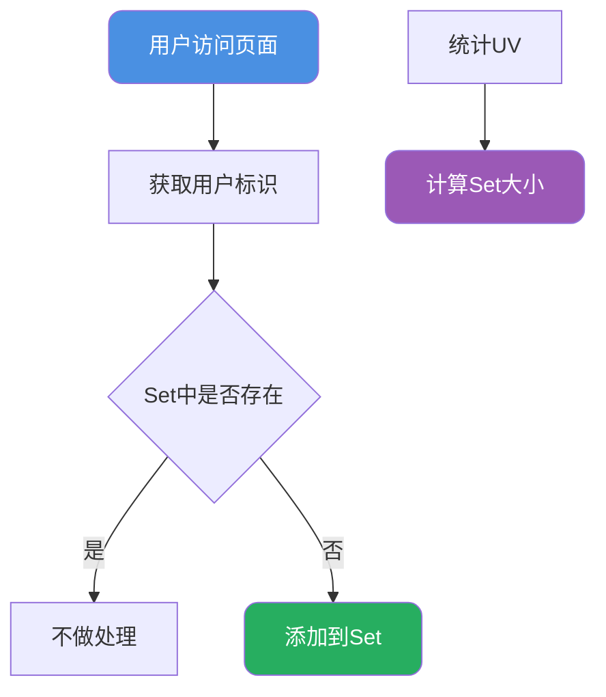

import PaidCTA from '@site/src/components/PaidCTA';

# 网站流量统计与分析方案

## 流量指标体系

在分析网站或应用的活跃度时，有几个核心指标需要掌握：

### 核心指标定义

**举例说明**：

假设用户通过家庭宽带上网，早上访问了电商平台的2个商品页面，下午又访问了3个商品页面：

| 指标 | 计算方式 | 结果 |
|------|---------|------|
| PV | 早上2页 + 下午3页 | 5 |
| UV | 同一访客全天只计1次 | 1 |
| VV | 早上1次 + 下午1次访问 | 2 |
| IP | 宽带可能换IP | 1-2 |

### 指标的业务价值

- **PV**：反映网站内容的吸引力和用户浏览深度
- **UV**：反映真实的用户覆盖面
- **PV/UV比值**：反映用户粘性，比值越高说明单用户浏览越多
- **IP**：用于判断用户地域分布和识别异常流量

## UV统计技术方案

### 方案一：Set集合精确统计

最直观的实现方式是为每个页面维护一个用户ID集合：

**Redis Set实现**：

<PaidCTA />