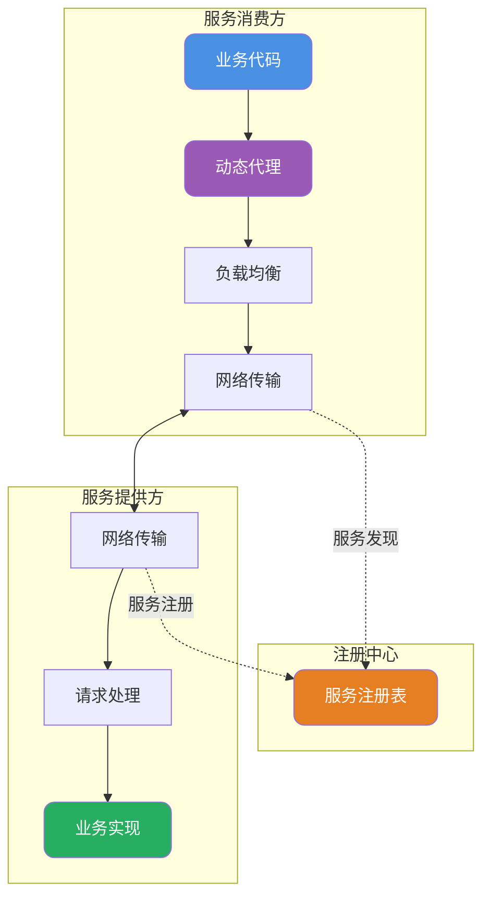
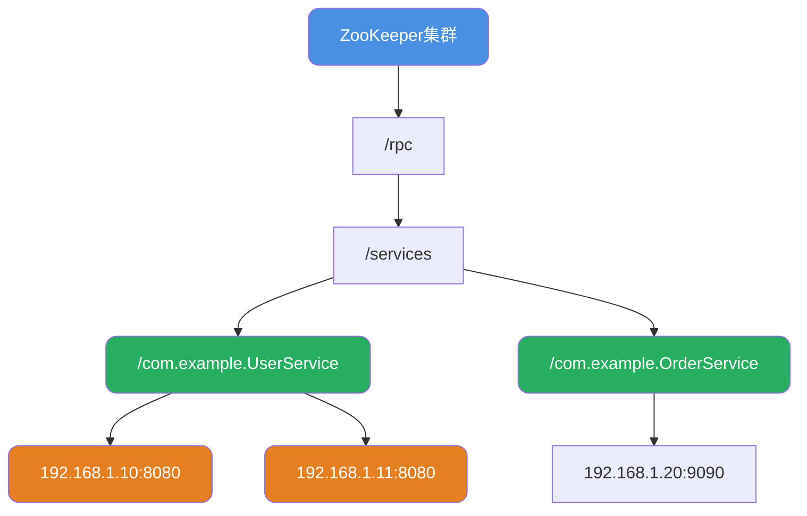

import PaidCTA from '@site/src/components/PaidCTA';

# RPC框架设计与实现原理

## RPC框架核心概念

RPC（Remote Procedure Call）远程过程调用，其目标是让远程服务调用像本地方法调用一样简单。一个完整的RPC框架需要解决服务发现、网络传输、序列化、负载均衡等多个技术问题。

### 整体架构设计

### 核心组件职责

| 组件 | 职责描述 | 技术选型 |
|------|---------|---------|
| 注册中心 | 服务地址的注册与发现 | ZooKeeper/Nacos/Consul |
| 网络传输 | 客户端与服务端的数据通信 | Netty/Mina |
| 序列化 | 对象与字节流的相互转换 | Protobuf/Kryo/Hessian |
| 动态代理 | 屏蔽远程调用细节 | JDK动态代理/CGLIB |
| 负载均衡 | 多服务实例间的请求分发 | 随机/轮询/一致性哈希 |

## 注册中心设计

### ZooKeeper作为注册中心

**服务注册实现**：

<PaidCTA />