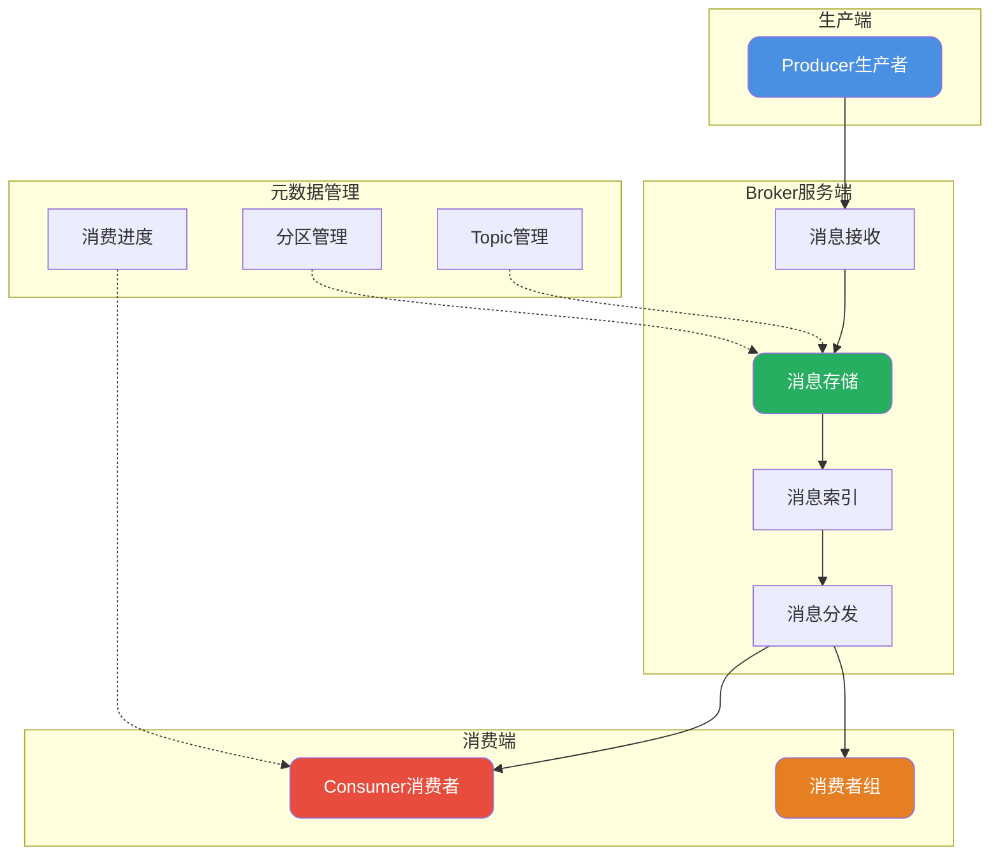
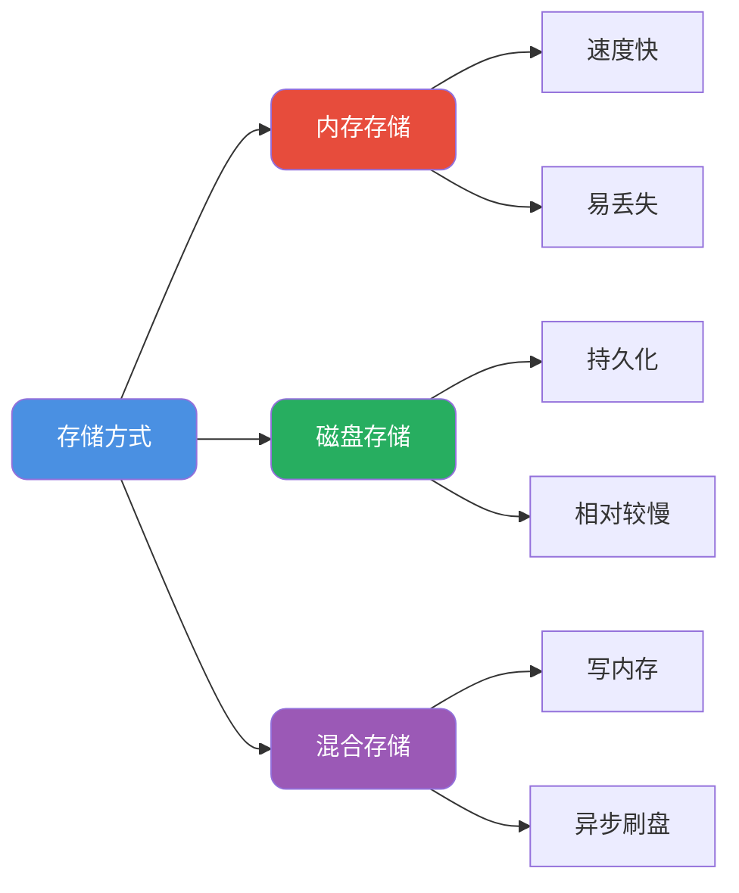

import PaidCTA from '@site/src/components/PaidCTA';

# 消息队列设计核心要点

## 消息队列架构概述

设计一个消息队列系统需要从多个维度进行考量，包括架构设计、消息可靠性、高性能实现以及功能扩展等方面。

### 核心架构组成

### 核心概念定义

| 概念 | 说明 | 作用 |
|------|------|------|
| Producer | 消息生产者 | 负责发送消息到Broker |
| Consumer | 消息消费者 | 负责从Broker获取消息 |
| Broker | 消息服务端 | 负责消息存储、转发 |
| Topic | 消息主题 | 消息分类标识 |
| Partition | 分区 | Topic的物理分割，提升并行度 |
| Consumer Group | 消费者组 | 多消费者协作消费 |

## 消息存储设计

### 存储介质选择

**生产级方案通常采用混合存储**：
- 消息先写入内存缓冲区
- 异步或同步刷盘到磁盘
- 通过配置平衡性能与可靠性

### 顺序写入优化

磁盘顺序写性能可以接近内存随机写，这是消息队列高性能的关键：

<PaidCTA />