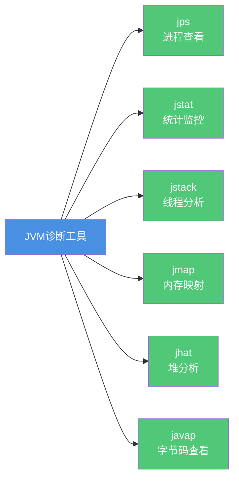
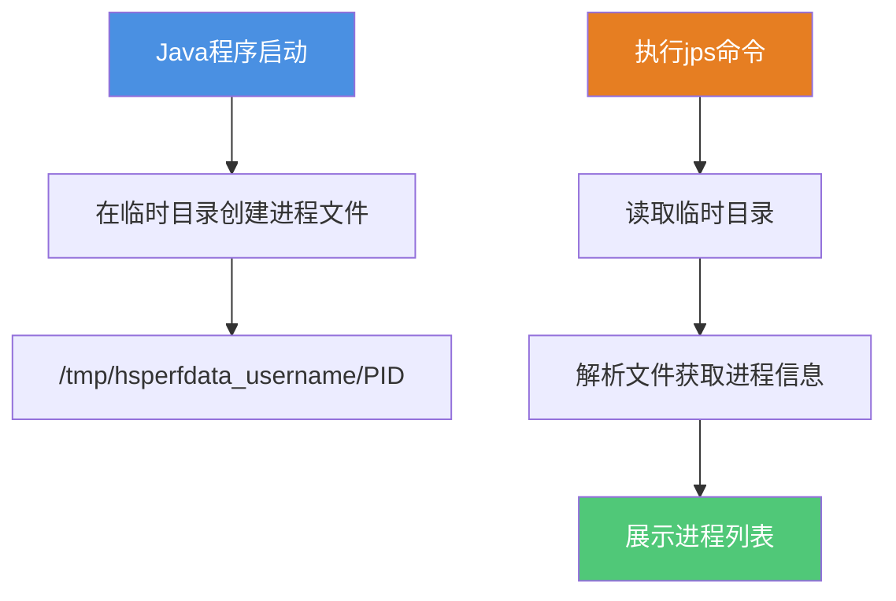
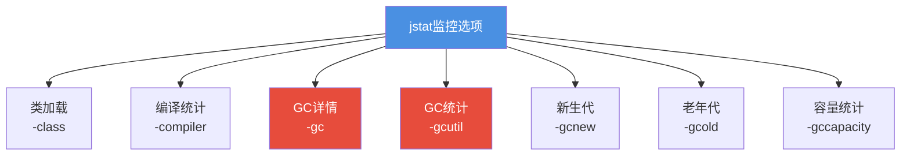
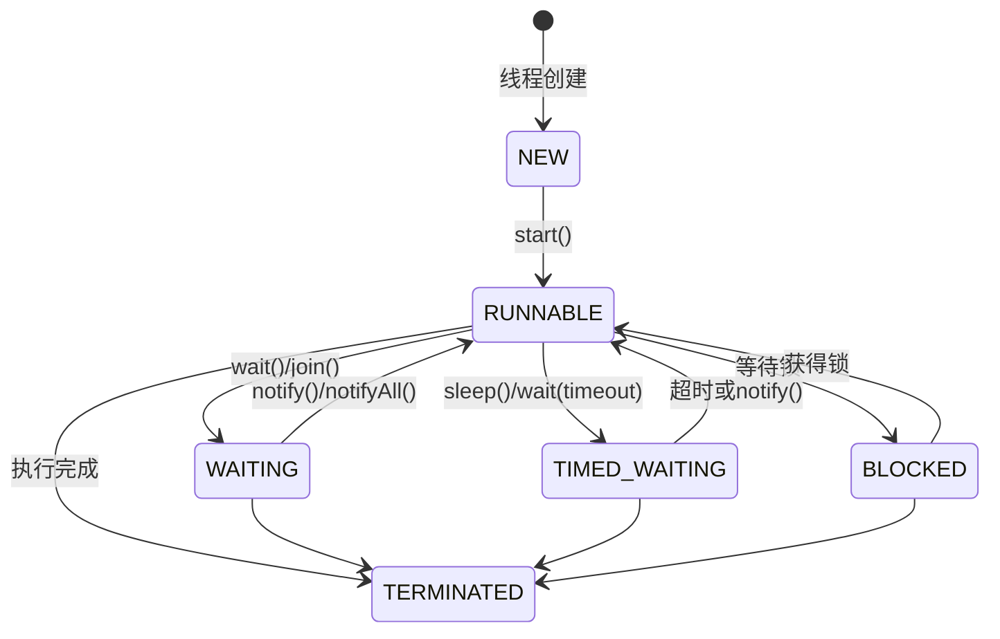
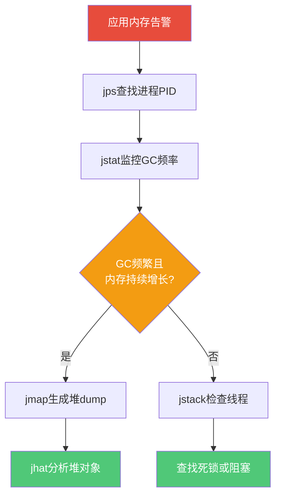
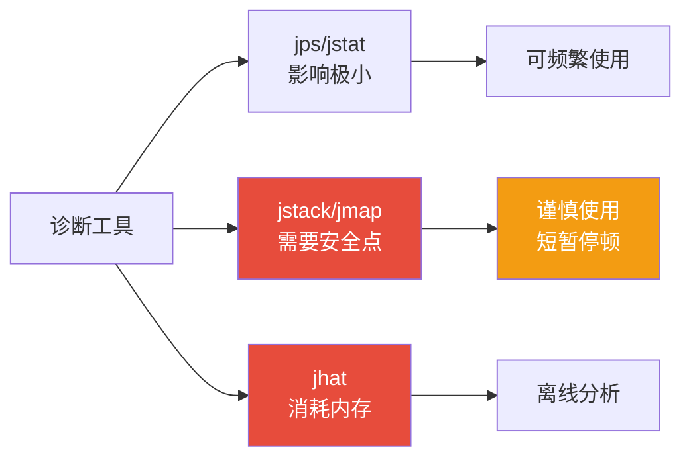

# JVM诊断工具命令详解

## JVM进程诊断工具概览

在日常开发和生产环境中,我们经常需要对Java应用进行问题排查和性能分析。JDK自带了一套强大的命令行工具,能够帮助我们快速定位问题根源。这些工具主要包括jps、jstat、jstack、jmap、jhat和javap,它们各司其职,构成了完整的JVM诊断体系。



## jps - Java进程状态工具

### 核心功能

jps(Java Virtual Machine Process Status Tool)是JDK 1.5引入的进程查看工具,用于显示当前系统中所有正在运行的Java进程及其PID。它是使用其他JVM诊断工具的前提,因为大多数工具都需要指定进程ID。

### 实现原理

当Java程序启动后,JVM会在系统临时目录(java.io.tmpdir指定的位置)下创建一个特殊的文件夹。在Linux系统中,这个文件夹位于`/tmp/hsperfdata_{userName}/`,文件夹内的每个文件名就是对应Java进程的PID。jps命令的本质就是列出这个目录下的所有文件名。



### 常用参数

```bash
# 基础用法
jps

# 仅显示进程ID
jps -q

# 显示传递给main方法的参数
jps -m

# 显示main类的完整包名或jar文件路径
jps -l

# 显示传递给JVM的参数
jps -v
```

### 实战案例

假设我们开发了一个订单处理系统,启动时传入了自定义参数:

```java
public class OrderProcessor {
    public static void main(String[] args) {
        // args包含: region=cn,env=prod
        while(true) {
            // 业务逻辑
            processOrders();
        }
    }
    
    private static void processOrders() {
        // 处理订单逻辑
    }
}
```

使用不同参数查看进程信息:

```bash
# 查看所有Java进程
$ jps
15823 OrderProcessor
15867 Jps

# 查看main方法参数
$ jps -m
15823 OrderProcessor region=cn,env=prod

# 查看完整类名
$ jps -l
15823 com.example.order.OrderProcessor

# 查看JVM参数
$ jps -v
15823 OrderProcessor -Xms2g -Xmx4g -XX:+UseG1GC
```

## jstat - JVM统计监控工具

### 核心功能

jstat(JVM Statistics Monitoring Tool)是一个轻量级的性能监控工具,可以实时查看类加载、内存使用、垃圾回收等运行数据。相比图形化工具,jstat在无GUI的服务器环境中非常实用。

### 命令格式

```bash
jstat -<option> [-t] [-h<lines>] <vmid> [<interval> [<count>]]
```

参数说明:
- **option**: 监控选项(如-gc、-gcutil等)
- **vmid**: 进程ID
- **interval**: 查询间隔时间(毫秒)
- **count**: 查询次数

### 核心选项



### 实战应用

监控电商系统的GC情况,每秒查询一次,共查询10次:

```bash
$ jstat -gcutil 15823 1000 10

S0     S1     E      O      M     CCS    YGC     YGCT    FGC    FGCT     GCT   
0.00  85.23  45.67  23.45  95.12  92.34   156    1.234     2   0.456   1.690
0.00  85.23  56.78  23.45  95.12  92.34   156    1.234     2   0.456   1.690
```

列含义:
- **S0/S1**: Survivor区使用率
- **E**: Eden区使用率  
- **O**: Old区使用率
- **M**: Metaspace使用率
- **YGC**: Young GC次数
- **YGCT**: Young GC总耗时
- **FGC**: Full GC次数
- **FGCT**: Full GC总耗时

## jstack - 线程堆栈分析工具

### 核心功能

jstack用于生成JVM当前时刻的线程快照,即所有线程正在执行的方法调用栈集合。它是定位线程长时间停顿、死锁、死循环等问题的利器。

:::warning 重要提示
执行jstack时,JVM会进入安全点(Safepoint)并暂停所有线程,以确保获取的线程快照准确一致。这个过程可能会短暂影响应用响应。
:::

### 命令参数

```bash
# 标准用法
jstack <pid>

# 强制dump(当进程无响应时)
jstack -F <pid>

# 打印锁的额外信息
jstack -l <pid>

# 混合模式(包含native栈帧)
jstack -m <pid>
```

### 线程状态分析



### 实战案例

分析一个支付服务的线程状态:

```java
public class PaymentService {
    private final Object lock = new Object();
    
    public void processPayment() {
        synchronized(lock) {
            // 支付处理逻辑
            handleTransaction();
        }
    }
    
    private void handleTransaction() {
        // 模拟耗时操作
        while(true) {
            validatePayment();
        }
    }
    
    private void validatePayment() {
        // 验证支付
    }
}
```

执行jstack查看线程堆栈:

```bash
$ jstack 18234

"payment-thread-1" #12 prio=5 os_prio=0 tid=0x00007f8c4c001000 nid=0x4738 runnable [0x00007f8c3d5fc000]
   java.lang.Thread.State: RUNNABLE
        at com.example.PaymentService.validatePayment(PaymentService.java:18)
        at com.example.PaymentService.handleTransaction(PaymentService.java:13)
        at com.example.PaymentService.processPayment(PaymentService.java:8)
        - locked <0x0000000787e12340> (a java.lang.Object)

"Reference Handler" daemon prio=10 tid=0x00007f8c4c06e000 nid=0x4739 in Object.wait() [0x00007f8c3d4fb000]
   java.lang.Thread.State: WAITING (on object monitor)
        at java.lang.Object.wait(Native Method)
        - waiting on <0x0000000787e066e0> (a java.lang.ref.Reference$Lock)
        at java.lang.Object.wait(Object.java:503)
        at java.lang.ref.Reference$ReferenceHandler.run(Reference.java:133)
        - locked <0x0000000787e066e0> (a java.lang.ref.Reference$Lock)
```

从堆栈信息可以看出:
- payment-thread-1线程处于RUNNABLE状态
- 持有锁`<0x0000000787e12340>`
- 正在执行`validatePayment`方法,可能存在死循环

## javap - 字节码反编译工具

### 核心功能

javap是JDK自带的字节码查看工具,虽然很少用于完整的反编译(有更好的工具如jad),但它是查看编译器生成的字节码指令的首选工具,对于理解Java底层实现机制非常有帮助。

### 常用参数

```bash
# 查看类的基本信息
javap ClassName

# 查看字节码指令
javap -c ClassName

# 查看详细信息(包含常量池)
javap -v ClassName

# 查看私有成员
javap -p ClassName
```

### 实战分析

分析字符串拼接的底层实现:

```java
public class StringConcatDemo {
    public static void main(String[] args) {
        String company = "AliBaba";
        String department = "Technology";
        String team = company + department;
        
        Integer count = Integer.valueOf(100);
        String result = count.toString();
    }
}
```

编译后使用javap查看字节码:

```bash
$ javac StringConcatDemo.java
$ javap -c -v StringConcatDemo

Constant pool:
   #1 = Methodref          #8.#20         // java/lang/Object."<init>":()V
   #2 = String             #21            // AliBaba
   #3 = String             #22            // Technology
   #4 = Methodref          #23.#24        // java/lang/Integer.valueOf:(I)Ljava/lang/Integer;
   #5 = Methodref          #23.#25        // java/lang/Integer.toString:()Ljava/lang/String;
   ...

public static void main(java.lang.String[]);
    Code:
       0: ldc           #2                  // String AliBaba
       2: astore_1
       3: ldc           #3                  // String Technology
       5: astore_2
       6: new           #7                  // class java/lang/StringBuilder
       9: dup
      10: invokespecial #8                  // Method java/lang/StringBuilder."<init>":()V
      13: aload_1
      14: invokevirtual #9                  // Method java/lang/StringBuilder.append:(Ljava/lang/String;)
      17: aload_2
      18: invokevirtual #9                  // Method java/lang/StringBuilder.append:(Ljava/lang/String;)
      21: invokevirtual #10                 // Method java/lang/StringBuilder.toString:()Ljava/lang/String;
      24: astore_3
      25: bipush        100
      27: invokestatic  #4                  // Method java/lang/Integer.valueOf:(I)
      30: astore        4
      32: aload         4
      34: invokevirtual #5                  // Method java/lang/Integer.toString:()
      37: astore        5
      39: return
```

从字节码可以看出:
- 字符串拼接实际使用`StringBuilder`实现
- `Integer.valueOf(100)`使用了装箱机制
- 常量池中预先存储了字符串字面量

## 工具组合实战

### 场景:定位内存泄漏



### 诊断流程

```bash
# 1. 查找目标进程
jps -l | grep OrderService
# 输出: 23456 com.example.OrderService

# 2. 监控GC情况(每秒一次,共60次)
jstat -gcutil 23456 1000 60

# 3. 如果发现频繁Full GC,检查线程状态
jstack 23456 > thread_dump.txt

# 4. 生成堆dump进一步分析(后续章节详述)
jmap -dump:live,format=b,file=heap.bin 23456
```

## 使用注意事项

### 性能影响



### 最佳实践

1. **生产环境使用原则**:
   - jps和jstat可以频繁使用,影响微乎其微
   - jstack和jmap会触发STW(Stop-The-World),避免在高峰期执行
   - 大堆内存应用执行jmap可能导致长时间暂停

2. **权限要求**:
   - 必须使用启动Java进程的同一用户执行诊断命令
   - 跨用户查看需要使用系统级别命令(如ps)

3. **数据保存**:
   - 线程dump建议保存多份(间隔10秒),便于对比分析
   - 堆dump文件较大,确保磁盘空间充足

## 总结

JVM诊断工具是Java开发者必备的技能,合理运用这些工具能够快速定位生产问题:

- **jps**: 进程查看的起点,获取PID
- **jstat**: 轻量级监控,观察GC和内存趋势  
- **jstack**: 线程分析专家,定位死锁和阻塞
- **jmap**: 内存快照工具,深度分析必备
- **jhat**: 堆分析助手,配合jmap使用
- **javap**: 字节码查看,理解底层原理

掌握这些工具的组合使用,能够构建完整的问题诊断链路,从现象定位到根因分析,从表象观察到深层剖析。
