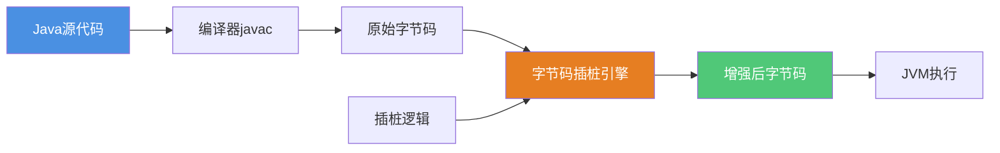
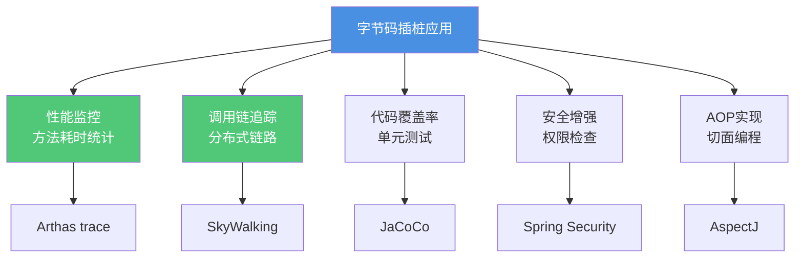
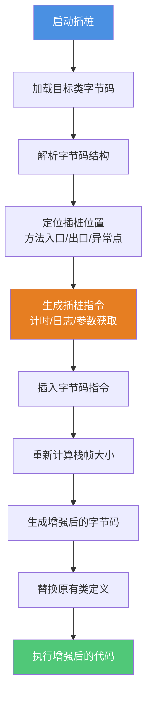
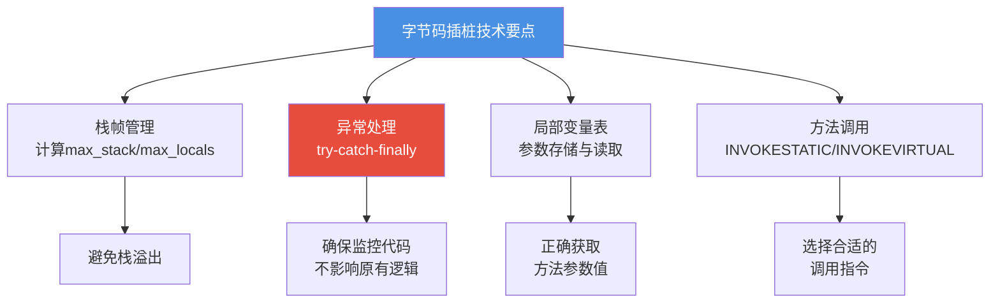
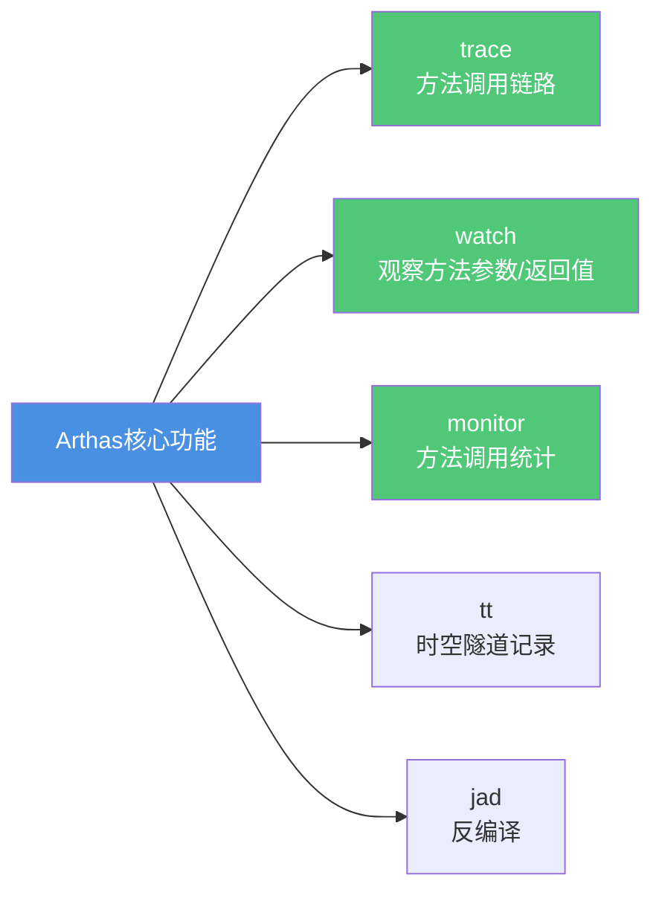
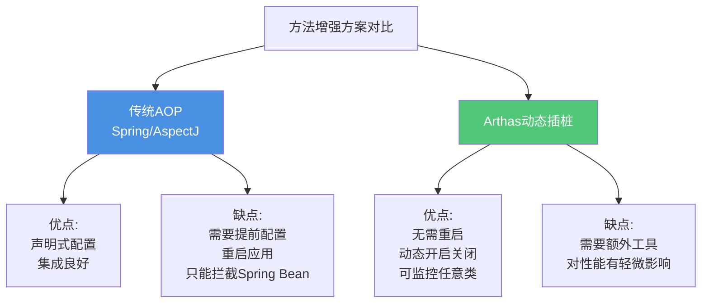
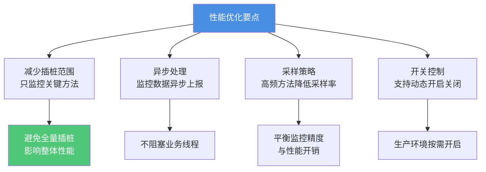

# 字节码插桩技术与性能监控

## 字节码增强技术概述

在Java应用的性能监控和问题诊断领域,字节码增强技术扮演着至关重要的角色。它允许我们在不修改源代码的情况下,动态地向程序中注入监控逻辑,实现方法耗时统计、参数追踪、异常捕获等强大功能。Arthas作为阿里开源的Java诊断工具,正是基于这项技术实现了无侵入式的在线诊断能力。

### 什么是字节码插桩

字节码插桩(Bytecode Instrumentation)是指在Java字节码层面修改程序行为的技术。通过在编译期或运行期向字节码中插入额外的指令,我们可以在原有代码执行前后添加自定义逻辑,而无需改动Java源代码。



### 字节码插桩的应用场景



字节码插桩技术的核心优势:
- **无侵入性**: 不修改源代码,保持业务逻辑纯净
- **动态性**: 运行时可随时开启或关闭监控
- **全面性**: 可监控任意方法,包括第三方库
- **高效性**: 直接操作字节码,性能开销小

## 字节码插桩实现原理

### 插桩流程详解

字节码插桩的核心流程包括以下几个关键步骤:



### 手动实现方法耗时统计

让我们通过一个具体案例来理解字节码插桩的实现细节。假设我们需要监控一个订单处理服务的方法耗时:

**原始业务代码:**

```java
public class OrderService {
    public void processOrder(String orderId) {
        // 查询订单信息
        Order order = queryOrderById(orderId);
        
        // 验证订单状态
        validateOrder(order);
        
        // 处理订单
        handleOrder(order);
    }
    
    private Order queryOrderById(String orderId) {
        // 数据库查询逻辑
        return new Order(orderId);
    }
    
    private void validateOrder(Order order) {
        // 订单验证逻辑
    }
    
    private void handleOrder(Order order) {
        // 订单处理逻辑
    }
}
```

**监控工具类(插桩后调用):**

```java
public class PerformanceMonitor {
    // 使用ThreadLocal存储每个线程的开始时间
    private static ThreadLocal<Long> startTimeHolder = new ThreadLocal<>();
    
    public static void recordStart() {
        long startTime = System.nanoTime();
        startTimeHolder.set(startTime);
    }
    
    public static void recordEnd(String methodName) {
        long endTime = System.nanoTime();
        Long startTime = startTimeHolder.get();
        
        if (startTime != null) {
            long elapsed = endTime - startTime;
            double milliseconds = elapsed / 1_000_000.0;
            System.out.printf("[性能监控] 方法 %s 耗时: %.2f ms%n", 
                methodName, milliseconds);
            startTimeHolder.remove();
        }
    }
    
    public static void recordException(String methodName, Throwable throwable) {
        recordEnd(methodName);
        System.out.printf("[性能监控] 方法 %s 发生异常: %s%n", 
            methodName, throwable.getMessage());
    }
}
```

### 使用ASM实现字节码增强

ASM是Java中最流行的字节码操作框架,以下是使用ASM对OrderService进行插桩的实现:

```java
import org.objectweb.asm.*;

public class PerformanceTransformer implements Opcodes {
    
    /**
     * 对类的字节码进行转换
     * @param classBytes 原始字节码
     * @return 增强后的字节码
     */
    public static byte[] transform(byte[] classBytes) {
        ClassReader reader = new ClassReader(classBytes);
        ClassWriter writer = new ClassWriter(ClassWriter.COMPUTE_MAXS | ClassWriter.COMPUTE_FRAMES);
        
        // 创建访问器链
        ClassVisitor visitor = new ClassVisitor(ASM9, writer) {
            @Override
            public MethodVisitor visitMethod(int access, String name, String desc, 
                                            String signature, String[] exceptions) {
                MethodVisitor mv = super.visitMethod(access, name, desc, signature, exceptions);
                
                // 跳过构造方法和静态初始化块
                if (name.equals("<init>") || name.equals("<clinit>")) {
                    return mv;
                }
                
                // 为普通方法添加监控逻辑
                return new MethodTimingVisitor(mv, name);
            }
        };
        
        reader.accept(visitor, ClassReader.EXPAND_FRAMES);
        return writer.toByteArray();
    }
    
    /**
     * 方法访问器,负责插入监控代码
     */
    static class MethodTimingVisitor extends MethodVisitor {
        private final String methodName;
        private final Label startLabel = new Label();
        private final Label endLabel = new Label();
        private final Label catchLabel = new Label();
        
        public MethodTimingVisitor(MethodVisitor mv, String methodName) {
            super(ASM9, mv);
            this.methodName = methodName;
        }
        
        @Override
        public void visitCode() {
            super.visitCode();
            
            // 在方法开始处插入: PerformanceMonitor.recordStart()
            mv.visitMethodInsn(INVOKESTATIC, 
                "com/example/monitor/PerformanceMonitor", 
                "recordStart", 
                "()V", 
                false);
            
            // 标记try块开始
            mv.visitLabel(startLabel);
        }
        
        @Override
        public void visitInsn(int opcode) {
            // 在方法返回前插入: PerformanceMonitor.recordEnd(methodName)
            if (opcode >= IRETURN && opcode <= RETURN) {
                mv.visitLdcInsn(methodName);
                mv.visitMethodInsn(INVOKESTATIC, 
                    "com/example/monitor/PerformanceMonitor", 
                    "recordEnd", 
                    "(Ljava/lang/String;)V", 
                    false);
            }
            super.visitInsn(opcode);
        }
        
        @Override
        public void visitMaxs(int maxStack, int maxLocals) {
            // 标记try块结束
            mv.visitLabel(endLabel);
            
            // 添加catch块
            mv.visitLabel(catchLabel);
            mv.visitVarInsn(ASTORE, maxLocals); // 存储异常对象
            
            // 调用: PerformanceMonitor.recordException(methodName, exception)
            mv.visitLdcInsn(methodName);
            mv.visitVarInsn(ALOAD, maxLocals);
            mv.visitMethodInsn(INVOKESTATIC, 
                "com/example/monitor/PerformanceMonitor", 
                "recordException", 
                "(Ljava/lang/String;Ljava/lang/Throwable;)V", 
                false);
            
            // 重新抛出异常
            mv.visitVarInsn(ALOAD, maxLocals);
            mv.visitInsn(ATHROW);
            
            // 添加异常表项
            mv.visitTryCatchBlock(startLabel, endLabel, catchLabel, "java/lang/Throwable");
            
            super.visitMaxs(maxStack + 2, maxLocals + 1);
        }
    }
}
```

**增强后的字节码等效代码:**

```java
public class OrderService {
    public void processOrder(String orderId) {
        PerformanceMonitor.recordStart();
        try {
            Order order = queryOrderById(orderId);
            validateOrder(order);
            handleOrder(order);
            PerformanceMonitor.recordEnd("processOrder");
        } catch (Throwable t) {
            PerformanceMonitor.recordException("processOrder", t);
            throw t;
        }
    }
    
    private Order queryOrderById(String orderId) {
        PerformanceMonitor.recordStart();
        try {
            Order result = new Order(orderId);
            PerformanceMonitor.recordEnd("queryOrderById");
            return result;
        } catch (Throwable t) {
            PerformanceMonitor.recordException("queryOrderById", t);
            throw t;
        }
    }
    
    // 其他方法类似...
}
```

### 字节码插桩的关键技术点



## Arthas方法耗时统计原理

### Arthas简介

Arthas是阿里巴巴开源的Java诊断工具,可以在不重启应用的情况下实时查看应用运行状态、监控方法执行、热更新代码等。其核心能力就是基于字节码插桩技术实现的。



### trace命令原理

当我们使用`arthas trace`命令时,Arthas会:

1. **Attach到目标JVM进程**
2. **使用Java Agent机制加载Arthas代理**
3. **通过Instrumentation API重新定义目标类**
4. **在方法入口和出口插入计时代码**
5. **实时输出调用链路和耗时信息**

**实战演示:**

```bash
# 启动Arthas
$ java -jar arthas-boot.jar

# 选择目标进程
[1]: 35621 com.example.OrderService

# 追踪订单处理方法
$ trace com.example.OrderService processOrder

Press Q or Ctrl+C to abort.
Affect(class count: 1 , method count: 1) cost in 156 ms, listenerId: 1

`---ts=2025-12-02 15:30:25;thread_name=order-pool-1;id=2f;is_daemon=false;priority=5;TCCL=org.springframework.boot.loader.LaunchedURLClassLoader@5c8da962
    `---[128.456789 ms] com.example.OrderService:processOrder()
        +---[45.123456 ms] com.example.OrderService:queryOrderById() #15
        +---[12.345678 ms] com.example.OrderService:validateOrder() #18
        `---[68.987654 ms] com.example.OrderService:handleOrder() #21
```

### Arthas插桩实现细节

Arthas使用了Java Instrumentation API + ASM框架实现动态插桩:

```java
// Arthas核心插桩逻辑(简化版)
public class ArthasTransformer implements ClassFileTransformer {
    
    @Override
    public byte[] transform(ClassLoader loader, String className, 
                          Class<?> classBeingRedefined, 
                          ProtectionDomain protectionDomain,
                          byte[] classfileBuffer) {
        
        // 判断是否为目标类
        if (!isTargetClass(className)) {
            return null;
        }
        
        try {
            ClassReader cr = new ClassReader(classfileBuffer);
            ClassWriter cw = new ClassWriter(cr, ClassWriter.COMPUTE_FRAMES);
            
            // 添加trace逻辑的访问器
            ClassVisitor cv = new TraceClassVisitor(cw, targetMethod);
            cr.accept(cv, ClassReader.EXPAND_FRAMES);
            
            return cw.toByteArray();
        } catch (Exception e) {
            logger.error("字节码增强失败", e);
            return null;
        }
    }
    
    private boolean isTargetClass(String className) {
        return className.equals("com/example/OrderService");
    }
}

// Trace访问器实现
class TraceClassVisitor extends ClassVisitor {
    private final String targetMethod;
    
    public TraceClassVisitor(ClassVisitor cv, String targetMethod) {
        super(ASM9, cv);
        this.targetMethod = targetMethod;
    }
    
    @Override
    public MethodVisitor visitMethod(int access, String name, String desc, 
                                    String signature, String[] exceptions) {
        MethodVisitor mv = super.visitMethod(access, name, desc, signature, exceptions);
        
        if (name.equals(targetMethod)) {
            return new TraceMethodVisitor(mv, name, desc);
        }
        return mv;
    }
}

class TraceMethodVisitor extends AdviceAdapter {
    private int adviceId;
    private int startTimeVar;
    
    protected TraceMethodVisitor(MethodVisitor mv, String name, String desc) {
        super(ASM9, mv, ACC_PUBLIC, name, desc);
        this.adviceId = TraceAdviceRegistry.register(name);
    }
    
    @Override
    protected void onMethodEnter() {
        // 生成: long startTime = System.nanoTime();
        startTimeVar = newLocal(Type.LONG_TYPE);
        mv.visitMethodInsn(INVOKESTATIC, 
            "java/lang/System", 
            "nanoTime", 
            "()J", 
            false);
        mv.visitVarInsn(LSTORE, startTimeVar);
        
        // 通知Arthas开始追踪
        push(adviceId);
        mv.visitMethodInsn(INVOKESTATIC, 
            "com/taobao/arthas/core/advisor/TraceAdvice", 
            "onBefore", 
            "(I)V", 
            false);
    }
    
    @Override
    protected void onMethodExit(int opcode) {
        // 计算耗时
        mv.visitMethodInsn(INVOKESTATIC, 
            "java/lang/System", 
            "nanoTime", 
            "()J", 
            false);
        mv.visitVarInsn(LLOAD, startTimeVar);
        mv.visitInsn(LSUB);
        
        // 通知Arthas方法结束
        push(adviceId);
        mv.visitInsn(SWAP);
        mv.visitMethodInsn(INVOKESTATIC, 
            "com/taobao/arthas/core/advisor/TraceAdvice", 
            "onAfter", 
            "(IJ)V", 
            false);
    }
}
```

### Arthas与传统AOP对比



## 字节码插桩的高级应用

### 参数值追踪

除了统计耗时,字节码插桩还可以捕获方法参数和返回值:

```java
// 使用Arthas watch命令
$ watch com.example.OrderService processOrder '{params, returnObj, throwExp}' -x 2

Press Q or Ctrl+C to abort.
Affect(class count: 1 , method count: 1) cost in 89 ms, listenerId: 2

method=com.example.OrderService.processOrder location=AtExit
ts=2025-12-02 15:35:12; result=@ArrayList[
    @Object[][
        @String[order-20251202-001],
    ],
    null,
    null,
]
```

实现原理是在方法入口处将参数值保存到局部变量:

```java
// 插桩后等效代码
public void processOrder(String orderId) {
    Object[] params = new Object[]{orderId};
    Object returnValue = null;
    Throwable exception = null;
    
    try {
        // 原始业务逻辑
        Order order = queryOrderById(orderId);
        validateOrder(order);
        handleOrder(order);
        
        WatchAdvice.onReturn(params, returnValue);
    } catch (Throwable t) {
        exception = t;
        WatchAdvice.onThrow(params, exception);
        throw t;
    }
}
```

### 热更新代码

Arthas的`redefine`命令可以在不重启应用的情况下更新类定义:

```bash
# 修复bug后,热更新OrderService
$ redefine /tmp/OrderService.class

redefine success, size: 1, classes:
com.example.OrderService
```

实现原理:


:::warning 热更新限制
Java的热更新有诸多限制:
- 不能修改类的继承关系
- 不能添加或删除字段
- 不能添加或删除方法
- 只能修改方法体内的代码逻辑
:::

### 分布式链路追踪

SkyWalking、Pinpoint等APM工具也是基于字节码插桩实现的:

```java
// SkyWalking插桩示例(简化版)
public class HttpClientInstrumentation {
    
    // 拦截Apache HttpClient的execute方法
    @RuntimeType
    public static Object intercept(@This Object target,
                                  @AllArguments Object[] args,
                                  @SuperCall Callable<?> callable) throws Exception {
        
        // 创建span记录调用
        AbstractSpan span = ContextManager.createExitSpan("HTTP-Client", getPeer(args));
        
        try {
            // 注入trace上下文到HTTP Header
            CarrierItem next = ContextManager.inject();
            while (next.hasNext()) {
                next = next.next();
                ((HttpRequest)args[0]).setHeader(next.getHeadKey(), next.getHeadValue());
            }
            
            // 执行原始方法
            Object result = callable.call();
            
            return result;
        } catch (Throwable t) {
            span.errorOccurred().log(t);
            throw t;
        } finally {
            span.asyncFinish();
        }
    }
}
```

## 字节码插桩最佳实践

### 性能优化建议



### 安全注意事项

1. **权限控制**: 字节码修改权限应严格限制,防止恶意利用
2. **版本兼容**: 不同JDK版本字节码格式可能不同,需做兼容处理
3. **异常处理**: 插桩代码必须捕获所有异常,不能影响原有业务逻辑
4. **内存管理**: ThreadLocal等资源使用后必须清理,避免内存泄漏

### 生产环境使用规范

```java
// 推荐的监控配置
public class MonitorConfig {
    // 是否启用监控
    private static volatile boolean enabled = false;
    
    // 采样率(0.0-1.0)
    private static volatile double sampleRate = 0.1;
    
    public static boolean shouldMonitor() {
        if (!enabled) {
            return false;
        }
        return Math.random() < sampleRate;
    }
    
    public static void enable() {
        enabled = true;
    }
    
    public static void disable() {
        enabled = false;
    }
    
    public static void setSampleRate(double rate) {
        if (rate >= 0.0 && rate <= 1.0) {
            sampleRate = rate;
        }
    }
}

// 监控工具类改进
public class PerformanceMonitor {
    private static ThreadLocal<Long> startTimeHolder = new ThreadLocal<>();
    
    public static void recordStart() {
        // 根据配置决定是否监控
        if (!MonitorConfig.shouldMonitor()) {
            return;
        }
        startTimeHolder.set(System.nanoTime());
    }
    
    public static void recordEnd(String methodName) {
        Long startTime = startTimeHolder.get();
        if (startTime == null) {
            return;
        }
        
        try {
            long elapsed = System.nanoTime() - startTime;
            // 异步上报监控数据,不阻塞业务线程
            MetricsReporter.reportAsync(methodName, elapsed);
        } finally {
            startTimeHolder.remove();
        }
    }
}
```

## 总结

字节码插桩技术是Java性能监控和问题诊断的基石,通过本文我们深入了解了:

1. **插桩原理**: 在字节码层面修改程序行为,实现无侵入式监控
2. **实现方式**: 使用ASM等框架操作字节码,在方法入口/出口插入监控代码
3. **Arthas原理**: 利用Java Agent + Instrumentation API实现动态插桩
4. **最佳实践**: 性能优化、安全控制、生产环境使用规范

相比传统的基于AOP框架的监控方案,字节码插桩具有动态性强、适用范围广、性能开销低的优势。掌握这项技术,能够帮助我们构建更强大的监控体系,快速定位和解决生产环境问题。

在实际应用中,建议结合业务特点选择合适的插桩粒度和监控策略,既要保证监控的有效性,又要控制对系统性能的影响。Arthas等成熟工具已经为我们提供了开箱即用的能力,但理解其背后的原理能让我们更灵活地应对各种诊断场景。
