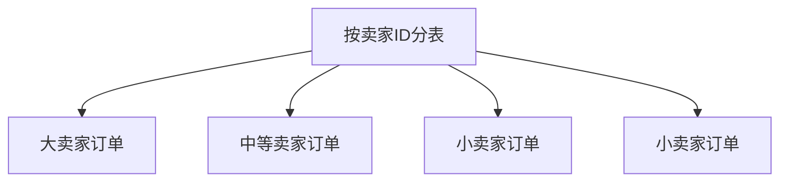
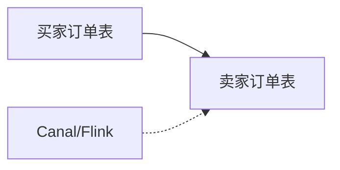
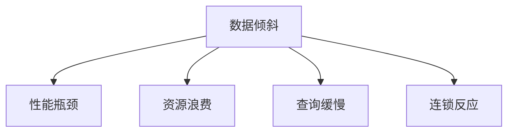
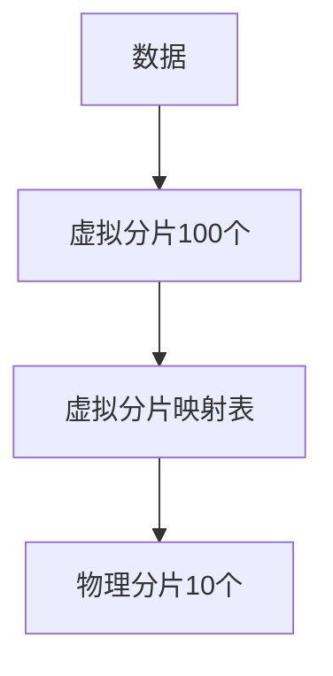
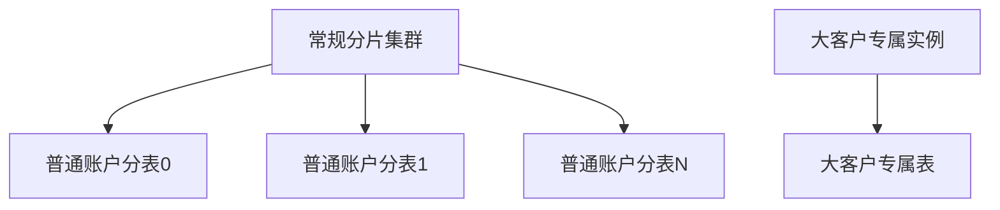

## 分表字段的选择原则

在分库分表方案中,分表字段(ShardingKey)的选择直接影响数据分布均匀性和查询性能。选择不当会导致严重的数据倾斜问题,使分表效果大打折扣。

### 核心选择标准

**分表字段必须满足以下条件:**

1. **高散列性**:字段值分布均匀,避免集中在少数值上
2. **高频查询**:业务查询经常携带该字段,减少跨表查询
3. **低更新频率**:字段值相对稳定,避免频繁路由变更

### 典型场景:订单表分表字段选型

以电商订单表为例,可选字段包括:买家ID、卖家ID、订单号、时间、地区等。如何抉择?

#### 为什么选择买家ID而非卖家ID

买家ID是推荐的分表字段,主要原因:

**避免数据倾斜:** 大型商家(如苏宁易购、当当网等旗舰店)每天产生海量订单。若按卖家ID分表,这些大商家的所有订单会集中在同一张表,导致:

- 单表数据量暴增,失去分表意义
- 该表查询性能急剧下降
- 影响同表中其他小商家的查询体验



相比之下,买家ID分布更均匀,单个买家订单量通常不会造成数据倾斜。

**理解分表机制:** 按买家ID分表并非为每个买家创建独立表,而是通过路由算法将买家映射到固定数量的分表。例如分1024张表时:

```java
// 分表路由算法示例
int tableIndex = buyerId.hashCode() % 1024;
String tableName = "t_order_" + String.format("%04d", tableIndex);
```

这样可以确保同一买家的所有订单始终落在同一张表,便于查询。

### 应对卖家查询场景

按买家ID分表后,如何支持卖家查询自己的订单?

#### 方案:异步同步卖家维度表

采用空间换时间策略,通过binlog实时同步构建卖家维度的分表:



**关键设计要点:**

1. **卖家表只读**:所有写操作仍在买家表执行,卖家表仅接收同步数据
2. **准实时延迟**:通常存在秒级延迟,业务上可接受
3. **数据库选型灵活**:卖家表可选用PolarDB、Lindorm、HBase等适合大数据量读取的数据库,无需高配MySQL
4. **大卖家特殊处理**:对识别出的大卖家,可将其订单按时间维度二次分表

### 基于订单号查询的基因法

用户直接输入订单号查询时,如何快速定位到具体分表?

#### 订单号基因编码

在生成订单号时,将分表路由信息编码到订单号中:


代码示例:

```java
// 订单号生成(场景已更换)
public String generateInvoiceNo(Long customerId) {
    // 计算分表索引
    int shardIndex = (int)(customerId % 1024);
    
    // 订单号格式: 日期(8位) + 分表索引(4位) + 序列号(4位)
    String date = LocalDate.now().format(DateTimeFormatter.BASIC_ISO_DATE);
    String shardPart = String.format("%04d", shardIndex);
    String sequence = String.format("%04d", sequenceGenerator.next());
    
    return date + shardPart + sequence;
}

// 查询时解码
public String getTableName(String invoiceNo) {
    // 提取订单号中的分表索引(第9-12位)
    String shardPart = invoiceNo.substring(8, 12);
    int shardIndex = Integer.parseInt(shardPart);
    
    return "t_order_" + String.format("%04d", shardIndex);
}
```

## 什么是数据倾斜

数据倾斜是指在分布式存储系统中,数据分布严重不均的现象。理想状态下,数据应均匀分散到各节点,但实际往往因分表字段选择不当或业务特性导致某些节点数据量远超其他节点。

### 典型案例

假设系统共存储500万笔支付记录,但其中某个企业账户的支付记录就有400万笔。若按付款方ID分表,会导致该企业账户的数据集中在一张表,造成严重倾斜。

### 数据倾斜的危害



1. **性能瓶颈**:热点节点负载极高,成为系统瓶颈
2. **资源利用不均**:部分节点过载,部分节点闲置
3. **查询效率下降**:单表数据量大,索引效率降低
4. **影响范围扩大**:热点表中的其他业务也会受连累

## 如何预防数据倾斜

### 选择高散列性分表字段

这是最根本的预防措施。以订单表为例,买家ID天然比卖家ID更均匀,应优先选择。

### 复合分片策略

当单一字段无法避免倾斜时,可组合多个字段进行分片。

**场景示例:** 支付单按付款方ID分表后,发现企业付款方数据量巨大。解决方案是对企业类型付款方采用"付款方ID + 支付时间"复合分片:

```java
// 复合分片算法(场景已更换)
public int calculateShardIndex(PaymentRecord record) {
    PayerType payerType = record.getPayerType();
    
    if (payerType == PayerType.ENTERPRISE) {
        // 企业付款方:组合ID和时间戳分片
        long combinedKey = record.getPayerId() 
            + DateUtils.truncate(record.getPayTime(), Calendar.DAY_OF_MONTH).getTime();
        return (int)(combinedKey % 256);
    } else {
        // 个人付款方:仅用ID分片
        return (int)(record.getPayerId() % 256);
    }
}
```

**代价:** 查询时需要额外提供支付时间参数,但可通过基因法将分片信息编码到支付单号中解决。

### 虚拟分片映射

先按较大基数进行虚拟分片,再将虚拟分片映射到物理分片,平滑数据分布。

**工作原理:** 假设实际只有10个物理分片,但虚拟分片设置为100个:



代码示例:

```java
// 虚拟分片配置
private static final int VIRTUAL_SHARDS = 100;
private static final int PHYSICAL_SHARDS = 10;

// 虚拟分片到物理分片的映射
public int getPhysicalShard(Long accountId) {
    // 先计算虚拟分片
    int virtualShard = (int)(accountId % VIRTUAL_SHARDS);
    
    // 映射到物理分片
    int physicalShard = virtualShard % PHYSICAL_SHARDS;
    
    return physicalShard;
}
```

即使某些账户ID段数据特别多,通过虚拟分片和映射也能相对均匀地分布到所有物理分片上。

## 数据倾斜的治理方案

当已发生数据倾斜时,如何补救?

### 二次分表

针对热点数据再次拆分。以付款方倾斜为例,对识别出的大客户数据按时间维度二次分片:

```java
// 热点账户二次分片(场景已调整)
public String getTableName(Long payerId, PayerType payerType, Date payTime) {
    
    if (isHotAccount(payerId)) {
        // 热点账户:基于时间二次分片
        long timeFactor = DateUtils.truncate(payTime, Calendar.MONTH).getTime();
        int shardIndex = (int)((payerId + timeFactor) % 64);
        return "t_payment_hot_" + String.format("%02d", shardIndex);
    } else {
        // 普通账户:仅基于ID分片
        int shardIndex = (int)(payerId % 64);
        return "t_payment_" + String.format("%02d", shardIndex);
    }
}
```

### 物理隔离

将严重倾斜的大客户数据迁移到独立数据库实例:



**优势:**

1. 隔离故障影响范围
2. 可针对大客户数据库配置更高规格硬件
3. 独立监控和调优

**代价:**

1. 增加硬件成本
2. 应用层需要动态路由逻辑,根据账户类型选择数据库实例

## 分区与分表的区别

MySQL的分区(Partition)功能与分表看似相似,但本质不同。

### 存储层面差异

**分区:**

- 逻辑上仍是一张表(共用一个.frm文件)
- 数据分散存储在多个.ibd文件中
- 对应用透明,SQL直接操作表名

**分表:**

- 物理上是多张独立表(多个.frm文件)
- 每张表有独立的.frm和.ibd文件
- 应用需要明确指定表名

### 文件对比示例

**分区表文件结构:**

```
account_p1.ibd
account_p2.ibd
account_p3.ibd
account_p4.ibd
account.frm
```

**分表文件结构:**

```
account_1.ibd
account_1.frm
account_2.ibd
account_2.frm
account_3.ibd
account_3.frm
account_4.ibd
account_4.frm
```

### 应用场景建议

**优先考虑分区:** 数据量增长但并发压力可控时,分区对应用改造成本低。

**必须采用分表:** 当同时面临高并发和大数据量时,分表能进一步提升:

- 页缓存命中率
- 锁粒度优化
- 事务处理效率
- 备份恢复速度

### 分区方式

MySQL支持水平分区,常见方式包括:

**按范围分区:**

```sql
CREATE TABLE invoice (
    invoice_id INT PRIMARY KEY,
    invoice_date DATE,
    customer_id INT,
    amount DECIMAL(10, 2)
) PARTITION BY RANGE (YEAR(invoice_date)) (
    PARTITION p0 VALUES LESS THAN (2022),
    PARTITION p1 VALUES LESS THAN (2023),
    PARTITION p2 VALUES LESS THAN (2024),
    PARTITION p3 VALUES LESS THAN MAXVALUE
);
```

**适用场景:**

- 按时间分区便于数据归档
- 按业务负载分区
- 按哈希分散热点数据
